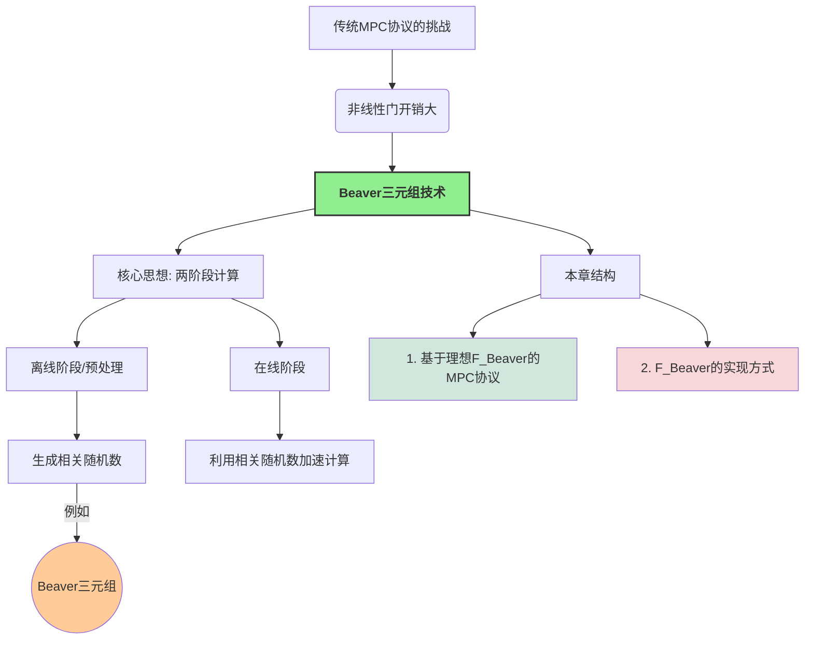
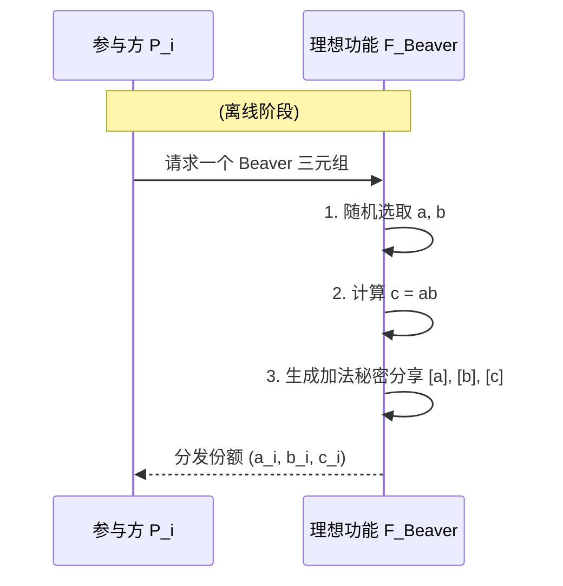

> **[迁移说明]** 本文最初发布于 `blog.zzw4257.cn`，现已迁移并在本站进行结构化整理与增强。

在前面的章节中，无论是 BGW 协议、GMW 协议，还是第一章介绍的简单协议，我们都观察到一个共同点：协议中的**线性门**（如加法、常数乘法、异或、非门）通常具有非常低的计算和通信开销，参与方往往只需在本地对其秘密份额执行相应操作即可。相比之下，**非线性门**（如乘法门、与门）的开销则要大得多，通常需要参与方之间进行多轮交互，并调用相对复杂的子协议（例如 OT 或 OLE）。

为了显著降低非线性门（尤其是乘法门）的在线计算开销，**Beaver 三元组 (Beaver Triple)** 技术应运而生。这一技术的核心思想是将 MPC 协议划分为两个阶段：

1.  **离线阶段 (Offline Phase) / 预处理阶段 (Preprocessing Phase)**: 在这个阶段，参与方共同生成一些与实际输入无关的**相关随机数 (Correlated Randomness)**，最典型的就是 Beaver 三元组。这个阶段可以提前进行，甚至在实际的私密输入可用之前。
2.  **在线阶段 (Online Phase)**: 当实际的私密输入可用时，参与方利用离线阶段生成的这些相关随机数来极大地加速（主要是乘法）运算。

这种设计模式可以将大部分的计算和通信密集型工作转移到离线阶段，使得在线阶段的效率得到显著提升，这对于需要快速响应的 MPC 应用尤为重要。

本章将采用模块化的方法进行介绍：
1.  首先，我们将 Beaver 三元组的生成过程抽象为一个理想功能 $\mathcal{F}_{\text{Beaver}}$。
2.  然后，在 $\mathcal{F}_{\text{Beaver}}$-混合模型下，构造一个高效的 MPC 协议，并证明其安全性。
3.  最后，我们将讨论如何实际生成 Beaver 三元组，即如何实现 $\mathcal{F}_{\text{Beaver}}$。

## 7.1 基于 Beaver 三元组的 MPC 协议

我们将主要关注基于**加法秘密分享 (Additive Secret Sharing)** 的 MPC 协议，其中秘密份额可以直接相加来得到秘密的和。

### 7.1.1 Beaver 三元组定义

一个 Beaver 三元组（针对某个有限域 $\mathbb{F}$）是指一组秘密分享值 $([a], [b], [c])$，其中 $a, b \in \mathbb{F}$ 是均匀随机选择的元素，而 $c = ab \in \mathbb{F}$。
这里的 $[x]$ 表示秘密 $x$ 的加法秘密份额的集合，即 $[x] = (x_1, \dots, x_n)$，其中 $x = x_1 + \dots + x_n \pmod p$ (如果 $\mathbb{F}=\mathbb{Z}_p$)。每个参与方 $P_i$ 持有份额 $x_i$。

**符号约定**:

*   $[x]$: 秘密 $x \in \mathbb{F}$ 的秘密份额集 $(x_1, \dots, x_n)$，满足 $x = \sum x_i$。
*   **本地加法**: $[x] + [y] = (x_1+y_1, \dots, x_n+y_n) = [x+y]$。
*   **本地常数乘法**: $k \cdot [x] = (k x_1, \dots, k x_n) = [k x]$。
*   **本地常数加法**: $[x] + k = (x_1+k, x_2, \dots, x_n) = [x+k]$ (通常将常数项加在 $P_1$ 的份额上)。

**利用 Beaver 三元组计算乘法**:

假设我们想要计算两个秘密分享值 $[x]$ 和 $[y]$ 的乘积 $[xy]$。参与方已经共同持有一个 Beaver 三元组 $([a], [b], [c])$，其中 $c=ab$。

1.  **盲化 (Blinding) / 计算差值**:
    *   所有参与方在本地计算 $[d] = [x]-[a] = [x-a]$。
    *   所有参与方在本地计算 $[e] = [y]-[b] = [y-b]$。
2.  **公开差值 (Reveal Differences)**:
    *   参与方共同重构秘密 $d = x-a$ 和 $e = y-b$。
    *   现在，$d$ 和 $e$ 成为公开值。

> **隐私性分析**: 由于 $a$ 和 $b$ 是均匀随机的，即使公开了 $d=x-a$ 和 $e=y-b$，也不会泄露关于 $x$ 和 $y$ 的任何信息，因为 $a,b$ 完美地掩盖了真实输入。

3.  **本地计算最终份额**:
    基于公式 $xy = (d+a)(e+b) = de + db + ea + ab$，可以转化为：
    $[xy] = [de] + d[b] + e[a] + [c]$
    由于 $d$ 和 $e$ 是公开值，每个参与方 $P_i$ 可以本地计算其持有的份额：
    $(xy)_i = de_i + d \cdot b_i + e \cdot a_i + c_i$
    (其中 $de_i$ 仅由 $P_1$ 持有 $de$，其他方为 $0$)。

> **效率对比**: 
> *   **GMW 乘法**: 需要 $O(n^2)$ 次 OT 调用。
> *   **Beaver 三元组乘法 (在线阶段)**: 仅需要两次秘密重构，通信量为 $O(n)$。主要的开销被转移到了离线阶段。

### 7.1.2 协议描述

**协议 $\Pi_{\text{Beaver}}$ (在 $\mathcal{F}_{\text{Beaver}}$-混合模型下)**:

1.  **输入分享**: 每个 $P_i$ 将其输入进行加法秘密分享。
2.  **计算阶段**:
    *   **加法门/常数乘法门**: 参与方进行本地份额运算。
    *   **乘法门**: 按照 7.1.1 节所述，消耗一个 Beaver 三元组，公开 $d, e$ 并计算份额。
3.  **输出重构**: 收集各方最终份额并求和。

**理想功能 $\mathcal{F}_{\text{Beaver}}$**:

### 7.1.3 安全性证明简述

**定理**: 在 $\mathcal{F}_{\text{Beaver}}$-混合模型下，$\Pi_{\text{Beaver}}$ 协议对于静态半诚实敌手是 UC-安全的。

**模拟思路**:
*   **乘法门模拟**: 模拟器 $\mathcal{S}$ 虽然不知道诚实方的输入，但可以随机选择 $d^*, e^*$ 作为公开的差值。由于在真实世界中 $a, b$ 是随机的，公开的 $d, e$ 本质上也是随机分布的，因此 $d^*, e^*$ 与真实视图不可区分。
*   **一致性**: $\mathcal{S}$ 随后构造诚实方的份额，使得它们与被攻陷方的份额及公开值 $d^*, e^*$ 保持数学一致。

## 7.2 Beaver 三元组的生成

### 7.2.1 基于半可信第三方 (TTP)

如果存在一个不与任何参与方串通的第三方，三元组的生成非常简单：TTP 生成 $a, b, c=ab$ 后直接将份额分发。这里的“半可信”意味着 TTP 必须诚实执行操作且不泄露原始随机数。

### 7.2.2 分布式生成

在无中心化信任的环境下，参与方需要通过 MPC 协议共同生成三元组：

1.  **生成随机分享 $[a]$ 和 $[b]$**: 每个 $P_i$ 贡献一个本地随机数 $a_i, b_i$，则 $a = \sum a_i$ 是一个无人知晓的随机数。
2.  **计算 $[c] = [ab]$**: 这是一个标准的乘法问题。可以使用基于 OT 或同态加密（HE）的高效协议来实现。虽然这本身涉及乘法，但其优势在于可以**批量预计算**，将昂贵的密码学操作移出实时交易路径。

> **小结**: 
> Beaver 三元组是现代高效 MPC 框架（如 SPDZ）的基石。它不仅简化了在线阶段的计算逻辑，还为协议的模块化设计（离线预处理 + 在线快速计算）提供了理论支撑。
