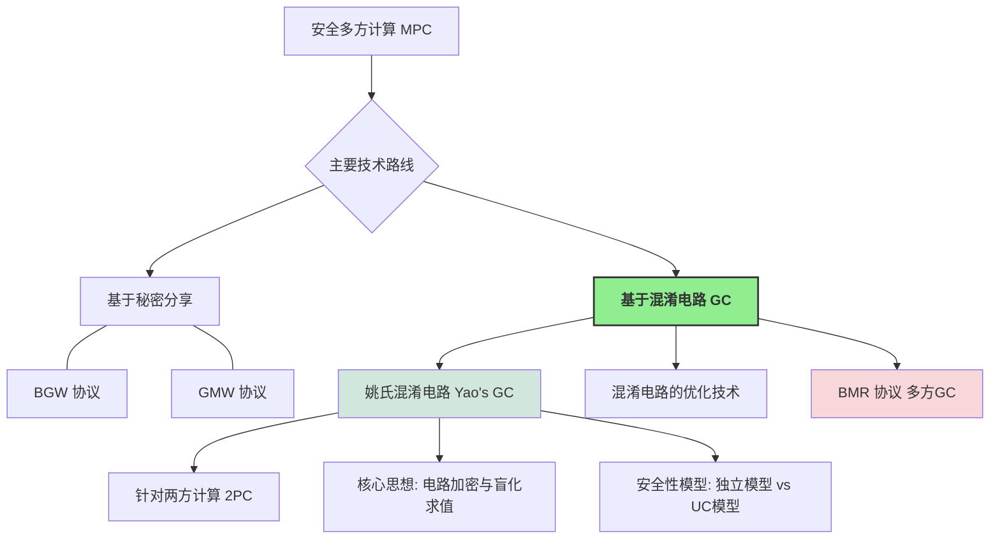

> **[迁移说明]** 本文最初发布于 `blog.zzw4257.cn`，现已迁移并在本站进行结构化整理与增强。

与前几章主要基于秘密分享的 MPC 方案（如 BGW、GMW）不同，**混淆电路 (Garbled Circuits, GC)** 是安全多方计算（尤其是两方计算）的另一种经典且强大的技术。它最早由姚期智院士在 1986 年提出，因此最初的协议被称为**姚氏混淆电路协议 (Yao's Garbled Circuits protocol, Yao's GC)**。

姚氏混淆电路是第一个通用的两方安全计算 (Secure Two-Party Computation, 2PC) 协议，它的出现标志着 MPC 领域的一个重要里程碑，并迅速成为后续研究和优化的热点。

## 本章主要内容

1.  **姚氏两方混淆电路协议**：
    *   详细介绍其直观思想和构造方法。
    *   分析其安全性，讨论其在标准 UC 模型下的局限性，并引入**独立模型 (Stand-alone Model)**。
    *   在独立模型下给出姚氏协议的安全性证明。
2.  **混淆电路的优化**：介绍经典的混淆电路优化技术，如 Free-XOR 和 Half-Gates，以提高效率。
3.  **BMR 协议**：介绍 Beaver-Micali-Rogaway (BMR) 协议，该协议将混淆电路的思想从两方推广到多方场景。

## 8.1 姚氏混淆电路协议 (Yao's Garbled Circuits Protocol)

姚氏协议主要用于两方场景，其中一方称为**混淆者 (Garbler)** 或**构造者 (Constructor)**（通常记为 $P_1$），另一方称为**求值者 (Evaluator)**（通常记为 $P_2$）。

### 8.1.1 直观思想

假设 $P_1$ 的输入是 $x$，$P_2$ 的输入是 $y$，他们想共同计算函数 $f(x,y)$。核心步骤如下：

1.  **电路表示**：将函数 $f$ 表示为一个由逻辑门构成的布尔电路 $C$。
2.  **电路混淆 (Garbling)**：
    *   对于电路中的每根导线 $w_i$，$P_1$ 随机选择两个密钥 $k_{w_i}^0$ 和 $k_{w_i}^1$。
    *   对于每个逻辑门 $g$，$P_1$ 生成一个**混淆表 (garbled table)**。每一行使用输入导线的密钥加密输出导线的密钥，并随机打乱行顺序。
    *   $P_1$ 发送所有门的混淆表及输出解密映射表给 $P_2$。
3.  **输入密钥获取**：
    *   $P_1$ 直接发送其输入 $x$ 对应的密钥给 $P_2$。
    *   $P_2$ 通过 **1-out-of-2 茫然传输 (OT)** 协议从 $P_1$ 处获取其输入 $y$ 对应的密钥。$P_1$ 无法得知 $P_2$ 选择了哪个密钥。
4.  **电路求值**：
    *   $P_2$ 拥有所有输入导线的密钥，逐门解密混淆表，最终获得输出导线的密钥。
5.  **输出获取**：
    *   $P_2$ 使用解密表将输出密钥转换回逻辑值，并可选择分享给 $P_1$。

### 8.1.2 示例：与门混淆

以与门为例，其真值表与加密后的混淆表结构如下：

**表：与门加密真值表（概念性）**
| x 密钥 | y 密钥 | 加密的 z |
| :--- | :--- | :--- |
| $k_X^0$ | $k_Y^0$ | $Enc_{k_X^0}(Enc_{k_Y^0}(k_Z^0))$ |
| $k_X^0$ | $k_Y^1$ | $Enc_{k_X^0}(Enc_{k_Y^1}(k_Z^0))$ |
| $k_X^1$ | $k_Y^0$ | $Enc_{k_X^1}(Enc_{k_Y^0}(k_Z^0))$ |
| $k_X^1$ | $k_Y^1$ | $Enc_{k_X^1}(Enc_{k_Y^1}(k_Z^1))$ |

为了让 $P_2$ 判断是否成功解密，通常在密钥后附加全零后缀 $0^\kappa$。若解密后后缀匹配，则认为获取了正确的密钥。

### 8.1.3 安全性定义与性质

协议中使用的对称加密方案 $(Gen, Enc, Dec)$ 需满足两个额外性质：
1.  **不可知的密文空间 (Elusive Range)**：敌手无法伪造合法密文。
2.  **可验证的密文空间 (Efficiently Verifiable Range)**：给定密钥可高效验证密文是否合法。

> **引理 8.1**：若对称加密方案满足 IND-CPA 安全，则其也具有双重加密安全性 (Double Encryption Security)。

### 8.1.4 混淆电路的优化 (Optimizations)

下表总结了提升姚氏协议效率的经典优化技术：

| 方案 | 异或门开销 (密文数) | 与门开销 (密文数) | 求值复杂度 | 特点 |
| :--- | :---: | :---: | :---: | :--- |
| 经典方案 | 4 | 4 | 2.5次解密 | 基础版本 |
| 标识置换 (Point-and-Permute) | 4 | 4 | 1次解密 | 消除解密尝试，直接寻址 |
| GRR3 | 3 | 3 | 1次解密 | 减少一行密文传输 |
| Free-XOR | 0 | 3 | 0 | XOR门计算完全免费 |
| 半门 (Half-Gates) | 0 | 2 | 2次解密 | 与门仅需2行，目前最优方案 |

## 8.2 BMR 协议 (Beaver-Micali-Rogaway)

BMR 协议旨在将混淆电路推广到多方场景 ($n > 2$)，其核心挑战在于如何分布式地生成混淆表，防止单一混淆者泄露隐私。

### 8.2.1 核心设计思路

1.  **分布式密钥生成**：每条导线 $w_i$ 的全局密钥 $K_{w_i}^v$ 是所有参与方提供的子密钥的异或和：$K_{w_i}^v = \bigoplus_{j=1}^n k_{w_i,j}^v$。
2.  **协作混淆**：所有参与方共同参与 MPC 协议来生成每个门的混淆表份额。每个条目由所有方贡献的伪随机数异或聚合而成。
3.  **常数轮性**：BMR 协议最显著的特点是其在线阶段是**常数轮**的。一旦预处理完成了混淆表的生成，在线求值过程与电路深度无关。

### 8.2.2 协议阶段总结

*   **预处理阶段**：
    *   参与方生成各自的子密钥和掩码比特。
    *   通过 MPC 共同计算并公开混淆表。
*   **在线阶段**：
    *   公开输入导线的外部值（逻辑值与掩码的异或）。
    *   广播对应的子密钥。
    *   所有方本地求值电路，得到输出标签并结合输出掩码重构结果。

## 8.3 独立模型与 UC 模型的对比

标准的姚氏协议通常在**独立模型**下证明安全性。它不满足 UC 安全性，主要因为模拟器在构造假电路时需要预先知道输入和输出，而在 UC 模型中，环境可能在电路发送后才动态决定输入。若需满足 UC 安全，通常需要引入复杂的承诺机制或非交互式零知识证明。
