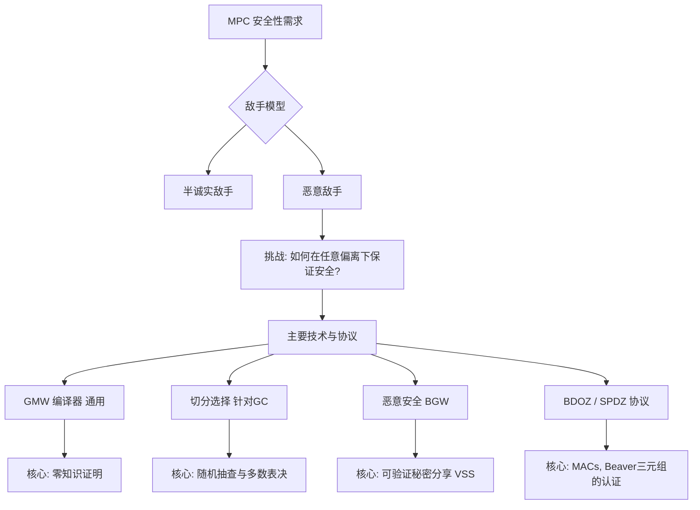

> **[迁移说明]** 本文最初发布于 `blog.zzw4257.cn`，现已迁移并在本站进行结构化整理与增强。

在之前的讨论中，我们主要聚焦于**半诚实敌手模型 (Semi-Honest Adversary Model)**。在该模型下，参与方遵循协议规定但会尝试推断额外信息。然而，在现实应用中，必须考虑**恶意 (Malicious)** 参与方可能采取的任何偏离协议的行为。本章将介绍实现恶意安全 MPC 的关键技术。监控、验证与容错是核心所在。

### 本章主要内容

1.  **GMW 编译器 (GMW Compiler)**: 利用零知识证明将半诚实协议转化为恶意安全协议的通用技术。
2.  **切分选择技术 (Cut-and-Choose)**: 增强混淆电路协议（如姚氏协议）以抵抗恶意混淆者的技术。
3.  **恶意安全的 BGW 协议**: 使用**可验证秘密分享 (VSS)** 确保输入诚实分享。
4.  **BDOZ 和 SPDZ 协议**: 基于 Beaver 三元组和消息认证码 (MAC) 的现代高效协议。

## 9.1 GMW 编译器 (GMW Compiler)

GMW 编译器由 Goldreich, Micali 和 Wigderson 提出。其核心思想是：在半诚实协议的每一步执行后，让执行方使用**零知识证明 (Zero-Knowledge Proof, ZKP)** 向其他方证明其行为严格遵循了协议规定。

### 零知识证明 (Zero-Knowledge Proof)

零知识证明是一种两方协议，其中证明者 (Prover, P) 向验证者 (Verifier, V) 证明某个陈述 $x$ 是真实的，而不泄露除了该陈述为真以外的任何信息。

*   **完备性 (Completeness)**: 诚实的证明者总能说服验证者。
*   **可靠性 (Soundness)**: 恶意的证明者无法说服验证者接受虚假陈述。
*   **零知识性 (Zero-Knowledge)**: 验证者无法从交互中获得关于见证 $w$ 的任何额外信息。

### Sigma 协议 (Sigma Protocols)

Sigma 协议是一类特殊的 3 步公共硬币零知识证明系统：

1.  **承诺 (Commit)**: $P \to V: a$
2.  **挑战 (Challenge)**: $V \to P: e$ (随机挑战)
3.  **回应 (Response)**: $P \to V: z$

其具备特殊可靠性（从两个有效回应中可提取见证）和诚实验证者零知识性 (HVZK)。

### GMW 编译器的执行步骤

1.  **承诺阶段**: 每个参与方 $P_i$ 对其输入 $x_i$ 和随机带 $\rho_i$ 进行密码学承诺并公开。
2.  **抛硬币阶段**: 生成公共随机性（如果需要）。
3.  **执行与证明阶段**: 参与方按照原协议执行。发送消息 $m_i$ 时，必须证明该消息是根据之前承诺的 $(x_i, \rho_i)$ 和收到的历史消息正确计算得出的。

## 9.2 切分选择 (Cut-and-Choose)

切分选择专门用于抵抗姚氏混淆电路协议中的恶意混淆者。恶意混淆者可能构造错误的电路来诱导求值者泄露信息或产生错误输出。

### 9.2.1 直观思想

混淆者 $P_1$ 生成 $s$ 个混淆电路副本，求值者 $P_2$ 随机选择一部分（如 $s/2$ 个）作为**检查电路**，要求 $P_1$ 打开并验证。若全部通过，则对剩余的**求值电路**进行计算并取多数表决结果。

**安全性分析**：
通过选择足够大的 $s$（如 128 或 160），恶意方构造足够多坏电路且不被发现的概率会呈指数级下降。教材中给出的概率界限为：$\text{Pr}[\text{noAbort} \land \text{badMaj}] < 2^{-s/4+1}$。

### 9.2.2 切分选择中的核心问题

*   **电路一致性**: 确保所有电路计算的是同一个函数。
*   **输入一致性**: 确保 $P_1$ 在所有求值电路中使用相同的输入 $x$。通常使用基于 DH 元组的复合陈述证明来实现。
*   **选择性中止攻击 (Selective Abort)**: $P_1$ 通过在 OT 阶段输入垃圾信息，根据 $P_2$ 是否中止来探测 $P_2$ 的输入比特。解决方法是使用**承诺式 OT (Committing OT)** 或 **切分选择 OT (CCOT)**。

## 9.3 LP11 协议 (Lindell-Pinkas 2011)

LP11 协议是一个代表性的恶意安全两方混淆电路协议，其对切分选择进行了系统化实现。

### LP11 协议流程概要

1.  **构造**: $P_1$ 生成 $s$ 个电路 $GC_1, \dots, GC_s$，并承诺其输入导线密钥。
2.  **CCOT 执行**: $P_1$ 和 $P_2$ 执行批处理单一选择 CCOT。$P_2$ 获得求值电路的选择密钥和检查电路的全部密钥。
3.  **挑战与打开**: $P_2$ 发送检查索引集 $J$。$P_1$ 揭示对应电路的随机性和结构。
4.  **验证**: $P_2$ 验证检查电路的正确性。若有误则中止。
5.  **一致性证明**: $P_1$ 发送求值电路的输入密钥，并证明输入的一致性。
6.  **计算**: $P_2$ 对求值电路求值，取多数结果。

## 9.4 安全性证明与结论

LP11 协议的安全性建立在 DDH 假设和 ZKP 的性质之上。在独立模型下，模拟器可以通过从 ZKP 或 CCOT 交互中提取恶意方的输入来模拟理想化环境。

若要在 **UC (Universal Composability) 模型**下获得安全性，通常需要在公共参考字符串 (CRS) 模型下使用不可带回（Non-interactive）或可模拟的 ZKP 构造。将 LP11 中的 ZKP 替换为 UC 安全版本后，该协议可在恶意敌手环境下实现 UC 安全。
