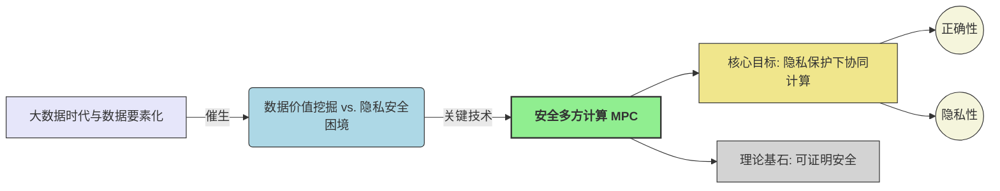

> **[迁移说明]** 本文最初发布于 `blog.zzw4257.cn`，现已迁移并在本站进行结构化整理与增强。

# 隐私计算笔记汇总

## 课程概述

隐私计算 (Privacy Computing) 是一门研究如何在保护数据隐私的同时进行有效计算的学科，它结合了密码学、分布式计算和安全多方计算等领域的技术。本课程笔记全面覆盖了从基础理论到高级协议的关键知识点。

## 第1章 引言 (Introduction)

本章概述安全多方计算 (Secure Multi-Party Computation, MPC) 的基本概念、核心问题、应用场景以及基础协议构造思想。

### 1.1 安全多方计算 (Secure Multi-Party Computation)

#### 定义与目标

> **安全多方计算 (MPC)** 是一种密码学分支，旨在允许多个互不信任的参与方 $P_1, \dots, P_n$，在各自持有私密输入 $x_1, \dots, x_n$ 的情况下，共同计算一个约定函数 $y = f(x_1, \dots, x_n)$，并确保：
> 
> - **正确性 (Correctness)**: 协议输出的 $y$ 与函数 $f$ 的真实计算结果一致。
> - **隐私性 (Privacy)**: 协议执行过程中，任何参与方除了其应得的计算结果外，不能获取其他参与方的任何额外信息。

#### 可信第三方 (TTP) 模型的局限性

> 理想化的 TTP 可以解决 MPC 问题，但现实中难以建立绝对中立的信任根，且存在 **单点故障 (Single Point of Failure)** 风险。

### 1.2 基础协议构造思想

#### 秘密分享机制 (Secret Sharing)

> 将一个秘密 $s$ 分割成 $n$ 个份额 (shares) $s_1, \dots, s_n$，分发给 $n$ 个参与方。只有达到特定门限 $t$ 的份额才能恢复秘密。

#### 示例：复制秘密分享 (Replicated Secret Sharing) for $n=3, t=2$

1. **份额生成**: $P_S$ 将秘密 $x \in \mathbb{Z}_p$ 分解为 $x \equiv r_1 + r_2 + r_3 \pmod p$。
2. **份额分配**: $P_1$ 保留 $(r_2, r_3)$；$P_2$ 获赠 $(r_1, r_3)$；$P_3$ 获赠 $(r_1, r_2)$。
3. **恢复**: 任意两方合作即可凑齐 $r_1, r_2, r_3$。

### 1.3 安全威胁与对策初步

- **半诚实 (Semi-Honest)**: 遵循协议但试图推断额外信息。
- **恶意 (Malicious)**: 可能不遵循协议，篡改输入或偏离指令。
- **对策**: 使用一致性校验 (Consistency Check) 等技术确保行为合规。

## 第2章 基础知识 (Basic Knowledge)

本章聚焦现代密码学的基石——**可证明安全 (Provable Security)**。

### 2.1 现代密码学与可证明安全

#### 可证明安全的三大基石

1. **形式化的定义**: 清晰定义安全目标与敌手能力。
2. **精确的假设**: 依赖于大整数分解、离散对数等数学难题。
3. **严格的安全性证明**: 通过归约 (reduction) 证明攻破协议等同于解决数学难题。

#### 威胁模型演进

| 攻击类型 | 能力描述 | 典型防御模型 |
| :--- | :--- | :--- |
| COA (仅密文攻击) | 被动监听网络流量 | OTP加密 |
| CPA (选择明文攻击) | 主动获取任意明文的加密 | RSA-OAEP |
| CCA2 (自适应选择密文攻击) | 自适应选择密文解密查询 | ECIES |

### 2.2 基础原语 (Basic Primitives)

- **门限秘密分享**: $(t,n)$-门限方案，如 Shamir 秘密分享。
- **哈希函数**: 具有抗碰撞性、抗原像性。
- **承诺方案 (Commitment Schemes)**: 包含承诺 (Commit) 和揭示 (Open) 阶段，具有隐藏性和绑定性。
- **茫然传输 (Oblivious Transfer, OT)**: 发送方输入消息对，接收方选择其一，双方均不泄露额外信息。

## 第3章 一个安全多方计算协议的例子

本章通过 **Shamir 秘密分享** 构造一个半诚实安全的电路计算协议。

### 3.1 Shamir 秘密分享

基于有限域 $\mathbb{F}$ 上的多项式插值：

1. **分享**: 构造 $t$ 阶多项式 $q_s(x) = s + a_1 x + \dots + a_t x^t$，份额为 $s_j = q_s(\alpha_j)$。
2. **重构**: 利用拉格朗日插值公式 $s = \sum_{k \in K} s_k \cdot \delta_k(0)$。

### 3.2 算术电路计算协议

- **加法门**: 参与方本地将份额相加。
- **乘法门**: 参与方本地将份额相乘（阶数变为 $2t$），随后进行 **度降低 (Degree Reduction)** 步骤恢复至 $t$ 阶。
- **安全性**: 只要被攻陷方 $t < n/2$，协议具有完美隐私性。

## 第4章 安全模型 (Security Models)

### 4.1 通用可组合性框架 (UC Framework)

UC 框架为协议提供模块化分析标准。其核心在于 **模拟范式 (Simulation Paradigm)**：

- **环境 $\mathcal{Z}$**: 提供输入并观察输出，试图区分真实世界与理想世界。
- **理想功能 $\mathcal{F}$**: 描述任务的理想化安全服务。
- **模拟器 $\mathcal{S}$**: 在理想世界中模拟真实敌手的行为。

## 第5章 茫然传输和茫然传输扩展

### 5.1 OT 基础结论

- 不存在信息论安全的两方 OT 协议，必须依赖计算假设。
- **OT 变种**: Rabin OT, 1-out-of-N OT 等在计算上是等价的。

### 5.2 茫然传输扩展 (OTE)

通过少量基础 OT 结合对称加密操作扩展出大量 OT，是提升 MPC 效率的关键技术。

## 第6章 基于线性秘密分享的协议

- **BGW 协议**: 基于 Shamir 秘密分享，在 $t < n/2$ 时提供信息论安全。
- **GMW 协议**: 基于加法秘密分享，通常用于布尔电路计算，依赖 OT 实现乘法（与门）。

## 第7章 通过 Beaver 三元组实现 MPC

将协议分为：

1. **离线阶段**: 生成与输入无关的随机三元组 $([a], [b], [c])$，满足 $c = ab$。
2. **在线阶段**: 利用三元组通过线性运算和少量重构开销快速计算乘法。

## 第8章 基于混淆电路的协议 (Garbled Circuits)

### 8.1 姚氏混淆电路 (Yao's GC)

针对两方计算 (2PC) 的经典协议：

- **混淆者 (Garbler)**: 加密布尔电路，生成混淆表。
- **求值者 (Evaluator)**: 通过 OT 获取输入密钥，解密电路得到结果。

### 8.2 混淆电路优化

| 方案 | 异或门开销 | 与门开销 | 特性 |
| :--- | :--- | :--- | :--- |
| 标识置换 | 4 密文 | 4 密文 | 确定性解密 |
| Free-XOR | **0 密文** | 3 密文 | 异或门免费 |
| 半门 (Half-Gates) | **0 密文** | **2 密文** | 目前主流最优 |

## 第9章 恶意安全性 (Malicious Security)

### 9.1 GMW 编译器

利用 **零知识证明 (ZKP)** 强迫参与方证明其每一步操作都遵循了半诚实协议的逻辑。

### 9.2 切分选择 (Cut-and-Choose)

防止混淆者构造恶意电路。求值者随机抽取部分电路“打开检查”，其余用于求值并取多数表决结果。

### 9.3 现代高效协议

- **BDOZ / SPDZ**: 基于消息认证码 (MAC) 验证三元组的正确性，实现高效的恶意安全计算。
