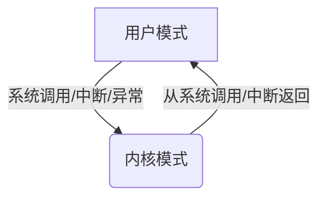
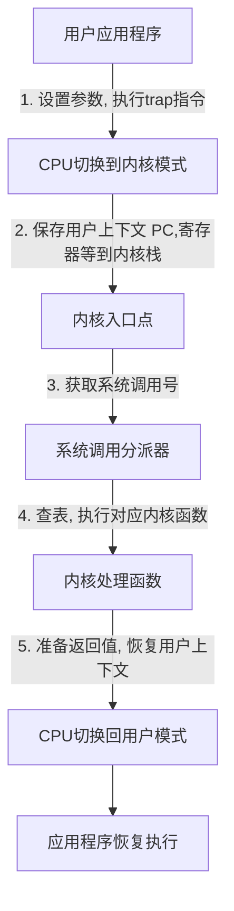
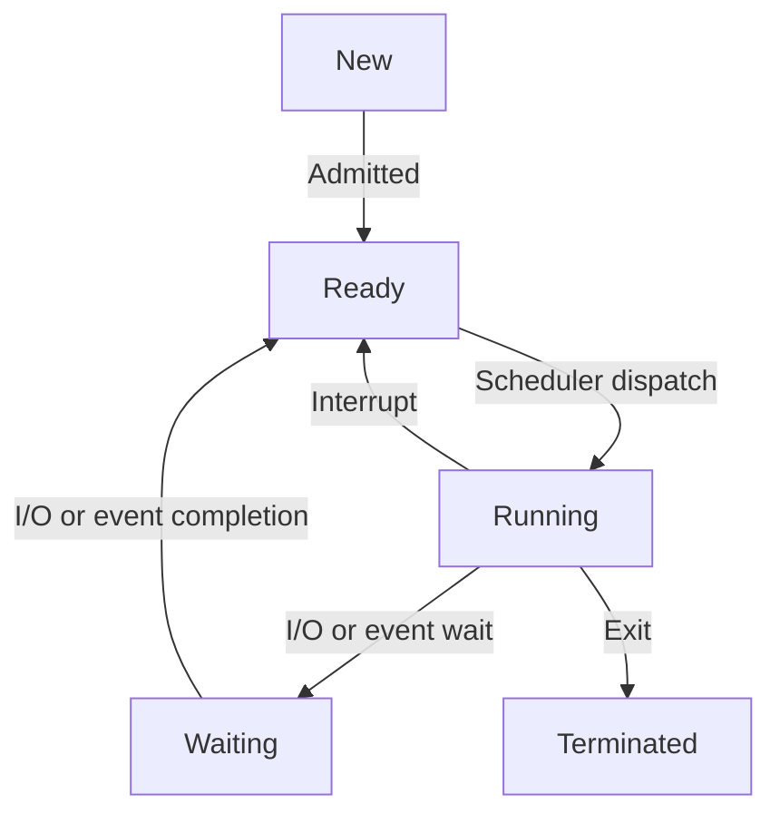

> **[迁移说明]** 本文最初发布于 `blog.zzw4257.cn`，现已迁移并在本站进行结构化整理与增强。

## 1. 操作系统导论

### 什么是操作系统？

-   **定义**：位于应用程序与硬件之间的软件层，负责管理硬件资源并为应用程序提供服务。
-   **核心目标**：用户使用的便利性与系统运行的高效性。

### 计算机系统四大组件

1.  **硬件**：提供基础计算资源（CPU、内存、I/O 设备）。
2.  **操作系统**：控制与协调硬件的使用。
3.  **应用程序**：定义如何利用系统资源解决具体问题（如编译器、浏览器）。
4.  **用户**：人、机器或其他计算机系统。

### 操作系统操作模式

-   **多道程序设计 (Multiprogramming)**：内存中同时保留多个作业。当当前作业因 I/O 等待时，CPU 切换到另一作业，显著提高 CPU 利用率。
-   **分时系统 (Timesharing / Multitasking)**：多道程序设计的逻辑扩展，通过频繁切换 CPU 让用户能与每个运行中的进程进行交互。
-   **双模式操作**：
    -   **用户模式 (User Mode)**：运行应用程序，受硬件保护限制。
    -   **内核模式 (Kernel Mode)**：运行操作系统，拥有完全访问权限。
    -   **转换机制**：通过模式位 (Mode Bit) 标识。系统调用、中断或异常会触发从用户态到内核态的切换。

### 资源管理职能

-   **进程管理**：处理进程的创建、终止、挂起、同步与通信。进程是资源分配单位，线程是执行单位。
-   **内存管理**：跟踪内存使用情况，优化 CPU 利用率，提供虚拟内存抽象。
-   **文件系统管理**：提供数据的逻辑视图，处理文件/目录的创建、映射及安全性。

---

## 2. 操作系统服务与结构

### 操作系统服务

-   **用户可见服务**：UI（CLI/GUI）、程序执行、I/O 操作、文件系统管理、通信（IPC）、错误检测。
-   **系统效率服务**：资源分配、日志审计、保护（访问控制）与安全（身份认证）。

### 系统调用 (System Call)

系统调用是访问 OS 服务的编程接口，通常通过 API（如 POSIX, Win32）封装。其核心处理流程如下：

### 进程内存布局与 ELF 加载

-   **内存结构**：代码段 (Text) -> 数据段 (Data) -> BSS 段 -> 堆 (Heap, 向上增长) -> 栈 (Stack, 向下增长)。
-   **加载流程**：
    -   静态链接：内核通过 `execve` 直接完成映射。
    -   动态链接：内核识别解释器（如 `ld.so`），由加载器在用户空间完成依赖库的加载。

### 操作系统结构模型

-   **单体内核 (Monolithic)**：所有功能在同一地址空间，性能高，但稳定性受限（如 Linux）。
-   **微内核 (Microkernel)**：仅保留核心功能（IPC、调度），其余移至用户空间，可靠性高但 IPC 开销大（如 L4, Mach）。
-   **混合内核**：结合上述两者特点（如 Windows, macOS）。

---

## 3. 进程管理

### 进程概念与 PCB

进程是执行中的程序。内核通过 **进程控制块 (PCB)** 管理进程，包含 PID、状态、PC 指针、寄存器、内存映射等。在 Linux 中，PCB 对应 `task_struct` 结构。

### 进程状态转换

### 进程间通信 (IPC)

1.  **共享内存 (Shared Memory)**：直接读写内存块，速度快，但需用户处理同步。
2.  **消息传递 (Message Passing)**：通过内核队列交换消息，易于同步但有上下文切换开销。

---

## 4. 线程管理

### 线程特性

-   **独有资源**：TID、PC、寄存器、栈。
-   **共享资源**：代码段、数据段、堆、文件描述符。
-   **优势**：响应性好、资源共享成本低、适合多核并行。

### 多线程模型映射

-   **一对一**：最常用，支持真并行，但内核线程创建开销大。
-   **多对一**：用户态管理，高效但不利用多核，一阻塞全阻塞。
-   **多对多**：平衡性能与并行度。

### Linux 线程实现

Linux 使用 `clone()` 系统调用创建进程或线程。线程在 Linux 中被视为“轻量级进程”(LWP)，共享相同的 `mm_struct`（内存描述符）。

---

## 5. CPU 调度

### 调度准则

-   **最大化**：CPU 利用率、吞吐量。
-   **最小化**：周转时间、等待时间、响应时间。

### 常见调度算法

1.  **FCFS (先来先服务)**：非抢占，易产生护航效应。
2.  **SJF (最短作业优先)**：平均等待时间最优，但存在饥饿问题。
3.  **优先级调度**：通过“老化” (Aging) 解决低优先级饥饿。
4.  **RR (轮转调度)**：为分时系统设计，时间片大小是关键。
5.  **多级反馈队列 (MLFQ)**：最通用算法，根据进程行为动态调整优先级。

---

## 6. 同步机制

### 临界区问题 (Critical Section)

解决方案必须满足：**互斥** (Mutual Exclusion)、**前进** (Progress) 和 **有界等待** (Bounded Waiting)。

### 同步原语

-   **互斥锁 (Mutex)**：简单的 0/1 锁。若使用忙等待则称为自旋锁 (Spinlock)。
-   **信号量 (Semaphore)**：
    -   `wait(S)` / P 操作：S 减 1，若 S &lt; 0 则阻塞。
    -   `signal(S)` / V 操作：S 加 1，若 S &lt;= 0 则唤醒。

### 经典问题：生产者-消费者

通过 `mutex`（互斥访问）、`empty`（空位计数）和 `full`（满位计数）三个信号量协同工作。

---

## 7. 死锁

### 死锁的四个必要条件

1.  **互斥**：资源不可共享。
2.  **占有并等待**：持有资源并请求新资源。
3.  **非抢占**：资源不可强行剥夺。
4.  **循环等待**：存在进程等待链。

### 死锁处理策略

-   **预防**：破坏必要条件之一（如资源有序分配）。
-   **避免**：银行家算法，确保系统始终处于“安全状态”。
-   **检测与恢复**：运行监控并强行终止进程或抢占资源。
-   **忽略**：鸵鸟算法（多数通用 OS 的选择）。
