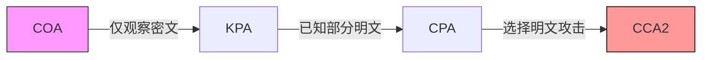
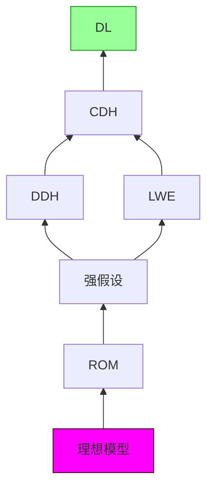

> **[迁移说明]** 本文最初发布于 `blog.zzw4257.cn`，现已迁移并在本站进行结构化整理与增强。

# 第2章 基础知识 (Basic Knowledge)

本章旨在夯实后续章节学习所需的基础，核心围绕现代密码学的基石——**可证明安全 (Provable Security)**。我们将深入探讨其三大支柱：形式化的定义、精确的假设和严格的证明。随后，将介绍本书通用的符号体系，并阐述若干核心的密码学原语。


## 2.1 现代密码学与可证明安全 (Modern Cryptography and Provable Security)

现代密码学区别于传统密码学的核心在于其系统性和科学性。它不再仅仅依赖于设计者对方案复杂性和巧妙性的直观感受，而是建立在一套严谨的理论框架之上。

> **📋 可证明安全的三大基石**
> 
> 1.  **形式化的定义 (Formal Definitions)**: 清晰、无歧义地阐述一个密码学方案应达成的安全目标以及敌手可能拥有的能力。
> 2.  **精确的假设 (Precise Assumptions)**: 将方案的安全性归结于某个被广泛研究且普遍认为难以解决的数学难题（如大整数分解、离散对数问题等）。
> 3.  **严格的安全性证明 (Rigorous Proofs)**: 通过数学归约 (reduction) 的方式，证明如果存在一个敌手能够攻破该密码学方案，那么利用该敌手就可以构造出一个算法来解决底层的数学难题。

$$
\boxed{\text{安全证明} = \text{形式化定义} + \text{计算假设} + \text{归约证明}}
$$

### 2.1.1 形式化的定义 (Formal Definitions)

形式化定义是理解和评估密码学方案安全性的第一步，它避免了“看起来安全”的主观判断。一个完整的安全定义通常包含两个方面：

-   **安全保证 (Security Guarantee)**: 明确指出协议在面对攻击时应具备何种安全属性。例如，对于加密方案，最强的安全保证是敌手无法从密文中获取关于明文的任何信息。
-   **威胁模型 (Threat Model)**: 精确刻画敌手所拥有的能力，包括其可获取的信息、可执行的操作等。

> **⚠️ 关于定义安全性的思路**

    Katz 和 Lindell 在《Introduction to Modern Cryptography》中总结了现代密码学的核心原则：
    
    1.  **形式化定义**（Formal Definition）
    2.  **精确假设**（Precise Assumptions）
    3.  **严格安全性证明**（Rigorous Security Proofs）
    
    密码学中的安全性定义由**安全保证**和**威胁模型**两部分组成：
    
    -   **安全保证**：规定方案应满足的安全属性，即敌手成功攻击的条件。
    -   **威胁模型**：定义敌手可执行的操作和可见的信息，但不限定具体攻击策略。
    
    以**加密**为例，直觉上，安全性似乎可以定义为：
    > 	**敌手不能从密文恢复明文。**
    
    -   若方案泄露 50% 明文，虽然剩余部分无法破译，但仍然是不安全的。
    -   若方案允许敌手判断**明文是否大于 20 万**，仍然会泄露信息。
    
    因此，正确的定义是：
    
    > 	**敌手不能从密文中获得任何关于明文的信息。**

#### 🔐 保密性基础

$$
\begin{aligned}
&\boxed{\text{完美保密性}} &&: \forall m_0,m_1 \in \mathcal{M},\ \Delta(\mathsf{Enc}(m_0), \mathsf{Enc}(m_1)) = 0 \\
&\boxed{\text{计算保密性}} &&: \forall \mathsf{PPT}\ \mathcal{A},\ \mathsf{Adv}_{\mathcal{A}}^{\mathsf{IND}}(\lambda) \leq \mathsf{negl}(\lambda)
\end{aligned}
$$

#### 🛡️ 威胁模型演进



| 攻击类型 | 能力描述                     | 典型防御模型     |
|----------|------------------------------|------------------|
| COA (仅密文攻击)     | 被动监听网络流量             | OTP加密          |
| KPA (已知明文攻击)     | 获取部分明文-密文对          | AES-CBC          |
| CPA (选择明文攻击)     | 主动获取任意明文的加密       | RSA-OAEP        |
| CCA2 (自适应选择密文攻击)| 自适应选择密文解密查询       | ECIES           |

为了精确描述这些概念，密码学中常采用**基于游戏 (Game-based) 的定义**。在这类定义中，安全性通过一个挑战者 (Challenger) 和一个敌手 (Adversary, $\mathcal{A}$) 之间的交互游戏来刻画。敌手赢得游戏的概率（或优势）衡量了方案的安全性。

> **📖 不可区分性在选择明文攻击下的安全性 (IND-CPA Security for Public-Key Encryption)**

    一个公钥加密方案 $\Pi = (\text{Gen}, \text{Enc}, \text{Dec})$ 被认为是 IND-CPA 安全的，如果任何概率多项式时间 (PPT) 的敌手 $\mathcal{A}$ 在以下游戏中的优势是可忽略的。
    
    **IND-CPA 游戏 $\text{PubK}^{\text{CPA}}_{\mathcal{A},\Pi}(\lambda)$**:
    
    1.  **密钥生成 (Key Generation)**: 挑战者运行 $(pk, sk) \leftarrow \text{Gen}(1^\lambda)$，并将公钥 $pk$ 发送给敌手 $\mathcal{A}$。
    2.  **挑战查询 (Challenge Query)**: 敌手 $\mathcal{A}$ 选择两条等长的消息 $m_0, m_1$，并发送给挑战者。
    3.  **挑战密文生成 (Challenge Ciphertext Generation)**: 挑战者随机选择一个比特 $b \leftarrow_{\$} \{0, 1\}$，计算挑战密文 $c^* \leftarrow \text{Enc}_{pk}(m_b)$，并将 $c^*$ 发送给 $\mathcal{A}$。
    4.  **猜测 (Guess)**: 敌手 $\mathcal{A}$ (可以继续进行加密查询，但对于公钥加密，$\mathcal{A}$ 已有公钥，可自行加密) 输出一个猜测比特 $b'$。
    5.  **游戏结果**: 如果 $b' = b$，则敌手 $\mathcal{A}$ 获胜，游戏输出 1；否则输出 0。
    
    **定义 2.1.1 (IND-CPA 安全性)**:
    如果对于任意 PPT 敌手 $\mathcal{A}$，存在一个可忽略函数 $\text{negl}(\lambda)$ 使得：
    $$
    \Pr[\text{PubK}^{\text{CPA}}_{\mathcal{A},\Pi}(\lambda) = 1] \le \frac{1}{2} + \text{negl}(\lambda)
    $$
    则称公钥加密方案 $\Pi$ 是 IND-CPA 安全的。
    敌手的**优势 (Advantage)** 定义为 $\text{Adv}^{\text{CPA}}_{\mathcal{A},\Pi}(\lambda) = \left| \Pr[\text{PubK}^{\text{CPA}}_{\mathcal{A},\Pi}(\lambda) = 1] - \frac{1}{2} \right| \le \text{negl}(\lambda)$。

#### 🧩 核心安全模型

> **ℹ️ IND-CPA (选择明文攻击不可区分)**

    ```mermaid
    graph TD
        A[敌手] -->|获取公钥| B[Challenger]
        B -->|生成挑战密文| A
        A -->|猜测明文| B
        style B fill:#f0f3ff,stroke:#4a7
    ```
    -   **目标**: 区分加密明文的随机性
    -   ✔️ 应用: Signal协议
    -   ❌ 局限: 不抗密文篡改

> **📋 IND-CCA2 (自适应选择密文攻击)**

    ```mermaid
    graph LR
        A[敌手] -->|解密查询| B[Oracle]
        B -->|返回解密结果| A
        A -->|构造关联密文| B
        style B fill:#ffe,stroke:#d90
    ```
    -   **创新点**: 允许除挑战密文外的任意解密
    -   🔑 应用: PGP加密
    -   ⚠️ 注意: 需要防填充预言攻击

> **ℹ️ CPA 与 CCA 的核心差异**

    | 特性               | CPA                     | CCA                     |
    |--------------------|-------------------------|-------------------------|
    | 解密查询           | ❌ 完全禁止             | ✅ 允许（除挑战密文）   |
    | 攻击难度           | 较弱                    | 更强                    |
    | 典型应用场景       | 基础加密                | 安全通信协议            |
    | 安全证明复杂度     | 较低                    | 较高                    |

### 2.1.2 精确的假设 (Precise Assumptions)

大多数现代密码方案的安全性并非无条件的，而是依赖于某些数学问题的计算困难性。这些问题通常经过密码学界多年的研究，尚未找到有效的求解算法。

#### 🔬 密码学基础假设

**离散对数家族**

$$
\boxed{\mathbb{G}=\langle g \rangle},\ \mathsf{DLP}(g^x) \xrightarrow{\text{强化}} \mathsf{CDH}(g^a,g^b) \xrightarrow{\text{抽象}} \mathsf{DDH}(g^a,g^b,g^{ab})
$$

| 假设         | 数学描述                     | 应用案例         |
|--------------|------------------------------|------------------|
| DL (离散对数)          | 从$g^x$反推$x$               | ElGamal加密      |
| CDH (计算性DH)         | 计算$g^{ab}$                 | DH密钥交换       |
| DDH (判定性DH)         | 区分$(g^a,g^b,g^{ab})$与随机  | 伪随机生成器     |

**其他重要假设**

> **💡 RSA假设**

    $$ \boxed{c \equiv m^e \ (\mathrm{mod}\ N)} $$
    -   依赖大整数分解困难性
    -   应用: SSH协议认证

> **📝 椭圆曲线假设 (ECDLP)**

    -   密钥长度更短
    -   应用: 比特币地址生成

???+ definition "判定性 Diffie-Hellman (DDH) 假设"

    令 $\mathbb{G}$ 是一个阶为素数 $q$ 的循环群， $g$ 是其生成元。
    DDH 假设声称，对于随机选择的 $x, y, z \in \mathbb{Z}_q$，以下两个分布是计算上不可区分的：
    
    1.  **DDH 元组分布**: $(g, g^x, g^y, g^{xy})$
    2.  **随机元组分布**: $(g, g^x, g^y, g^z)$
    
    **定义 2.1.2 (DDH 困难性)**:
    如果对于任意 PPT 敌手 $\mathcal{A}$，存在一个可忽略函数 $\text{negl}(\lambda)$ 使得：
    $$
    \left| \Pr[\mathcal{A}(\mathbb{G}, q, g, g^x, g^y, g^{xy}) = 1] - \Pr[\mathcal{A}(\mathbb{G}, q, g, g^x, g^y, g^z) = 1] \right| \le \text{negl}(\lambda)
    $$
    其中，群参数 $(\mathbb{G}, q, g)$ 由群生成算法 $\mathcal{G}(1^\lambda)$ 生成，$x,y,z \leftarrow_{\$} \mathbb{Z}_q$。则称 DDH 问题在群 $\mathbb{G}$ 中是困难的。

#### 🏗️ 假设层次结构



-   **可靠性排序**: ROM > LWE > DDH > CDH > DL
-   **工程实践**: 优先选择高层假设，权衡效率与安全

### 2.1.3 严格的安全性证明 (Rigorous Security Proofs)

安全性证明的核心思想是**归约 (Reduction)**。即证明，如果存在一个能攻破当前密码方案的敌手 $\mathcal{A}$，那么就可以利用 $\mathcal{A}$ 作为子程序，构造另一个算法 $\mathcal{B}$ 来解决某个已知的困难问题（如 DDH 问题）。

> **📝 ElGamal 加密方案的 IND-CPA 安全性证明**

    **ElGamal 加密方案**:
    设 $\mathbb{G}$ 为阶为素数 $q$ 的循环群， $g$ 为生成元。
    
    *   $\text{Gen}(1^\lambda)$: 随机选择私钥 $sk \leftarrow_{\$} \mathbb{Z}_q$，计算公钥 $pk = g^{sk}$。输出 $(pk, sk)$。
    *   $\text{Enc}_{pk}(m)$: 对于消息 $m \in \mathbb{G}$，随机选择 $r \leftarrow_{\$} \mathbb{Z}_q$，计算密文 $c = (c_1, c_2) = (g^r, m \cdot pk^r)$。
    *   $\text{Dec}_{sk}(c_1, c_2)$: 计算 $\hat{m} = c_2 / (c_1^{sk})$。
    
    **正确性**: $c_2 / (c_1^{sk}) = (m \cdot (g^{sk})^r) / ((g^r)^{sk}) = (m \cdot g^{sk \cdot r}) / g^{r \cdot sk} = m$。
    
    **定理 2.1**: 如果 DDH 问题在群 $\mathbb{G}$ 中是困难的，那么 ElGamal 加密方案是 IND-CPA 安全的。
    
    **证明思路 (归约)**:
    假设存在一个 PPT 敌手 $\mathcal{A}$，它能以不可忽略的优势 $\epsilon(\lambda)$ 攻破 ElGamal 的 IND-CPA 安全性。我们将构造一个 PPT 算法 $\mathcal{B}$，利用 $\mathcal{A}$ 来解决 DDH 问题。
    
    1.  $\mathcal{B}$ 接收一个 DDH 挑战实例 $(g, A=g^x, B=g^y, Z)$，其中 $Z$ 要么是 $g^{xy}$ (DDH 元组)，要么是 $g^z$ (随机元组)。$\mathcal{B}$ 的目标是区分这两种情况。
    2.  $\mathcal{B}$ 模拟 ElGamal 的 IND-CPA 游戏与 $\mathcal{A}$ 交互：
        *   $\mathcal{B}$ 将 ElGamal 公钥设置为 $pk = A (=g^x)$。（这里 $\mathcal{B}$ 不知道对应的私钥 $x$）。
        *   $\mathcal{A}$ 选择两条消息 $m_0, m_1$。
        *   $\mathcal{B}$ 随机选择比特 $b \leftarrow_{\$} \{0, 1\}$。
        *   $\mathcal{B}$ 构造挑战密文 $c^* = (c_1^*, c_2^*) = (B, m_b \cdot Z)$。
        *   $\mathcal{B}$ 将 $c^*$ 发送给 $\mathcal{A}$。
        *   $\mathcal{A}$ 输出其猜测 $b'$。
    3.  $\mathcal{B}$ 的输出：如果 $b' = b$，则 $\mathcal{B}$ 输出 1 (猜测 $Z=g^{xy}$ )；否则输出 0 (猜测 $Z=g^z$)。
    
    **分析 $\mathcal{B}$ 的优势**:
    *   **情况 1: $Z = g^{xy}$ (DDH 元组)**
        此时，$pk=g^x$，挑战密文是 $(g^y, m_b \cdot g^{xy}) = (g^y, m_b \cdot (g^x)^y) = (g^y, m_b \cdot pk^y)$。这是一个合法的 ElGamal 密文（其中 $r=y$）。
        根据假设，$\mathcal{A}$ 猜测正确的概率是 $\Pr[b'=b | Z=g^{xy}] = \frac{1}{2} + \epsilon(\lambda)$。
        所以，$\Pr[\mathcal{B} \text{ 输出 } 1 | Z=g^{xy}] = \frac{1}{2} + \epsilon(\lambda)$。
    *   **情况 2: $Z = g^z$ (随机元组，其中 $z$ 随机且独立于 $x,y$)**
        此时，挑战密文是 $(g^y, m_b \cdot g^z)$。由于 $z$ 是随机的，$m_b \cdot g^z$ 也是一个随机的群元素（与 $m_b$ 无关，只要 $m_b \in \mathbb{G}$）。因此，密文的第二部分 $c_2^*$ 与 $m_b$ 无关。$\mathcal{A}$ 无法从 $c_2^*$ 中获得关于 $b$ 的信息。
        所以，$\Pr[b'=b | Z=g^z] = \frac{1}{2}$。
        因此，$\Pr[\mathcal{B} \text{ 输出 } 1 | Z=g^z] = \frac{1}{2}$。
    
    $\mathcal{B}$ 区分 DDH 问题的优势是:
    $$
    \left| \Pr[\mathcal{B} \text{ 输出 } 1 | Z=g^{xy}] - \Pr[\mathcal{B} \text{ 输出 } 1 | Z=g^z] \right| = \left| (\frac{1}{2} + \epsilon(\lambda)) - \frac{1}{2} \right| = \epsilon(\lambda)
    $$
    由于 $\epsilon(\lambda)$ 是不可忽略的，$\mathcal{B}$ 能以不可忽略的优势解决 DDH 问题，这与 DDH 假设矛盾。因此，原假设（存在能攻破 ElGamal 的敌手 $\mathcal{A}$）不成立。故 ElGamal 是 IND-CPA 安全的。

## 2.2 基本术语和符号 (Basic Terms and Symbols)

> **📋 核心术语**
> 
> *   **MPC**: Secure Multi-Party Computation。
    *   **PPT**: Probabilistic Polynomial Time (概率多项式时间)，描述算法或敌手的计算能力。
    *   **$[n]$**: 集合 $\{1, 2, \dots, n\}$。
    *   **$\leftarrow_{\$}$**: 从某个集合或分布中均匀随机选取。
    *   **$|X|$**: 集合 $X$ 的大小（基数）。
    *   **可忽略函数 (Negligible Function) $\text{negl}(\lambda)$**: 一个函数 $\nu: \mathbb{N} \to \mathbb{R}_{\ge 0}$ 是可忽略的，如果对于任意正多项式 $\text{poly}(\cdot)$，存在一个 $N_0 \in \mathbb{N}$，使得对于所有 $\lambda > N_0$，都有 $\nu(\lambda) < \frac{1}{\text{poly}(\lambda)}$。直观上，它比任何多项式的倒数都更快地趋近于0。
    *   **安全参数 (Security Parameter) $\lambda$ (或 $\kappa, n$)**: 一个正整数，用于衡量密码学方案的安全性。通常，协议的运行时间是 $\lambda$ 的多项式，而敌手成功攻破协议的概率是 $\lambda$ 的可忽略函数。
    *   **统计距离 (Statistical Distance)**: 衡量两个概率分布 $X_1, X_2$ (定义在同一离散集合 $D$ 上) 差异的量。
        $$
        \Delta(X_1, X_2) = \frac{1}{2} \sum_{d \in D} |\Pr[X_1=d] - \Pr[X_2=d]|
        $$
        $0 \le \Delta(X_1, X_2) \le 1$。
    *   **不可区分性 (Indistinguishability)**: (设 $X_1(\lambda), X_2(\lambda)$ 是依赖于安全参数 $\lambda$ 的概率分布系)
        *   **完美不可区分 (Perfectly Indistinguishable)**: $X_1(\lambda) \stackrel{\text{perf}}{\equiv} X_2(\lambda)$，如果对于所有 $\lambda$，$\Delta(X_1(\lambda), X_2(\lambda)) = 0$。
        *   **统计不可区分 (Statistically Indistinguishable)**: $X_1(\lambda) \stackrel{\text{stat}}{\approx} X_2(\lambda)$，如果 $\Delta(X_1(\lambda), X_2(\lambda)) \le \text{negl}(\lambda)$。这意味着即使拥有无限计算能力的敌手也几乎无法区分。
        *   **计算不可区分 (Computationally Indistinguishable)**: $X_1(\lambda) \stackrel{\text{comp}}{\approx} X_2(\lambda)$，如果对于任意 PPT 区分器 $\mathcal{D}$，
            $$
            |\Pr[\mathcal{D}(X_1(\lambda))=1] - \Pr[\mathcal{D}(X_2(\lambda))=1]| \le \text{negl}(\lambda)
            $$
    *   **信息论安全 (Information-Theoretic Security)**: 即使敌手拥有无限计算能力，方案也是安全的（通常基于统计不可区分性）。
    *   **计算安全 (Computational Security)**: 方案的安全性依赖于某个计算难题，对于计算能力受限（如PPT）的敌手是安全的。

## 2.3 基础原语 (Basic Primitives)

本节介绍一些在安全多方计算协议中广泛使用的基础密码学工具。

### 2.3.1 门限秘密分享 (Threshold Secret Sharing)

秘密分享是 MPC 的核心构建模块之一。

> **📖 $(t,n)$-门限秘密分享方案 (Def 2.3.1)**
> 
> 一个 $(t,n)$-门限秘密分享方案包含两个算法：
    
    *   **分享 (Sharing)**: $\text{Shr}(s) \rightarrow (s_1, \dots, s_n)$。输入秘密 $s \in \mathcal{D}$ (秘密空间)，输出 $n$ 个份额 $s_i \in \mathcal{D}_1$ (份额空间)。
    *   **重构 (Reconstruction)**: $\text{Rec}(s_{i_1}, \dots, s_{i_k}) \rightarrow s$。输入 $k$ 个份额，输出秘密 $s$ 或 $\perp$ (失败)。
    
    该方案需满足以下性质：
    
    1.  **正确性 (Correctness)**: 对于任意 $k \ge t+1$ 个不同的份额 $\{s_{i_j}\}_{j=1}^k$，有 $\text{Rec}(s_{i_1}, \dots, s_{i_k}) = s$。
    2.  **完美隐私性 (Perfect Privacy / $t$-Privacy)**: 对于任意 $k \le t$ 个不同的份额 $\{s_{i_j}\}_{j=1}^k$，这些份额的联合分布与秘密 $s$ 的先验分布无关。即，从这 $k$ 个份额中无法获得关于 $s$ 的任何信息。
        形式化地，对于任意秘密 $s, s' \in \mathcal{D}$，以及任意 $k \le t$ 个索引的集合 $I = \{i_1, \dots, i_k\}$，由 $\text{Shr}(s)$ 产生的份额子集 $(S_{i_1}, \dots, S_{i_k})$ 的分布与由 $\text{Shr}(s')$ 产生的份额子集 $(S'_{i_1}, \dots, S'_{i_k})$ 的分布完全相同。

> **ℹ️ Shamir (t,n)-门限方案的数学构造**

    基于多项式插值：
    $$ f(x) = s + \sum_{i=1}^t a_ix^i \mod p $$
    其中 $s$ 是秘密， $a_i$ 是随机系数，$p$ 是大素数。
    份额为 $s_j = f(x_j)$，其中 $x_j$ 是公开的非零值。
    
    -   **重构定理 (拉格朗日插值)**：
        $$ s = f(0) = \sum_{j \in J, |J|=t+1} s_j \prod_{k \in J, k \ne j} \frac{x_k}{x_k-x_j} \mod p $$
    
    **安全属性**：
    
    $$
    \boxed{
    \begin{aligned}
    &\text{完美隐私}:\ \forall S' \subset \{x_1,...,x_n\}, |S'| \le t \\
    &\quad \text{从 } \{f(x_j)\}_{x_j \in S'} \text{ 无法获得关于 } s=f(0) \text{ 的信息}
    \end{aligned}
    }
    $$

### 2.3.2 哈希函数与随机谕示机 (Hash Functions and Random Oracle)

哈希函数将任意长度的输入映射到固定长度的输出。密码学哈希函数还需具备特定安全属性。

> **📖 密码学哈希函数的性质**
> 
> *   **抗原像性 (Preimage Resistance)**: 给定 $y = H(x)$，计算上难以找到 $x'$ 使得 $H(x')=y$。
    *   **抗第二原像性 (Second-Preimage Resistance)**: 给定 $x$，计算上难以找到 $x' \ne x$ 使得 $H(x')=H(x)$。
    *   **抗碰撞性 (Collision Resistance)**: 计算上难以找到任意两个不同的输入 $x, x'$ 使得 $H(x)=H(x')$。

> **💡 哈希函数层次结构 (从强到弱)**

    ```mermaid
    graph BT
        RO[随机谕示机Ideal] --> CR[抗碰撞Collision Resistance]
        CR --> PRE[抗第一原像 Preimage Resistance]
        PRE --> SPR[抗第二原像 Second-Preimage Resistance]
        
        style RO fill:#f9f,stroke:#333
    ```

| 哈希类型 | 安全性要求           | 典型实现    |
|----------|-----------------------|-------------|
| MD5      | ❌ 已被攻破          | (仅用于校验完整性)    |
| SHA-1    | ❌ 理论碰撞已找到    | (逐渐淘汰)    |
| SHA-256   | ✅ 目前安全     | 比特币, TLS      |
| SHA3/BLAKE2| ✅ 更高安全性/效率 | 新标准/高性能场景    |

> **ℹ️ 随机谕示机模型 (Random Oracle Model, ROM)**

    ROM 是一个理想化的密码学模型，其中哈希函数 $H: \{0,1\}^* \to \{0,1\}^\lambda$ 被视为一个公开的、随机选择的函数。
    
    *   当首次查询 $H(x)$ 时，谕示机随机选择一个 $\lambda$ 比特的串 $r_x$ 作为输出，并记录 $(x, r_x)$。
    *   后续对 $H(x)$ 的查询将返回相同的 $r_x$。
    
    在 ROM 中证明安全的协议，在实践中通常用标准的密码学哈希函数（如 SHA-256）实例化。然而，从 ROM 中的安全性到标准模型（使用具体哈希函数）的安全性转换并非总是成立的，ROM 被视为一种启发式证明工具。

> **⚠️ 哈希函数现实警告**
    ```python
    # 现实中，如果哈希函数设计不当或强度不足，抗碰撞性可能被打破
    def find_collision_example(hash_func):
        # 实际的碰撞攻击比这复杂得多
        seen_hashes = {}
        while True:
            message = generate_random_message()
            h = hash_func(message)
            if h in seen_hashes and seen_hashes[h] != message:
                return (message, seen_hashes[h]) # 找到了一个碰撞
            seen_hashes[h] = message
    ```

### 2.3.3 对称加密 (Symmetric Encryption)

对称加密使用相同的密钥进行加密和解密。

一个对称加密方案 $\Pi_{\text{sym}} = (\text{Gen}, \text{Enc}, \text{Dec})$ 包含三个算法：

*   **密钥生成 (Key Generation)**: $k \leftarrow \text{Gen}(1^\lambda)$。输入安全参数，输出密钥 $k \in \mathcal{K}$。
*   **加密 (Encryption)**: $c \leftarrow \text{Enc}_k(m)$。输入密钥 $k$ 和明文 $m \in \mathcal{M}$，输出密文 $c \in \mathcal{E}$。
*   **解密 (Decryption)**: $m' \leftarrow \text{Dec}_k(c)$。输入密钥 $k$ 和密文 $c$，输出明文 $m' \in \mathcal{M}$ 或错误符号 $\perp$。

**性质**:

1.  **正确性**：对于任意由 $\text{Gen}(1^\lambda)$ 生成的密钥 $k$ 和任意明文 $m \in \mathcal{M}$，有
    $$
    \Pr\left[\text{Dec}_k(\text{Enc}_k(m)) = m\right] = 1
    $$
2.  **选择明文攻击下的不可区分性（IND-CPA Security）**：对于任意 PPT 敌手 $\mathcal{A}^{\text{Enc}_k(\cdot)}$（拥有加密预言机访问权限），存在可忽略函数 $\text{negl}(\lambda)$ 使得

    $$
    \Pr\left[
    \begin{array}{l}
    k \leftarrow \text{Gen}(1^\lambda); \\
    (m_0, m_1) \leftarrow \mathcal{A}^{\text{Enc}_k(\cdot)}(1^\lambda) \text{ s.t. } |m_0| = |m_1|; \\
    b \leftarrow_{\$} \{0, 1\}; \\
    c^* \leftarrow \text{Enc}_k(m_b); \\
    b' \leftarrow \mathcal{A}^{\text{Enc}_k(\cdot)}(1^\lambda, c^*, m_0, m_1)
    \end{array}
    : b' = b
    \right] \leq \frac{1}{2} + \text{negl}(\lambda)
    $$


### 2.3.4 承诺方案 (Commitment Schemes)

承诺方案允许一方（承诺者）“承诺”一个值，同时保持该值对另一方（接收者）的隐藏性，直到承诺者后续“揭示”该值。

> **📖 承诺方案 (Def 2.3.3)**
> 
> 一个承诺方案 $\Pi_{\text{com}} = (\text{KeyGen}, \text{Commit}, \text{ComVer})$ (密钥生成是可选的，有些方案不需要公共参数) 包含：
    
    *   **(可选) 密钥/参数生成**: $ck \leftarrow \text{KeyGen}(1^\lambda)$。
    *   **承诺 (Commit)**: $(c, d) \leftarrow \text{Commit}_{ck}(m)$。承诺者输入消息 $m \in \mathcal{M}$ 和随机性 (包含在 $d$ 中或内部生成)，输出承诺值 $c \in \mathcal{C}$ 和揭示信息 $d \in \mathcal{D}$。承诺者发送 $c$ 给接收者。
    *   **验证/揭示 (Commitment Verification / Open)**: $b \leftarrow \text{ComVer}_{ck}(c, m, d)$。承诺者发送 $(m,d)$ 给接收者。接收者输出 $1$ (接受) 或 $0$ (拒绝)。
    
    **性质**:
    
    1.  **正确性 (Correctness)**: 对于任意 $m \in \mathcal{M}$，若 $(c,d) \leftarrow \text{Commit}_{ck}(m)$，则 $\text{ComVer}_{ck}(c, m, d) = 1$。
    2.  **(计算) 隐藏性 (Hiding)**: 对于任意两条消息 $m_0, m_1 \in \mathcal{M}$，由 $\text{Commit}_{ck}(m_0)$ 产生的承诺值 $c_0$ 与由 $\text{Commit}_{ck}(m_1)$ 产生的承诺值 $c_1$ 是计算上不可区分的。
        形式化地，对于任意 PPT 敌手 $\mathcal{A}$：
    
        $$
        \Pr \left[
        \begin{array}{l}
        ck \leftarrow \text{KeyGen}(1^\lambda); \\
        (m_0, m_1) \leftarrow \mathcal{A}(ck) \text{ s.t. } |m_0|=|m_1|; \\
        b \leftarrow_{\$} \{0, 1\}; \\
        (c, d) \leftarrow \text{Commit}_{ck}(m_b); \\
        b' \leftarrow \mathcal{A}(c, ck, m_0, m_1)
        \end{array}
        : b' = b
        \right] \le \frac{1}{2} + \text{negl}(\lambda)
        $$
    3.  **(计算) 绑定性 (Binding)**: 承诺者在承诺阶段生成 $c$ 后，计算上难以找到 $(m_0, d_0)$ 和 $(m_1, d_1)$ 使得 $m_0 \ne m_1$ 但 $\text{ComVer}_{ck}(c, m_0, d_0) = 1$ 且 $\text{ComVer}_{ck}(c, m_1, d_1) = 1$。
        形式化地，对于任意 PPT 敌手 $\mathcal{A}$：
    
        $$
        \Pr \left[
        \begin{array}{l}
        ck \leftarrow \text{KeyGen}(1^\lambda); \\
        (c, m_0, m_1, d_0, d_1) \leftarrow \mathcal{A}(ck)
        \end{array}
        :
        \begin{array}{l}
        \text{ComVer}_{ck}(c, m_0, d_0) = 1 \land \\
        \text{ComVer}_{ck}(c, m_1, d_1) = 1 \land \\
        m_0 \ne m_1
        \end{array}
        \right] \le \text{negl}(\lambda)
        $$

> **📝 承诺方案实例**

    *   **基于哈希函数的承诺**: $c = H(m || r)$，其中 $r$ 是随机数。揭示时发送 $(m,r)$。依赖哈希函数的抗碰撞性（用于绑定性）和其作为随机谕示机的性质（用于隐藏性，若 $r$ 足够长且随机）。
    *   **Pedersen 承诺**: 在群 $\mathbb{G}$ (生成元 $g$) 中，公共参数包含另一个独立的生成元 $h$ (其 $log_g h$ 未知)。承诺值为 $c = g^m h^r \pmod p$。揭示时发送 $(m,r)$。Pedersen 承诺具有完美隐藏性和计算绑定性（基于离散对数困难性）。

> **🐛 承诺方案常见验证陷阱**

    ```python
    # 不可提取承诺缺陷示例
    class BadCommitment:
        # 假设这是一个简单的哈希承诺
        def commit(self, message, randomness):
            # 如果randomness空间太小或者不是真随机，可能导致问题
            return hash(str(message) + str(randomness))
    
        def open(self, commitment, message, randomness):
            return commitment == hash(str(message) + str(randomness))
    
    # 攻击场景：如果承诺者可以预测或控制randomness，或者randomness空间小，
    # 接收者可能无法验证承诺的唯一性，或者承诺者可能找到多个 (m,r) 对同一承诺 c。
    # 真正的安全承诺需要良好的随机性和足够大的随机空间。
    ```

### 2.3.5 茫然传输 (Oblivious Transfer, OT)

OT 是一个基础的两方协议，在 MPC 中有广泛应用，许多更复杂的 MPC 协议可以基于 OT 构建。

> **📖 1-out-of-2 茫然传输 (OT)**
> 
> 一个 1-out-of-2 OT 协议涉及两方：发送者 (Sender, $P_S$) 和接收者 (Receiver, $P_R$)。
    
    *   $P_S$ 的输入是两条消息 $(x_0, x_1)$。
    *   $P_R$ 的输入是一个选择比特 $b \in \{0, 1\}$。
    
    协议结束后：
    
    *   $P_R$ 获得消息 $x_b$。
    *   $P_S$ 对 $P_R$ 的选择比特 $b$ 一无所知。
    *   $P_R$ 对另一条消息 $x_{1-b}$ 一无所知。

???+ info "OT 的理想功能 $F_{OT}$ (图 2.1)"

    $F_{OT}$ 刻画了 OT 协议期望达到的理想安全效果，扮演一个可信第三方的角色。
    
    ```mermaid
    sequenceDiagram
        participant PR as P_R (接收者)
        participant FOT as F_OT (理想功能)
        participant PS as P_S (发送者)
    
        PR->>FOT: 输入选择比特 b
        PS->>FOT: 输入消息对 (x_0, x_1)
        FOT-->>PR: 输出 x_b
        FOT-->>PS: 输出 ⊥ (无信息)
    ```
    
    *   $F_{OT}$ 接收 $P_R$ 的输入 $b$ 和 $P_S$ 的输入 $(x_0, x_1)$。
    *   $F_{OT}$ 将 $x_b$ 发送给 $P_R$。
    *   $F_{OT}$ 不向 $P_S$ 泄露任何关于 $b$ 的信息。
    *   $F_{OT}$ 不向 $P_R$ 泄露任何关于 $x_{1-b}$ 的信息。

**OT 的安全条件**:

**发送方安全 (Sender Security)**  
对于任意接收者选择的比特 $b$，发送方无法区分 $b=0$ 和 $b=1$。即对于任意概率多项式时间（PPT）发送方敌手 $\mathcal{A}_{\text{Sender}}$，有

$$
\left| \Pr[\mathcal{A}_{\text{Sender}}(\text{view}_{\text{Sender}}(b=0)) = 1] - \Pr[\mathcal{A}_{\text{Sender}}(\text{view}_{\text{Sender}}(b=1)) = 1] \right| \leq \mathsf{negl}(\lambda)
$$

**接收方安全 (Receiver Security)**  
对于任意发送方输入 $(x_0, x_1)$ 和接收者选择的 $b$，接收者除了 $x_b$ 外对 $x_{1-b}$ 一无所知。即对于任意 PPT 接收方敌手 $\mathcal{A}_{\text{Receiver}}$，存在一个模拟器 $\text{Sim}_{\mathcal{A}_{\text{Receiver}}}$，使得

$$
\text{Sim}_{\mathcal{A}_{\text{Receiver}}}(x_b) \stackrel{c}{\approx} \text{view}_{\text{Receiver}}(x_0, x_1, b)
$$


其中 $\text{view}$ 表示对应参与方在协议执行过程中看到的所有消息，$\text{Sim}$ 是一个模拟器。

后续章节将详细讨论各种 OT 协议的构造及其安全性证明。