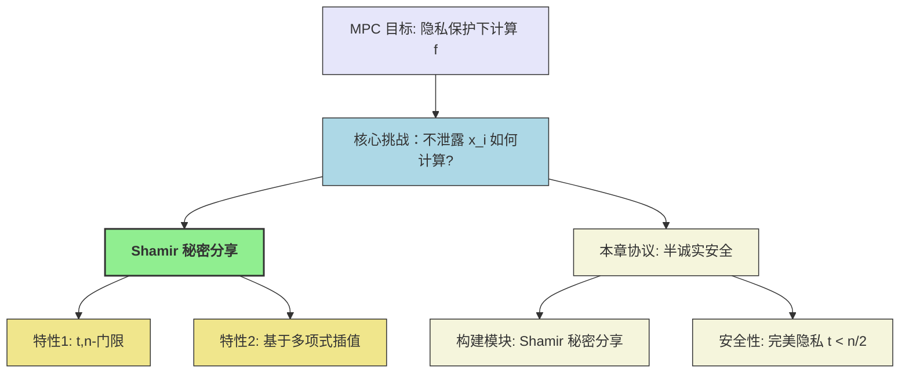

> **[迁移说明]** 本文最初发布于 `blog.zzw4257.cn`，现已迁移并在本站进行结构化整理与增强。

# 第3章 一个安全多方计算协议的例子 (An Example of Secure Multi-Party Computation Protocol)

本章将通过一个具体的例子，介绍一个具有**完美隐私性 (Perfect Privacy)** 的通用安全多方计算协议。该协议假设存在任意数量的 $n$ 个参与方，并且如果同时被攻陷的参与方数量不超过 $t < n/2$，那么这些被攻陷方将无法从协议交互中获得除其应得输出之外的任何额外信息。我们将在第六章对该协议的安全性进行严格的数学证明，即便是计算能力无限的敌手也无法获取额外信息。

与第一章的简单示例类似，本章我们仍然采用**半诚实敌手模型 (Semi-Honest Adversary Model)**，即假设所有参与者都会遵循协议的指令，但可能会试图从其收到的消息中推断更多信息。同时，我们假设任意两个参与方之间存在安全的通信信道。

本章的核心构建模块是 **Shamir 秘密分享方案 (Shamir's Secret Sharing Scheme)**。

## 3.1 Shamir 秘密分享 (Shamir's Secret Sharing)

Shamir 秘密分享方案由 Adi Shamir 于1979年提出，它是一种基于有限域 $\mathbb{F}$ 上多项式插值的秘密分享机制。该方案要求有限域的大小 $|\mathbb{F}| > n$（参与方数量）。在本章中，我们通常假设 $\mathbb{F} = \mathbb{Z}_p$，其中 $p$ 是一个足够大的素数且 $n < p$。

**基本思想**:

1.  **公共参数**: 所有参与方约定 $n$ 个公开的、各不相同且均不为零的元素 $(\alpha_1, \dots, \alpha_n)$，其中 $\alpha_i \in \mathbb{F} \setminus \{0\}$。这些 $\alpha_i$ 通常是参与方 $P_i$ 的公开标识。
2.  **秘密分享**: 要分享秘密 $s \in \mathbb{F}$，秘密持有者（或指定的 Dealer）执行以下操作：
    *   随机选择一个阶数最多为 $t$ 的多项式 $q_s(x) \in \mathbb{F}[x]$，使得 $q_s(0) = s$。
        即 $q_s(x) = s + a_1 x + a_2 x^2 + \dots + a_t x^t$，其中 $a_1, \dots, a_t \leftarrow_{\text{\textdollar}} \mathbb{F}$ 是随机选择的系数。
    *   秘密地将份额 $s_j = q_s(\alpha_j)$ 发送给参与方 $P_j$。

**关键性质 (基于拉格朗日插值法)**:

1.  **可重构性 (Reconstructibility)**: 任意 $t+1$ 个或更多的份额 $((\alpha_{i_1}, s_{i_1}), \dots, (\alpha_{i_{t+1}}, s_{i_{t+1}}))$ 可以唯一地确定多项式 $q_s(x)$，从而恢复秘密 $s = q_s(0)$。
2.  **隐私性 (Privacy)**: 任意 $t$ 个或更少的份额 $((\alpha_{i_1}, s_{i_1}), \dots, (\alpha_{i_t}, s_{i_t}))$ 无法泄露关于秘密 $s$ 的任何信息。这是因为给定 $t$ 个点，存在无数个阶数不超过 $t$ 的多项式经过这些点，并且这些多项式在 $x=0$ 处的取值可以是域 $\mathbb{F}$ 中的任何元素。

### 3.1.1 拉格朗日插值法 (Lagrange Interpolation)

拉格朗日插值法提供了一种通过给定点集构造唯一多项式的方法。

> **📐 拉格朗日插值定理**

    给定 $\ell+1$ 个不同的点 $(\alpha_1, y_1), \dots, (\alpha_{\ell+1}, y_{\ell+1})$，其中 $\alpha_i \in \mathbb{F}$ 且 $\alpha_i \ne \alpha_j$ for $i \ne j$，存在唯一一个阶数至多为 $\ell$ 的多项式 $q(x)$ 经过所有这些点，该多项式可以表示为：
    $$
    q(x) = \sum_{i=1}^{\ell+1} y_i \cdot \delta_i(x)
    $$
    其中，$y_i = q(\alpha_i)$，而 $\delta_i(x)$ 是拉格朗日基多项式，定义为：
    $$
    \delta_i(x) = \prod_{j=1, j \ne i}^{\ell+1} \frac{x - \alpha_j}{\alpha_i - \alpha_j}
    $$
    这些基多项式满足性质：$\delta_i(\alpha_i) = 1$ 且 $\delta_i(\alpha_j) = 0$ 对于所有 $j \ne i$。

**秘密重构**:
在 Shamir 秘密分享中，如果我们拥有 $t+1$ 个份额 $(s_{i_1}, \dots, s_{i_{t+1}})$ 对应于点 $(\alpha_{i_1}, \dots, \alpha_{i_{t+1}})$，我们可以用这些点来插值多项式 $q_s(x)$。秘密 $s$ 即为 $q_s(0)$。
令 $\ell = t$，我们有 $t+1$ 个点 $(\alpha_k, s_k)$ for $k \in K$ where $|K|=t+1$。
$$
s = q_s(0) = \sum_{k \in K} s_k \cdot \delta_k(0) = \sum_{k \in K} s_k \cdot \left( \prod_{j \in K, j \ne k} \frac{0 - \alpha_j}{\alpha_k - \alpha_j} \right) = \sum_{k \in K} s_k \cdot \left( \prod_{j \in K, j \ne k} \frac{\alpha_j}{\alpha_j - \alpha_k} \right)
$$
这里的 $\left( \prod_{j \in K, j \ne k} \frac{\alpha_j}{\alpha_j - \alpha_k} \right)$ 称为**重构向量 (recombination vector)** 的分量 $r_k$ (或 $\lambda_k$)。这些 $r_k$ 是公开的，因为它们仅依赖于公开的 $\alpha_j$ 值。

**隐私性证明 (直观)**:
考虑 $t$ 个份额 $((\alpha_1, s_1), \dots, (\alpha_t, s_t))$。对于任何可能的秘密值 $s' \in \mathbb{F}$，我们都可以找到一个阶数至多为 $t$ 的多项式 $q'(x)$，它同时满足 $q'(\alpha_j) = s_j$ for $j=1,\dots,t$ 和 $q'(0)=s'$。这是因为 $t+1$ 个点（包括 $(0, s')$ 和已知的 $t$ 个份额点）可以唯一确定一个阶数至多为 $t$ 的多项式。由于原始多项式 $q_s(x)$ 的系数 $a_1, \dots, a_t$ 是均匀随机选择的，所以对于这 $t$ 个份额，秘密 $s$ 的任何可能取值都是等概率的。因此，这 $t$ 个份额不泄露关于 $s$ 的任何信息。

### 3.1.2 计算示例 (Calculation Example)

教材中给出了一个具体的计算例子 (Page 18-19)，展示了如何使用 Shamir 秘密分享以及如何通过拉格朗日插值重构秘密。

**参数**:

*   参与方数量 $n=5$ (不直接用于多项式阶数，但 $\alpha_i$ 有 5 个)。
*   门限 $t=2$ (即多项式最高阶为 2)。
*   秘密 $s=6$。
*   有限域 $\mathbb{F} = \mathbb{Z}_{11}$。
*   公开点 $\vec{\alpha} = (\alpha_1, \dots, \alpha_5) = (1, 2, 3, 4, 5)$。

**分享过程**:

1.  随机选择系数 $b_1=7, b_2=1 \in \mathbb{Z}_{11}$。
2.  构造多项式 $q_s(x) = s + b_1 x + b_2 x^2 = 6 + 7x + x^2 \pmod{11}$。
3.  计算份额:
    *   $s_1 = q_s(1) = 6+7+1 = 14 \equiv 3 \pmod{11}$
    *   $s_2 = q_s(2) = 6+14+4 = 24 \equiv 2 \pmod{11}$
    *   $s_3 = q_s(3) = 6+21+9 = 36 \equiv 3 \pmod{11}$
    *   $s_4 = q_s(4) = 6+28+16 = 50 \equiv 6 \pmod{11}$
    *   $s_5 = q_s(5) = 6+35+25 = 66 \equiv 0 \pmod{11}$
    份额为 $(3, 2, 3, 6, 0)$。

**重构过程 (假设拥有份额 $s_3, s_4, s_5$ 对应于 $\alpha_3=3, \alpha_4=4, \alpha_5=5$)**:
由于 $t=2$，需要 $t+1=3$ 个份额来重构。
我们希望找到 $q_s(0)$。根据拉格朗日插值公式:
$$
q_s(0) = s_3 \delta_3(0) + s_4 \delta_4(0) + s_5 \delta_5(0)
$$

计算基多项式在 $x=0$ 处的值:

*   $\delta_3(0)$:

    $$
    \begin{align}
    \delta_3(0) &\equiv \frac{0-\alpha_4}{\alpha_3-\alpha_4} \cdot \frac{0-\alpha_5}{\alpha_3-\alpha_5} \pmod{11} \\
    &\equiv \frac{-4}{3-4} \cdot \frac{-5}{3-5} \pmod{11} \\
    &\equiv \frac{-4}{-1} \cdot \frac{-5}{-2} \pmod{11} \\
    &\equiv 4 \cdot (5 \cdot 2^{-1}) \pmod{11} \\
    &\text{其中 } 2^{-1} \equiv 6 \pmod{11} \text{ (因为 } 2 \cdot 6 = 12 \equiv 1 \pmod{11}) \\
    &\equiv 4 \cdot (5 \cdot 6) \pmod{11} \\
    &\equiv 4 \cdot 30 \pmod{11} \\
    &\equiv 4 \cdot 8 \pmod{11} \\
    &\equiv 32 \pmod{11} \\
    &\equiv 10 \pmod{11}
    \end{align}
    $$

教材计算 $\delta_3(x)$ 先，然后代入 $x=0$。 
    
$$
\begin{align}
    \delta_3(x) &= \frac{(x-4)(x-5)}{(3-4)(3-5)} \\
    &= \frac{(x-4)(x-5)}{(-1)\cdot(-2)} \\
    &= \frac{(x-4)(x-5)}{2} \\
    &= (x^2 - 9x + 20) \cdot 6 \pmod{11} \\
    &= (x^2 - 9x + 20) \cdot 6 \\
    &= 6x^2 - 54x + 120 \pmod{11} \\
    &\equiv 6x^2 + 2x + 10 \pmod{11}
\end{align}
$$

导出 $\delta_3(0)=10$ 比较麻烦

*   $\delta_4(0)$:

    $$
    \begin{align}
    \delta_4(0) &\equiv \frac{0-\alpha_3}{\alpha_4-\alpha_3} \cdot \frac{0-\alpha_5}{\alpha_4-\alpha_5} \pmod{11} \\
    &\equiv \frac{-3}{4-3} \cdot \frac{-5}{4-5} \pmod{11} \\
    &\equiv \frac{-3}{1} \cdot \frac{-5}{-1} \pmod{11} \\
    &\equiv (-3) \cdot 5 \pmod{11} \\
    &\equiv -15 \pmod{11} \\
    &\equiv 7 \pmod{11}
    \end{align}
    $$

    (教材计算 $\delta_4(x) \equiv 10x^2+8x+7 \pmod{11}$。$\delta_4(0) = 7$。)

*   $\delta_5(0)$:

    $$
    \begin{align}
    \delta_5(0) &\equiv \frac{0-\alpha_3}{\alpha_5-\alpha_3} \cdot \frac{0-\alpha_4}{\alpha_5-\alpha_4} \pmod{11} \\
    &\equiv \frac{-3}{5-3} \cdot \frac{-4}{5-4} \pmod{11} \\
    &\equiv \frac{-3}{2} \cdot \frac{-4}{1} \pmod{11} \\
    &\equiv (-3 \cdot 2^{-1}) \cdot (-4) \pmod{11} \\
    &\equiv (-3 \cdot 6) \cdot (-4) \pmod{11} \\
    &\equiv (-18) \cdot (-4) \pmod{11} \\
    &\equiv 4 \cdot (-4) \pmod{11} \\
    &\equiv -16 \pmod{11} \\
    &\equiv 6 \pmod{11}
    \end{align}
    $$
    
    (教材计算 $\delta_5(x) \equiv 6x^2+2x+6 \pmod{11}$。$\delta_5(0) = 6$。)

重构秘密:

$$
\begin{align}
s &\equiv (s_3 \cdot \delta_3(0) + s_4 \cdot \delta_4(0) + s_5 \cdot \delta_5(0)) \pmod{11} \\
&\equiv (3 \cdot 10 + 6 \cdot 7 + 0 \cdot 6) \pmod{11} \\
&\equiv (30 + 42 + 0) \pmod{11} \\
&\equiv (8 + 9 + 0) \pmod{11} \\
&\equiv 17 \pmod{11} \\
&\equiv 6 \pmod{11}
\end{align}
$$

与原始秘密一致。

## 3.2 半诚实安全的电路计算协议 (Semi-Honest Secure Circuit Computation Protocol)

本节将基于 Shamir 秘密分享方案，构造一个通用的安全多方计算协议，用于计算表示为**算术电路 (Arithmetic Circuit)** 的任何函数。该协议在半诚实敌手模型下是安全的。

### 3.2.1 算术电路 (Arithmetic Circuit)

> **📖 算术电路**

    算术电路是一个有向无环图 (DAG)，其节点称为**门 (gate)**，边称为**导线 (wire)**。
    
    *   **输入门 (Input Gates)**: 每个参与方 $P_i$ 对应一个输入门，没有输入导线，但可以有任意数量的输出导线。它将其私密输入 $x_i \in \mathbb{F}$ 传递到其输出导线上。
    *   **加法门 (Addition Gates)**: 有两条输入导线，任意数量的输出导线。输出其两个输入值之和。
    *   **乘法门 (Multiplication Gates)**: 有两条输入导线，任意数量的输出导线。输出其两个输入值之积。
    *   **常数乘法门 (Constant Multiplication Gates)**: 有一条输入导线，任意数量的输出导线。将其输入值乘以一个公开常数 $c \in \mathbb{F}$。
    *   **输出门 (Output Gates)**: 每个参与方 $P_i$ 可能对应一个或多个输出门，有一条输入导线，没有输出导线。其输入导线上的值即为该参与方的输出 $y_i$。
    
    电路的计算按照**拓扑顺序 (topological order)** 进行，即一个门的计算在其所有输入导线的值都确定之后进行。

> **💡 通用性**
    任何可计算函数都可以表示为布尔电路（与门、或门、非门）。而布尔电路的操作又可以模拟为有限域 $\mathbb{F}$ 上的算术运算：

    *   NOT $b \Rightarrow 1-b$ (在 $\mathbb{F}_2$ 中)
    *   AND $b, b' \Rightarrow b \cdot b'$ (在 $\mathbb{F}_2$ 中)
    *   XOR $b, b' \Rightarrow b+b'$ (在 $\mathbb{F}_2$ 中)
    因此，算术电路模型具有通用性。

### 3.2.2 协议描述 (Protocol Description)

协议的目标是让 $n$ 个参与方安全地计算一个由算术电路 $C$ 表示的函数 $f: \mathbb{F}^N \to \mathbb{F}^M$ (这里 $N, M$ 是总输入/输出数量)。
我们采用 Shamir $(t,n)$-秘密分享，其中门限 $t < n/2$。

**符号约定 (Def 3.2.1)**:
给定公开点 $\vec{\alpha} = (\alpha_1, \dots, \alpha_n)$。对于一个秘密 $a \in \mathbb{F}$，如果它通过一个阶数最多为 $t$ 的多项式 $f_a(x)$ (满足 $f_a(0)=a$) 进行分享，那么参与方 $P_j$ 持有的份额是 $f_a(\alpha_j)$。我们将这组份额记为 $[a; f_a]_t$ 或简写为 $[a]_t$ 或 $[a]$。
$[a; f_a]_t = (f_a(\alpha_1), \dots, f_a(\alpha_n))$

**份额的线性性质 (Lemma 3.1)**:
设 $[a; f_a]_t$ 和 $[b; f_b]_t$ 是秘密 $a, b$ 的份额。
1.  **加法**: $[a; f_a]_t + [b; f_b]_t = (f_a(\alpha_1)+f_b(\alpha_1), \dots, f_a(\alpha_n)+f_b(\alpha_n)) = [a+b; f_a+f_b]_t$。
    (其中 $(f_a+f_b)(x) = f_a(x)+f_b(x)$，其阶数仍 $\le t$)
2.  **常数乘法**: $c \cdot [a; f_a]_t = (c \cdot f_a(\alpha_1), \dots, c \cdot f_a(\alpha_n)) = [ca; c \cdot f_a]_t$。
    (其中 $(c \cdot f_a)(x) = c \cdot f_a(x)$，其阶数仍 $\le t$)
3.  **逐项乘法**: $[a; f_a]_t * [b; f_b]_t = (f_a(\alpha_1)f_b(\alpha_1), \dots, f_a(\alpha_n)f_b(\alpha_n)) = [ab; f_a f_b]_{2t}$。
    (其中 $(f_a f_b)(x) = f_a(x)f_b(x)$，其阶数变为 $\le 2t$)

注意乘法后多项式的阶数翻倍。由于 $t < n/2 \Rightarrow 2t < n-1$ (如果 $n$ 是奇数，则 $2t \le n-1$；如果 $n$ 是偶数，则 $2t \le n-2$)。只要 $2t < n$ (即 $2t \le n-1$)，那么 $2t+1 \le n$ 个点仍然可以唯一确定一个阶数为 $2t$ 的多项式。因此，我们需要 $2t+1 \le n$ 才能进行乘法后的秘密重构（如果需要的话）或继续进行基于 $2t$ 阶多项式的分享。协议中乘法后会进行一次**度降低 (degree reduction)** 步骤。

**协议流程 (图 3.1)**:
协议分为三个阶段：输入分享、计算、输出重构。

1.  **输入分享阶段 (Input Sharing Phase)**:

    *   对于每个参与方 $P_i$ 的每个私密输入比特/元素 $x_{i,k} \in \mathbb{F}$， $P_i$ 选择一个随机的 $t$ 阶多项式 $f_{x_{i,k}}(x)$ 使得 $f_{x_{i,k}}(0) = x_{i,k}$。
    *   $P_i$ 计算份额 $(f_{x_{i,k}}(\alpha_1), \dots, f_{x_{i,k}}(\alpha_n))$ 并将 $f_{x_{i,k}}(\alpha_j)$ 安全地发送给 $P_j$。
    *   现在每个参与方都持有了所有输入值对应的份额 $[x_{input}; f_{x_{input}}]_t$。

2.  **计算阶段 (Computation Phase)**:
    按照电路的拓扑顺序逐个门进行计算。假设一个门 $g$ 的输入导线 $w_a, w_b$ 上对应的值的分享为 $[val(w_a); f_a]_t$ 和 $[val(w_b); f_b]_t$。
    *   **加法门/常数乘法门**:
        *   每个参与方 $P_j$ 在本地对其持有的份额 $f_a(\alpha_j)$ 和 $f_b(\alpha_j)$ 进行相应的加法或常数乘法运算。
        *   根据引理 3.1，结果份额 $[val(w_a)+val(w_b); f_a+f_b]_t$ 或 $[c \cdot val(w_a); c \cdot f_a]_t$ 被正确计算并分发，且多项式阶数仍为 $t$。
    *   **乘法门**:
        1.  **本地乘法**: 每个参与方 $P_j$ 计算其份额的乘积 $f_a(\alpha_j) \cdot f_b(\alpha_j)$。这会得到 $[val(w_a)val(w_b); f_a f_b]_{2t}$ 的份额。此时多项式 $h(x) = f_a(x)f_b(x)$ 的阶数为 $2t$。
        2.  **度降低 (Degree Reduction / Re-sharing)**: (这一步是关键，因为我们希望后续操作仍基于 $t$ 阶多项式)
            *   目标：将秘密 $S = val(w_a)val(w_b)$ (当前由 $2t$ 阶多项式 $h(x)$ 分享) 重新分享为一个新的 $t$ 阶多项式 $h'(x)$。
            *   每个参与方 $P_j$ 持有 $h(\alpha_j)$。现在，$P_j$ 将 $h(\alpha_j)$ 视为其新的秘密输入，并对其进行一次新的 $t$-阶 Shamir 分享。即，$P_j$ 选择随机 $t$ 阶多项式 $f_j(x)$ 使得 $f_j(0) = h(\alpha_j)$，然后将 $f_j(\alpha_k)$ 发送给 $P_k$。
            *   此时，对于秘密 $S=h(0)$，每个参与方 $P_k$ 持有了一组份额 $(f_1(\alpha_k), \dots, f_n(\alpha_k))$。
            *   注意到 $S = h(0) = \sum_{j=1}^{2t+1} r_j h(\alpha_j)$ （如果 $2t+1 \le n$，使用 $2t+1$ 个点来重构 $h(0)$，其中 $r_j$ 是重构向量的分量）。
            *   我们想得到 $[S; h']_t$。$P_k$ 计算 $\sum_{j=1}^{2t+1} r_j f_j(\alpha_k)$。这个和是 $P_k$ 持有的关于 $S$ 的 $t$-阶分享的新份额。
                设 $h'(x) = \sum_{j=1}^{2t+1} r_j f_j(x)$。那么 $h'(0) = \sum r_j f_j(0) = \sum r_j h(\alpha_j) = h(0) = S$。
                并且 $h'(x)$ 的阶数是 $t$ (因为每个 $f_j(x)$ 阶数为 $t$，$r_j$ 是常数)。
                因此，参与方 $P_k$ 计算出的 $\sum_{j=1}^{2t+1} r_j f_j(\alpha_k)$ 就是 $h'(\alpha_k)$，即秘密 $S$ 的新的 $t$-阶份额。
            *   **条件**: 这个度降低步骤需要 $2t+1 \le n$。由于协议假设 $t < n/2$，即 $2t < n$，所以 $2t+1 \le n$ 总是成立的。

3.  **输出重构阶段 (Output Reconstruction Phase)**:
    *   当计算到电路的输出门时，假设输出导线 $w_{out}$ 上的值的分享为 $[y; f_y]_t$。
    *   为了让某个参与方 $P_{target}$ 获得输出 $y$，其他所有参与方 $P_j$ ($j \ne target$) 将其持有的份额 $f_y(\alpha_j)$ 发送给 $P_{target}$。
    *   $P_{target}$ 收集到至少 $t+1$ 个份额（包括自己的），然后使用拉格朗日插值计算 $f_y(0) = y$。

### 3.2.3 安全性分析 (Security Analysis)

**正确性 (Correctness)**:
*   加法门和常数乘法门的正确性直接由份额的线性性质保证。
*   乘法门的度降低步骤确保了秘密的正确传递，并且分享的多项式阶数恢复到 $t$。
*   输出重构的正确性由拉格朗日插值保证。
因此，协议是完美正确的。

**完美隐私性 (Perfect Privacy)** (直观分析，正式证明见第6章):
我们需要证明，对于任意 $t$ 个被攻陷的参与方组成的集合 $C$ (即 $|C| \le t < n/2$)，他们联合起来看到的所有消息（视图 view）都可以由他们自己的输入和应得的输出高效地模拟出来。

*   **输入分享阶段**: 诚实方 $P_j \notin C$ 分享其输入 $x_j$ 时，生成的 $t$ 阶多项式 $f_{x_j}(x)$ 的系数是随机的。因此，集合 $C$ 中的参与方收到的关于 $x_j$ 的 $t$ 个份额是关于 $x_j$ 的 $t$-隐私分享，不泄露任何关于 $x_j$ 的信息（根据 Shamir 分享的隐私性）。
*   **计算阶段**:
    *   加法门和常数乘法门：本地计算，不产生新的通信。
    *   乘法门 (度降低)：当诚实方 $P_j \notin C$ 将其持有的 $h(\alpha_j)$ (其中 $h(x)$ 是一个 $2t$ 阶多项式) 进行 $t$-阶分享时，同样，因为 $f_j(x)$ 的随机性，$C$ 收到的份额不泄露 $h(\alpha_j)$。
        关键在于， $C$ 中的参与方总共只能看到 $t$ 个关于任何秘密的份额（无论是原始输入、中间值还是度降低的值）。
*   **输出重构阶段**: 当诚实方 $P_j \notin C$ 将其份额 $f_y(\alpha_j)$ 发送给一个被攻陷的输出方 $P_i \in C$ 时，由于 $P_i$ 最终会得到输出 $y=f_y(0)$，并且它已经拥有了 $C$ 中其他成员的份额（总共 $|C| \le t$ 个）。它可以利用 $y$ 和这 $|C|$ 个份额，唯一确定 $f_y(x)$（如果 $|C|=t$），或者确定经过这些点且 $f_y(0)=y$ 的多项式。因此，它能计算出诚实方 $P_j$ 发送给它的份额。这意味着诚实方发送的份额没有泄露额外信息。

**模拟器构造 (粗略思路)**:
模拟器 $S$ 知道 $C$ 中参与方的输入 $\{x_i\}_{P_i \in C}$ 和输出 $\{y_i\}_{P_i \in C}$。
1.  对于 $C$ 中参与方的输入分享， $S$ 诚实地执行。
2.  对于诚实方 $P_j \notin C$ 的输入分享， $S$ 为其生成随机的 $t$ 个份额（对于 $C$ 中的每个成员）发送给 $C$。
3.  对于乘法门的度降低，当诚实方 $P_j \notin C$ 需要分享 $h(\alpha_j)$ 时，$S$ 同样为其生成随机的 $t$ 个份额发送给 $C$。
4.  对于输出重构，如果输出方 $P_i \in C$， $S$ 利用 $y_i$ 和 $C$ 中成员已有的关于 $y_i$ 的份额，计算出诚实方应该发送给 $P_i$ 的份额，并模拟这个发送。

由于所有诚实方贡献的份额在 $C$ 看来都是随机的（或者可以从 $C$ 的输入输出推断出来），因此模拟的视图与真实视图是完美不可区分的。

### 3.2.4 计算示例 (Calculation Example - Page 24)

教材中用一个简单的加法 $c=a+b$ 的例子，展示了在输出重构阶段，即便将所有份额都发给被攻陷方 $P_1$，也不会泄露额外信息。

**设定**:
*   $n=3, t=1$。$P_1$ 被攻陷。
*   $\vec{\alpha} = (1, 2, 3)$。
*   $t=1 \Rightarrow$ 多项式为线性 $f(x) = s + b_0 x$。
*   假设 $a=4$ 通过 $a(x)=4+x$ 分享: $[a] = (a(1),a(2),a(3)) = (5,6,7)$。
*   假设 $b=4$ 通过 $b(x)=4+2x$ 分享: $[b] = (b(1),b(2),b(3)) = (6,8,10)$。
*   $P_1$ 的份额加粗：$P_1$ 持有 $a(1)=\mathbf{5}, b(1)=\mathbf{6}$。

**计算 $c=a+b$**:
本地份额相加: $c(x) = a(x)+b(x) = (4+x)+(4+2x) = 8+3x$。
$[c] = (a(1)+b(1), a(2)+b(2), a(3)+b(3)) = (5+6, 6+8, 7+10) = (11, 14, 17)$。
$P_1$ 持有 $c(1)=\mathbf{11}$。

**输出 $c$ 给 $P_1$**:
$P_2$ 发送 $c(2)=14$ 给 $P_1$。
$P_3$ 发送 $c(3)=17$ 给 $P_1$。
$P_1$ 现在拥有 $(c(1), c(2), c(3)) = (11, 14, 17)$。
$P_1$ 用 $(\alpha_1, c(1))=(1,11)$ 和 $(\alpha_2, c(2))=(2,14)$ 插值 (因为 $t=1$, 2个点足够):

$$
\begin{align*}
c(x) 
&= c(1) \cdot \frac{x-\alpha_2}{\alpha_1-\alpha_2} + c(2) \cdot \frac{x-\alpha_1}{\alpha_2-\alpha_1} \\
&= 11 \cdot \frac{x-2}{1-2} + 14 \cdot \frac{x-1}{2-1} \\
&= 11 \cdot (-(x-2)) + 14 \cdot (x-1) \\
&= -11x + 22 + 14x - 14 \\
&= 3x + 8
\end{align*}
$$

$c = c(0) = 8$。

**隐私性**: $P_1$ 知道 $c=8$。他是否能知道 $a, b$ 的原始值？
$P_1$ 的视图包括：
*   自己的输入（如果有的话，这里没有）
*   $a(1)=5, b(1)=6$
*   $c(1)=11, c(2)=14, c(3)=17$ (以及输出 $c=8$)

$P_1$ 可以尝试假设 $a=3, b=5$ (仍然满足 $a+b=8$)。
如果 $a=3$，且 $a(1)=5$，那么 $a(x)=3+2x$。则 $a(2)=7, a(3)=9$。
如果 $b=5$，且 $b(1)=6$，那么 $b(x)=5+x$。则 $b(2)=7, b(3)=8$。
那么对应的 $c(x) = a(x)+b(x) = (3+2x)+(5+x) = 8+3x$。
所以 $c(1)=11, c(2)=14, c(3)=17$。
这个假设 $(a=3, b=5)$ 与 $P_1$ 观察到的所有信息是完全一致的。因此，$P_1$ 无法区分 $a=4, b=4$ 和 $a=3, b=5$ 这两种情况。
这说明了即使在输出重构阶段将所有份额都给了一个被攻陷方，只要 $t < n/2$ (这里 $1 < 3/2$)，协议仍然保持隐私性。

教材的乘法例子 (Page 25) 进一步说明了度降低过程如何保持隐私性，因为即使是 $2t$ 阶多项式的份额，在仅有 $t$ 个被攻陷方的情况下，也无法唯一确定该多项式，其在 $x=0$ 处的值（即乘积）也就无法被唯一确定。度降低过程中的重新随机分享进一步增强了隐私性。