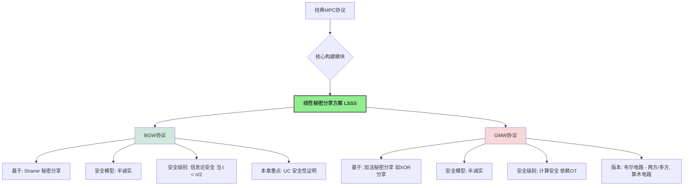

> **[迁移说明]** 本文最初发布于 `blog.zzw4257.cn`，现已迁移并在本站进行结构化整理与增强。

# 第6章 基于线性秘密分享的协议 (Protocols based on Linear Secret Sharing)

从本章开始，我们将深入探讨几类经典的 MPC 协议。我们将从**半诚实安全 (Semi-Honest Secure)** 的协议入手，这是理解更复杂恶意安全协议的基础。本章的核心是介绍基于**线性秘密分享方案 (Linear Secret Sharing Scheme, LSSS)** 的 MPC 协议。LSSS 的一个关键特性是，秘密的份额可以进行线性组合，从而直接得到原秘密线性组合的份额。

本章主要介绍两类基于 LSSS 的里程碑式协议：

1. **BGW 协议 (Ben-Or, Goldwasser, Wigderson)**: 该协议主要构建于 **Shamir 秘密分享** 之上，能够为算术电路提供信息论安全（在半诚实模型和特定门限下）。我们将回顾其构造，并为其提供在通用可组合 (UC) 框架下的形式化安全性证明。
2. **GMW 协议 (Goldreich, Micali, Wigderson)**: 该协议则通常基于更简单的**加法秘密分享** (例如，基于异或的分享来处理布尔电路，或基于模加法来处理算术电路)。其安全性通常是计算安全的，依赖于诸如茫然传输 (OT) 等密码学原语。我们将探讨其在布尔电路和算术电路上的不同版本。

## 6.1 BGW 协议（半诚实安全）(BGW Protocol - Semi-Honest Security)

BGW 协议 [30] 是最早实现对任意函数进行安全多方计算的协议之一，它为后续的 MPC 研究奠定了坚实的基础。

### 6.1.1 协议描述 (Protocol Description - Fig 6.2 / Fig 3.1)

> **📋 BGW 协议核心流程 (基于 Shamir $(t,n)$-秘密分享, $t < n/2$)**
    该协议的详细步骤与第3章介绍的“半诚实安全的电路计算协议”完全一致。这里进行概要回顾，并强调其基于 Shamir 分享的特性。

    **协议阶段**:

    1.**输入分享 (Input Sharing Phase)**:

    *   对于每个参与方 $P_i$ 的私密输入 $x_{i,k} \in \mathbb{F}$ (有限域元素)，$P_i$ 选择一个随机的、阶数最高为 $t$ 的多项式 $q_{i,k}(z)$，使得 $q_{i,k}(0) = x_{i,k}$。
    *   $P_i$ 计算份额 $s_{i,k}^{(j)} = q_{i,k}(\alpha_j)$ (其中 $\alpha_j$ 是公开的、赋予 $P_j$ 的非零域元素)，并将 $s_{i,k}^{(j)}$ 安全地发送给 $P_j$。
    *   最终，对于电路的每个输入导线 $w$ (其值为 $v_w$)，每个参与方 $P_j$ 持有其 Shamir 份额 $[v_w]_j$ (即 $q_w(\alpha_j)$)。

    2.**计算阶段 (Computation Phase)**:
    参与方按照电路的拓扑顺序，逐个门进行计算。设一个门 $g$ 的输入导线为 $w_a, w_b$，其上的秘密值分别为 $v_a, v_b$，输出导线为 $w_c$，其值为 $v_c$。参与方 $P_j$ 持有份额 $[v_a]_j$ 和 $[v_b]_j$。

    *   **加法门 ($v_c = v_a + v_b$)**:
        每个 $P_j$ 在本地计算其输出份额 $[v_c]_j = [v_a]_j + [v_b]_j$。
        由于 Shamir 分享的线性性，$q_c(z) = q_a(z) + q_b(z)$ 仍是 $t$ 阶多项式，且 $q_c(0) = q_a(0) + q_b(0) = v_a + v_b = v_c$。
    *   **常数乘法门 ($v_c = k \cdot v_a$)**:
        每个 $P_j$ 在本地计算其输出份额 $[v_c]_j = k \cdot [v_a]_j$ (其中 $k$ 是公开常数)。
        $q_c(z) = k \cdot q_a(z)$ 仍是 $t$ 阶多项式，且 $q_c(0) = k \cdot v_a = v_c$。
    *   **乘法门 ($v_c = v_a \cdot v_b$)**:
    
        1.  **本地份额乘积**: 每个 $P_j$ 计算 $h_j = [v_a]_j \cdot [v_b]_j = q_a(\alpha_j) \cdot q_b(\alpha_j)$。
            这些 $h_j$ 是一个新的多项式 $h(z) = q_a(z) \cdot q_b(z)$ 在点 $\alpha_j$ 上的取值。$h(z)$ 的阶数最高为 $2t$，且 $h(0) = q_a(0)q_b(0) = v_a v_b = v_c$。
        2.  **度降低 / 重新随机化和分享 (Degree Reduction / Re-randomization and Re-sharing)**:
            由于 $h(z)$ 的阶数为 $2t$，而我们希望后续计算仍基于 $t$ 阶多项式的分享。因为 $t < n/2 \Rightarrow 2t < n$, 所以 $2t+1 \le n$。这意味着 $2t+1$ 个点足以唯一确定 $h(z)$。
            *   每个参与方 $P_j$ 将其计算得到的 $h_j = h(\alpha_j)$ 视为一个新的秘密。$P_j$ 对 $h_j$ 进行一次新的、独立的 Shamir $(t,n)$-分享：选择随机 $t$ 阶多项式 $q'_j(z)$ 使得 $q'_j(0) = h_j$，然后将份额 $q'_j(\alpha_k)$ 发送给 $P_k$。
            *   现在，对于秘密 $v_c = h(0)$，我们知道 $v_c = \sum_{j \in S_{recon}} \lambda_j h(\alpha_j)$，其中 $S_{recon}$ 是一个大小为 $2t+1$ 的公开索引集合，$\lambda_j$ 是对应的拉格朗日重构系数。
            *   每个参与方 $P_k$ 计算其关于 $v_c$ 的新的 $t$-阶份额：
                    

        $$
        [v_c]_k = \sum_{j \in S_{recon}} \lambda_j \cdot q'_j(\alpha_k)
        $$

        令新的分享多项式为 $q_c(z) = \sum_{j \in S_{recon}} \lambda_j q'_j(z)$。
        则 $q_c(0) = \sum \lambda_j q'_j(0) = \sum \lambda_j h(\alpha_j) = h(0) = v_c$。
        且 $q_c(z)$ 的阶数是 $t$（因为每个 $q'_j(z)$ 的阶数是 $t$，$\lambda_j$ 是常数）。
        因此，$[v_c]_k = q_c(\alpha_k)$。

    3.**输出重构阶段 (Output Reconstruction Phase)**:
        *   对于需要公开的输出值 $v_{out}$ (其当前分享为 $[v_{out}]$，基于 $t$ 阶多项式 $q_{out}(z)$)，指定的接收方（或所有参与方）收集至少 $t+1$ 个份额。
        *   使用这些份额通过拉格朗日插值计算 $v_{out} = q_{out}(0)$。

### 6.1.2 安全性证明 (Security Proof)

在第3章中，我们对 BGW 协议的安全性进行了较为直观的分析。本节将给出其在 UC 框架下，针对静态半诚实敌手的形式化安全性证明。

> **📐 定理 6.1: BGW 协议的半诚实 UC 安全性"
    假设被攻陷的参与方数量不超过 $t$，且 $t < n/2$。BGW 协议 $\Pi_{\text{BGW}}$ (如图 6.2 或 3.1 所述) 对于静态半诚实敌手，在通用可组合 (UC) 框架下，**信息论安全地** (statistically or perfectly securely) 实现了安全函数计算的理想功能 $\mathcal{F}_{\text{sfe}}$ (如图 6.1，即标准的安全函数计算理想功能)。

**证明**:
依据 UC 框架的平凡敌手完备性定理 (Thm 4.1)，我们仅需为平凡敌手 $\mathcal{A}_{\text{triv}}$ 构造一个模拟器 $\mathcal{S}$，使得对于任何环境 $\mathcal{Z}$，真实世界执行 $\text{EXEC}_{\Pi_{\text{BGW}}, \mathcal{A}_{\text{triv}}, \mathcal{Z}}$ 的视图与理想世界执行 $\text{EXEC}_{\mathcal{F}_{\text{sfe}}, \mathcal{S}, \mathcal{Z}}$ 的视图是不可区分的（对于 BGW 协议，实际上可以达到完美或统计不可区分）。

> **💡 理想功能 $\mathcal{F}_{\text{sfe}}$ (图 6.1 - 回顾)"
    *   当收到 $P_i$ 的输入 `(Input, sid, x_i)` 时，记录 $x_i$，并通知 $\mathcal{S}$ `(Input, sid, P_i)`。
    *   当收到 $\mathcal{S}$ 的指令 `(Output, sid, P_i)`，且所有必需输入已到时，将计算出的 $y_i=f(\vec{x})_i$ 发送给 $P_i$ (若 $P_i$ 诚实，则通过 $\mathcal{Z}$；若 $P_i$ 被攻陷，则给 $\mathcal{S}$)。

**模拟器 $\mathcal{S}$ 的构造**:
设 $C$ 为被攻陷的参与方集合 ($|C| \le t$)。 $\mathcal{S}$ 在内部运行 $\mathcal{A}_{\text{triv}}$，并模拟其与环境 $\mathcal{Z}$ 和协议其余部分的交互。

1. **处理来自 $\mathcal{F}_{\text{sfe}}$ 的 `(Input, sid, P_i)` 通知**:

   * **若 $P_i \in C$ (被攻陷方)**: 环境 $\mathcal{Z}$ 已经通过 $\mathcal{A}_{\text{triv}}$ 向 $P_i$ 提供了其真实输入 $x_i$。 $\mathcal{S}$ 知道了 $x_i$。$\mathcal{S}$ 指示其内部的 $\mathcal{A}_{\text{triv}}$ (模拟 $P_i$) 完全按照协议规定，对 $x_i$ 进行 Shamir 分享，并将相应的份额“发送”给 $C$ 中的其他成员（即 $\mathcal{A}_{\text{triv}}$ 的其他部分）。对于要发往诚实方 $P_j \notin C$ 的份额，$\mathcal{S}$ 仅作记录，不实际发送。
   * **若 $P_i \notin C$ (诚实方)**: $\mathcal{S}$ 并不知道 $P_i$ 的真实输入 $x_i$。$\mathcal{S}$ 设定 $P_i$ 的输入为一个**固定的默认值**（例如，全零向量或0）。然后，$\mathcal{S}$ 模拟 $P_i$ 对这个默认值进行 Shamir 分享，并将产生的份额发送给 $C$ 中的每个成员 $P_k \in C$ (即提供给 $\mathcal{A}_{\text{triv}}$)。
2. **模拟计算阶段的交互 (主要是乘法门的度降低)**:

   * **线性门**: 所有计算都是本地的。被攻陷方 $P_i \in C$ 会根据其持有的（可能是混合了真实输入份额和模拟的基于默认值的份额）份额进行计算。$\mathcal{S}$ 遵循此过程。
   * **乘法门的度降低步骤 (当需要诚实方 $P_j \notin C$ 发起重分享时)**:
     当一个诚实方 $P_j$ 需要对其本地计算的 $2t$ 阶份额 $h_j = q_a(\alpha_j)q_b(\alpha_j)$ 进行 $t$ 阶重分享时，$\mathcal{S}$ 模拟 $P_j$ 的行为如下：$\mathcal{S}$ 选择一个随机的 $t$ 阶多项式 $q'_j(z)$ 使得 $q'_j(0)=0$ (因为 $P_j$ 的“真实”输入被模拟为0，从而其贡献给 $h_j$ 的部分也是基于0的，除非 $h_j$ 的值完全由被攻陷方的份额决定)。然后 $\mathcal{S}$ 将 $q'_j(\alpha_k)$ 作为模拟份额发送给 $C$ 中的每个成员 $P_k \in C$。
     被攻陷方 $P_i \in C$ 接收到所有这些（真实的或模拟的）重分享份额后，会计算其新的 $t$ 阶份额。
3. **处理来自 $\mathcal{F}_{\text{sfe}}$ 的 `(Output, sid, P_i)` 指令 (当 $P_i \in C$ 是输出接收方)**:

   * $\mathcal{F}_{\text{sfe}}$ 将真实的输出值 $y_i$ (基于所有参与方的真实输入计算得到的) 发送给 $\mathcal{S}$ (因为 $P_i$ 被攻陷)。
   * $\mathcal{S}$ 现在需要模拟诚实方 $P_j \notin C$ 在输出重构阶段发送给被攻陷方 $P_i$ 的份额 $q_{y_i}(\alpha_j)$。
   * $\mathcal{S}$ 知道 $C$ 中所有成员已经持有的关于 $y_i$ 的 $t$ 阶多项式 $q_{y_i}(z)$ 的 $|C|$ 个（模拟的）份额。它还知道 $q_{y_i}(0) = y_i$。
   * 由于 $|C| \le t$，这 $|C|+1$ 个条件（$|C|$ 个份额值和 $q_{y_i}(0)=y_i$）足以唯一确定 $q_{y_i}(z)$ (如果 $|C|=t$)，或者可以找到一个与这些条件一致且系数随机选择的 $q_{y_i}(z)$ (如果 $|C|<t$，因为此时有 $t-|C|$ 个自由度来选择剩余的随机系数)。
   * $\mathcal{S}$ 构造出这样的 $q_{y_i}(z)$，然后计算 $q_{y_i}(\alpha_j)$ 对于所有 $P_j \notin C$，并将这些模拟的份额提供给 $\mathcal{A}_{\text{triv}}$ (模拟它们是从诚实方 $P_j$ 发送给被攻陷方 $P_i$ 的)。

**不可区分性分析 (完美或统计不可区分)**:
我们需要证明环境 $\mathcal{Z}$ 无法区分它所观察到的被攻陷方 $C$ 的视图。

* **输入分享阶段**: 来自诚实方 $P_j \notin C$ 的份额，在真实世界中是基于其真实输入 $x_j$ 的 $t$-Shamir份额；在理想世界中，是 $\mathcal{S}$ 模拟的基于默认值（如0）的 $t$-Shamir份额。由于 $|C| \le t$，根据 Shamir 分享的 $t$-隐私性，这两组 $t$ 个份额对于 $C$ 来说都表现为均匀随机的、与原始秘密（$x_j$ 或 0）无关的值（除非秘密本身就是0）。因此， $C$ 的视图在这部分是不可区分的。
* **计算阶段 (乘法门度降低)**: 当诚实方 $P_j \notin C$ 重分享其 $2t$ 阶份额 $h_j$ 时，它进行的是一次新的 $t$-Shamir 分享。同样，由于 $t$-隐私性， $C$ 收到的份额是均匀随机的，与 $h_j$ 的真实值（或 $\mathcal{S}$ 模拟的0值）无关。
* **输出重构阶段**:
  * **引理 6.1 (Page 68, 与引理1, Page 68 类似，但针对 BGW)**:
    令 $\text{Strip}(\text{view}_C)$ 为 $C$ 的视图中移除了输出重构阶段来自诚实方的份额的部分。对于两个不同的诚实方输入向量 $\vec{x}_{honest}^{(0)}$ 和 $\vec{x}_{honest}^{(1)}$ (假设被攻陷方输入不变)， $\text{Strip}(\text{view}_C(\vec{x}_{honest}^{(0)}))$ 和 $\text{Strip}(\text{view}_C(\vec{x}_{honest}^{(1)}))$ 的分布是完美相同的。这是因为所有来自诚实方的中间计算份额（由于 $t$-隐私性）在 $C$ 看来都是随机的。
  * **引理 6.2 (Page 70, 与引理2, Page 70 类似)**:
    令 $\text{Dress}_{\vec{y}_C}(\text{StrippedView})$ 是一个过程，它获取剥离后的视图和被攻陷方应得的真实输出 $\vec{y}_C$，并“填充回”输出重构阶段来自诚实方的份额。那么，$\text{Dress}_{\vec{y}_C}(\text{Strip}(\text{view}_C))$ 与原始的 $\text{view}_C$ 具有完美相同的分布。这是因为给定 $y_i = q_{y_i}(0)$ 和 $C$ 已知的 $|C| \le t$ 个份额，其余诚实方的份额是被唯一确定（或一致地随机确定）的。
  * **结合**:
    理想世界中 $\mathcal{S}$ 产生的视图是 $\text{Dress}_{\vec{y}_C}(\text{Strip}(\text{view}_C(\vec{x}_{honest}=\vec{0})))$ （其中 $\vec{y}_C$ 是基于真实输入的）。
    真实世界 $C$ 的视图是 $\text{view}_C(\vec{x}_{honest}=\text{actual values})$。
    由引理1，$\text{Strip}(\text{view}_C(\vec{x}_{honest}=\vec{0})) \stackrel{\text{perf}}{\equiv} \text{Strip}(\text{view}_C(\vec{x}_{honest}=\text{actual values}))$。
    由引理2，应用 $\text{Dress}_{\vec{y}_C}$ 后，两者仍然完美不可区分。
    因此，真实视图和模拟视图是完美不可区分的。

> **✅ 结论"
    BGW 协议在 $t < n/2$ 的条件下，对于静态半诚实敌手，信息论安全地（完美地）在 UC 框架下实现了 $\mathcal{F}_{\text{sfe}}$。

> **❓ 关于假设输出门之前都有乘法门 (Page 71)"
    这个假设主要简化了引理 6.2 的证明。如果输出门前是线性门，输出多项式 $q_{y_i}(z)$ 的随机性完全由其输入导线的多项式决定。模拟器在构造 $q_{y_i}(z)$ 时，需要确保其随机性与这些“上游”多项式（它们可能是基于真实输入或模拟的0输入）的（模拟的）随机性一致。这使得证明稍微复杂，但协议本身仍然是安全的。乘法门后的度降低步骤会引入新的、独立的随机性到输出多项式中，使得模拟更直接。
