> **[迁移说明]** 本文最初发布于 `blog.zzw4257.cn`，现已迁移并在本站进行结构化整理与增强。

# 文件系统 (File System)

## 1. 文件系统接口 (File System Interface)

### 1.1. 引言：为何需要文件系统 (Introduction: Why File Systems?)

计算机系统中的海量数据存储在磁盘等二级存储设备上。如果应用程序直接操作磁盘的物理地址（如磁道号、扇区号），将会极其复杂且容易出错。文件系统作为操作系统提供的核心组件，旨在解决这一问题。

> **ℹ️ 核心目标**  
> 文件系统为用户和应用程序提供了一个**统一的、抽象的、持久化的数据存储和访问机制**。

#### 1.1.1. 存储的抽象 (Abstraction of Storage)

文件系统将底层物理存储设备的复杂性屏蔽掉，向上层提供更易于理解和操作的抽象概念。

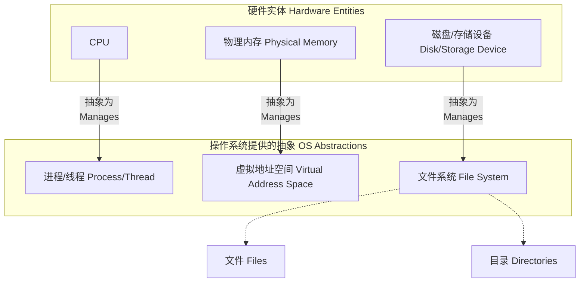

* **CPU** 被抽象为并发执行的实体：**进程 (processes)** 和 **线程 (threads)**。
* **物理内存 (Memory)** 被抽象为每个进程独立的**虚拟地址空间 (virtual address spaces)**。
* **存储设备 (Storage)** 被抽象为有组织的**文件 (files)** 和 **目录 (directories)**。

> **💡 Unix哲学**  
> 在Unix及其衍生系统中（如Linux），一个核心设计哲学是"一切皆文件 (Everything is a file)"。这使得对不同类型资源（真实文件、设备、网络连接等）的访问可以通过统一的文件操作接口进行。

### 1.2. 文件基本概念 (File Concept)

#### 1.2.1. 文件定义与类型 (File Definition and Types)

**文件 (File)** 是一个用于存储相关信息的、具有名称的逻辑存储单元。从操作系统的角度看，它通常是一系列字节的集合，其具体含义由创建和使用它的应用程序来解释。

**常见文件类型**:

* **数据文件 (Data files)**:

  * 文本文件 (Text files): 如源代码 (`.c`, `.py`), 配置文件 (`.conf`)。
  * 二进制文件 (Binary files):
    * 可执行文件 (Executable files): 如Linux下的ELF格式文件，Windows下的PE格式文件 (`.exe`)。
    * 归档文件 (Archive files): 如 `.tar`, `.zip`。
    * 多媒体文件 (Multimedia files): 如 `.jpg`, `.mp4`。
  * 特定应用型 (Application-specific): 如字处理文档 (`.docx`), 电子表格 (`.xlsx`)。
* **程序文件 (Program files)**: 通常指可执行文件。
* **特殊文件 (Special files)** (常见于Unix-like系统):

  * 设备文件 (Device files): 如 `/dev/sda` (硬盘), `/dev/tty` (终端)。
  * 目录 (Directories): 存储其他文件和目录的条目。
  * 符号链接 (Symbolic links)。
  * `/proc` 文件系统下的文件: 动态生成，反映内核和进程状态，如 `/proc/cpuinfo`。

**文件类型识别方法**:

* **文件扩展名 (File extension)**: (e.g., `main.c`, `document.pdf`)

  * Windows系统主要依赖扩展名来关联文件类型和默认打开程序。
* **魔数 (Magic number)**:

  * 文件内容开头的特定字节序列，用于标识文件类型。
  * Unix/Linux系统常用 `file` 命令通过魔数识别文件类型。

  ```bash
  # 示例 (来自PPT P1-S10)
  $ file main.c
  main.c: C source, ASCII text
  $ file a.out
  a.out: ELF 64-bit LSB pie executable, x86-64, ...
  ```
* **元数据标记 (Metadata flag)**: 某些文件系统会在文件的元数据中直接存储文件类型信息。

> **📝 文件类型表格 (源自PPT P1-S14)"

| 文件类型 (File Type)       | 常见扩展名 (Usual Extension) | 功能 (Function)                    |
| -------------------------- | ---------------------------- | ---------------------------------- |
| 可执行 (executable)        | exe, com, bin, 或无 (Unix)   | 可直接运行的机器语言程序           |
| 对象 (object)              | obj, o                       | 已编译、机器语言、未链接           |
| 源代码 (source code)       | c, cc, java, pas, asm, py    | 各种编程语言的源代码               |
| 批处理 (batch)             | bat, sh                      | 解释器执行的命令序列               |
| 文本 (text)                | txt, doc (早期)              | 文本数据，文档                     |
| 字处理器 (word processor)  | wp, tex, rtf, docx, odt      | 各种字处理程序格式                 |
| 库 (library)               | lib, a, so, dll              | 程序使用的例程库                   |
| 打印或查看 (print or view) | ps, pdf, jpg, png            | ASCII或二进制文件，用于打印或查看  |
| 归档 (archive)             | arc, zip, tar, gz            | 相关文件组合成一个文件，可能已压缩 |
| 多媒体 (multimedia)        | mpeg, mov, rm, mp3, avi      | 包含音频或视频信息的二进制文件     |

#### 1.2.2. 文件属性 (File Attributes)

文件系统为每个文件维护一组**元数据 (metadata)**，用于描述文件的特性。这些属性通常存储在目录条目或专门的结构（如inode）中。

* **名称 (Name)**: 用户可读的符号化文件名。
* **标识符 (Identifier)**: 文件系统内部唯一的数字标签，用于区分文件，对用户通常不可见。
* **类型 (Type)**: 文件类型信息。
* **位置 (Location)**: 指向文件在存储设备上实际数据块位置的指针或信息。
* **大小 (Size)**: 文件当前的逻辑大小（通常以字节为单位）。
* **保护 (Protection)**: 访问控制信息（如读/写/执行权限）。
* **时间戳 (Timestamps)**:
  * 创建时间 (Creation time)
  * 最后修改时间 (Last modification time)
  * 最后访问时间 (Last access time)
* **用户和组标识 (User and Group ID)**: 文件所有者 (owner) 和所属组 (group)。
* **其他属性**: 如引用计数 (for hard links), 文件校验和 (checksums for integrity), 扩展属性 (extended attributes for specific metadata)。

> **📝 Linux `stat` 命令输出 (源自PPT P1-S10)"
    ``bash     $ stat a.out       File: a.out       Size: 15960           Blocks: 32         IO Block: 4096   regular file     Device: 803h/2051d      Inode: 3670041     Links: 1     Access: (0775/-rwxrwxr-x)  Uid: ( 1000/  wenbo)   Gid: ( 1000/   wenbo)     Access: 2022-12-15 11:29:38.536299736 +0800     Modify: 2022-11-24 14:35:14.406255682 +0800     Change: 2022-11-24 14:35:14.406255682 +0800      Birth: 2022-11-24 14:35:14.390247501 +0800     ``
    这个输出详细展示了 `a.out` 文件的各种属性。

#### 1.2.3. 文件操作 (File Operations)

操作系统提供一组API（通常是系统调用）来对文件进行操作：

* `create()`: 创建一个新文件。
  1. 检查文件名是否已存在。
  2. 在文件系统中为文件分配所需空间（或至少是元数据空间）。
  3. 在目录中创建新条目，记录文件名和指向文件元数据（如inode）的指针。
* `open()`: 打开一个已存在的文件，为后续操作做准备。
  1. 根据文件名在目录中查找文件。
  2. 检查访问权限。
  3. 在内核中创建/获取打开文件表条目。
  4. 返回一个**文件描述符 (file descriptor)** 或 **文件句柄 (file handle)** 给调用进程。
* `read()`: 从文件中读取数据。需要一个文件描述符、一个缓冲区和要读取的字节数。文件指针会随读取的字节数前进。
* `write()`: 向文件中写入数据。需要文件描述符、包含数据的缓冲区和要写入的字节数。文件指针会随写入的字节数前进。
* `seek()` (或 `lseek()`): 重新定位文件指针到文件中的指定位置，实现随机访问。
* `close()`: 关闭一个打开的文件。释放内核中与此打开文件相关的资源，如文件描述符和打开文件表条目。将缓存中的数据刷新到磁盘。
* `delete()` (或 `unlink()`): 删除一个文件。
  1. 从目录中移除该文件的条目。
  2. 释放文件占用的磁盘块（如果引用计数为0）。
* `truncate()`: 将文件大小截断为指定长度（通常为0，即清空文件内容），但保留文件名和属性。
* 其他操作: `rename()`, `stat()` (获取属性), `chmod()` (修改权限) 等。

> **🔬 实验: 使用 `strace`观察 `cat`命令的文件操作"
    `strace` 是一个强大的工具，可以跟踪进程执行的系统调用。让我们用它来观察一个简单的 `cat`命令是如何与文件系统交互的。

    1.**创建一个测试文件**:
        ``bash         echo "Hello, File System!" > testfile.txt         ``
    
    2.**使用 `strace`跟踪 `cat testfile.txt`**:
        ``bash         strace cat testfile.txt         ``
    
    3.**观察输出 (节选与解释)**:
        你会在输出中看到类似以下（可能因系统和版本略有不同）的系统调用序列：
        ```text
        execve("/usr/bin/cat", ["cat", "testfile.txt"], шедрпкк... vars */) = 0
        # ... (省略很多初始化相关的调用) ...
        openat(AT_FDCWD, "testfile.txt", O_RDONLY) = 3
        # ^^^ 关键！cat程序打开了testfile.txt文件进行只读操作 (O_RDONLY)。
        #     AT_FDCWD表示当前工作目录。
        #     系统调用返回了文件描述符 3。
    
    fstat(3, {st_mode=S_IFREG|0664, st_size=20, ...}) = 0
        # ^^^ 获取文件描述符3的元数据 (大小等)。
    
    read(3, "Hello, File System!\n", 65536) = 20
        # ^^^ 从文件描述符3读取数据到缓冲区。请求读取65536字节，实际读取了20字节(文件内容)。
    
    write(1, "Hello, File System!\n", 20) = 20
        # ^^^ 将读取到的20字节数据写入到标准输出 (文件描述符1)。
    
    read(3, "", 65536) = 0
        # ^^^ 再次尝试读取，返回0，表示到达文件末尾 (EOF)。
    
    close(3)                                = 0
        # ^^^ 关闭文件描述符3。
        # ... (省略退出相关的调用) ...
        ```
    
    4.**分析**:
        *   这个简单的 `cat`操作涉及了核心的 `openat` (打开文件), `fstat` (获取文件信息), `read` (读取文件内容), `write` (输出到终端), 和 `close` (关闭文件) 系统调用。
        *   文件描述符 `0` (stdin), `1` (stdout), `2` (stderr) 通常是预先为进程打开的。新打开的文件 `testfile.txt` 被分配了文件描述符 `3`。
    
    > **💡 尝试更多"
        *   尝试`strace -e trace=file,network ls -l` 只看与文件和网络相关的系统调用。
        *   尝试 `strace -o output.txt some_program` 将输出保存到文件。
        *   跟踪 `mkdir testdir` 和 `rmdir testdir` 的系统调用。

#### 1.2.4. 打开文件管理 (Managing Open Files)

内核为管理打开的文件，维护以下关键数据结构：

* **进程级打开文件表 (Per-process open-file table)**: 每个进程拥有一个，存储该进程打开的所有文件的信息，包括：
  * 指向系统级打开文件表条目的指针。
  * 当前文件指针 (read/write offset)。
  * 访问模式 (e.g., read-only, write-only, read-write)。
* **系统级打开文件表 (System-wide open-file table)**: 内核全局维护一个，存储所有当前被任何进程打开的文件的信息，包括：
  * 文件元数据 (FCB/inode的副本)。
  * 文件打开计数 (reference count of how many processes have this file open)。
  * 磁盘位置信息 (cached for performance)。
* **文件锁 (File Lock)**:
  * **共享锁 (Shared lock / Read lock)**: 允许多个进程并发读取。
  * **排他锁 (Exclusive lock / Write lock)**: 只允许一个进程写入，阻止其他读写。
  * **强制锁 (Mandatory lock)**: 内核强制执行锁定规则。
  * **劝告锁 (Advisory lock)**: 应用程序自行检查和遵守锁定规则。

#### 1.2.5. 文件结构 (File Structure)

指文件内部数据的组织方式。

* **无结构 (Unstructured)**: 字节序列 (stream of bytes)。操作系统不关心内容结构，由应用程序解释。如Unix/Linux。
* **记录结构 (Record-oriented)**: 文件由定长或变长记录组成。常用于数据库。
* **复杂结构 (Complex structures)**: 如可执行文件 (ELF, PE)，字处理文档 (.docx)，其内部有特定格式。

### 1.3. 文件访问方法 (File Access Methods)

#### 1.3.1. 顺序访问 (Sequential Access)

* 文件按字节或记录顺序处理。
* 读操作读取下一个单元，写操作在文件末尾追加或覆盖当前单元。
* 文件指针自动前进。
* 可以重置指针到文件开头。
* 这是最简单和最常见的方法，磁带等设备仅支持此方式。
  ```
  PPT P1-S18 示意图描述:
  一个长条代表文件，从左到右是 "beginning" -> "current position" -> "end"。
  从 "current position" 向左有一个 "rewind" 箭头，表示可以回到文件开头。
  从 "current position" 向右有一个 "read or write" 箭头，表示顺序读写。
  ```

#### 1.3.2. 直接访问 (Direct Access / Random Access)

* 文件被视为编号的逻辑块序列，可以按任意顺序、以大致相等的时间访问任何块。
* 操作基于块号。
* 数据库系统常用。
  ```
  PPT P1-S17 示意图对比:
  顺序访问: 1 -> 2 -> 3 -> 4 -> 5 -> 6 -> 7 -> 8 (箭头依次连接)
  随机访问: 箭头从任意位置指向任意其他位置，如 1 -> 3, 3 -> 7, 7 -> 2 等，表示可以跳跃访问。
  ```

> **💡 在直接访问设备上模拟顺序访问 (PPT P1-S19)"

| 顺序访问操作 (Sequential Access) | 直接访问实现 (Implementation for Direct Access) |
| -------------------------------- | ----------------------------------------------- |
| `reset`                        | `cp = 0;` (cp: current position)              |
| `read next`                    | `read cp; cp = cp + 1;`                       |
| `write next`                   | `write cp; cp = cp + 1;`                      |

#### 1.3.3. 索引访问与其他方法 (Indexed Access and Other Methods)

* 为文件维护一个**索引 (index)**，索引中包含指向文件数据块的指针。
* 查找记录时，先搜索索引，再通过索引中的指针直接访问数据块。
* 索引可以有多层，形成复杂结构（如B树、B+树），以支持大型文件的高效查找。

### 1.4. 目录与磁盘结构 (Directory and Disk Structure)

#### 1.4.1. 磁盘分区与卷 (Disk Partitions and Volumes)

* **磁盘 (Disk)**: 物理存储设备。
* **分区 (Partition / Slice / Minidisk)**: 磁盘可以被划分为一个或多个逻辑部分。
* **卷 (Volume)**: 一个包含文件系统的分区。
* 一个磁盘可以有多个分区，每个分区可以有不同的文件系统类型（如一个NTFS分区，一个ext4分区）。
* **裸设备 (Raw device)**: 磁盘或分区不经过文件系统直接由应用（如数据库）管理。

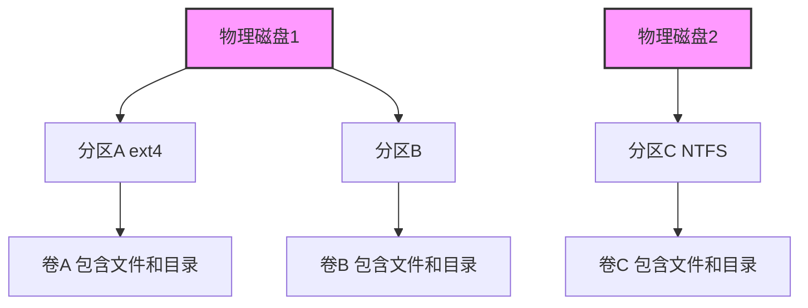

*(上图示意性地表示了PPT P1-S23中磁盘、分区和文件系统的组织)*

#### 1.4.2. 目录概念与操作 (Directory Concept and Operations)

**目录 (Directory)** 是一种特殊的文件，其内容是**文件名到文件元数据（或指向元数据的指针，如inode号）的映射**。它用于组织文件。

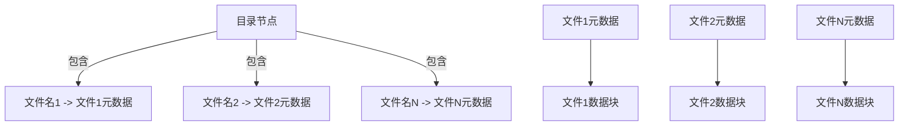

*(上图示意性地表示了PPT P1-S24中目录和文件的关系)*

**目录操作**:

* `Search for a file`
* `Create a file`
* `Delete a file`
* `List a directory`
* `Rename a file`
* `Traverse the file system`

#### 1.4.3. 目录组织结构 (Directory Organization Structures)

目标: 效率 (Efficiency), 命名方便 (Naming), 分组 (Grouping)。

##### 1.4.3.1. 单层目录 (Single-Level Directory)

所有文件都在同一个目录下。

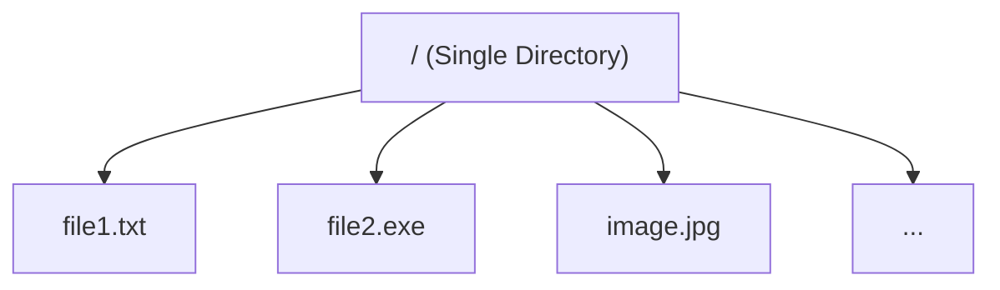

*(示意图对应PPT P1-S27)*

* **缺点**: 命名冲突，难以组织大量文件。

##### 1.4.3.2. 双层目录 (Two-Level Directory)

一个主文件目录 (MFD)，其下为每个用户创建一个用户文件目录 (UFD)。

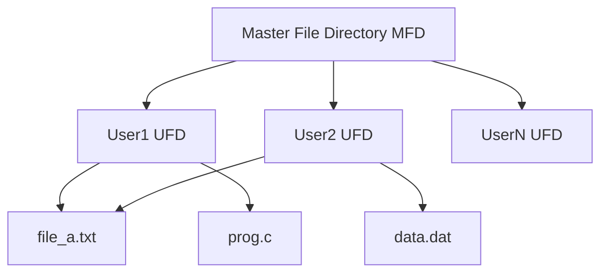

*(示意图对应PPT P1-S28)*

* **优点**: 解决了命名冲突。
* **缺点**: 用户间共享不便，用户仍不能在其UFD内创建子目录。

##### 1.4.3.3. 树形结构目录 (Tree-Structured Directories)

最常用结构，目录可以包含文件和其他目录（子目录）。

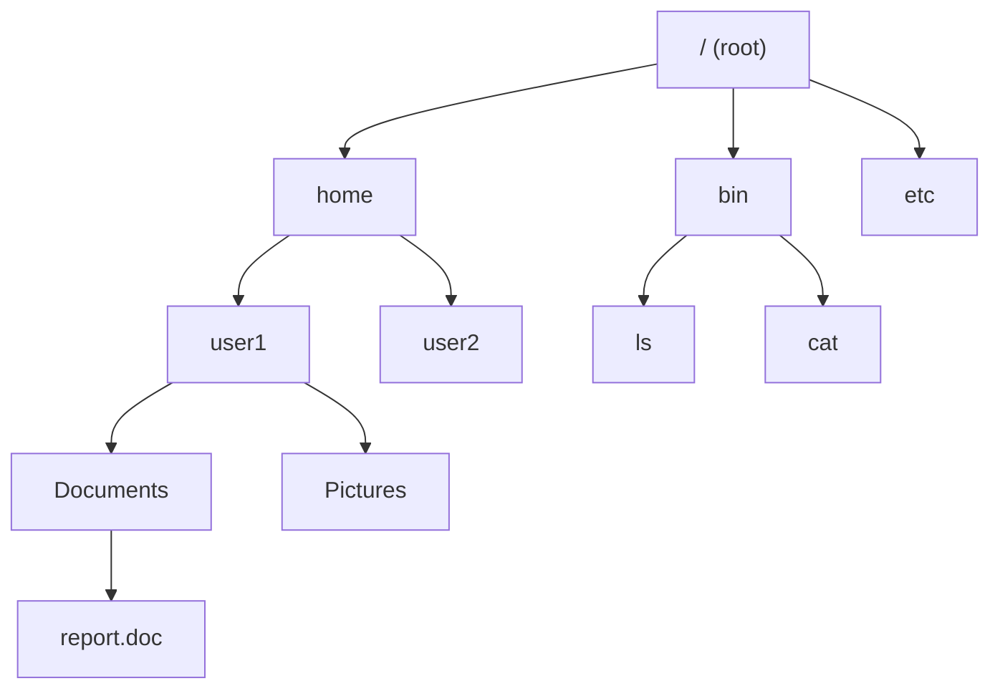

*(示意图对应PPT P1-S29)*

* **路径 (Path)**:
  * **绝对路径 (Absolute path)**: 从根开始，如 `/home/user1/Documents/report.doc`。
  * **相对路径 (Relative path)**: 从当前工作目录开始。
* **当前工作目录 (Current Working Directory - `pwd`)**: 每个进程都有一个。
* **操作**: `mkdir`, `rmdir`, `cd`。
  * `mkdir count` (若当前在 `/mail`): 创建 `/mail/count` (PPT P1-S30)。
* **问题**: 标准树形结构不允许共享文件/目录。删除非空目录需特殊处理 (e.g., `rm -rf /`)。

> **⚠️ 危险操作"
    `sudo rm -rf /` 是一个极其危险的命令，它会递归地删除根目录下的所有文件和目录，导致系统完全损坏。**切勿在真实系统上尝试！**

##### 1.4.3.4. 无环图目录 (Acyclic-Graph Directories)

允许通过**链接 (links)** 共享文件和目录，形成无环图。

* **硬链接 (Hard Link)**: 多个目录条目指向同一个文件的inode（元数据）。文件系统维护一个**引用计数 (reference counter)**。
* **软链接/符号链接 (Symbolic Link)**: 一个特殊文件，其内容是另一个文件或目录的路径名。

允许通过**链接 (links)** 共享文件和目录，形成无环图。文件可能通过多个名称或在多个目录中被知晓。

*   **硬链接 (Hard Link)** (PPT P2-S11, S12):
    *   一个硬链接是一个**目录条目 (directory entry)**，它将一个名称与一个文件（即inode）关联起来。
    *   多个目录条目（可能在不同目录中，甚至不同名称）可以指向同一个文件的inode。
    *   文件系统维护一个**引用计数 (reference counter / link count)**，存储在inode中。每创建一个硬链接，计数加1；每删除一个硬链接 (`unlink`)，计数减1。当计数为0时，文件数据才会被实际删除。
    *   `link()` 系统调用用于创建硬链接，它接受一个旧路径名和一个新路径名作为参数。新旧路径名将引用同一个文件（即同一个inode号）(PPT P2-S14)。
        ```bash
        # (Output from PPT P2-S14)
        parallels@ubuntu:~/os-course$ echo hello > file1
        parallels@ubuntu:~/os-course$ cat file1
        hello
        parallels@ubuntu:~/os-course$ ln file1 file2 # Create hard link
        parallels@ubuntu:~/os-course$ ls -l file*
        -rw-rw-r-- 2 parallels parallels 6 Dec 17 21:02 file1 # Link count is 2
        -rw-rw-r-- 2 parallels parallels 6 Dec 17 21:02 file2 # Link count is 2
        parallels@ubuntu:~/os-course$ ls -i file1 file2
        3670573 file1  3670573 file2 # Same inode number
        ```
    *   `rm` 命令会减少链接计数。当计数变为0时，文件被删除 (PPT P2-S17)。
        ```bash
        # (Output from PPT P2-S17, showing link count changes)
        parallels@ubuntu:~/os-course$ ll file1
        -rw-rw-r-- 1 parallels parallels 6 Dec 17 21:02 file1
        parallels@ubuntu:~/os-course$ ln file1 file2
        parallels@ubuntu:~/os-course$ ll file1
        -rw-rw-r-- 2 parallels parallels 6 Dec 17 21:02 file1
        parallels@ubuntu:~/os-course$ ln file1 file3
        parallels@ubuntu:~/os-course$ ll file1
        -rw-rw-r-- 3 parallels parallels 6 Dec 17 21:02 file1
        parallels@ubuntu:~/os-course$ rm file3
        parallels@ubuntu:~/os-course$ ll file1
        -rw-rw-r-- 2 parallels parallels 6 Dec 17 21:02 file1
        parallels@ubuntu:~/os-course$ rm file2
        parallels@ubuntu:~/os-course$ ll file1
        -rw-rw-r-- 1 parallels parallels 6 Dec 17 21:02 file1
        ```
    *   目录也是文件。一个**硬链接是目录中的一个条目** (PPT P2-S12)。

        ```mermaid
             graph TD
            subgraph DirectoryInode [Directory as an inode]
                DirDataBlock["数据块 (Data Block)"]
            end
            DirDataBlock -->|Contains multiple entries| DirEntryView

            subgraph DirEntryView
                direction LR
                InodeNum1[inode 号]
                DirEntryLen1[目录项长度]
                FileNameLen1[文件名长度]
                FileName1[文件名]

                Space1["..."]

                InodeNumN[inode 号]
                DirEntryLenN[目录项长度]
                FileNameLenN[文件名长度]
                FileNameN[文件名]
            end
            style DirEntryView fill:#lightblue

            subgraph ext2_dir_entry_struct
                code["
                struct ext2_dir_entry {
                    __le32 inode;       /* Inode number */
                    __le16 rec_len;     /* Directory entry length */
                    __le16 name_len;    /* Name length */
                    char   name[];      /* File name, up to EXT2_NAME_LEN */
                };
                "]
            end
             DirEntryView -.->|Represents| ext2_dir_entry_struct


        ```

        *(Based on PPT P2-S12)*

    *   特殊硬链接在目录中：
        *   文件名 `.` 在目录中是到该目录自身的硬链接 (PPT P2-S11)。
        *   文件名 `..` 在目录中是到其父目录的硬链接 (PPT P2-S11)。
        *   因此，即使是一个空目录，其链接计数至少为2（来自父目录对它的引用，和它自身的 `.` 条目）(PPT P2-S15)。
            ```bash
            # (Output from PPT P2-S15)
            parallels@ubuntu:~/os-course$ mkdir dir1
            parallels@ubuntu:~/os-course$ ls -al dir1
            total 8
            drwxrwxr-x  2 parallels parallels 4096 Dec 17 21:05 .
            drwxrwxr-x 20 parallels parallels 4096 Dec 17 21:05 ..
            parallels@ubuntu:~/os-course$ stat dir1
            File: dir1
            # ...
            Links: 2
            # ...
            ```

*   **软链接/符号链接 (Symbolic Link / Symlink)** (PPT P2-S11, S13):
    *   一个符号链接是一个**特殊类型的文件 (file)**，其内容是**另一个文件或目录的路径名 (path name)**。
    *   它不直接指向inode，而是存储一个文本路径。
    *   当访问符号链接时，操作系统会解析其内容（路径），然后沿着该路径查找目标。
    *   硬链接计数不会因此增加 (PPT P2-S18)。
    *   符号链接有其自身的inode，与目标文件的inode不同 (PPT P2-S18)。
    *   如果目标文件被删除或移动，符号链接会变成**悬空链接 (dangling link)**，因为它指向的路径不再有效 (PPT P2-S18)。
    *   软链接可以跨文件系统边界 (PPT P2-S11)。
        ```mermaid
        graph TD
            SymlinkInode["Symbolic Link Inode"] --> SymlinkDataBlock["数据块 (Data Block)<br/>'../xxx/path to target file'"]
        ```
        *(Based on PPT P2-S13)*
        ```bash
        # (Output from PPT P2-S18)
        parallels@ubuntu:~/os-course$ cat file1
        hello
        parallels@ubuntu:~/os-course$ ln -s file1 file2 # Create soft link
        parallels@ubuntu:~/os-course$ ll file*
        -rw-rw-r-- 1 parallels parallels 6 Dec 17 21:02 file1  # Link count is 1
        lrwxrwxrwx 1 parallels parallels 5 Dec 17 21:14 file2 -> file1 # 'l' type, points to file1
        parallels@ubuntu:~/os-course$ ls -i file*
        3670573 file1  3670575 file2 # Different inode numbers
        parallels@ubuntu:~/os-course$ rm file1
        parallels@ubuntu:~/os-course$ ll file*
        lrwxrwxrwx 1 parallels parallels 5 Dec 17 21:14 file2 -> file1 # Link is now dangling (often shown in red in 'ls')
        ```

* **悬空指针 (Dangling pointer) 问题**:
  * 如果 `all` 被删除（假设通过 `/dict/all`），而硬链接计数未到0，则文件数据保留。
  * 如果 `all` 被删除，指向它的软链接将失效。
* **解决方案**:
  * 硬链接: 引用计数。
  * 软链接: 访问时检查有效性。

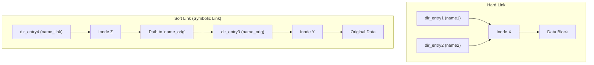

*(上图示意性地表示了PPT P1-S33中硬链接和软链接的区别)*

##### 1.4.3.5. 通用图目录 (General Graph Directory)

允许链接形成循环。

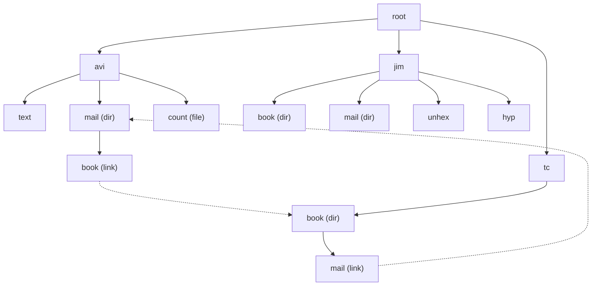

*(上图示意性地表示了PPT P1-S34中的循环链接情况)*

* **问题**: 遍历时可能无限循环，垃圾回收复杂。
* **解决方案**:
  * 允许循环，但使用**垃圾回收 (garbage collection)** 机制来回收不再被任何外部路径引用的循环结构。
  * 添加链接时进行**循环检测 (cycle detection)**，避免形成循环（但这可能限制灵活性）。

### 1.5. 文件系统挂载 (File System Mounting)

一个文件系统必须先**挂载 (mount)** 到主文件系统目录树中的某个**挂载点 (mount point)**，才能被访问。

* 挂载点通常是一个空目录。
* 挂载后，原挂载点目录的内容被暂时隐藏，显示的是被挂载文件系统的内容。
* 操作系统维护一个**挂载表 (mount table)**。

```mermaid
%% PPT P1-S36 示意图:
%% (a) 现有文件系统: / (root) -> users (dir, fred, help 在其下)
%% (b) 未挂载的分区: (sue, doc, prog 在其下)
%% (c) (b)挂载到(a)的 /users: / (root) -> users (现在是(b)的内容，sue, doc, prog 在其下), fred, help 被隐藏

    graph TD
        subgraph "图 (a): 挂载前"
            Root_a["/"] --> users_a["users (dir)"]
            users_a --> fred_a["fred (dir)"]
            users_a --> bill_a["bill (dir, shaded)"]
            fred_a --> help_a["help (dir, shaded)"]
        end

        subgraph "图 (b): 未挂载的分区 (如 /dev/sdb1)"
            Root_b["(partition root)"] --> sue_b["sue (dir, shaded)"]
            Root_b --> jane_b["jane (dir)"]
            jane_b --> doc_b["doc (dir, shaded)"]
            jane_b --> prog_b["prog (dir, shaded black)"]
        end

        subgraph "图 (c): (b) 挂载到 (a) 的 /users 节点后"
            Root_c["/"] --> users_c["users (挂载点, 内容来自(b))"]
            users_c --> sue_b_mounted["sue (来自b)"]
            users_c --> jane_b_mounted["jane (来自b)"]
            jane_b_mounted --> doc_b_mounted["doc (来自b)"]
            jane_b_mounted --> prog_b_mounted["prog (来自b)"]
        end
```

*(上图尝试用Mermaid描述PPT P1-S36的挂载过程。原图中的阴影和形状难以完全复制，但结构可以表示)*

> **📝 Linux `mount` 命令输出 (源自PPT P1-S37)"
    ``bash     os@os:~/temp/foo$ mount     sysfs on /sys type sysfs (rw,nosuid,nodev,noexec,relatime)     proc on /proc type proc (rw,nosuid,nodev,noexec,relatime)     udev on /dev type devtmpfs (rw,nosuid,relatime,size=475364k,nr_inodes=118841,mode=755)     devpts on /dev/pts type devpts (rw,nosuid,noexec,relatime,gid=5,mode=620,ptmxmode=000)     tmpfs on /run type tmpfs (rw,nosuid,noexec,relatime,size=100384k,mode=755)     /dev/sda1 on / type ext4 (rw,relatime,errors=remount-ro,data=ordered) # 关键行     securityfs on /sys/kernel/security type securityfs (rw,nosuid,nodev,noexec,relatime)     tmpfs on /dev/shm type tmpfs (rw,nosuid,nodev)     tmpfs on /run/lock type tmpfs (rw,nosuid,nodev,noexec,relatime,size=5120k)     ``
    关键行 `/dev/sda1 on / type ext4 (...)` 表明根文件系统 (/) 是来自设备 `/dev/sda1` 的 `ext4` 类型文件系统。

### 1.6. 文件共享 (File Sharing)

#### 1.6.1. 本地共享机制 (Local Sharing Mechanisms)

* 多用户系统中，通过权限控制实现。
* **用户ID (UID)** 和 **组ID (GID)** 是核心。

#### 1.6.2. 远程文件系统与共享 (Remote File Systems and Sharing)

通过网络访问其他计算机上的文件。

* **客户端-服务器模型**。
* 协议: **NFS (Network File System)** (Unix/Linux), **CIFS/SMB** (Windows)。
* 挑战: 身份验证、权限映射、网络延迟、数据一致性。

### 1.7. 文件保护 (File Protection)

控制对文件的访问。

#### 1.7.1. 访问类型 (Types of Access)

* 读 (Read), 写 (Write), 执行 (Execute)
* 追加 (Append), 删除 (Delete), 列出 (List attributes)

#### 1.7.2. 访问控制 (Access Control)

##### 1.7.2.1. 访问控制列表 (ACL - Access Control List)

为每个文件/目录关联一个列表，指定用户/组及其权限。

* **优点**: 细粒度控制。
* **缺点**: 列表可能很长，管理和检查开销大。
  ```
  PPT P1-S44 Windows 8 File Access-Control 截图描述:
  该截图显示了Windows文件属性对话框的“安全(Security)”选项卡。
  - 列出了“组或用户名(Group or user names)”，如 Authenticated Users, SYSTEM, Administrators, Users。
  - 选中一个用户/组后，下方显示其“权限(Permissions)”，如 Full control, Modify, Read & execute, Read, Write。
  - 权限可以被设置为“允许(Allow)”或“拒绝(Deny)”。
  - 有“编辑(Edit...)”和“高级(Advanced...)”按钮进行更复杂的权限设置。
  这体现了基于ACL的细粒度权限管理。
  ```

##### 1.7.2.2. Unix 访问控制模型 (Unix Access Control Model)

更简洁的模式，结合了类别和权限位。

* **三类用户**: **所有者 (Owner)**, **组 (Group)**, **其他 (Others)**。
* **三种基本权限**: **读 (r)**, **写 (w)**, **执行 (x)**。
  * r = 4, w = 2, x = 1
* 示例: `rwxr-x--x` (八进制 `751`)
  * Owner: rwx (4+2+1 = 7)
  * Group: r-x (4+0+1 = 5)
  * Others: --x (0+0+1 = 1)

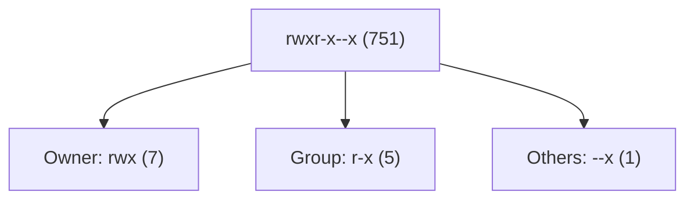

*(上图示意性地表示了PPT P1-S43中权限的分解)*

> **📝 UNIX目录列表示例 (源自PPT P1-S45)"
    ``   -rw-r--r-- 1 pbg  staff   31200 Sep  3 08:30 intro.ps     drwx------ 5 pbg  staff     512 Jul  8 09:33 private/     drwxrwxr-x 2 pbg  staff     512 Jul  8 09:35 doc/     drwxrwx--- 2 pbg  student   512 Aug  3 14:13 student-proj/     -rw-r--r-- 1 pbg  staff    9423 Feb 24 2003 program.c     -rwxr-xr-x 1 pbg  staff  20471 Feb 24 2003 program     drwx--x--x 4 pbg  faculty   512 Jul 31 10:31 lib/     drwx------ 3 pbg  staff    1024 Aug 29 06:52 mail/     drwxrwxrwx 3 pbg  staff     512 Jul  8 09:35 test/   ``
    第一列显示文件类型（`d`为目录, `-`为普通文件）和权限。后续列为链接数、所有者、组、大小、修改日期和文件名。

> **📝 Linux ACL实践 (getfacl, setfacl - 源自PPT P1-S46)"
    ```bash
    # 初始权限
    os@os:~/os2018fall/test$ ls -l testacl
    -rw-r--r-- 1 os os 0 Dec 18 23:21 testacl

    # 查看ACL
    os@os:~/os2018fall/test$ getfacl testacl
    # file: testacl
    # owner: os
    # group: os
    user::rw-
    group::r--
    other::r--
    
    # 修改ACL，给用户test添加rw权限
    os@os:~/os2018fall/test$ setfacl -m u:test:rw testacl
    os@os:~/os2018fall/test$ getfacl testacl
    # file: testacl
    # owner: os
    # group: os
    user::rw-
    user:test:rw-   # 新增的ACL条目
    group::r--
    mask::rw-       # mask会影响有效权限
    other::r--
    ```
    这显示了标准Unix权限之外，还可以通过ACL为特定用户或组设置更精细的权限。

好的，我们继续增强“文件系统实现”部分。

## 2. 文件系统实现 (File System Implementation)

### 2.1. 文件系统发展历史回顾 (A Brief History of File Systems)

文件系统的演进与计算机技术的发展紧密相关，反映了对数据存储效率、可靠性、功能和规模需求的不断提升。

* **早期文件系统 (Early File Systems, 1950s-1970s)**:
  * 非常基础，通常为特定硬件或操作系统定制。
  * > **🖼️ IBM 350 Disk Storage Unit (源自PPT P2-S4)"
    
    *这是早期磁盘存储技术的代表，存储容量按今天的标准看非常小，但当时是巨大的进步。*
* **层次化文件系统 (Hierarchical File Systems, 1970s-1980s)**:
  * 引入目录树结构，如UNIX FS, MS-DOS FAT。
* **网络文件系统 (Network File Systems, 1980s-1990s)**:
  * 支持跨网络文件访问，如NFS。
* **日志文件系统 (Journaling File Systems, 1990s-2000s)**:
  * 通过日志机制提高崩溃恢复速度和数据一致性，如ext3, ext4, NTFS。
* **现代文件系统 (Modern File Systems, 2000s-Present)**:
  * 引入高级特性：快照 (snapshots)、写时复制 (Copy-on-Write)、数据压缩、数据去重、内置卷管理和RAID功能、端到端数据校验。
  * 代表：ZFS, Btrfs。
  * 大规模分布式文件系统：Google File System (GFS), Hadoop Distributed File System (HDFS), Amazon S3。

### 2.2. 文件系统整体结构 (Overall File System Structure)

文件系统通常采用分层设计，以管理复杂性并促进模块化。

#### 2.2.1. 分层结构模型 (Layered Structure Model)

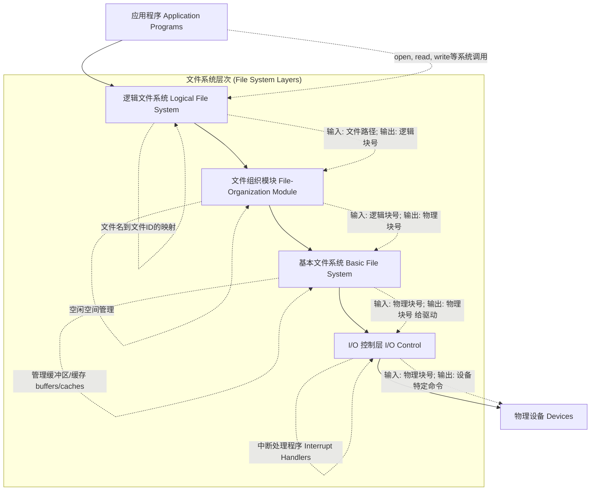

*(上图基于PPT P2-S7至S11的层次图和描述)*

##### 2.2.1.1. 逻辑文件系统 (Logical File System)

* **职责**: 管理文件系统元数据，包括目录结构和文件控制块 (FCB) / inodes。处理文件名到文件内部标识符的转换，权限检查。
* **交互**:
  * **上层输入**: 文件路径名 (`filepath`)，如 `/usr/bin/cat`。
  * **下层输出**: 逻辑块号 (`logical blocks`)。
* **元数据 (Metadata)**: 除文件内容外的一切信息（文件属性、结构信息等）。

##### 2.2.1.2. 文件组织模块 (File-Organization Module)

* **职责**: 将文件的逻辑块地址（从0到N）映射到磁盘上的物理块地址。管理磁盘空闲空间。
* **交互**:
  * **上层输入**: 读/写逻辑块 `X`。
  * **下层输出**: 读/写物理块 `P`。

##### 2.2.1.3. 基本文件系统 (Basic File System)

* **职责**: 生成向存储设备驱动程序发送的通用命令，以读取或写入物理块。管理用于文件系统数据、目录和数据块的各种**缓冲区/缓存 (buffers/caches)**。
* **交互**:
  * **上层输入**: 读/写物理块 `#P`。
  * **下层输出**: 仍然是读/写物理块 `#P`（命令传递给I/O控制层）。

##### 2.2.1.4. I/O 控制层 (I/O Control Layer)

* **职责**: 包含设备驱动程序和中断处理程序。将来自基本文件系统的请求转换为设备特定的操作。处理硬件中断。
* **交互**:
  * **上层输入**: 读/写物理块 `#P`。
  * **下层输出**: 将命令写入设备控制器的寄存器，启动磁盘I/O操作；响应中断。

##### 2.2.1.5. 分层结构的优缺点 (Pros and Cons of Layering - PPT P2-S12)

* **优点**:
  * **降低复杂性 (Reducing complexity)**: 每层职责清晰。
  * **减少冗余 (Reducing redundancy)**: 通用功能可复用。
* **缺点**:
  * **增加开销 (Adds overhead)**: 层间调用和数据传递。
  * **可能降低性能 (Can decrease performance)**: 过多层次。

### 2.3. 文件系统核心数据结构 (Core File System Data Structures - PPT P2-S14)

#### 2.3.1. 磁盘常驻数据结构 (On-Disk Structures)

这些结构持久化存储在磁盘上：

* **引导控制块 (Boot Control Block)**: (可选) 用于启动操作系统。UFS称 `boot block`，NTFS称 `Partition Boot Sector`。
* **卷控制块 (Volume Control Block)**: 描述整个卷的信息。UFS称 `superblock`，NTFS的部分信息在 `Master File Table (MFT)`。
  * 包含：块总数、块大小、空闲块计数、空闲块指针、FCB计数、FCB指针等。
* **目录结构 (Directory Structure)**: 组织文件，文件名到FCB/inode的映射。
* **文件控制块 (File Control Block - FCB)**: (每个文件一个) 存储文件的元数据。NTFS中FCB是MFT中的一行。

#### 2.3.2. 内存常驻数据结构 (In-Memory Structures)

当文件系统被使用时，这些结构在内存中创建或从磁盘加载：

* **挂载表 (Mount Table)**: 跟踪已挂载的文件系统。
* **目录缓存 (Directory Cache)**: 加速路径名解析。
* **系统级打开文件表 (System-wide Open-File Table)**: 包含所有已打开文件的FCB副本和共享信息（如打开计数）。
* **进程级打开文件表 (Per-process Open-File Table)**: 每个进程一张，包含指向系统级表项的指针和进程特定的信息（如当前文件指针）。
* **缓冲区 (Buffers)**: 缓存磁盘块，提高I/O性能。


> **ℹ️ Linux ext2 inode 字段 (PPT P2-S27)"
    一个简化的 ext2 inode 结构包含以下字段：

    | Size | Name        | What is this inode field for?                      |
    |------|-------------|----------------------------------------------------|
    | 2    | mode        | can this file be read/written/executed? (file type & permissions) |
    | 2    | uid         | who owns this file?                                |
    | 4    | size        | how many bytes are in this file?                   |
    | 4    | time        | (atime) what time was this file last accessed?     |
    | 4    | ctime       | what time was this file created? (actually status change time) |
    | 4    | mtime       | what time was this file last modified?             |
    | 4    | dtime       | what time was this inode deleted?                  |
    | 2    | gid         | which group does this file belong to?              |
    | 2    | links_count | how many hard links are there to this file?        |
    | 4    | blocks      | how many blocks have been allocated to this file?  |
    | 4    | flags       | how should ext2 use this inode?                    |
    | 4    | osd1        | an OS-dependent field                              |
    | 60   | block       | a set of disk pointers (15 total for ext2: 12 direct, 1 single indirect, 1 double indirect, 1 triple indirect) |
    | 4    | generation  | file version (used by NFS)                         |
    | 4    | file_acl    | a new permissions model beyond mode bits           |
    | 4    | dir_acl     | called access control lists                        |

#### 2.3.3. 文件控制块 (FCB - File Control Block) / inode

FCB（或Unix中的inode）是描述文件的核心。

注意不同的进程有不同的FCB，fdn是每个进程独占的
> **ℹ️ FCB 内容 (PPT P2-S15)"
    *   文件权限 (File permissions)
    *   文件日期 (File dates: create, access, write)
    *   文件所有者，组，ACL (File owner, group, ACL)
    *   文件大小 (File size)
    *   指向文件数据块的指针 (File data blocks or pointers to file data blocks)

> **📝 ext2_inode 结构示意图 (源自PPT P2-S16)"

    ```mermaid
    graph TD
      Inode["ext2_inode"]
      Inode --> MetaData["元数据<br/>mode, owner, timestamps, size, block count, ..."]
      Inode --> DirectPtrs["直接块指针<br/>(Direct Blocks, 0~11)"]
      Inode --> SingleIndirect["一级间接指针<br/>(Single Indirect, 12)"]
      Inode --> DoubleIndirect["二级间接指针<br/>(Double Indirect, 13)"]
      Inode --> TripleIndirect["三级间接指针<br/>(Triple Indirect, 14)"]

      %% 直接块指针
      DirectPtrs --> D0["数据块 0"]
      DirectPtrs --> D1["数据块 1"]
      DirectPtrs --> D2["数据块 2"]
      DirectPtrs --> D3["..."]
      DirectPtrs --> D11["数据块 11"]

      %% 一级间接指针
      SingleIndirect --> SIBlock["一级间接块"]
      SIBlock --> SIData0["数据块 A"]
      SIBlock --> SIData1["数据块 B"]
      SIBlock --> SIDataN["..."]

      %% 二级间接指针
      DoubleIndirect --> DIBlock1["二级间接块 (1级)"]
      DIBlock1 --> DIBlock2["二级间接块 (2级)"]
      DIBlock2 --> DIData0["数据块 X"]
      DIBlock2 --> DIData1["数据块 Y"]
      DIBlock2 --> DIDataN["..."]

      %% 三级间接指针
      TripleIndirect --> TIBlock1["三级间接块 (1级)"]
      TIBlock1 --> TIBlock2["三级间接块 (2级)"]
      TIBlock2 --> TIBlock3["三级间接块 (3级)"]
      TIBlock3 --> TIData0["数据块 M"]
      TIBlock3 --> TIData1["数据块 N"]
      TIBlock3 --> TIDataN["..."]

      %% 样式优化
      classDef meta fill:#f9f,stroke:#333,stroke-width:1px;
      class MetaData meta;
    ```

    这个结构通过直接指针和多级间接指针来定位文件的数据块，从而支持从小文件到非常大的文件。

### 2.4. 文件系统操作的实现 (Implementation of File System Operations)

#### 2.4.1. 文件创建过程 (File Creation Process - PPT P2-S17)

1. 应用程序请求创建新文件。
2. 逻辑文件系统分配一个新的FCB (inode)。
3. 在相应的目录文件中添加一个条目，包含新文件名和指向新FCB的指针。

#### 2.4.2. 文件打开过程 (File Open Process - `open()` - PPT P2-S18, S19)

#### 2.4.2.1. Linux内核中的文件描述符表实现 (`fdtable.h`)

在[Linux内核(v6.0)](https://elixir.bootlin.com/linux/v6.0/source/include/linux/fdtable.h#L49)中，与进程打开文件相关的核心数据结构定义在 `<linux/fdtable.h>` 中。这些结构是理解文件描述符如何映射到实际文件对象的关键。

**核心数据结构**:

1. **`struct files_struct`**: 代表一个进程的**打开文件描述符集合** (Per-process open-file table)。每个进程 (`task_struct`) 通过其 `files` 指针指向一个 `files_struct` 实例。

   ```c
   // (源码节选 - files_struct)
   struct files_struct {
       atomic_t count;             // 引用计数，允许多个进程共享此结构
       struct fdtable __rcu *fdt;  // RCU保护的指针，指向实际的文件描述符表 (fdtable)
       struct fdtable fdtab;       // 内嵌的fdtable，用于少量fd的情况，避免早期动态分配
       spinlock_t file_lock;       // 保护此结构的自旋锁
       unsigned int next_fd;        // 分配下一个fd的起始提示
       // ... 其他用于小表优化的内嵌数组 ...
       struct file __rcu * fd_array[NR_OPEN_DEFAULT]; // 默认大小的内嵌fd指针数组
   };
   ```

   * **`count`**: 当进程通过 `fork()` 创建子进程且未设置 `CLONE_FILES` 时，子进程会共享父进程的 `files_struct`，此时 `count` 增加。当引用计数为0时，`files_struct` 才会被释放。
   * **`fdt` 和 `fdtab`**: Linux内核采用了一种优化策略。当进程打开的文件描述符数量较少（小于 `NR_OPEN_DEFAULT`，通常是64）时，会直接使用 `files_struct` 内部嵌入的 `fdtab` 和 `fd_array`。如果超过这个数量，则会动态分配一个更大的 `struct fdtable`，并让 `fdt` 指向它。这种动态扩展通过RCU机制进行，以保证并发读取的性能和安全性。
2. **`struct fdtable`**: 实际存储文件描述符到文件对象指针映射的表。

   ```c
   // (源码节选 - fdtable)
   struct fdtable {
       unsigned int max_fds;       // 当前此表能容纳的最大fd数
       struct file __rcu **fd;     // 核心！指向 `struct file *` 的数组 (RCU保护)
       unsigned long *close_on_exec; // 位图：标记哪些fd在exec()时关闭
       unsigned long *open_fds;    // 位图：标记哪些fd当前是打开的
       // ... 其他 ...
       struct rcu_head rcu;        // 用于RCU延迟释放
   };
   ```

   * `fd`: 这是一个指针数组，数组的**下标即为文件描述符 (fd)**，数组元素是 `struct file __rcu *`，即指向内核文件对象的指针。例如，`fdt->fd[5]` 就存储了文件描述符 `5` 对应的 `struct file` 的地址。
   * `close_on_exec` 和 `open_fds`: 这两个位图直接管理着每个文件描述符的“执行时关闭”属性和“是否打开”状态。

**关键操作（概念性）**:

* **查找文件对象**: 当用户空间程序使用一个文件描述符 `n` 进行如 `read(n, ...)` 的操作时，内核需要通过 `n` 找到对应的 `struct file` 对象。这个过程大致如下（简化版）：

  ```c
  // (伪代码示意 - files_lookup_fd_raw 核心逻辑)
  struct file *lookup(struct files_struct *files, unsigned int fd_num) {
      // 1. RCU安全地获取当前的fdtable
      struct fdtable *current_fdt = rcu_dereference(files->fdt);
  
      // 2. 检查fd_num是否有效
      if (fd_num < current_fdt->max_fds) {
          // 3. RCU安全地从fd数组中获取file指针
          return rcu_dereference(current_fdt->fd[fd_num]);
      }
      return NULL; // 无效fd或未打开
  }
  ```

  内核提供了 `files_lookup_fd_rcu()`, `files_lookup_fd_locked()` 等函数来在不同并发上下文中安全地执行此查找。
* **管理 `close_on_exec`标志**:

  ```c
  // (源码节选 - close_on_exec 检查)
  static inline bool close_on_exec(unsigned int fd, const struct fdtable *fdt)
  {
      return test_bit(fd, fdt->close_on_exec); // test_bit 检查位图中特定位是否为1
  }
  ```

  `fcntl(fd, F_SETFD, FD_CLOEXEC)` 和 `fcntl(fd, F_GETFD)` 系统调用最终会操作这个 `close_on_exec` 位图。

> **✅ 与课程的联系"
    *   `struct files_struct` 和 `struct fdtable` 是课程中讨论的“**进程级打开文件表**”在Linux中的具体体现。
    *   `fdt->fd` 数组清晰地展示了**文件描述符（整数索引）到内核文件对象（`struct file *`）的映射关系**。
    *   RCU的使用强调了在现代多核操作系统内核中，**并发控制和性能优化**的重要性。
    *   `close_on_exec` 位图是文件描述符的一个重要**属性**，影响进程行为。

通过了解这些内核数据结构，我们可以更深入地理解操作系统是如何在底层管理进程与文件之间的关系的。

#### 2.4.2.2. `open()` 系统调用的实现 (PPT P2-S18, S19)

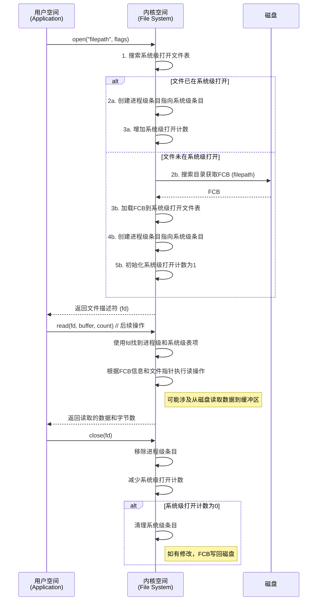

*(上图详细描述了 `open()` 的主要步骤，结合了PPT P2-S18的文字描述和P1-S33 (File Open/Read Revisit) 中的图示逻辑。)*

> **ℹ️ Unix (UFS) inode (PPT P2-S20)"
    *   系统级打开文件表持有文件的inode。
    *   Inode编号仅在当前文件系统内唯一。

#### 2.4.3. 跟踪读写操作：示例 `/foo/bar` (PPT P2-S30, S31)

##### 2.4.3.1. 读取 `/foo/bar` (假设 foo 是目录，bar 是其中的文件)

| 操作        | data bitmap | inode bitmap | root inode | foo inode | bar inode | root data | foo data | bar data[0] | bar data[1] | bar data[2] | 说明                               |
|-------------|-------------|--------------|------------|-----------|-----------|-----------|----------|-------------|-------------|-------------|------------------------------------|
| `open(bar)` |             |              | read       |           |           | read      |          |             |             |             | 读根目录inode和数据，找到foo       |
|             |             |              |            | read      |           |           | read     |             |             |             | 读foo目录inode和数据，找到bar的inode |
|             |             |              |            |           | read      |           |          |             |             |             | 读bar的inode                       |
| `read()`    |             |              |            | write     | write     |           |          | read        | read        | read        | 读bar的数据块，更新foo,bar的atime  |

*   **打开 `/foo/bar`**:
    1.  读取根目录 (/) 的 inode 和数据块，找到 `foo` 的 inode 号。
    2.  读取 `foo` 目录的 inode 和数据块，找到 `bar` 的 inode 号。
    3.  读取 `bar` 文件的 inode。
*   **读取 `bar` 的内容**:
    1.  根据 `bar` inode 中的指针，读取其数据块。
    2.  更新 `bar` inode 和 `foo` inode 的访问时间 (`atime`)。

##### 2.4.3.2. 创建并写入 `/foo/bar`

| 操作              | data bitmap | inode bitmap | root inode | foo inode | bar inode | root data | foo data | bar data[0] | 说明                                                         |
|-------------------|-------------|--------------|------------|-----------|-----------|-----------|----------|-------------|--------------------------------------------------------------|
| `create(/foo/bar)`| read, write | read, write  | read       |           |           | read      |          |             | 读根目录inode/data找foo                                      |
|                   |             |              |            | read      |           |           | read     |             | 读foo目录inode/data，发现bar不存在                           |
|                   |             |              |            | write     | write     |           | write    |             | 分配inode给bar,更新bitmap,在foo目录数据中写入bar条目,更新元数据 |
| `write()`         | read, write |              |            |           | write     |           |          | write       | 分配数据块给bar,更新bitmap,写入数据,更新bar元数据(size,mtime) |

*   **创建 `/foo/bar`**:
    1.  解析路径，读取根目录和 `foo` 目录的 inode 和数据块。发现 `bar` 不存在。
    2.  在 `inode bitmap` 中分配一个新的 inode 给 `bar`，更新 bitmap。
    3.  在 `foo` 目录的数据块中添加 `bar` 的条目（名称和新 inode 号），可能需要分配新数据块给 `foo` 目录并更新 `data bitmap`。
    4.  更新 `foo` inode (如 `mtime`, `ctime`) 和 `bar` inode 的元数据。
*   **写入 `bar`**:
    1.  在 `data bitmap` 中为 `bar` 分配数据块，更新 bitmap。
    2.  将数据写入分配的数据块。
    3.  更新 `bar` inode (如 `size`, `mtime`, 数据块指针)。

### 2.5. 虚拟文件系统 (VFS - Virtual File System - PPT P2-S22 to S28)

**核心问题**: 操作系统如何统一处理不同类型的文件系统？
**答案**: **增加一个间接层** (David Wheeler)。VFS就是这个间接层。

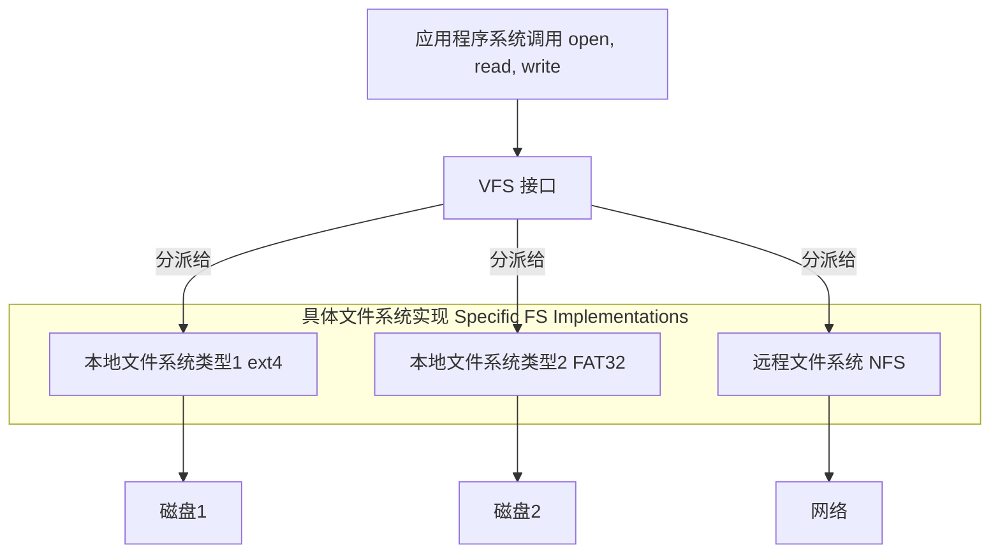

*(上图基于PPT P2-S24的VFS示意图)*

* **VFS**: 提供了一个面向对象的框架，定义了一组通用的文件系统操作接口。
* **具体文件系统**: 必须实现VFS定义的这些接口。
* **好处**: 应用程序使用统一的API，VFS根据文件所在位置透明地调用相应文件系统的实现。

#### 2.5.2. VFS 的实现机制：功能与实现分离

VFS的核心在于**定义了一系列标准的对象类型及其相关的操作接口 (operations structures)**，而将这些接口的**具体实现**委托给各个实际的文件系统模块（如ext4, XFS, NFS等）。

这些操作接口通常是以包含函数指针的结构体形式存在的：（这里挑选的是 [v5.2.12版本](https://elixir.bootlin.com/linux/v5.2.12/source/include/linux/fs.h#L2093) ）

1. **`struct file_operations`**: 定义了对一个**已打开文件**（由 `struct file` 表示）可以执行的操作。

   ```c
   // (源码节选 - linux/fs.h)
   struct file_operations {
       loff_t (*llseek) (struct file *, loff_t, int);
       ssize_t (*read) (struct file *, char __user *, size_t, loff_t *);
       ssize_t (*write) (struct file *, const char __user *, size_t, loff_t *);
       int (*iterate_shared) (struct file *, struct dir_context *); // 用于 readdir
       long (*unlocked_ioctl) (struct file *, unsigned int, unsigned long);
       int (*mmap) (struct file *, struct vm_area_struct *);
       int (*open) (struct inode *, struct file *);
       int (*release) (struct inode *, struct file *); // 最后一个引用关闭
       int (*fsync) (struct file *, loff_t, loff_t, int datasync);
       // ... 等等
   };
   ```

   当一个文件被打开时，`struct file` 对象中的 `f_op` 成员会指向特定文件系统提供的 `file_operations` 实例。VFS通过 `filp->f_op->read(...)` 这样的间接调用来执行实际的读操作。
2. **`struct inode_operations`**: 定义了对**inode**（由 `struct inode` 表示，代表文件或目录的元数据）可以执行的操作。

   ```c
   // (源码节选 - linux/fs.h)
   struct inode_operations {
       struct dentry * (*lookup) (struct inode *,struct dentry *, unsigned int);
       int (*create) (struct inode *,struct dentry *, umode_t, bool);
       int (*link) (struct dentry *,struct inode *,struct dentry *);
       int (*unlink) (struct inode *,struct dentry *);
       int (*mkdir) (struct inode *,struct dentry *,umode_t);
       int (*rmdir) (struct inode *,struct dentry *);
       int (*rename) (struct inode *, struct dentry *,
                      struct inode *, struct dentry *, unsigned int);
       int (*setattr) (struct dentry *, struct iattr *);
       // ... 等等
   };
   ```

   `struct inode` 对象中的 `i_op` 成员指向具体文件系统为该类型inode提供的 `inode_operations`。
3. **`struct super_operations`**: 定义了对**超级块**（由 `struct super_block` 表示，代表一个已挂载的文件系统实例）可以执行的操作。

   ```c
   // (源码节选 - linux/fs.h)
   struct super_operations {
       struct inode *(*alloc_inode)(struct super_block *sb);
       void (*destroy_inode)(struct inode *);
       int (*write_inode) (struct inode *, struct writeback_control *wbc);
       void (*put_super) (struct super_block *);
       int (*statfs) (struct dentry *, struct kstatfs *);
       // ... 等等
   };
   ```

   `struct super_block` 对象中的 `s_op` 成员指向具体文件系统的 `super_operations`。
4. **`struct address_space_operations`**: 定义了对文件的**页缓存 (address_space)** 进行操作的方法。

   ```c
   // (源码节选 - linux/fs.h)
   struct address_space_operations {
       int (*writepage)(struct page *page, struct writeback_control *wbc);
       int (*readpage)(struct file *, struct page *);
       int (*write_begin)(struct file *, struct address_space *mapping, ...);
       int (*write_end)(struct file *, struct address_space *mapping, ...);
       // ... 等等
   };
   ```

   `struct address_space` 对象（通常嵌入在 `struct inode` 中或通过 `inode->i_mapping` 访问）的 `a_ops` 成员指向这些操作。

> **✅ VFS的面向对象特征"
    虽然Linux内核用C语言编写，但VFS的设计巧妙地运用了面向对象的思想：
    *   **封装 (Encapsulation)**: `struct file`, `struct inode`, `struct super_block` 等核心VFS对象封装了各自的状态数据和指向操作函数表的指针。具体文件系统的实现细节对VFS上层是隐藏的。
    *   **多态 (Polymorphism)**: 通过函数指针实现。同一个VFS层代码（如 `vfs_read()`）可以操作不同类型文件系统的文件，因为它调用的是 `file->f_op->read`，而这个 `f_op` 指向的是具体文件系统的操作集。这种机制使得VFS可以透明地处理多种文件系统。
    *   **继承 (Inheritance - 概念上)**: 虽然C没有直接的类继承，但具体文件系统可以提供自己的操作函数集，"覆盖" VFS定义的通用接口，这在概念上类似继承和方法重写。一些通用函数（如 `generic_file_llseek`）也可以被多个文件系统复用。

#### 2.5.3. Linux VFS 中的核心对象 (回顾与深化)

除了之前提到的 `superblock`, `inode`, `dentry`, `file` 对象，理解它们之间如何通过指针和操作结构体关联起来至关重要：

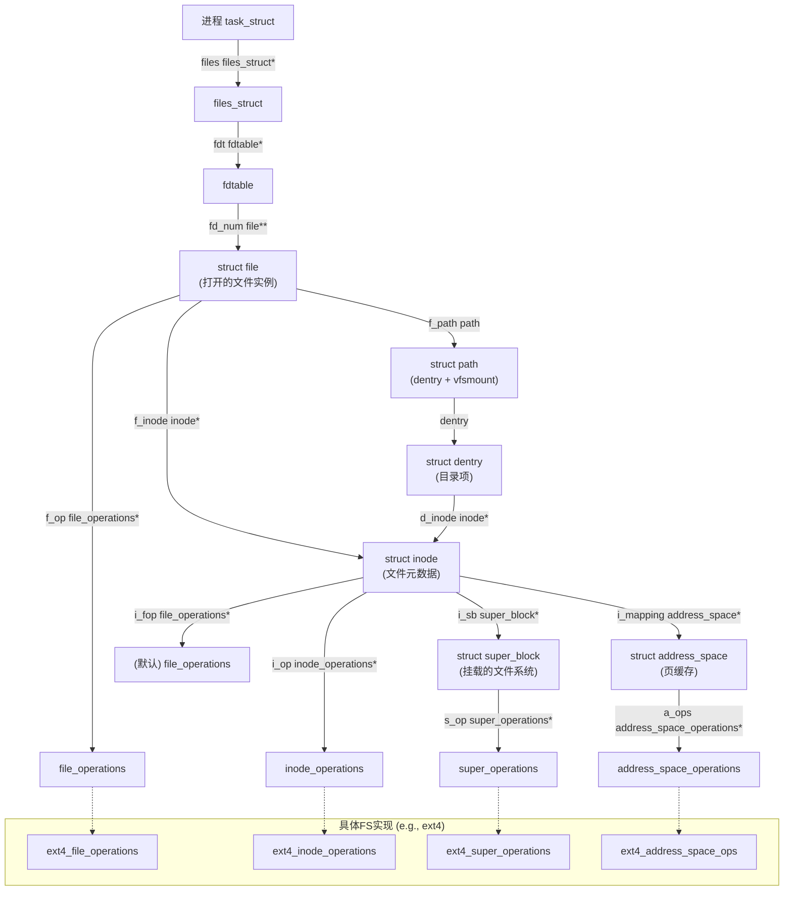

#### 2.5.3. Linux VFS 中的核心对象 (Core Objects in Linux VFS - PPT P2-S26)

* **`superblock`**: 代表一个已挂载的文件系统。
* **`inode`**: 代表一个具体文件或目录。
* **`dentry` (directory entry)**: 代表路径名的一个组成部分，将名字链接到inode。
* **`file`**: 代表一个由进程打开的文件，存储进程与文件交互的状态（如文件指针）。

#### 2.5.4. VFS 操作示例 (VFS Operation Example - PPT P2-S27, S28)

VFS通过函数指针表（如 `struct file_operations`）实现操作的分派。

* `struct file_operations { ... ssize_t (*read) (...); ssize_t (*write) (...); ... }`
* 当进程打开一个ext4文件时，其 `file`对象的 `f_op`指针会指向ext4定义的 `file_operations`结构。
* 当调用 `write()`时，VFS通过 `file->f_op->write`最终调用到 `ext4_file_write_iter`。

??? question "file->f_op 的值是谁设置的？"
    `file->f_op` 的赋值通常发生在文件被打开（open）时。具体来说，是由对应文件系统实现的 `open` 方法（如 `ext4_file_open`、`nfs_file_open` 等）根据 inode 类型和文件属性，将 `file->f_op` 指向该文件系统定义的 `file_operations` 结构体实例。这样，后续对该文件的读写等操作就会通过对应文件系统的实现进行分派。

    具体到代码当VFS尝试打开一个文件（通常通过 dentry_open() 或其内部调用的函数如 finish_open()）时，会执行以下类似逻辑：
    获取到与路径对应的 inode 对象。
    分配一个新的 struct file 对象。
    关键步骤: 将 inode->i_fop 的值赋给 file->f_op。
    然后，如果该文件系统为此次打开操作定义了特定的 open 方法 (file->f_op->open)，则会调用它。这个特定的 open 方法有机会再次修改 file->f_op，如果需要的话（例如，设备文件驱动程序可能会根据打开的次设备号设置不同的操作集）。具体可以看[finish_open函数](https://elixir.bootlin.com/linux/v6.0/source/fs/open.c#L952，具体是到https://elixir.bootlin.com/linux/v6.0/source/fs/open.c#L861)。
    
    https://elixir.bootlin.com/linux/v6.0/source/fs/file_table.c#L224
    
    这里的理解可以再深一点

#### 2.5.5. NFS（Network File System）在VFS中的实现与调用路径

当访问NFS（网络文件系统）挂载的文件时，VFS的分派机制会将相关操作（如 `open()`、`read()`、`write()`等）转发到NFS客户端驱动实现的操作函数。例如：

* `file->f_op->write` 会指向 NFS 客户端的写操作（如 `nfs_file_write`），该函数不会直接操作本地磁盘，而是通过网络协议（如 RPC）将写请求发送到远程 NFS 服务器。
* 服务器端收到请求后，执行实际的文件操作，并将结果返回给客户端。
* 这种机制使得应用程序无需关心文件实际存储位置，VFS层保证了本地和远程文件系统的透明访问。

**调用路径简述**：

1. 用户进程调用如 `write(fd, buf, len)`。
2. VFS 通过 `file->f_op->write` 跳转到 NFS 客户端实现。
3. NFS 客户端通过网络协议（如 SunRPC）将请求发送到远端 NFS 服务器。
4. 服务器完成操作后返回结果，客户端再将结果返回给用户进程。

**NFS的特点**：

- 文件元数据和数据的操作都通过网络完成，受网络延迟和一致性协议影响。
- 客户端通常有缓存机制，但一致性由NFS协议保证（如定期校验、写回策略等）。
- VFS层的抽象使得NFS与本地文件系统（如ext4）在接口上完全一致。

> **ℹ️ NFS与VFS的关系"
    NFS 作为一种具体的文件系统类型，实现了 VFS 所需的所有操作接口（如 `file_operations`, `inode_operations` 等），并通过网络协议与远程服务器交互。VFS 负责分派，NFS 负责网络通信和协议细节。

> **❓ 思考 (PPT P2-S28)"
    *   **写入NFS文件时的调用路径?** `file->f_op->write`会指向NFS客户端的写函数，该函数通过RPC与NFS服务器通信。
    *   **`file->f_op`何时设置?** 在文件 `open()`时，由具体文件系统的 `open`方法根据文件类型和inode信息设置。

### 2.6. 目录的实现 (Directory Implementation - PPT P2-S30 to S32)

目录是特殊文件，存储文件名到inode的映射。

> **🖼️ 目录条目结构 (ext2_dir_entry - PPT P2-S30, S31)"
    ``   +-------------+-----------+----------+-----------+-------------------+     | inode (4B)  | rec_len(2B) | name_len(1B) | file_type(1B) | name (变长) ... |     +-------------+-----------+----------+-----------+-------------------+   ``

    *`inode`: Inode号。
    *   `rec_len`: 目录项总长度（用于对齐和删除后的空间合并）。
    *   `name_len`: 文件名实际长度。
    *   `file_type`: 文件类型 (可选)。
    *   `name`: 文件名。
    
    **目录组织示例 (PPT P2-S31)**:
    
    一个目录 (inode 5) 包含文件`foo`, `bar`, `foobar_is_...`。
    数据块中的条目可能类似：

| inum | reclen | strlen | name                        |
| ---- | ------ | ------ | --------------------------- |
| 12   | 12     | 3      | foo                         |
| 13   | 12     | 3      | bar                         |
| 24   | 36     | 28     | foobar_is_a_pretty_longname |

    *(reclen通常是4字节对齐的，并且会填满到下一个条目的起始或块尾)*

另外一个课件给出了更加精确的描述

目录是特殊文件，其数据块存储文件名到 inode 的映射 (PPT P2-S29)。

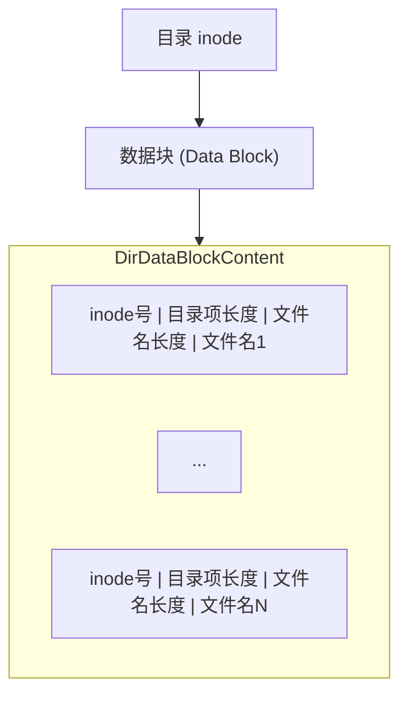


#### 2.6.1. 目录与文件的数据块差异

- **目录**和**普通文件**在磁盘上都以数据块（block）形式存储，但内容结构不同：
  - **普通文件的数据块**：存放的是文件的实际数据（如文本、图片、程序等），操作系统不关心其内容结构，由应用程序解释。
  - **目录的数据块**：存放的是**目录项（directory entries）**，每个目录项记录了一个文件（或子目录）的名字和其对应的元数据指针（如inode号）。目录本质上是“名字到文件元数据的映射表”。

#### 2.6.2. 目录如何查找文件

- 当需要查找某个文件（如 `/home/user/foo.txt`）时，操作系统会：

  1. **逐级解析路径**：从根目录 `/` 开始，依次查找 `home`、`user`、`foo.txt`。
  2. **读取目录数据块**：每到一个目录，读取其数据块，遍历其中的目录项，查找目标名字。
  3. **获取inode号**：找到名字后，获得对应的inode号（或FCB指针）。
  4. **定位文件数据**：通过inode中的指针找到文件的实际数据块。
- **目录查找的本质**：就是在目录文件的数据块中，遍历目录项，匹配目标文件名，获取其inode号，然后才能访问文件内容。
- **优化**：为加速查找，大型文件系统可能采用哈希表、B树等结构来组织目录项，但本质仍是“名字到inode号的映射”。

**目录查找策略 (PPT P2-S32)**:

* **线性列表 (Linear list)**: 简单但查找慢。
* **哈希表 (Hash table)**: 查找快，但需处理冲突。

#### 2.6.2.1. `ls`命令的实现细节

当你在终端输入 `ls`命令时，操作系统会经历如下步骤：

1. **打开目录文件**：`ls`首先会调用 `open()`或 `opendir()`打开目标目录（如 `.`）。
2. **读取目录数据块**：通过 `read()`或 `readdir()`等系统调用，内核会读取该目录对应inode的数据块内容。
3. **遍历目录项**：每个目录项（directory entry）包含一个文件名和对应的inode号。`ls`会遍历所有目录项，收集文件名。
4. **获取文件元数据（可选）**：如果加了 `-l`参数，`ls`还会对每个文件名调用 `stat()`，通过inode号获取更多元数据（如权限、大小、时间等）。
5. **输出结果**：将收集到的文件名（和元数据）输出到终端。

**本质**：
`ls`命令实际上就是**读取目录文件的数据块，遍历目录项，获取文件名和inode号**，再根据需要进一步获取详细信息。

> **💡 一句话回答 "ls 读的是什么？"**
    `ls`读取的是**目录文件的数据块**，或者简单来说读的是 `d-entry`，这些数据块里存放的是目录项（文件名到inode号的映射），而不是普通文件的数据内容。

#### 2.6.3. 文件删除操作的实现细节 (`unlink`)

当一个文件被删除时（例如通过 `unlink()` 系统调用），文件系统会执行一系列操作，主要涉及对目录项和文件控制块（FCB/inode）的修改。

**1. 目录项 (Directory Entry) 的操作**

目录文件存储了文件名到其对应inode号的映射。删除文件时：

* **定位**: 首先，在父目录中找到包含要删除文件名的目录项。
* **移除/标记**:

  * 该目录项被从目录中移除或标记为无效。例如，可以将其inode号字段置零，或者调整记录长度（`rec_len`）使其被覆盖。
  * 这使得该文件名不再解析到任何inode。

  ```mermaid
  graph LR
      subgraph "删除前目录 /dir"
          DE1["file_A (inode 10)"]
          DE2["file_X (inode 25)"]
          DE3["file_B (inode 15)"]
      end
      subgraph "执行 unlink('/dir/file_X') 后"
          DE1_after["file_A (inode 10)"]
          DE2_deleted["(inode=0 or marked free)"]
          DE3_after["file_B (inode 15)"]
      end
      DE1 --- DE2 --- DE3
      DE1_after --- DE2_deleted --- DE3_after
  ```
* **更新目录元数据**: 父目录的修改时间 (`mtime`) 和状态改变时间 (`ctime`) 会被更新。

**2. 文件控制块 (FCB) / Inode 的操作**

在目录项处理完毕后，文件系统会操作与被删除文件名关联的inode：

* **减少链接计数 (`i_nlink`)**: 每个inode都有一个硬链接计数器 (`i_nlink`)，记录有多少个目录项指向此inode。当一个目录项被删除时，对应inode的 `i_nlink` 减1。

  ```c
  // (伪代码示意)
  inode->i_nlink--;
  mark_inode_dirty(inode); // inode元数据已改变，标记为脏
  ```
* **检查链接计数是否为零**:

  * **若 `inode->i_nlink == 0`**:
    这意味着这是最后一个指向该inode的目录项。文件在文件系统中不再有任何名称。此时，文件系统可以开始回收该inode及其占用的数据块。

    1. **释放数据块**: 根据inode中的数据块指针（直接、间接等），找到所有属于该文件的数据块，并将它们返回到文件系统的空闲空间池（如更新位图或空闲链表）。
    2. **释放Inode**: inode本身所占用的磁盘空间（在inode表中）也被标记为空闲，可以被新文件重用。

    ```mermaid
    graph TD
        Unlink["unlink filename"] -->|找到目录项| ModifyDir["修改目录项<br/>inode_num = 0"]
        ModifyDir -->|获取原inode| DecreaseLinkCount["inode->i_nlink--"]
        DecreaseLinkCount -- i_nlink == 0 --> DeallocateBlocks["释放数据块<br/>更新空闲块列表/位图"]
        DeallocateBlocks --> DeallocateInode["释放Inode<br/>更新Inode位图"]
        DecreaseLinkCount -- i_nlink > 0 --> Stop["停止<br/>文件仍有其他硬链接"]
    END
    ```

  * **若 `inode->i_nlink > 0`**:
    这意味着文件还有其他硬链接。在这种情况下，inode和其数据块**不会**被释放。文件仍然可以通过其他名称访问。仅仅是当前这个路径到文件的链接被断开了。
* **更新Inode元数据**: inode的状态改变时间 (`ctime`) 会被更新。

**3. 处理已打开的文件句柄**

一个重要的特性是，如果一个文件在被 `unlink()`时（即使其 `i_nlink`变为0），仍有进程持有该文件的打开文件描述符：

* **文件数据保留**: 在Unix/Linux系统中，inode和其数据块并**不会立即被物理删除**。
* **继续访问**: 持有打开文件描述符的进程仍然可以对该文件进行读写操作。
* **最终释放**: 直到最后一个引用该文件的文件描述符被关闭（或者持有该描述符的进程退出），内核才会真正回收该inode及其数据块。
* **`inode->i_count`**: 内核中inode还有一个内存引用计数 `i_count`。当 `i_nlink`为0且 `i_count`（表示内存中的引用，如打开文件、dentry缓存等）也变为0时，inode才会被彻底清理。

> **💡 “删除即释放” vs “延迟释放”"
    这种“删除后仍可访问直到最后关闭”的行为，对于创建临时文件非常有用：程序可以创建一个文件，立即 `unlink()`它（使其在目录中不可见），然后继续通过打开的文件描述符使用它。当程序关闭该描述符或退出时，文件占用的空间会自动被回收。

通过这个流程，文件系统确保了即使在有并发访问或硬链接存在的情况下，文件删除操作也能正确、安全地进行。

### 2.7. 磁盘块分配方法 (Disk Block Allocation Methods - PPT P2-S35 to S45)

#### 2.7.1. 连续分配 (Contiguous Allocation - PPT P2-S36, S37)

文件占据连续的磁盘块。目录记录起始块和长度。

* **优点**: 简单，顺序和随机访问快。
* **缺点**: 外部碎片，文件增长困难（不好变）。

  ```mermaid
  graph LR
      subgraph 磁盘
          direction TB
          B0---B1---B2---B3---B4---B5---B6---B7---B8---B9---B10---B11---B12---B13---B14---B15---B16---B17---B18---B19---B20---B21---B22---B23---B24---B25---B26---B27---B28---B29---B30---B31
      end
      subgraph 目录
          F_count["count (start:0, len:2)"]
          F_tr["tr (start:14, len:3)"]
          F_mail["mail (start:19, len:6)"]
          F_list["list (start:28, len:4)"]
          F_f["f (start:6, len:2)"]
      end
      F_count --> B0
      F_count --> B1
      F_tr --> B14
      F_tr --> B15
      F_tr --> B16
      F_mail --> B19
      F_mail --> B20
      F_mail --> B21
      F_mail --> B22
      F_mail --> B23
      F_mail --> B24
      F_list --> B28
      F_list --> B29
      F_list --> B30
      F_list --> B31
      F_f --> B6
      F_f --> B7
  
      style B0 fill:#87CEFA
      style B1 fill:#87CEFA
      style B14 fill:#90EE90
      style B15 fill:#90EE90
      style B16 fill:#90EE90
      style B19 fill:#FFB6C1
      style B20 fill:#FFB6C1
      style B21 fill:#FFB6C1
      style B22 fill:#FFB6C1
      style B23 fill:#FFB6C1
      style B24 fill:#FFB6C1
      style B28 fill:#FFFFE0
      style B29 fill:#FFFFE0
      style B30 fill:#FFFFE0
      style B31 fill:#FFFFE0
      style B6 fill:#DDA0DD
      style B7 fill:#DDA0DD
  ```

  *(上图基于PPT P2-S36连续分配的示意图)*

#### 2.7.2. 链接分配 (Linked Allocation - PPT P2-S38, S39)

每个块包含指向下一个块的指针。目录记录起始块。

* **优点**: 无外部碎片，文件增长容易(姐在后面就好了)。
* **缺点**: 随机访问慢，指针开销，可靠性差。

  ```mermaid
  graph TD
      subgraph 磁盘
          B9["9<br/>Data"] --> B16["16<br/>Data"]
          B16 --> B1["1<br/>Data"]
          B1 --> B10["10<br/>Data"]
          B10 --> B25["25<br/>Data (End)"]
  
          B_other["... (other blocks)"]
      end
      Directory["目录<br/>file: jeep<br/>start: 9<br/>end: 25"] --> B9
  ```

  *(上图基于PPT P2-S39链接分配的示意图)*

##### 2.7.2.1. 文件分配表 (FAT - File Allocation Table - PPT P2-S40)

链接分配的变种，将指针集中存储在FAT表中。

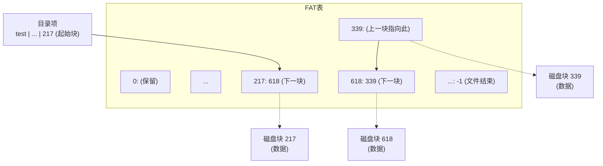

*(上图基于PPT P2-S40 FAT的示意图)*

#### 2.7.3. 索引分配 (Indexed Allocation - PPT P2-S41 to S44)

每个文件有一个索引块，存储所有数据块的指针。目录记录索引块地址。

* **优点**: 支持随机访问，无外部碎片。
* **缺点**: 索引块开销（对小文件浪费），索引块大小限制。

  ```mermaid
  graph TD
      subgraph 磁盘数据块
          direction LR
          B9[9]
          B16[16]
          B1[1]
          B10[10]
          B25[25]
          B_neg1[-1]
          B_neg2[-1]
          B_neg3[-1]
      end
  
      subgraph "索引块 (Index Block - 磁盘块19)"
          Ptr0["0: 9"] --> B9
          Ptr1["1: 16"] --> B16
          Ptr2["2: 1"] --> B1
          Ptr3["3: 10"] --> B10
          Ptr4["4: 25"] --> B25
          Ptr5["5: -1 (空)"] --> B_neg1
          Ptr6["6: -1 (空)"] --> B_neg2
          Ptr7["7: -1 (空)"] --> B_neg3
      end
  
      Directory["目录<br/>file: jeep<br/>index block: 19"] --> Ptr0
  
      style B_neg1 fill:#ccc
      style B_neg2 fill:#ccc
      style B_neg3 fill:#ccc
  ```

  *(上图基于PPT P2-S42索引分配的示意图)*

##### 2.7.3.1. UNIX inode 与多级索引 (PPT P2-S44)

inode使用直接指针、一级、二级、三级间接指针，有效支持不同大小的文件。
*(示意图见2.3.3中ext2_inode的Mermaid图)*

> **💡 最大文件大小计算 (PPT P2-S44)【经典题型】"

    若块大小512字节，指针4字节，则一个索引块含 512/4 = 128个指针。
    
    *   直接块: 12 × 512 B ≈ 6 KB
    *   一级间接: 128 × 512 B ≈ 64 KB
    *   二级间接: 128 × 128 × 512 B ≈ 8 MB
    *   三级间接: 128 × 128 × 128 × 512 B ≈ 1 GB
    
    **如果块大小改为4KB (4096 B)**，一个索引块含 4096/4 = 1024个指针。
    最大文件大小为：


$$
12 \times 4\,\text{KB} + 1024 \times 4\,\text{KB} + 1024^2 \times 4\,\text{KB} + 1024^3 \times 4\,\text{KB}
$$

    约等于 4TB。
    
    

#### 2.7.4. 不同分配方法的比较 (Comparison of Allocation Methods - PPT P2-S45)

* **Contiguous**: 顺序和随机访问都好，但外部碎片和文件增长是问题。
* **Linked**: 顺序访问好，随机访问差，无外部碎片，文件增长容易。
* **Indexed (combined)**: 顺序和随机访问都好，但更复杂，索引块有开销。
  * 单块访问可能需要多次磁盘读（读索引块(可能多级)，再读数据块）。

目前在用的主要是Indexed，而linked技巧实际上有FAT在用，我们就常见的文件格式使用的分配做一下列举

| 文件格式                 | 分配方式 |
| ------------------------ | -------- |
| FAT32                    | 链接分配 |
| NTFS                     | 索引分配 |
| ext2/ext3/ext4           | 索引分配 |
| HFS+                     | 索引分配 |
| APFS                     | 索引分配 |
| 这里在mkdocs折叠块里面用 |          |

???+ note "常见文件系统格式对比（exFAT、APFS、NTFS、FAT32、ext2/3/4）"

  - FAT32、exFAT 采用链式分配（FAT表），结构简单，兼容性强，适合移动存储。
  - NTFS 采用索引分配（MFT），支持高级功能，适合桌面/服务器。
  - ext2/3/4 采用inode索引分配，ext3/4支持日志，ext4支持extents和更大容量，是Linux主流。
  - APFS 采用B+树和写时复制，专为SSD和现代需求设计，安全性和性能优异。

  | 文件系统        | 中文名           | 主要应用平台                | 底层分配/管理方式                       | 技术特点                                                                            |
  | --------------- | ---------------- | --------------------------- | --------------------------------------- | ----------------------------------------------------------------------------------- |
  | **FAT32** | 文件分配表32     | Windows、U盘、SD卡等        | **FAT表（文件分配表）**，链式分配 | 结构简单，兼容性极好，单文件最大4GB，分区最大2TB，缺乏权限和日志功能                |
  | **exFAT** | 扩展文件分配表   | Windows、macOS、U盘、SDXC卡 | **改进型FAT表**，链式分配         | 支持超大文件（>4GB），分区大，优化闪存设备，兼容性好，无日志和权限管理              |
  | **NTFS**  | 新技术文件系统   | Windows主流                 | **主文件表（MFT）**，索引分配     | 支持权限（ACL）、日志、压缩、加密、配额、硬链接，单文件/分区极大，可靠性高          |
  | **APFS**  | 苹果文件系统     | macOS、iOS等Apple设备       | **B+树索引分配**，写时复制（COW） | 支持快照、加密、空间共享、原生SSD优化，强一致性，现代特性丰富                       |
  | **ext2**  | 第二扩展文件系统 | Linux早期                   | **inode索引分配**                 | 结构简单，无日志，支持大文件，易于恢复，现代已较少使用                              |
  | **ext3**  | 第三扩展文件系统 | Linux                       | **inode索引分配**，带日志         | 在ext2基础上增加日志功能，提高崩溃恢复能力，兼容ext2                                |
  | **ext4**  | 第四扩展文件系统 | Linux主流                   | **inode索引分配**，多级索引       | 支持超大文件/分区，延迟分配、日志、extents、性能和可靠性大幅提升，向下兼容ext3/ext2 |

    

### 2.8. 空闲空间管理 (Free-Space Management - PPT P2-S46 to S50)

跟踪可用磁盘块。

#### 2.8.1. 位图/位向量 (Bitmap / Bit Vector - PPT P2-S47)

每块对应一位。`1`=占用, `0`=空闲 (或反之)。

```
bit[i] = { 1 -> block[i] free
           0 -> block[i] occupied }

[ 0 | 1 | 2 | ... | n-1 ]  (块号)
[ b0| b1| b2| ... |bn-1]  (位图)
```

* **优点**: 易于查找连续空闲块。
* **缺点**: 位图本身占用空间。

#### 2.8.2. 链接空闲列表 (Linked Free Space List - PPT P2-S48, S49)

所有空闲块形成链表。

* **优点**: 无额外空间浪费。
* **缺点**: 难以获得连续空间，分配多个块效率低。

  ```mermaid
  graph TD
      FreeListHead["空闲列表头<br/>(指向第一个空闲块, e.g., 2)"]
  
      subgraph 磁盘上的空闲块链
          B2["块2<br/>(空闲, 指向5)"] --> B5["块5<br/>(空闲, 指向8)"]
          B5 --> B8["块8<br/>(空闲, 指向13)"]
          B8 --> B13["块13<br/>(空闲, 指向17)"]
          B13 --> B17["块17<br/>(空闲, 指向18)"]
          B17 --> B18["块18<br/>(空闲, 指向26)"]
          B18 --> B26["块26<br/>(空闲, 指向27)"]
          B26 --> B27["块27<br/>(空闲, 指向末尾或下一个)"]
          B27 --> End["..."]
      end
      FreeListHead --> B2
  ```

  *(上图基于PPT P2-S49链接空闲列表的示意图)*

#### 2.8.3. 分组法与计数法 (Grouping and Counting - PPT P2-S50)

为了解决简单链表法效率低、难以批量分配的问题，文件系统常用以下两种改进方法：

* **分组法 (Grouping)**

  - 将空闲块分为若干组，每个空闲块不仅存储下一个空闲块的地址，还可以存储一组（如N-1个）其他空闲块的地址。
  - 这样每次分配时，可以一次性获得多个空闲块的地址，减少磁盘访问次数，提高分配效率。
  - 典型做法是：第一个空闲块中存放下一个组的所有空闲块号，分配完当前组后再读取下一个组的块号列表。
* **计数法 (Counting)**

  - 利用磁盘上空闲块常常是连续的特点，将连续空闲块用一条记录表示：只需存储起始块号和连续空闲块的数量。
  - 例如，(起始块号=100, 数量=5) 表示100~104号块都是空闲的。
  - 这样可以极大减少空闲空间管理表的长度，分配和回收连续空间时效率很高。

这两种方法都能显著提升空闲空间管理的性能，尤其适合大容量磁盘和需要批量分配的场景。

### 2.9. 文件系统性能考量 (File System Performance Considerations - PPT P2-S51, S52)

* **影响因素**: 分配策略、目录算法、元数据结构、缓存。
* **提升技术**:
  * 数据与元数据尽量靠近。
  * 使用缓存 (Cache)。
  * **异步写入 (Asynchronous writes)**: 先写缓存，快速返回，后台刷盘。
    * 同步写入 (Synchronous writes) 必须等待落盘。
  * **预读 (Read-ahead)**, **后写 (Free-behind)**: 优化顺序访问。

### 2.10. 页缓存 (Page Cache) 与 缓冲区缓存 (Buffer Cache - PPT P2-S53)

#### 2.10.1. Page Cache 产生的背景与动机

随着操作系统和硬件的发展，文件I/O性能逐渐成为系统瓶颈。传统的文件I/O流程中，每次读写都直接访问磁盘，速度远低于内存操作。为提升性能，操作系统引入了**缓冲区缓存（buffer cache）**，用于缓存磁盘块，加速标准文件I/O（如 `read()`/`write()`）。

*   **没有缓存**: 每个文件打开可能需要多次磁盘读取（例如，每个目录级别两次读取：一次读inode，一次读目录数据块）。
*   **早期系统**: 分配一个**固定大小 (fixed-size)** 的缓存来保存常用块。
*   **现代系统**: 使用**统一页缓存 (unified page cache)**，同时为虚拟内存页和文件系统页服务。这避免了“双重缓存”问题，提高了内存利用率和数据一致性。
*   **写缓冲 (Write buffering)**: 写操作通常不会立即写入磁盘。数据先写入缓存，操作系统稍后（例如5-30秒后）或在 `fsync` 调用时，或在文件关闭时，将缓存中的“脏”页同步到磁盘。
*   **数据库的直接I/O (Direct IO)**: 某些应用程序（如数据库）可能希望绕过操作系统的页缓存，直接管理其数据的I/O和缓存策略，这通过直接I/O实现。

然而，随着**内存映射文件（memory-mapped file, MMIO）**的普及，出现了新的问题：

- 标准I/O和内存映射I/O各自维护独立的缓存（buffer cache vs. page cache），导致同一文件的数据在内存中存在两份副本，浪费内存资源。
- 数据一致性难以保证：一个进程通过标准I/O修改文件，另一个进程通过MMIO访问时，可能看不到最新内容，反之亦然。
- 维护和同步两个缓存体系结构复杂，且容易出错。


**Page Cache** 的设计灵感正是为了解决上述“双缓存”带来的冗余和一致性问题。它将所有文件I/O（无论是标准I/O还是MMIO）统一缓存到同一套页缓存体系中，实现了：

- **数据共享**：同一文件的数据只在内存中保留一份，节省内存。
- **一致性保障**：所有I/O路径都访问同一份缓存，避免数据不同步。
- **性能提升**：充分利用内存高速缓存特性，加速文件访问。

因此，Page Cache 的产生是操作系统为适应多样化文件访问方式、提升性能和简化内存管理而做出的关键演进。

#### 2.10.2. Page Cache 演示

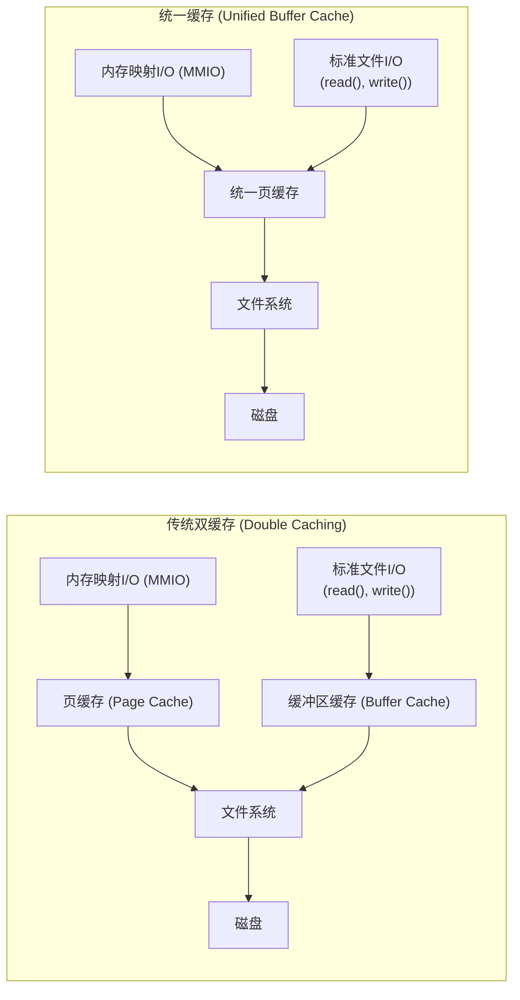

*(上图基于PPT P2-S53中双缓存和统一缓存的示意图)*

* **页缓存**: 主要服务内存映射文件 (MMIO)。
* **缓冲区缓存 (磁盘缓存)**: 服务标准文件I/O。
* **统一缓存**: 避免双重缓存，提高内存利用率。

### 2.11. 文件系统恢复 (File System Recovery - PPT P2-S54, S55)

#### 2.11.1. 一致性检查 (Consistency Checking)

* 如 `fsck`，比较目录数据和元数据的一致性。
* 可能慢且不完美。

#### 2.11.2. 备份 (Backup)

定期将数据复制到其他介质。

#### 2.11.3. 日志结构/日志文件系统 (Log-Structured/Journaling File Systems)

* **核心**: 将元数据（有时也包括数据）的更新操作先顺序写入一个**循环日志 (circular log)**。
* **提交**: 写入日志后即可认为操作已提交。
* **重放**: 后台将日志条目应用到实际文件系统结构。
* **恢复**: 系统崩溃后，只需重放日志中未完成的事务。

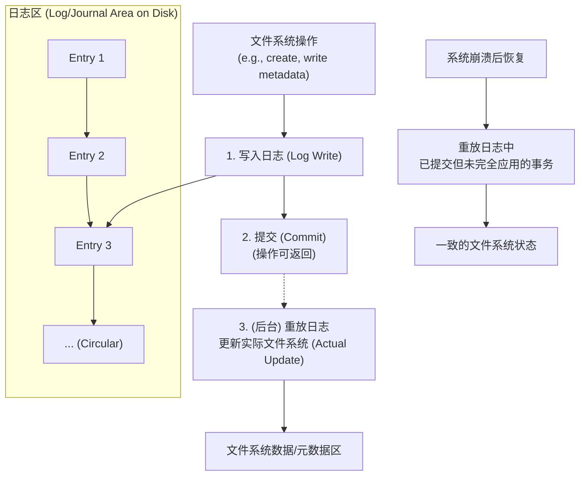

* **优点**: 恢复速度快，提高数据一致性保障。

## 3. 总结 (Summary - PPT P2-S56)

文件系统实现涉及分层结构、核心数据结构 (如inode)、VFS抽象、目录实现、磁盘块分配策略 (连续、链接、索引)、空闲空间管理、性能优化 (缓存、异步I/O) 和恢复机制 (日志)。目标是提供高效、可靠、易用的持久化存储服务。

---

## 4. 常见问题解答（Q&A）

### Q1: inode和文件名的映射是谁做的？目录和文件的本质差异是什么？

**inode和文件名的映射**由**目录文件**完成。目录本质上是一个特殊的文件，其内容是“文件名 → inode号”的映射表。操作系统通过遍历目录项，根据文件名查找对应的inode号，从而定位文件的元数据和数据块。

**目录和普通文件的本质差异**在于：
- **目录**的数据块存储的是目录项（文件名到inode号的映射），用于组织和管理文件结构。
- **普通文件**的数据块存储的是实际的数据内容（如文本、图片、程序等），由应用程序解释。

### Q2: 文件描述符（fd）的物理含义是什么？

**文件描述符（fd）**是操作系统为每个进程维护的一个**打开文件表**中的索引（整数）。它本身不是物理对象，而是进程级打开文件表的下标（open file table的index）。fd指向内核中的`struct file`对象，后者再关联到具体的文件（通过inode等结构）。fd的作用是让进程通过简单的整数句柄间接访问和操作已打开的文件、目录、设备等资源。

fd = 0, 1, 2 分别代表**标准输入（stdin）**、**标准输出（stdout）**和**标准错误（stderr）**。它们是每个进程启动时由操作系统自动打开的三个文件描述符，常用于输入输出操作。

- **0**：标准输入（stdin），通常对应键盘输入。
- **1**：标准输出（stdout），通常对应终端屏幕输出。
- **2**：标准错误（stderr），用于输出错误信息，通常也指向终端。


- 在 C 语言中，`scanf`/`read(0, ...)` 读取标准输入，`printf`/`write(1, ...)` 输出到标准输出，`fprintf(stderr, ...)`/`write(2, ...)` 输出到标准错误。
- 在 shell 命令行中，可以用重定向操作符 `<`、`>`、`2>` 分别重定向这三个描述符。例如：
  - `command > out.txt 2> err.txt` 把标准输出写到 out.txt，把标准错误写到 err.txt。

````c
// 标准输入输出错误的fd用法
#include <unistd.h>
write(1, "Hello, stdout!\n", 15); // 输出到标准输出
write(2, "Hello, stderr!\n", 15); // 输出到标准错误
````

这些 fd 在所有类 Unix 系统（如 Linux、macOS）中都广泛使用。

### Q3: 文件系统常见命令（如 mv、cp、rm）底层核心系统调用有哪些？

这些命令本质上是对文件系统的不同操作，底层主要依赖如下系统调用：

- **mv（移动/重命名）**
  - 主要调用：`rename()`（同一文件系统内移动/重命名），跨文件系统时为`link()`+`unlink()`（先创建新链接，再删除旧文件名）。
- **cp（复制）**
  - 主要调用：`open()`（打开源文件）、`read()`（读取数据）、`open()`/`creat()`（创建目标文件）、`write()`（写入数据）、`close()`（关闭文件）。
- **rm（删除）**
  - 主要调用：`unlink()`（删除普通文件）、`rmdir()`（删除空目录），递归删除目录时会遍历并对每个文件/子目录分别调用`unlink()`或`rmdir()`。

### rm a.cpp 的底层系统调用流程解析

1. **进程启动与环境准备**
  - `execve("/usr/bin/rm", ["rm", "a.cpp"], ...)`
  - Shell 启动 `rm` 程序，加载可执行文件和相关库。

2. **查找和加载动态库**
  - 通过 `openat`、`mmap` 等系统调用加载运行所需的动态链接库（如 `libc.so.6`）。

3. **获取文件信息**
  - `newfstatat(AT_FDCWD, "a.cpp", ...)`
  - 检查目标文件是否存在、类型、权限等。

4. **权限检查**
  - `geteuid()` 获取当前用户的有效 UID。
  - `faccessat2(AT_FDCWD, "a.cpp", W_OK, AT_EACCESS)` 检查是否有写权限。

5. **删除文件**
  - `unlinkat(AT_FDCWD, "a.cpp", 0)`
  - 在父目录的目录项中移除 `"a.cpp"` 到 inode 的映射。如果该 inode 没有其他硬链接且没有进程打开，则 inode 及其数据块会被释放。

6. **关闭标准输入输出**
  - `close(0)`、`close(1)`、`close(2)`
  - 程序退出前关闭标准输入、输出、错误。

7. **进程退出**
  - `exit_group(0)`

> 以上流程可通过 `strace rm a.cpp` 观察实际系统调用序列。


**示例流程：**

- `mv old new`（同一分区）：
  1. `rename("old", "new")`
- `cp src dst`：
  1. `fd_src = open("src", O_RDONLY)`
  2. `fd_dst = open("dst", O_WRONLY|O_CREAT)`
  3. 循环：`read(fd_src, buf, n)` → `write(fd_dst, buf, n)`
  4. `close(fd_src)`、`close(fd_dst)`
- `rm file`：
  1. `unlink("file")`

这些系统调用由内核实现，保证了文件操作的原子性和一致性。

### Q4: 目录中的 `.` 和 `..` 是如何实现的？它们的作用是什么？

**`.`（当前目录）**和**`..`（父目录）**是每个目录中都自动存在的特殊目录项：

- **`.`**：指向该目录自身的 inode。
- **`..`**：指向该目录的父目录的 inode（根目录 `/` 的 `..` 也指向自身）。

**实现方式**：

- 在创建新目录时，文件系统会自动在该目录的数据块中写入两个目录项：
  - `.` 的目录项，`name="."`，`inode=本目录的inode号`
  - `..` 的目录项，`name=".."`，`inode=父目录的inode号`
- 这两个目录项和普通目录项结构完全一样，只是名字和 inode 指向特殊。
- 根目录 `/` 的 `..` 也指向自己，保证路径遍历的统一性。

这里有个很有趣的事情，一个文件夹被创建时，其至少两个hardlink，被父目录和自己的.指向

假设创建一个子目录，则至少3个hardlink

这里需要进行一个鉴别，虽然 `ln 目标 起点` 能够进行一个链接的增补，但是不会生成新的inode，因为inode是对inode structrue 生效的，或者说直白点，产生新的link，只是新增了名字，而不动底层的inode item

??? question "一些对于hardlink的刁钻提问"

    1. ​硬链接能否跨文件系统创建？为什么？​​
    ​刁钻点​：考察对文件系统底层（inode）的理解。
    ​答案​：不能。硬链接通过共享inode实现，而inode仅在同一个文件系统内唯一。
    2. ​删除一个硬链接后，文件数据何时真正被释放？​​
    ​刁钻点​：涉及inode引用计数机制。
    ​答案​：只有当所有硬链接（包括原始文件）的引用计数归零时，文件数据才会被删除。
    3. ​为什么Linux不允许普通用户对目录创建硬链接？​​
    ​刁钻点​：结合文件系统树形结构的潜在风险。
    ​答案​：防止目录环路（如A链接到B的子目录，B又链接到A的子目录），导致遍历时无限递归。
    4. ​硬链接的inode号相同，但文件名不同。内核如何区分它们？​​
    ​刁钻点​：深入目录项（dentry）与inode的关系。
    ​答案​：文件名存储在目录项中，内核通过目录项映射到唯一的inode，不同目录项可指向同一inode。
    5. ​硬链接能否链接到符号链接（软链接）？​​
    ​刁钻点​：混淆硬链接和符号链接的特性。
    ​答案​：可以，但硬链接会直接指向符号链接的目标文件（而非符号链接本身），因为硬链接解析inode而非路径。
    6. ​如何用ls -i和stat命令验证硬链接？​​
    ​刁钻点​：工具链的实际使用技巧。
    ​答案​：ls -i显示相同inode号；stat命令的"Links"字段显示引用计数。
    7. ​硬链接对文件权限的影响是什么？​​
    ​刁钻点​：权限与inode的关联性。
    ​答案​：所有硬链接共享同一inode，因此权限修改会同步（因为权限存储在inode中）。
    8. ​若硬链接的源文件被mv移动到同一文件系统的其他位置，硬链接是否失效？​​
    ​刁钻点​：文件移动与inode的关系。
    ​答案​：不失效。mv在同一文件系统内仅修改目录项，不改变inode。
    9. ​硬链接能否用于实现文件系统的快照功能？​​
    ​刁钻点​：实际应用场景的可行性。
    ​答案​：可以，但需配合写时复制（CoW）。直接使用硬链接会导致修改同步到所有链接，需额外机制隔离变更。
    10. ​如何用find命令查找所有指向某inode的硬链接？​​
    ​刁钻点​：结合工具解决实际问题。
    ​答案​：
    ```bash
    find / -samefile 文件名  # 或
    find / -inum <inode号>
    ```

??? question "软链接（符号链接）能否跨文件系统？其解析过程与硬链接有何根本不同？"
    **答案**：软链接（符号链接）可以跨文件系统，因为它仅存储目标路径的字符串，不依赖于目标文件的inode号。解析软链接时，操作系统会将其内容作为路径重新解析，查找目标文件，可能跨越不同的挂载点。而硬链接只能在同一文件系统内，因为它直接指向目标文件的inode。软链接解析依赖路径名，硬链接解析依赖inode号，这也是两者根本的实现差异。


**作用**：

- 支持相对路径导航（如 `cd ..` 返回上一级目录）。
- 递归遍历目录树时，`..` 能让操作系统回溯到父目录。
- 保证目录结构的连通性和一致性。

**示例（ext2目录项）**：

| name | inode号 | 说明         |
|------|---------|--------------|
| .    | 5       | 当前目录     |
| ..   | 2       | 父目录       |
| foo  | 12      | 普通文件/目录|

**本质**：`.` 和 `..` 只是目录文件中的普通目录项，操作系统和工具（如 `ls -a`）会特殊处理它们，实现路径解析和目录遍历功能。

### Q5: `ll`（`ls -l`）命令的输出如何解析？每一列代表什么含义？

`ll` 是 `ls -l` 的常用别名，用于以详细列表形式显示目录内容。每一行的各字段含义如下：

```
drwxr-xr-x 9 parallels parallels 4.0K Apr  8 11:10 docs
```

| 字段序号 | 示例值         | 含义说明                                                                 |
| -------- | -------------- | ------------------------------------------------------------------------ |
| 1        | `drwxr-xr-x`   | 文件类型及权限（第1位：d=目录，-=普通文件，l=符号链接等；后9位为rwx权限） |
| 2        | `9`            | 硬链接数（目录为子目录+2，文件为硬链接数）                               |
| 3        | `parallels`    | 所有者用户名                                                             |
| 4        | `parallels`    | 所属组名                                                                 |
| 5        | `4.0K`         | 文件/目录大小（字节或带单位）                                            |
| 6-8      | `Apr  8 11:10` | 最后修改时间（日期和时间）                                               |
| 9        | `docs`         | 文件或目录名                                                             |

**示例解析：**

- `drwxr-xr-x`：每一位含义如下：
  - 第1位 `d`：表示类型，`d`为目录（directory），`-`为普通文件，`l`为符号链接等。
  - 第2-4位 `rwx`：所有者（user/owner）权限，分别为读（r）、写（w）、执行（x）。
  - 第5-7位 `r-x`：所属组（group）权限，分别为读（r）、无写（-）、执行（x）。
  - 第8-10位 `r-x`：其他用户（others）权限，分别为读（r）、无写（-）、执行（x）。
  - 综合起来，`drwxr-xr-x` 表示：目录，所有者有读/写/执行权限，组和其他用户有读/执行权限但无写权限。
  
- `9`：该目录有9个硬链接（包括自身的`.`、父目录的`..`及其子目录）。
- `parallels`：所有者和所属组均为 parallels。
- `4.0K`：目录占用4KB空间。
- `Apr  8 11:10`：最后修改时间。
- `docs`：目录名。

**普通文件示例：**

```
-rw-rw-r-- 1 parallels parallels 1.4K Apr 30 14:07 README.md
```

- `-rw-rw-r--`：普通文件，所有者和组有读/写权限，其他有读权限。
- `1`：只有一个硬链接（即只有一个名字）。
- `README.md`：文件名。

**总结**：`ll`/`ls -l` 输出的每一列依次为：类型与权限、硬链接数、所有者、组、大小、修改时间、文件名。

### Q6: `chmod` 的经典写法与含义

`chmod`（change mode）用于修改文件或目录的访问权限。常见写法有**数字法**和**符号法**两种：

#### 1. 数字法（八进制）

每种权限用一个数字表示，三位分别对应**所有者**、**组**、**其他用户**：

- r（读）= 4
- w（写）= 2
- x（执行）= 1

三位数字依次为 owner/group/others 权限之和。例如：

| 命令              | 权限字符串      | 含义说明                           |
| ----------------- | --------------- | ---------------------------------- |
| `chmod 755 file`  | `rwxr-xr-x`     | 所有者全部，组/其他读+执行         |
| `chmod 644 file`  | `rw-r--r--`     | 所有者读写，组/其他只读            |
| `chmod 700 file`  | `rwx------`     | 仅所有者有全部权限                 |
| `chmod 600 file`  | `rw-------`     | 仅所有者读写                       |

#### 2. 符号法

格式为 `[ugoa][+-=][rwx]`，可组合使用：

- `u`（user/所有者）、`g`（group/组）、`o`（others/其他）、`a`（all/全部）
- `+`（增加权限）、`-`（去除权限）、`=`（赋予指定权限）

示例：

- `chmod u+x file`：给所有者增加执行权限
- `chmod go-w file`：去除组和其他用户的写权限
- `chmod a=r file`：所有人只读

#### 3. 常见用法举例

```bash
chmod 755 script.sh      # 使脚本可执行
chmod 644 document.txt   # 普通文本文件
chmod u=rw,go= file.txt  # 仅所有者可读写，组和其他无权限
chmod +x myprog          # 所有人增加执行权限
```

### Q7: 访问、创建目录项时的 `read`、`write`、`open` 含义是什么？

在文件系统中，目录本质上是一个特殊的文件，其内容是“文件名到 inode 号”的映射表。对目录的操作（如访问、创建、删除文件或子目录）会涉及对目录项的 `read`、`write`、`open` 等系统调用，但这些操作与普通文件略有不同：

#### 1. `open` 目录

- `open("dirname", O_RDONLY | O_DIRECTORY)`：以只读方式打开目录，返回一个目录文件描述符（用于后续读取目录项）。
- 目录通常**不能**以写方式直接打开（除非有特殊权限），防止用户直接修改目录结构，保证文件系统一致性。

#### 2. `read` 目录

- `read(fd, buf, size)` 或更常见的 `readdir(fd)`：读取目录文件的数据块，遍历目录项，获取文件名和对应的 inode 号。
- 例如，`ls` 命令就是通过读取目录文件的数据块，列出所有目录项（文件/子目录名）。

#### 3. `write` 目录

- 用户**不能直接写目录文件**。只有内核在执行如 `create`、`unlink`、`rename`、`mkdir`、`rmdir` 等操作时，才会修改目录文件的数据块（即写入或删除目录项）。
- 例如，创建新文件时，内核会在父目录的数据块中**写入一个新的目录项**（文件名和 inode 号）；删除文件时则会**移除或标记无效**对应的目录项。

#### 总结

- **open 目录**：为遍历目录项做准备，返回目录文件描述符。
- **read 目录**：遍历目录项，获取文件名和 inode 号（如 `ls`、`find`）。
- **write 目录**：仅由内核在创建、删除、重命名文件/目录时进行，用户不能直接写目录文件。

**本质**：目录的 `read`/`write`/`open` 操作是对“文件名到 inode 号映射表”的访问和维护，保证文件系统结构的正确性和一致性。

**总结**：`chmod` 通过数字或符号灵活设置文件/目录的访问权限，是 Unix/Linux 权限管理的基础命令。