# 隐私计算笔记汇总

## 课程概述

隐私计算 (Privacy Computing) 是一门研究如何在保护数据隐私的同时进行有效计算的学科，它结合了密码学、分布式计算和安全多方计算等领域的技术。本课程笔记全面覆盖了从基础理论到高级协议的关键知识点。

# 第1章 引言 (Introduction)

本章概述安全多方计算 (Secure Multi-Party Computation, MPC) 的基本概念、核心问题、应用场景以及本书的组织结构。

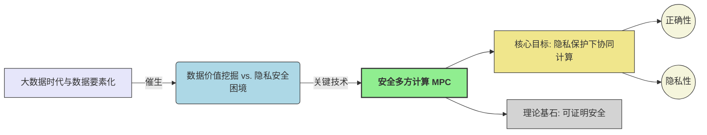

## 1.1 安全多方计算 (Secure Multi-Party Computation)

!!! abstract "MPC 定义与目标"

    **安全多方计算 (MPC)** 是一种密码学分支，旨在允许多个互不信任的参与方 $P_1, \dots, P_n$，在各自持有私密输入 $x_1, \dots, x_n$ 的情况下，共同计算一个约定函数 $y = f(x_1, \dots, x_n)$，并确保：
    
    -   **正确性 (Correctness)**: 协议输出的 $y$ 与函数 $f$ 的真实计算结果一致。
    
    -   **隐私性 (Privacy)**: 协议执行过程中，任何参与方（或其子集）除了其应得的计算结果外，不能获取关于其他参与方私密输入的任何额外信息。
    
    其核心价值在于打破数据孤岛，实现“数据可用不可见”。

!!! danger "可信第三方 (TTP) 模型的局限性"

    一个理想化的 TTP 可以轻易解决 MPC 问题，但现实中：
    
    -   **信任根难以建立**: 绝对中立且技术上无懈可击的 TTP 难寻。
    
    -   **单点故障 (Single Point of Failure)**: TTP 被攻破将导致所有数据泄露。
    
    MPC 的研究动力即源于摆脱对 TTP 的依赖。

???+ example "案例：第一价格密封拍卖 (First-Price Sealed-Bid Auction)"

    -   **目标**: 确定最高出价者及其出价，不泄露其他竞拍者的出价。
    
    -   **函数**: $f(x_1, \dots, x_n) = (\max(x_i), \text{argmax}(x_i))$
    
    -   **隐私挑战**: 如何在比较过程中隐藏非中标出价？

## 1.2 基础协议构造思想

本节通过构造简单的安全加法和乘法协议，初步展示 MPC 的实现思路。这些协议基于**秘密分享 (Secret Sharing)** 和一些基础的密码学操作。

### 1.2.1 秘密分享机制 (Secret Sharing)

!!! definition "秘密分享"

    将一个秘密 $s$ 分割成 $n$ 个份额 (shares) $s_1, \dots, s_n$，分发给 $n$ 个参与方。
    
    -   **隐私性**: 少于特定数量（门限 $t$）的份额无法恢复 $s$。
    
    -   **正确性/可恢复性**: 达到或超过门限数量的份额可以唯一确定 $s$。

???+ tip "教材示例：复制秘密分享 (Replicated Secret Sharing) for $n=3$, threshold $t=2$"

    针对秘密 $x \in \mathbb{Z}_p$ (素数 $p$ 为模数)：
    
    1.  **份额生成 ($P_S$ 持有秘密 $x$)**:
    
        -   $P_S$ 随机选择 $r_1, r_2 \in \mathbb{Z}_p$。
        -   计算 $r_3 = (x - r_1 - r_2) \pmod p$。
        -   此时，$x \equiv r_1 + r_2 + r_3 \pmod p$。
    
    2.  **份额分配**: (教材中 $P_1$ 生成份额并分配)
    
        -   $P_1$ 自己保留 $(r_2, r_3)$。
        -   $P_1$ 发送 $(r_1, r_3)$ 给 $P_2$。
        -   $P_1$ 发送 $(r_1, r_2)$ 给 $P_3$。
    
    3.  **秘密恢复**:
    
        -   任何单个参与方（例如 $P_2$ 持有 $r_1, r_3$）无法独自恢复 $x$ (因为 $r_2$ 未知)。
        -   三方合作，收集所有 $r_1, r_2, r_3$ 即可计算 $x = (r_1 + r_2 + r_3) \pmod p$。

### 1.2.2 安全加法协议 (Secure Addition Protocol)

**目标**: $n=3$ 个参与方 $P_1, P_2, P_3$ 各自持有秘密输入 $x_1, x_2, x_3 \in \mathbb{Z}_p$，共同计算 $y = (x_1 + x_2 + x_3) \pmod p$。

???+ protocol "安全加法协议流程 ($n=3$)"

    1.  **输入分享 (Input Sharing)**:
    
        -   每个 $P_i$ 将其输入 $x_i$ 进行上述复制秘密分享，得到份额 $(r_{i,1}, r_{i,2}, r_{i,3})$。
        -   $P_i$ 将其产生的份额按规则分配给其他参与方和自己。
        -   结果：$P_k$ (对于 $k \in \{1,2,3\}$) 会持有其他两方分享给它的对应部分的份额，以及自己输入对应部分的份额。例如，$P_1$ 持有自己输入产生的 $(r_{1,2}, r_{1,3})$，并收到来自 $P_2$ 的 $(r_{2,1}, r_{2,3})$ 中的 $r_{2,1}$ (若 $P_1$ 对应第一个部分和) 和 $r_{2,3}$ (若 $P_1$ 对应第三个部分和)，以及来自 $P_3$ 的类似份额。
            (教材描述：$P_i$ 对 $x_i$ 分享后，每个参与方 $P_j$ 持有 $r_{i,j}$，这里符号指 $x_i$ 的第 $j$ 个份额给了 $P_j$。然后每个 $P_k$ 计算 $s_k = \sum_{i=1}^3 r_{i,k}$。)
            **按教材逻辑 (Page 2, 1.1.2 Secret Sharing)**：
            $P_1$ 的输入 $x_1$，分享为 $x_1 = r_{1,1}+r_{1,2}+r_{1,3}$。
            $P_1$ 发送 $r_{1,1}, r_{1,3}$ 给 $P_2$；发送 $r_{1,1}, r_{1,2}$ 给 $P_3$；自己保留 $r_{1,2}, r_{1,3}$。
            其他 $P_i$ 对 $x_i$ 做类似操作。
            **本地计算 (Page 3, step 3)**：
            每个参与方 $P_i$ 将三个对应的秘密份额相加。即，对于 $l \neq i$，$P_i$ 计算 $s_l = r_{1,l} + r_{2,l} + r_{3,l} \pmod p$ 并公布 $s_l$。每个参与方计算并公布两个值。
            例如，$P_1$ 计算并公布 $s_2 = r_{1,2}+r_{2,2}+r_{3,2}$ 和 $s_3 = r_{1,3}+r_{2,3}+r_{3,3}$。
    2.  **结果重建 (Output Reconstruction)**:
    
        *   每个参与方（例如 $P_1$）收集所有公布的 $s_l$ (这里是 $s_2, s_3$)，并计算其未公布的 $s_i$ (例如 $s_1 = r_{1,1}+r_{2,1}+r_{3,1}$，注意 $P_1$ 没有 $r_{1,1}$，这部分的份额 $s_1$ 是通过其他方公布的 $s_2, s_3$ 及最终结果 $y$ 推算出来的，或者 $s_1$ 也是由某个参与方公布)。
        *   **按教材 (Page 3, step 4)**：每个参与方计算结果 $y = s_1 + s_2 + s_3 \pmod p$。（这里假设 $s_1, s_2, s_3$ 都是公开的）。

!!! success "正确性"
    $$
    y = \sum_{l=1}^3 s_l = \sum_{l=1}^3 \sum_{i=1}^3 r_{i,l} = \sum_{i=1}^3 \sum_{l=1}^3 r_{i,l} = \sum_{i=1}^3 x_i \pmod p
    $$

!!!- info "隐私性直观分析 (基于模拟的视角)"

    -   以 $P_1$ 为例，它知道自己的输入 $x_1$ 和最终输出 $y$。
    -   在协议中，$P_1$ 公布了 $s_2, s_3$ (由其持有的 $x_1, x_2, x_3$ 的份额计算得到)。
    -   $P_1$ 可以从 $y, s_2, s_3$ 推断出 $s_1 = y - s_2 - s_3 \pmod p$。
    -   关键在于，$s_1$ (或 $P_1$ 公布的 $s_2, s_3$) 并不直接泄露 $x_2, x_3$ 的原始值，因为它们是多个随机份额的线性组合。
    -   **模拟器 (Simulator)**: 模拟器仅知道 $P_1$ 的输入 $x_1$ 和输出 $y$。它可以随机选择 $s'_2, s'_3$，然后计算 $s'_1 = y - s'_2 - s'_3$。这个 $(s'_1, s'_2, s'_3)$ 的分布与真实协议中 $P_1$ 观察到的 $(s_1, s_2, s_3)$ 的分布是不可区分的（因为原始份额是随机的）。

### 1.2.3 安全乘法协议 (Secure Multiplication Protocol)

**目标**: 计算 $ab \pmod p$，其中 $a, b$ 已经通过复制秘密分享方案分享给 $P_1, P_2, P_3$。

???+ protocol "安全乘法协议流程 ($n=3$)"

    假设 $P_1$ 输入 $a$, $P_2$ 输入 $b$, $P_3$ 无输入。
    $a = a_1+a_2+a_3$, $b = b_1+b_2+b_3$。
    $ab = \sum a_i b_j$。
    1.  **份额分发 (Share Distribution)**:
    
        *   $P_1$ 对 $a$ 进行复制秘密分享，分发份额 $(a_1, a_2, a_3)$。
        *   $P_2$ 对 $b$ 进行复制秘密分享，分发份额 $(b_1, b_2, b_3)$。
    2.  **本地乘积项计算 (Local Product Term Computation)**: (按 Page 4, step 2)
    
        *   $P_1$ 计算 $u_1 = (a_2 b_2 + a_2 b_3 + a_3 b_2) \pmod p$。
        *   $P_2$ 计算 $u_2 = (a_3 b_3 + a_1 b_3 + a_3 b_1) \pmod p$。
        *   $P_3$ 计算 $u_3 = (a_1 b_1 + a_1 b_2 + a_2 b_1) \pmod p$。
        *   $u_1, u_2, u_3$ 是各个参与方的私有中间值。
    3.  **安全加法 (Secure Addition)**:
        *   参与方以 $u_1, u_2, u_3$ 作为各自的秘密输入，执行上一节的安全加法协议。
        *   输出 $y = (u_1 + u_2 + u_3) \pmod p = ab \pmod p$。

!!! success "正确性"
    $$
    u_1+u_2+u_3 = (a_2b_2+a_2b_3+a_3b_2) + (a_3b_3+a_1b_3+a_3b_1) + (a_1b_1+a_1b_2+a_2b_1) = \sum_{i,j} a_ib_j = ab \pmod p
    $$

!!!- info "隐私性分析"

    -   本地计算阶段，每个 $P_i$ 只使用其持有的份额，不泄露 $a, b$。
    -   安全加法阶段的隐私性依赖于安全加法协议本身的隐私性。
    -   因此，在半诚实模型下，该协议是隐私的。

## 1.3 安全威胁与对策初步

上述协议均假设参与方**半诚实 (Semi-Honest)**：遵循协议但试图从记录中推断信息。现实中需考虑**恶意 (Malicious)** 行为。

### 1.3.1 输入替换 (Input Replacement)

!!! warning "固有限制"

    -   恶意方 $P_i^*$ 可以自由选择其输入 $x_i^*$ 参与协议。
    -   协议层面无法完全阻止，因为 $P_i^*$ 控制其本地输入。
    -   **应对**: 通常依赖应用层机制或博弈论。

### 1.3.2 协议偏离 (Protocol Deviation)

恶意方不遵循协议指令。

!!! danger "协议偏离的风险"

    -   破坏正确性。
    -   破坏隐私性。

???+ check "一致性校验 (Consistency Check)"

    -   **思想**: 增加冗余和交叉验证。
    -   **例子 (安全加法 - 秘密分享阶段)**: (Page 5)
        1.  当 $P_1$ 向 $P_2$ 和 $P_3$ 分享 $x_1$ 的份额时，例如发送 $(r_{1,1}, r_{1,3})$ 给 $P_2$ 和 $(r_{1,1}, r_{1,2})$ 给 $P_3$。
        2.  $P_2$ 和 $P_3$ 可以互相发送它们共同收到的份额 (如 $r_{1,1}$)。
        3.  如果 $P_2$ 从 $P_3$ 处收到的 $r_{1,1}'$ 与自己从 $P_1$ 处收到的 $r_{1,1}$ 不同，则检测到 $P_1$ 作弊。
    -   **例子 (安全加法 - 部分和公布阶段)**: (Page 5)
        1.  当 $P_1$ 公布 $s_2$ 时 ($s_2 = r_{1,2}+r_{2,2}+r_{3,2}$)，$P_3$ 也需要计算 $s_2$ 并公布。
        2.  所有参与方可以比较 $P_1$ 公布的 $s_2$ 和 $P_3$ 公布的 $s_2$ 是否一致。

!!! key "恶意安全 (Malicious Security)"
    如果协议能确保任何（除了输入替换外的）恶意偏离行为都会被高概率检测到，并且在检测到作弊时，协议能安全中止，不泄露诚实方信息，则称协议是**恶意安全的**。

## 1.4 通用解决方案与展望

!!! success "通用性"

    -   任何可以在 $\mathbb{Z}_p$ 上表示的计算（算术电路）都可以通过组合安全加法和安全乘法协议来实现。
    -   任何布尔电路都可转化为算术电路。

!!!- enlightenment "本书后续内容"

    -   **第2章**: 密码学基础，可证明安全。
    -   **第3章**: 更通用的MPC协议示例 (Shamir秘密分享)。
    -   **第4章**: 形式化的安全模型 (UC框架)。
    -   **后续章节**: 半诚实协议 (OT, BGW, GMW, Yao's GC, BMR) 和恶意安全协议。

## 1.5 协议执行流程图 (抽象)

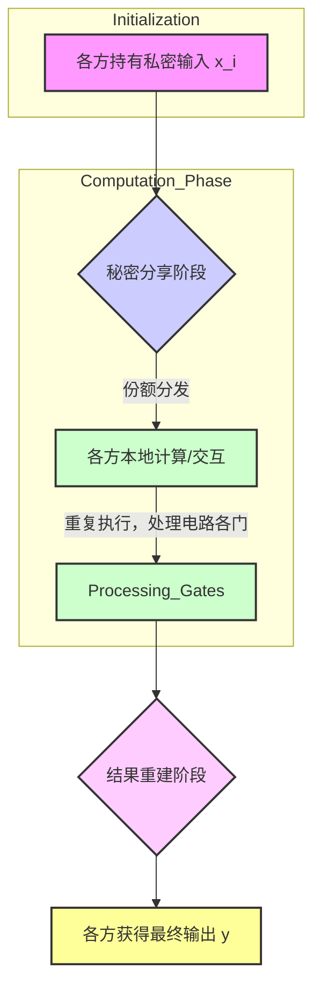


# 第2章 基础知识 (Basic Knowledge)

本章旨在夯实后续章节学习所需的基础，核心围绕现代密码学的基石——**可证明安全 (Provable Security)**。我们将深入探讨其三大支柱：形式化的定义、精确的假设和严格的证明。随后，将介绍本书通用的符号体系，并阐述若干核心的密码学原语。


## 2.1 现代密码学与可证明安全 (Modern Cryptography and Provable Security)

现代密码学区别于传统密码学的核心在于其系统性和科学性。它不再仅仅依赖于设计者对方案复杂性和巧妙性的直观感受，而是建立在一套严谨的理论框架之上。

!!! abstract "可证明安全的三大基石"

    1.  **形式化的定义 (Formal Definitions)**: 清晰、无歧义地阐述一个密码学方案应达成的安全目标以及敌手可能拥有的能力。
    2.  **精确的假设 (Precise Assumptions)**: 将方案的安全性归结于某个被广泛研究且普遍认为难以解决的数学难题（如大整数分解、离散对数问题等）。
    3.  **严格的安全性证明 (Rigorous Proofs)**: 通过数学归约 (reduction) 的方式，证明如果存在一个敌手能够攻破该密码学方案，那么利用该敌手就可以构造出一个算法来解决底层的数学难题。

$$
\boxed{\text{安全证明} = \text{形式化定义} + \text{计算假设} + \text{归约证明}}
$$

### 2.1.1 形式化的定义 (Formal Definitions)

形式化定义是理解和评估密码学方案安全性的第一步，它避免了“看起来安全”的主观判断。一个完整的安全定义通常包含两个方面：

-   **安全保证 (Security Guarantee)**: 明确指出协议在面对攻击时应具备何种安全属性。例如，对于加密方案，最强的安全保证是敌手无法从密文中获取关于明文的任何信息。
-   **威胁模型 (Threat Model)**: 精确刻画敌手所拥有的能力，包括其可获取的信息、可执行的操作等。

???+caution "关于定义安全性的思路"

    Katz 和 Lindell 在《Introduction to Modern Cryptography》中总结了现代密码学的核心原则：
    
    1.  **形式化定义**（Formal Definition）
    2.  **精确假设**（Precise Assumptions）
    3.  **严格安全性证明**（Rigorous Security Proofs）
    
    密码学中的安全性定义由**安全保证**和**威胁模型**两部分组成：
    
    -   **安全保证**：规定方案应满足的安全属性，即敌手成功攻击的条件。
    -   **威胁模型**：定义敌手可执行的操作和可见的信息，但不限定具体攻击策略。
    
    以**加密**为例，直觉上，安全性似乎可以定义为：
    > 	**敌手不能从密文恢复明文。**
    
    -   若方案泄露 50% 明文，虽然剩余部分无法破译，但仍然是不安全的。
    -   若方案允许敌手判断**明文是否大于 20 万**，仍然会泄露信息。
    
    因此，正确的定义是：
    
    > 	**敌手不能从密文中获得任何关于明文的信息。**

#### 🔐 保密性基础

$$
\begin{aligned}
&\boxed{\text{完美保密性}} &&: \forall m_0,m_1 \in \mathcal{M},\ \Delta(\mathsf{Enc}(m_0), \mathsf{Enc}(m_1)) = 0 \\
&\boxed{\text{计算保密性}} &&: \forall \mathsf{PPT}\ \mathcal{A},\ \mathsf{Adv}_{\mathcal{A}}^{\mathsf{IND}}(\lambda) \leq \mathsf{negl}(\lambda)
\end{aligned}
$$

#### 🛡️ 威胁模型演进

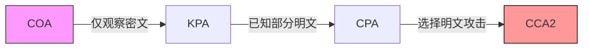

| 攻击类型 | 能力描述                     | 典型防御模型     |
|----------|------------------------------|------------------|
| COA (仅密文攻击)     | 被动监听网络流量             | OTP加密          |
| KPA (已知明文攻击)     | 获取部分明文-密文对          | AES-CBC          |
| CPA (选择明文攻击)     | 主动获取任意明文的加密       | RSA-OAEP        |
| CCA2 (自适应选择密文攻击)| 自适应选择密文解密查询       | ECIES           |

为了精确描述这些概念，密码学中常采用**基于游戏 (Game-based) 的定义**。在这类定义中，安全性通过一个挑战者 (Challenger) 和一个敌手 (Adversary, $\mathcal{A}$) 之间的交互游戏来刻画。敌手赢得游戏的概率（或优势）衡量了方案的安全性。

???+ definition "不可区分性在选择明文攻击下的安全性 (IND-CPA Security for Public-Key Encryption)"

    一个公钥加密方案 $\Pi = (\text{Gen}, \text{Enc}, \text{Dec})$ 被认为是 IND-CPA 安全的，如果任何概率多项式时间 (PPT) 的敌手 $\mathcal{A}$ 在以下游戏中的优势是可忽略的。
    
    **IND-CPA 游戏 $\text{PubK}^{\text{CPA}}_{\mathcal{A},\Pi}(\lambda)$**:
    
    1.  **密钥生成 (Key Generation)**: 挑战者运行 $(pk, sk) \leftarrow \text{Gen}(1^\lambda)$，并将公钥 $pk$ 发送给敌手 $\mathcal{A}$。
    2.  **挑战查询 (Challenge Query)**: 敌手 $\mathcal{A}$ 选择两条等长的消息 $m_0, m_1$，并发送给挑战者。
    3.  **挑战密文生成 (Challenge Ciphertext Generation)**: 挑战者随机选择一个比特 $b \leftarrow_{\$} \{0, 1\}$，计算挑战密文 $c^* \leftarrow \text{Enc}_{pk}(m_b)$，并将 $c^*$ 发送给 $\mathcal{A}$。
    4.  **猜测 (Guess)**: 敌手 $\mathcal{A}$ (可以继续进行加密查询，但对于公钥加密，$\mathcal{A}$ 已有公钥，可自行加密) 输出一个猜测比特 $b'$。
    5.  **游戏结果**: 如果 $b' = b$，则敌手 $\mathcal{A}$ 获胜，游戏输出 1；否则输出 0。
    
    **定义 2.1.1 (IND-CPA 安全性)**:
    如果对于任意 PPT 敌手 $\mathcal{A}$，存在一个可忽略函数 $\text{negl}(\lambda)$ 使得：
    $$
    \Pr[\text{PubK}^{\text{CPA}}_{\mathcal{A},\Pi}(\lambda) = 1] \le \frac{1}{2} + \text{negl}(\lambda)
    $$
    则称公钥加密方案 $\Pi$ 是 IND-CPA 安全的。
    敌手的**优势 (Advantage)** 定义为 $\text{Adv}^{\text{CPA}}_{\mathcal{A},\Pi}(\lambda) = \left| \Pr[\text{PubK}^{\text{CPA}}_{\mathcal{A},\Pi}(\lambda) = 1] - \frac{1}{2} \right| \le \text{negl}(\lambda)$。

#### 🧩 核心安全模型

???+ note "IND-CPA (选择明文攻击不可区分)"

    ```mermaid
    graph TD
        A[敌手] -->|获取公钥| B[Challenger]
        B -->|生成挑战密文| A
        A -->|猜测明文| B
        style B fill:#f0f3ff,stroke:#4a7
    ```
    -   **目标**: 区分加密明文的随机性
    -   ✔️ 应用: Signal协议
    -   ❌ 局限: 不抗密文篡改

??? abstract "IND-CCA2 (自适应选择密文攻击)"

    ```mermaid
    graph LR
        A[敌手] -->|解密查询| B[Oracle]
        B -->|返回解密结果| A
        A -->|构造关联密文| B
        style B fill:#ffe,stroke:#d90
    ```
    -   **创新点**: 允许除挑战密文外的任意解密
    -   🔑 应用: PGP加密
    -   ⚠️ 注意: 需要防填充预言攻击

???- note "CPA 与 CCA 的核心差异"

    | 特性               | CPA                     | CCA                     |
    |--------------------|-------------------------|-------------------------|
    | 解密查询           | ❌ 完全禁止             | ✅ 允许（除挑战密文）   |
    | 攻击难度           | 较弱                    | 更强                    |
    | 典型应用场景       | 基础加密                | 安全通信协议            |
    | 安全证明复杂度     | 较低                    | 较高                    |

### 2.1.2 精确的假设 (Precise Assumptions)

大多数现代密码方案的安全性并非无条件的，而是依赖于某些数学问题的计算困难性。这些问题通常经过密码学界多年的研究，尚未找到有效的求解算法。

#### 🔬 密码学基础假设

**离散对数家族**

$$
\boxed{\mathbb{G}=\langle g \rangle},\ \mathsf{DLP}(g^x) \xrightarrow{\text{强化}} \mathsf{CDH}(g^a,g^b) \xrightarrow{\text{抽象}} \mathsf{DDH}(g^a,g^b,g^{ab})
$$

| 假设         | 数学描述                     | 应用案例         |
|--------------|------------------------------|------------------|
| DL (离散对数)          | 从$g^x$反推$x$               | ElGamal加密      |
| CDH (计算性DH)         | 计算$g^{ab}$                 | DH密钥交换       |
| DDH (判定性DH)         | 区分$(g^a,g^b,g^{ab})$与随机  | 伪随机生成器     |

**其他重要假设**

??? tip "RSA假设"

    $$ \boxed{c \equiv m^e \ (\mathrm{mod}\ N)} $$
    -   依赖大整数分解困难性
    -   应用: SSH协议认证

??? example "椭圆曲线假设 (ECDLP)"

    -   密钥长度更短
    -   应用: 比特币地址生成

???+ definition "判定性 Diffie-Hellman (DDH) 假设"

    令 $\mathbb{G}$ 是一个阶为素数 $q$ 的循环群， $g$ 是其生成元。
    DDH 假设声称，对于随机选择的 $x, y, z \in \mathbb{Z}_q$，以下两个分布是计算上不可区分的：
    
    1.  **DDH 元组分布**: $(g, g^x, g^y, g^{xy})$
    2.  **随机元组分布**: $(g, g^x, g^y, g^z)$
    
    **定义 2.1.2 (DDH 困难性)**:
    如果对于任意 PPT 敌手 $\mathcal{A}$，存在一个可忽略函数 $\text{negl}(\lambda)$ 使得：
    $$
    \left| \Pr[\mathcal{A}(\mathbb{G}, q, g, g^x, g^y, g^{xy}) = 1] - \Pr[\mathcal{A}(\mathbb{G}, q, g, g^x, g^y, g^z) = 1] \right| \le \text{negl}(\lambda)
    $$
    其中，群参数 $(\mathbb{G}, q, g)$ 由群生成算法 $\mathcal{G}(1^\lambda)$ 生成，$x,y,z \leftarrow_{\$} \mathbb{Z}_q$。则称 DDH 问题在群 $\mathbb{G}$ 中是困难的。

#### 🏗️ 假设层次结构

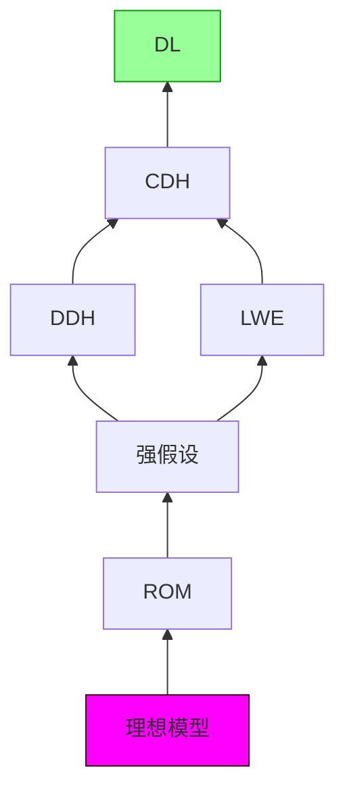

-   **可靠性排序**: ROM > LWE > DDH > CDH > DL
-   **工程实践**: 优先选择高层假设，权衡效率与安全

### 2.1.3 严格的安全性证明 (Rigorous Security Proofs)

安全性证明的核心思想是**归约 (Reduction)**。即证明，如果存在一个能攻破当前密码方案的敌手 $\mathcal{A}$，那么就可以利用 $\mathcal{A}$ 作为子程序，构造另一个算法 $\mathcal{B}$ 来解决某个已知的困难问题（如 DDH 问题）。

???+ example "ElGamal 加密方案的 IND-CPA 安全性证明"

    **ElGamal 加密方案**:
    设 $\mathbb{G}$ 为阶为素数 $q$ 的循环群， $g$ 为生成元。
    
    *   $\text{Gen}(1^\lambda)$: 随机选择私钥 $sk \leftarrow_{\$} \mathbb{Z}_q$，计算公钥 $pk = g^{sk}$。输出 $(pk, sk)$。
    *   $\text{Enc}_{pk}(m)$: 对于消息 $m \in \mathbb{G}$，随机选择 $r \leftarrow_{\$} \mathbb{Z}_q$，计算密文 $c = (c_1, c_2) = (g^r, m \cdot pk^r)$。
    *   $\text{Dec}_{sk}(c_1, c_2)$: 计算 $\hat{m} = c_2 / (c_1^{sk})$。
    
    **正确性**: $c_2 / (c_1^{sk}) = (m \cdot (g^{sk})^r) / ((g^r)^{sk}) = (m \cdot g^{sk \cdot r}) / g^{r \cdot sk} = m$。
    
    **定理 2.1**: 如果 DDH 问题在群 $\mathbb{G}$ 中是困难的，那么 ElGamal 加密方案是 IND-CPA 安全的。
    
    **证明思路 (归约)**:
    假设存在一个 PPT 敌手 $\mathcal{A}$，它能以不可忽略的优势 $\epsilon(\lambda)$ 攻破 ElGamal 的 IND-CPA 安全性。我们将构造一个 PPT 算法 $\mathcal{B}$，利用 $\mathcal{A}$ 来解决 DDH 问题。
    
    1.  $\mathcal{B}$ 接收一个 DDH 挑战实例 $(g, A=g^x, B=g^y, Z)$，其中 $Z$ 要么是 $g^{xy}$ (DDH 元组)，要么是 $g^z$ (随机元组)。$\mathcal{B}$ 的目标是区分这两种情况。
    2.  $\mathcal{B}$ 模拟 ElGamal 的 IND-CPA 游戏与 $\mathcal{A}$ 交互：
        *   $\mathcal{B}$ 将 ElGamal 公钥设置为 $pk = A (=g^x)$。（这里 $\mathcal{B}$ 不知道对应的私钥 $x$）。
        *   $\mathcal{A}$ 选择两条消息 $m_0, m_1$。
        *   $\mathcal{B}$ 随机选择比特 $b \leftarrow_{\$} \{0, 1\}$。
        *   $\mathcal{B}$ 构造挑战密文 $c^* = (c_1^*, c_2^*) = (B, m_b \cdot Z)$。
        *   $\mathcal{B}$ 将 $c^*$ 发送给 $\mathcal{A}$。
        *   $\mathcal{A}$ 输出其猜测 $b'$。
    3.  $\mathcal{B}$ 的输出：如果 $b' = b$，则 $\mathcal{B}$ 输出 1 (猜测 $Z=g^{xy}$ )；否则输出 0 (猜测 $Z=g^z$)。
    
    **分析 $\mathcal{B}$ 的优势**:
    *   **情况 1: $Z = g^{xy}$ (DDH 元组)**
        此时，$pk=g^x$，挑战密文是 $(g^y, m_b \cdot g^{xy}) = (g^y, m_b \cdot (g^x)^y) = (g^y, m_b \cdot pk^y)$。这是一个合法的 ElGamal 密文（其中 $r=y$）。
        根据假设，$\mathcal{A}$ 猜测正确的概率是 $\Pr[b'=b | Z=g^{xy}] = \frac{1}{2} + \epsilon(\lambda)$。
        所以，$\Pr[\mathcal{B} \text{ 输出 } 1 | Z=g^{xy}] = \frac{1}{2} + \epsilon(\lambda)$。
    *   **情况 2: $Z = g^z$ (随机元组，其中 $z$ 随机且独立于 $x,y$)**
        此时，挑战密文是 $(g^y, m_b \cdot g^z)$。由于 $z$ 是随机的，$m_b \cdot g^z$ 也是一个随机的群元素（与 $m_b$ 无关，只要 $m_b \in \mathbb{G}$）。因此，密文的第二部分 $c_2^*$ 与 $m_b$ 无关。$\mathcal{A}$ 无法从 $c_2^*$ 中获得关于 $b$ 的信息。
        所以，$\Pr[b'=b | Z=g^z] = \frac{1}{2}$。
        因此，$\Pr[\mathcal{B} \text{ 输出 } 1 | Z=g^z] = \frac{1}{2}$。
    
    $\mathcal{B}$ 区分 DDH 问题的优势是:
    $$
    \left| \Pr[\mathcal{B} \text{ 输出 } 1 | Z=g^{xy}] - \Pr[\mathcal{B} \text{ 输出 } 1 | Z=g^z] \right| = \left| (\frac{1}{2} + \epsilon(\lambda)) - \frac{1}{2} \right| = \epsilon(\lambda)
    $$
    由于 $\epsilon(\lambda)$ 是不可忽略的，$\mathcal{B}$ 能以不可忽略的优势解决 DDH 问题，这与 DDH 假设矛盾。因此，原假设（存在能攻破 ElGamal 的敌手 $\mathcal{A}$）不成立。故 ElGamal 是 IND-CPA 安全的。

## 2.2 基本术语和符号 (Basic Terms and Symbols)

!!! abstract "核心术语"

    *   **MPC**: Secure Multi-Party Computation。
    *   **PPT**: Probabilistic Polynomial Time (概率多项式时间)，描述算法或敌手的计算能力。
    *   **$[n]$**: 集合 $\{1, 2, \dots, n\}$。
    *   **$\leftarrow_{\$}$**: 从某个集合或分布中均匀随机选取。
    *   **$|X|$**: 集合 $X$ 的大小（基数）。
    *   **可忽略函数 (Negligible Function) $\text{negl}(\lambda)$**: 一个函数 $\nu: \mathbb{N} \to \mathbb{R}_{\ge 0}$ 是可忽略的，如果对于任意正多项式 $\text{poly}(\cdot)$，存在一个 $N_0 \in \mathbb{N}$，使得对于所有 $\lambda > N_0$，都有 $\nu(\lambda) < \frac{1}{\text{poly}(\lambda)}$。直观上，它比任何多项式的倒数都更快地趋近于0。
    *   **安全参数 (Security Parameter) $\lambda$ (或 $\kappa, n$)**: 一个正整数，用于衡量密码学方案的安全性。通常，协议的运行时间是 $\lambda$ 的多项式，而敌手成功攻破协议的概率是 $\lambda$ 的可忽略函数。
    *   **统计距离 (Statistical Distance)**: 衡量两个概率分布 $X_1, X_2$ (定义在同一离散集合 $D$ 上) 差异的量。
        $$
        \Delta(X_1, X_2) = \frac{1}{2} \sum_{d \in D} |\Pr[X_1=d] - \Pr[X_2=d]|
        $$
        $0 \le \Delta(X_1, X_2) \le 1$。
    *   **不可区分性 (Indistinguishability)**: (设 $X_1(\lambda), X_2(\lambda)$ 是依赖于安全参数 $\lambda$ 的概率分布系)
        *   **完美不可区分 (Perfectly Indistinguishable)**: $X_1(\lambda) \stackrel{\text{perf}}{\equiv} X_2(\lambda)$，如果对于所有 $\lambda$，$\Delta(X_1(\lambda), X_2(\lambda)) = 0$。
        *   **统计不可区分 (Statistically Indistinguishable)**: $X_1(\lambda) \stackrel{\text{stat}}{\approx} X_2(\lambda)$，如果 $\Delta(X_1(\lambda), X_2(\lambda)) \le \text{negl}(\lambda)$。这意味着即使拥有无限计算能力的敌手也几乎无法区分。
        *   **计算不可区分 (Computationally Indistinguishable)**: $X_1(\lambda) \stackrel{\text{comp}}{\approx} X_2(\lambda)$，如果对于任意 PPT 区分器 $\mathcal{D}$，
            $$
            |\Pr[\mathcal{D}(X_1(\lambda))=1] - \Pr[\mathcal{D}(X_2(\lambda))=1]| \le \text{negl}(\lambda)
            $$
    *   **信息论安全 (Information-Theoretic Security)**: 即使敌手拥有无限计算能力，方案也是安全的（通常基于统计不可区分性）。
    *   **计算安全 (Computational Security)**: 方案的安全性依赖于某个计算难题，对于计算能力受限（如PPT）的敌手是安全的。

## 2.3 基础原语 (Basic Primitives)

本节介绍一些在安全多方计算协议中广泛使用的基础密码学工具。

### 2.3.1 门限秘密分享 (Threshold Secret Sharing)

秘密分享是 MPC 的核心构建模块之一。

!!! definition " $(t,n)$-门限秘密分享方案 (Def 2.3.1)"

    一个 $(t,n)$-门限秘密分享方案包含两个算法：
    
    *   **分享 (Sharing)**: $\text{Shr}(s) \rightarrow (s_1, \dots, s_n)$。输入秘密 $s \in \mathcal{D}$ (秘密空间)，输出 $n$ 个份额 $s_i \in \mathcal{D}_1$ (份额空间)。
    *   **重构 (Reconstruction)**: $\text{Rec}(s_{i_1}, \dots, s_{i_k}) \rightarrow s$。输入 $k$ 个份额，输出秘密 $s$ 或 $\perp$ (失败)。
    
    该方案需满足以下性质：
    
    1.  **正确性 (Correctness)**: 对于任意 $k \ge t+1$ 个不同的份额 $\{s_{i_j}\}_{j=1}^k$，有 $\text{Rec}(s_{i_1}, \dots, s_{i_k}) = s$。
    2.  **完美隐私性 (Perfect Privacy / $t$-Privacy)**: 对于任意 $k \le t$ 个不同的份额 $\{s_{i_j}\}_{j=1}^k$，这些份额的联合分布与秘密 $s$ 的先验分布无关。即，从这 $k$ 个份额中无法获得关于 $s$ 的任何信息。
        形式化地，对于任意秘密 $s, s' \in \mathcal{D}$，以及任意 $k \le t$ 个索引的集合 $I = \{i_1, \dots, i_k\}$，由 $\text{Shr}(s)$ 产生的份额子集 $(S_{i_1}, \dots, S_{i_k})$ 的分布与由 $\text{Shr}(s')$ 产生的份额子集 $(S'_{i_1}, \dots, S'_{i_k})$ 的分布完全相同。

???+ note "Shamir (t,n)-门限方案的数学构造"

    基于多项式插值：
    $$ f(x) = s + \sum_{i=1}^t a_ix^i \mod p $$
    其中 $s$ 是秘密， $a_i$ 是随机系数，$p$ 是大素数。
    份额为 $s_j = f(x_j)$，其中 $x_j$ 是公开的非零值。
    
    -   **重构定理 (拉格朗日插值)**：
        $$ s = f(0) = \sum_{j \in J, |J|=t+1} s_j \prod_{k \in J, k \ne j} \frac{x_k}{x_k-x_j} \mod p $$
    
    **安全属性**：
    
    $$
    \boxed{
    \begin{aligned}
    &\text{完美隐私}:\ \forall S' \subset \{x_1,...,x_n\}, |S'| \le t \\
    &\quad \text{从 } \{f(x_j)\}_{x_j \in S'} \text{ 无法获得关于 } s=f(0) \text{ 的信息}
    \end{aligned}
    }
    $$

### 2.3.2 哈希函数与随机谕示机 (Hash Functions and Random Oracle)

哈希函数将任意长度的输入映射到固定长度的输出。密码学哈希函数还需具备特定安全属性。

!!! definition "密码学哈希函数的性质"

    *   **抗原像性 (Preimage Resistance)**: 给定 $y = H(x)$，计算上难以找到 $x'$ 使得 $H(x')=y$。
    *   **抗第二原像性 (Second-Preimage Resistance)**: 给定 $x$，计算上难以找到 $x' \ne x$ 使得 $H(x')=H(x)$。
    *   **抗碰撞性 (Collision Resistance)**: 计算上难以找到任意两个不同的输入 $x, x'$ 使得 $H(x)=H(x')$。

??? tip "哈希函数层次结构 (从强到弱)"

    ```mermaid
    graph BT
        RO[随机谕示机Ideal] --> CR[抗碰撞Collision Resistance]
        CR --> PRE[抗第一原像 Preimage Resistance]
        PRE --> SPR[抗第二原像 Second-Preimage Resistance]
        
        style RO fill:#f9f,stroke:#333
    ```

| 哈希类型 | 安全性要求           | 典型实现    |
|----------|-----------------------|-------------|
| MD5      | ❌ 已被攻破          | (仅用于校验完整性)    |
| SHA-1    | ❌ 理论碰撞已找到    | (逐渐淘汰)    |
| SHA-256   | ✅ 目前安全     | 比特币, TLS      |
| SHA3/BLAKE2| ✅ 更高安全性/效率 | 新标准/高性能场景    |

!!!- info "随机谕示机模型 (Random Oracle Model, ROM)"

    ROM 是一个理想化的密码学模型，其中哈希函数 $H: \{0,1\}^* \to \{0,1\}^\lambda$ 被视为一个公开的、随机选择的函数。
    
    *   当首次查询 $H(x)$ 时，谕示机随机选择一个 $\lambda$ 比特的串 $r_x$ 作为输出，并记录 $(x, r_x)$。
    *   后续对 $H(x)$ 的查询将返回相同的 $r_x$。
    
    在 ROM 中证明安全的协议，在实践中通常用标准的密码学哈希函数（如 SHA-256）实例化。然而，从 ROM 中的安全性到标准模型（使用具体哈希函数）的安全性转换并非总是成立的，ROM 被视为一种启发式证明工具。

!!! danger "哈希函数现实警告"
    ```python
    # 现实中，如果哈希函数设计不当或强度不足，抗碰撞性可能被打破
    def find_collision_example(hash_func):
        # 实际的碰撞攻击比这复杂得多
        seen_hashes = {}
        while True:
            message = generate_random_message()
            h = hash_func(message)
            if h in seen_hashes and seen_hashes[h] != message:
                return (message, seen_hashes[h]) # 找到了一个碰撞
            seen_hashes[h] = message
    ```

### 2.3.3 对称加密 (Symmetric Encryption)

对称加密使用相同的密钥进行加密和解密。

一个对称加密方案 $\Pi_{\text{sym}} = (\text{Gen}, \text{Enc}, \text{Dec})$ 包含三个算法：

*   **密钥生成 (Key Generation)**: $k \leftarrow \text{Gen}(1^\lambda)$。输入安全参数，输出密钥 $k \in \mathcal{K}$。
*   **加密 (Encryption)**: $c \leftarrow \text{Enc}_k(m)$。输入密钥 $k$ 和明文 $m \in \mathcal{M}$，输出密文 $c \in \mathcal{E}$。
*   **解密 (Decryption)**: $m' \leftarrow \text{Dec}_k(c)$。输入密钥 $k$ 和密文 $c$，输出明文 $m' \in \mathcal{M}$ 或错误符号 $\perp$。

**性质**:

1.  **正确性**：对于任意由 $\text{Gen}(1^\lambda)$ 生成的密钥 $k$ 和任意明文 $m \in \mathcal{M}$，有
    $$
    \Pr\left[\text{Dec}_k(\text{Enc}_k(m)) = m\right] = 1
    $$
2.  **选择明文攻击下的不可区分性（IND-CPA Security）**：对于任意 PPT 敌手 $\mathcal{A}^{\text{Enc}_k(\cdot)}$（拥有加密预言机访问权限），存在可忽略函数 $\text{negl}(\lambda)$ 使得

    $$
    \Pr\left[
    \begin{array}{l}
    k \leftarrow \text{Gen}(1^\lambda); \\
    (m_0, m_1) \leftarrow \mathcal{A}^{\text{Enc}_k(\cdot)}(1^\lambda) \text{ s.t. } |m_0| = |m_1|; \\
    b \leftarrow_{\$} \{0, 1\}; \\
    c^* \leftarrow \text{Enc}_k(m_b); \\
    b' \leftarrow \mathcal{A}^{\text{Enc}_k(\cdot)}(1^\lambda, c^*, m_0, m_1)
    \end{array}
    : b' = b
    \right] \leq \frac{1}{2} + \text{negl}(\lambda)
    $$


### 2.3.4 承诺方案 (Commitment Schemes)

承诺方案允许一方（承诺者）“承诺”一个值，同时保持该值对另一方（接收者）的隐藏性，直到承诺者后续“揭示”该值。

!!! definition "承诺方案 (Def 2.3.3)"

    一个承诺方案 $\Pi_{\text{com}} = (\text{KeyGen}, \text{Commit}, \text{ComVer})$ (密钥生成是可选的，有些方案不需要公共参数) 包含：
    
    *   **(可选) 密钥/参数生成**: $ck \leftarrow \text{KeyGen}(1^\lambda)$。
    *   **承诺 (Commit)**: $(c, d) \leftarrow \text{Commit}_{ck}(m)$。承诺者输入消息 $m \in \mathcal{M}$ 和随机性 (包含在 $d$ 中或内部生成)，输出承诺值 $c \in \mathcal{C}$ 和揭示信息 $d \in \mathcal{D}$。承诺者发送 $c$ 给接收者。
    *   **验证/揭示 (Commitment Verification / Open)**: $b \leftarrow \text{ComVer}_{ck}(c, m, d)$。承诺者发送 $(m,d)$ 给接收者。接收者输出 $1$ (接受) 或 $0$ (拒绝)。
    
    **性质**:
    
    1.  **正确性 (Correctness)**: 对于任意 $m \in \mathcal{M}$，若 $(c,d) \leftarrow \text{Commit}_{ck}(m)$，则 $\text{ComVer}_{ck}(c, m, d) = 1$。
    2.  **(计算) 隐藏性 (Hiding)**: 对于任意两条消息 $m_0, m_1 \in \mathcal{M}$，由 $\text{Commit}_{ck}(m_0)$ 产生的承诺值 $c_0$ 与由 $\text{Commit}_{ck}(m_1)$ 产生的承诺值 $c_1$ 是计算上不可区分的。
        形式化地，对于任意 PPT 敌手 $\mathcal{A}$：
    
        $$
        \Pr \left[
        \begin{array}{l}
        ck \leftarrow \text{KeyGen}(1^\lambda); \\
        (m_0, m_1) \leftarrow \mathcal{A}(ck) \text{ s.t. } |m_0|=|m_1|; \\
        b \leftarrow_{\$} \{0, 1\}; \\
        (c, d) \leftarrow \text{Commit}_{ck}(m_b); \\
        b' \leftarrow \mathcal{A}(c, ck, m_0, m_1)
        \end{array}
        : b' = b
        \right] \le \frac{1}{2} + \text{negl}(\lambda)
        $$
    3.  **(计算) 绑定性 (Binding)**: 承诺者在承诺阶段生成 $c$ 后，计算上难以找到 $(m_0, d_0)$ 和 $(m_1, d_1)$ 使得 $m_0 \ne m_1$ 但 $\text{ComVer}_{ck}(c, m_0, d_0) = 1$ 且 $\text{ComVer}_{ck}(c, m_1, d_1) = 1$。
        形式化地，对于任意 PPT 敌手 $\mathcal{A}$：
    
        $$
        \Pr \left[
        \begin{array}{l}
        ck \leftarrow \text{KeyGen}(1^\lambda); \\
        (c, m_0, m_1, d_0, d_1) \leftarrow \mathcal{A}(ck)
        \end{array}
        :
        \begin{array}{l}
        \text{ComVer}_{ck}(c, m_0, d_0) = 1 \land \\
        \text{ComVer}_{ck}(c, m_1, d_1) = 1 \land \\
        m_0 \ne m_1
        \end{array}
        \right] \le \text{negl}(\lambda)
        $$

???+ example "承诺方案实例"

    *   **基于哈希函数的承诺**: $c = H(m || r)$，其中 $r$ 是随机数。揭示时发送 $(m,r)$。依赖哈希函数的抗碰撞性（用于绑定性）和其作为随机谕示机的性质（用于隐藏性，若 $r$ 足够长且随机）。
    *   **Pedersen 承诺**: 在群 $\mathbb{G}$ (生成元 $g$) 中，公共参数包含另一个独立的生成元 $h$ (其 $log_g h$ 未知)。承诺值为 $c = g^m h^r \pmod p$。揭示时发送 $(m,r)$。Pedersen 承诺具有完美隐藏性和计算绑定性（基于离散对数困难性）。

!!! bug "承诺方案常见验证陷阱"

    ```python
    # 不可提取承诺缺陷示例
    class BadCommitment:
        # 假设这是一个简单的哈希承诺
        def commit(self, message, randomness):
            # 如果randomness空间太小或者不是真随机，可能导致问题
            return hash(str(message) + str(randomness))
    
        def open(self, commitment, message, randomness):
            return commitment == hash(str(message) + str(randomness))
    
    # 攻击场景：如果承诺者可以预测或控制randomness，或者randomness空间小，
    # 接收者可能无法验证承诺的唯一性，或者承诺者可能找到多个 (m,r) 对同一承诺 c。
    # 真正的安全承诺需要良好的随机性和足够大的随机空间。
    ```

### 2.3.5 茫然传输 (Oblivious Transfer, OT)

OT 是一个基础的两方协议，在 MPC 中有广泛应用，许多更复杂的 MPC 协议可以基于 OT 构建。

!!! definition "1-out-of-2 茫然传输 (OT)"

    一个 1-out-of-2 OT 协议涉及两方：发送者 (Sender, $P_S$) 和接收者 (Receiver, $P_R$)。
    
    *   $P_S$ 的输入是两条消息 $(x_0, x_1)$。
    *   $P_R$ 的输入是一个选择比特 $b \in \{0, 1\}$。
    
    协议结束后：
    
    *   $P_R$ 获得消息 $x_b$。
    *   $P_S$ 对 $P_R$ 的选择比特 $b$ 一无所知。
    *   $P_R$ 对另一条消息 $x_{1-b}$ 一无所知。

???+ info "OT 的理想功能 $F_{OT}$ (图 2.1)"

    $F_{OT}$ 刻画了 OT 协议期望达到的理想安全效果，扮演一个可信第三方的角色。
    
    ```mermaid
    sequenceDiagram
        participant PR as P_R (接收者)
        participant FOT as F_OT (理想功能)
        participant PS as P_S (发送者)
    
        PR->>FOT: 输入选择比特 b
        PS->>FOT: 输入消息对 (x_0, x_1)
        FOT-->>PR: 输出 x_b
        FOT-->>PS: 输出 ⊥ (无信息)
    ```
    
    *   $F_{OT}$ 接收 $P_R$ 的输入 $b$ 和 $P_S$ 的输入 $(x_0, x_1)$。
    *   $F_{OT}$ 将 $x_b$ 发送给 $P_R$。
    *   $F_{OT}$ 不向 $P_S$ 泄露任何关于 $b$ 的信息。
    *   $F_{OT}$ 不向 $P_R$ 泄露任何关于 $x_{1-b}$ 的信息。

**OT 的安全条件**:

**发送方安全 (Sender Security)**  
对于任意接收者选择的比特 $b$，发送方无法区分 $b=0$ 和 $b=1$。即对于任意概率多项式时间（PPT）发送方敌手 $\mathcal{A}_{\text{Sender}}$，有

$$
\left| \Pr[\mathcal{A}_{\text{Sender}}(\text{view}_{\text{Sender}}(b=0)) = 1] - \Pr[\mathcal{A}_{\text{Sender}}(\text{view}_{\text{Sender}}(b=1)) = 1] \right| \leq \mathsf{negl}(\lambda)
$$

**接收方安全 (Receiver Security)**  
对于任意发送方输入 $(x_0, x_1)$ 和接收者选择的 $b$，接收者除了 $x_b$ 外对 $x_{1-b}$ 一无所知。即对于任意 PPT 接收方敌手 $\mathcal{A}_{\text{Receiver}}$，存在一个模拟器 $\text{Sim}_{\mathcal{A}_{\text{Receiver}}}$，使得

$$
\text{Sim}_{\mathcal{A}_{\text{Receiver}}}(x_b) \stackrel{c}{\approx} \text{view}_{\text{Receiver}}(x_0, x_1, b)
$$


其中 $\text{view}$ 表示对应参与方在协议执行过程中看到的所有消息，$\text{Sim}$ 是一个模拟器。

后续章节将详细讨论各种 OT 协议的构造及其安全性证明。

# 第3章 一个安全多方计算协议的例子 (An Example of Secure Multi-Party Computation Protocol)

本章将通过一个具体的例子，介绍一个具有**完美隐私性 (Perfect Privacy)** 的通用安全多方计算协议。该协议假设存在任意数量的 $n$ 个参与方，并且如果同时被攻陷的参与方数量不超过 $t < n/2$，那么这些被攻陷方将无法从协议交互中获得除其应得输出之外的任何额外信息。我们将在第六章对该协议的安全性进行严格的数学证明，即便是计算能力无限的敌手也无法获取额外信息。

与第一章的简单示例类似，本章我们仍然采用**半诚实敌手模型 (Semi-Honest Adversary Model)**，即假设所有参与者都会遵循协议的指令，但可能会试图从其收到的消息中推断更多信息。同时，我们假设任意两个参与方之间存在安全的通信信道。

本章的核心构建模块是 **Shamir 秘密分享方案 (Shamir's Secret Sharing Scheme)**。

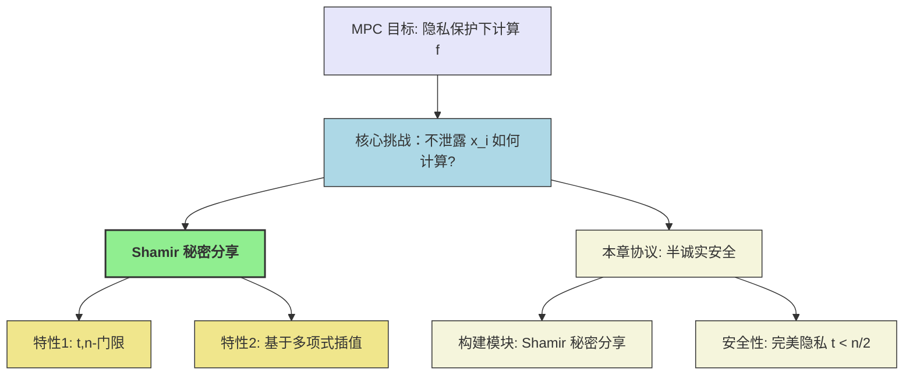

## 3.1 Shamir 秘密分享 (Shamir's Secret Sharing)

Shamir 秘密分享方案由 Adi Shamir 于1979年提出，它是一种基于有限域 $\mathbb{F}$ 上多项式插值的秘密分享机制。该方案要求有限域的大小 $|\mathbb{F}| > n$（参与方数量）。在本章中，我们通常假设 $\mathbb{F} = \mathbb{Z}_p$，其中 $p$ 是一个足够大的素数且 $n < p$。

**基本思想**:

1.  **公共参数**: 所有参与方约定 $n$ 个公开的、各不相同且均不为零的元素 $(\alpha_1, \dots, \alpha_n)$，其中 $\alpha_i \in \mathbb{F} \setminus \{0\}$。这些 $\alpha_i$ 通常是参与方 $P_i$ 的公开标识。
2.  **秘密分享**: 要分享秘密 $s \in \mathbb{F}$，秘密持有者（或指定的 Dealer）执行以下操作：
    *   随机选择一个阶数最多为 $t$ 的多项式 $q_s(x) \in \mathbb{F}[x]$，使得 $q_s(0) = s$。
        即 $q_s(x) = s + a_1 x + a_2 x^2 + \dots + a_t x^t$，其中 $a_1, \dots, a_t \leftarrow_{\$} \mathbb{F}$ 是随机选择的系数。
    *   秘密地将份额 $s_j = q_s(\alpha_j)$ 发送给参与方 $P_j$。

**关键性质 (基于拉格朗日插值法)**:

1.  **可重构性 (Reconstructibility)**: 任意 $t+1$ 个或更多的份额 $((\alpha_{i_1}, s_{i_1}), \dots, (\alpha_{i_{t+1}}, s_{i_{t+1}}))$ 可以唯一地确定多项式 $q_s(x)$，从而恢复秘密 $s = q_s(0)$。
2.  **隐私性 (Privacy)**: 任意 $t$ 个或更少的份额 $((\alpha_{i_1}, s_{i_1}), \dots, (\alpha_{i_t}, s_{i_t}))$ 无法泄露关于秘密 $s$ 的任何信息。这是因为给定 $t$ 个点，存在无数个阶数不超过 $t$ 的多项式经过这些点，并且这些多项式在 $x=0$ 处的取值可以是域 $\mathbb{F}$ 中的任何元素。

### 3.1.1 拉格朗日插值法 (Lagrange Interpolation)

拉格朗日插值法提供了一种通过给定点集构造唯一多项式的方法。

!!! theorem "拉格朗日插值定理"

    给定 $\ell+1$ 个不同的点 $(\alpha_1, y_1), \dots, (\alpha_{\ell+1}, y_{\ell+1})$，其中 $\alpha_i \in \mathbb{F}$ 且 $\alpha_i \ne \alpha_j$ for $i \ne j$，存在唯一一个阶数至多为 $\ell$ 的多项式 $q(x)$ 经过所有这些点，该多项式可以表示为：
    $$
    q(x) = \sum_{i=1}^{\ell+1} y_i \cdot \delta_i(x)
    $$
    其中，$y_i = q(\alpha_i)$，而 $\delta_i(x)$ 是拉格朗日基多项式，定义为：
    $$
    \delta_i(x) = \prod_{j=1, j \ne i}^{\ell+1} \frac{x - \alpha_j}{\alpha_i - \alpha_j}
    $$
    这些基多项式满足性质：$\delta_i(\alpha_i) = 1$ 且 $\delta_i(\alpha_j) = 0$ 对于所有 $j \ne i$。

**秘密重构**:
在 Shamir 秘密分享中，如果我们拥有 $t+1$ 个份额 $(s_{i_1}, \dots, s_{i_{t+1}})$ 对应于点 $(\alpha_{i_1}, \dots, \alpha_{i_{t+1}})$，我们可以用这些点来插值多项式 $q_s(x)$。秘密 $s$ 即为 $q_s(0)$。
令 $\ell = t$，我们有 $t+1$ 个点 $(\alpha_k, s_k)$ for $k \in K$ where $|K|=t+1$。
$$
s = q_s(0) = \sum_{k \in K} s_k \cdot \delta_k(0) = \sum_{k \in K} s_k \cdot \left( \prod_{j \in K, j \ne k} \frac{0 - \alpha_j}{\alpha_k - \alpha_j} \right) = \sum_{k \in K} s_k \cdot \left( \prod_{j \in K, j \ne k} \frac{\alpha_j}{\alpha_j - \alpha_k} \right)
$$
这里的 $\left( \prod_{j \in K, j \ne k} \frac{\alpha_j}{\alpha_j - \alpha_k} \right)$ 称为**重构向量 (recombination vector)** 的分量 $r_k$ (或 $\lambda_k$)。这些 $r_k$ 是公开的，因为它们仅依赖于公开的 $\alpha_j$ 值。

**隐私性证明 (直观)**:
考虑 $t$ 个份额 $((\alpha_1, s_1), \dots, (\alpha_t, s_t))$。对于任何可能的秘密值 $s' \in \mathbb{F}$，我们都可以找到一个阶数至多为 $t$ 的多项式 $q'(x)$，它同时满足 $q'(\alpha_j) = s_j$ for $j=1,\dots,t$ 和 $q'(0)=s'$。这是因为 $t+1$ 个点（包括 $(0, s')$ 和已知的 $t$ 个份额点）可以唯一确定一个阶数至多为 $t$ 的多项式。由于原始多项式 $q_s(x)$ 的系数 $a_1, \dots, a_t$ 是均匀随机选择的，所以对于这 $t$ 个份额，秘密 $s$ 的任何可能取值都是等概率的。因此，这 $t$ 个份额不泄露关于 $s$ 的任何信息。

### 3.1.2 计算示例 (Calculation Example)

教材中给出了一个具体的计算例子 (Page 18-19)，展示了如何使用 Shamir 秘密分享以及如何通过拉格朗日插值重构秘密。

**参数**:

*   参与方数量 $n=5$ (不直接用于多项式阶数，但 $\alpha_i$ 有 5 个)。
*   门限 $t=2$ (即多项式最高阶为 2)。
*   秘密 $s=6$。
*   有限域 $\mathbb{F} = \mathbb{Z}_{11}$。
*   公开点 $\vec{\alpha} = (\alpha_1, \dots, \alpha_5) = (1, 2, 3, 4, 5)$。

**分享过程**:

1.  随机选择系数 $b_1=7, b_2=1 \in \mathbb{Z}_{11}$。
2.  构造多项式 $q_s(x) = s + b_1 x + b_2 x^2 = 6 + 7x + x^2 \pmod{11}$。
3.  计算份额:
    *   $s_1 = q_s(1) = 6+7+1 = 14 \equiv 3 \pmod{11}$
    *   $s_2 = q_s(2) = 6+14+4 = 24 \equiv 2 \pmod{11}$
    *   $s_3 = q_s(3) = 6+21+9 = 36 \equiv 3 \pmod{11}$
    *   $s_4 = q_s(4) = 6+28+16 = 50 \equiv 6 \pmod{11}$
    *   $s_5 = q_s(5) = 6+35+25 = 66 \equiv 0 \pmod{11}$
    份额为 $(3, 2, 3, 6, 0)$。


**重构过程 (假设拥有份额 $s_3, s_4, s_5$ 对应于 $\alpha_3=3, \alpha_4=4, \alpha_5=5$)**:
由于 $t=2$，需要 $t+1=3$ 个份额来重构。
我们希望找到 $q_s(0)$。根据拉格朗日插值公式:
$$
q_s(0) = s_3 \delta_3(0) + s_4 \delta_4(0) + s_5 \delta_5(0)
$$

计算基多项式在 $x=0$ 处的值:

*   $\delta_3(0)$:

    $$
    \begin{align}
    \delta_3(0) &\equiv \frac{0-\alpha_4}{\alpha_3-\alpha_4} \cdot \frac{0-\alpha_5}{\alpha_3-\alpha_5} \pmod{11} \\
    &\equiv \frac{-4}{3-4} \cdot \frac{-5}{3-5} \pmod{11} \\
    &\equiv \frac{-4}{-1} \cdot \frac{-5}{-2} \pmod{11} \\
    &\equiv 4 \cdot (5 \cdot 2^{-1}) \pmod{11} \\
    &\text{其中 } 2^{-1} \equiv 6 \pmod{11} \text{ (因为 } 2 \cdot 6 = 12 \equiv 1 \pmod{11}) \\
    &\equiv 4 \cdot (5 \cdot 6) \pmod{11} \\
    &\equiv 4 \cdot 30 \pmod{11} \\
    &\equiv 4 \cdot 8 \pmod{11} \\
    &\equiv 32 \pmod{11} \\
    &\equiv 10 \pmod{11}
    \end{align}
    $$

教材计算 $\delta_3(x)$ 先，然后代入 $x=0$。 
    
$$
\begin{align}
    \delta_3(x) &= \frac{(x-4)(x-5)}{(3-4)(3-5)} \\
    &= \frac{(x-4)(x-5)}{(-1)\cdot(-2)} \\
    &= \frac{(x-4)(x-5)}{2} \\
    &= (x^2 - 9x + 20) \cdot 6 \pmod{11} \\
    &= (x^2 - 9x + 20) \cdot 6 \\
    &= 6x^2 - 54x + 120 \pmod{11} \\
    &\equiv 6x^2 + 2x + 10 \pmod{11}
\end{align}
$$

导出 $\delta_3(0)=10$ 比较麻烦


*   $\delta_4(0)$:

    $$
    \begin{align}
    \delta_4(0) &\equiv \frac{0-\alpha_3}{\alpha_4-\alpha_3} \cdot \frac{0-\alpha_5}{\alpha_4-\alpha_5} \pmod{11} \\
    &\equiv \frac{-3}{4-3} \cdot \frac{-5}{4-5} \pmod{11} \\
    &\equiv \frac{-3}{1} \cdot \frac{-5}{-1} \pmod{11} \\
    &\equiv (-3) \cdot 5 \pmod{11} \\
    &\equiv -15 \pmod{11} \\
    &\equiv 7 \pmod{11}
    \end{align}
    $$

    (教材计算 $\delta_4(x) \equiv 10x^2+8x+7 \pmod{11}$。$\delta_4(0) = 7$。)

*   $\delta_5(0)$:

    $$
    \begin{align}
    \delta_5(0) &\equiv \frac{0-\alpha_3}{\alpha_5-\alpha_3} \cdot \frac{0-\alpha_4}{\alpha_5-\alpha_4} \pmod{11} \\
    &\equiv \frac{-3}{5-3} \cdot \frac{-4}{5-4} \pmod{11} \\
    &\equiv \frac{-3}{2} \cdot \frac{-4}{1} \pmod{11} \\
    &\equiv (-3 \cdot 2^{-1}) \cdot (-4) \pmod{11} \\
    &\equiv (-3 \cdot 6) \cdot (-4) \pmod{11} \\
    &\equiv (-18) \cdot (-4) \pmod{11} \\
    &\equiv 4 \cdot (-4) \pmod{11} \\
    &\equiv -16 \pmod{11} \\
    &\equiv 6 \pmod{11}
    \end{align}
    $$
    
    (教材计算 $\delta_5(x) \equiv 6x^2+2x+6 \pmod{11}$。$\delta_5(0) = 6$。)

重构秘密:

$$
\begin{align}
s &\equiv (s_3 \cdot \delta_3(0) + s_4 \cdot \delta_4(0) + s_5 \cdot \delta_5(0)) \pmod{11} \\
&\equiv (3 \cdot 10 + 6 \cdot 7 + 0 \cdot 6) \pmod{11} \\
&\equiv (30 + 42 + 0) \pmod{11} \\
&\equiv (8 + 9 + 0) \pmod{11} \\
&\equiv 17 \pmod{11} \\
&\equiv 6 \pmod{11}
\end{align}
$$

与原始秘密一致。


## 3.2 半诚实安全的电路计算协议 (Semi-Honest Secure Circuit Computation Protocol)

本节将基于 Shamir 秘密分享方案，构造一个通用的安全多方计算协议，用于计算表示为**算术电路 (Arithmetic Circuit)** 的任何函数。该协议在半诚实敌手模型下是安全的。

### 3.2.1 算术电路 (Arithmetic Circuit)

!!! definition "算术电路"

    算术电路是一个有向无环图 (DAG)，其节点称为**门 (gate)**，边称为**导线 (wire)**。
    
    *   **输入门 (Input Gates)**: 每个参与方 $P_i$ 对应一个输入门，没有输入导线，但可以有任意数量的输出导线。它将其私密输入 $x_i \in \mathbb{F}$ 传递到其输出导线上。
    *   **加法门 (Addition Gates)**: 有两条输入导线，任意数量的输出导线。输出其两个输入值之和。
    *   **乘法门 (Multiplication Gates)**: 有两条输入导线，任意数量的输出导线。输出其两个输入值之积。
    *   **常数乘法门 (Constant Multiplication Gates)**: 有一条输入导线，任意数量的输出导线。将其输入值乘以一个公开常数 $c \in \mathbb{F}$。
    *   **输出门 (Output Gates)**: 每个参与方 $P_i$ 可能对应一个或多个输出门，有一条输入导线，没有输出导线。其输入导线上的值即为该参与方的输出 $y_i$。
    
    电路的计算按照**拓扑顺序 (topological order)** 进行，即一个门的计算在其所有输入导线的值都确定之后进行。

!!! tip "通用性"
    任何可计算函数都可以表示为布尔电路（与门、或门、非门）。而布尔电路的操作又可以模拟为有限域 $\mathbb{F}$ 上的算术运算：

    *   NOT $b \Rightarrow 1-b$ (在 $\mathbb{F}_2$ 中)
    *   AND $b, b' \Rightarrow b \cdot b'$ (在 $\mathbb{F}_2$ 中)
    *   XOR $b, b' \Rightarrow b+b'$ (在 $\mathbb{F}_2$ 中)
    因此，算术电路模型具有通用性。

### 3.2.2 协议描述 (Protocol Description)

协议的目标是让 $n$ 个参与方安全地计算一个由算术电路 $C$ 表示的函数 $f: \mathbb{F}^N \to \mathbb{F}^M$ (这里 $N, M$ 是总输入/输出数量)。
我们采用 Shamir $(t,n)$-秘密分享，其中门限 $t < n/2$。

**符号约定 (Def 3.2.1)**:
给定公开点 $\vec{\alpha} = (\alpha_1, \dots, \alpha_n)$。对于一个秘密 $a \in \mathbb{F}$，如果它通过一个阶数最多为 $t$ 的多项式 $f_a(x)$ (满足 $f_a(0)=a$) 进行分享，那么参与方 $P_j$ 持有的份额是 $f_a(\alpha_j)$。我们将这组份额记为 $[a; f_a]_t$ 或简写为 $[a]_t$ 或 $[a]$。
$[a; f_a]_t = (f_a(\alpha_1), \dots, f_a(\alpha_n))$

**份额的线性性质 (Lemma 3.1)**:
设 $[a; f_a]_t$ 和 $[b; f_b]_t$ 是秘密 $a, b$ 的份额。
1.  **加法**: $[a; f_a]_t + [b; f_b]_t = (f_a(\alpha_1)+f_b(\alpha_1), \dots, f_a(\alpha_n)+f_b(\alpha_n)) = [a+b; f_a+f_b]_t$。
    (其中 $(f_a+f_b)(x) = f_a(x)+f_b(x)$，其阶数仍 $\le t$)
2.  **常数乘法**: $c \cdot [a; f_a]_t = (c \cdot f_a(\alpha_1), \dots, c \cdot f_a(\alpha_n)) = [ca; c \cdot f_a]_t$。
    (其中 $(c \cdot f_a)(x) = c \cdot f_a(x)$，其阶数仍 $\le t$)
3.  **逐项乘法**: $[a; f_a]_t * [b; f_b]_t = (f_a(\alpha_1)f_b(\alpha_1), \dots, f_a(\alpha_n)f_b(\alpha_n)) = [ab; f_a f_b]_{2t}$。
    (其中 $(f_a f_b)(x) = f_a(x)f_b(x)$，其阶数变为 $\le 2t$)

注意乘法后多项式的阶数翻倍。由于 $t < n/2 \Rightarrow 2t < n-1$ (如果 $n$ 是奇数，则 $2t \le n-1$；如果 $n$ 是偶数，则 $2t \le n-2$)。只要 $2t < n$ (即 $2t \le n-1$)，那么 $2t+1 \le n$ 个点仍然可以唯一确定一个阶数为 $2t$ 的多项式。因此，我们需要 $2t+1 \le n$ 才能进行乘法后的秘密重构（如果需要的话）或继续进行基于 $2t$ 阶多项式的分享。协议中乘法后会进行一次**度降低 (degree reduction)** 步骤。

**协议流程 (图 3.1)**:
协议分为三个阶段：输入分享、计算、输出重构。

1.  **输入分享阶段 (Input Sharing Phase)**:

    *   对于每个参与方 $P_i$ 的每个私密输入比特/元素 $x_{i,k} \in \mathbb{F}$， $P_i$ 选择一个随机的 $t$ 阶多项式 $f_{x_{i,k}}(x)$ 使得 $f_{x_{i,k}}(0) = x_{i,k}$。
    *   $P_i$ 计算份额 $(f_{x_{i,k}}(\alpha_1), \dots, f_{x_{i,k}}(\alpha_n))$ 并将 $f_{x_{i,k}}(\alpha_j)$ 安全地发送给 $P_j$。
    *   现在每个参与方都持有了所有输入值对应的份额 $[x_{input}; f_{x_{input}}]_t$。

2.  **计算阶段 (Computation Phase)**:
    按照电路的拓扑顺序逐个门进行计算。假设一个门 $g$ 的输入导线 $w_a, w_b$ 上对应的值的分享为 $[val(w_a); f_a]_t$ 和 $[val(w_b); f_b]_t$。
    *   **加法门/常数乘法门**:
        *   每个参与方 $P_j$ 在本地对其持有的份额 $f_a(\alpha_j)$ 和 $f_b(\alpha_j)$ 进行相应的加法或常数乘法运算。
        *   根据引理 3.1，结果份额 $[val(w_a)+val(w_b); f_a+f_b]_t$ 或 $[c \cdot val(w_a); c \cdot f_a]_t$ 被正确计算并分发，且多项式阶数仍为 $t$。
    *   **乘法门**:
        1.  **本地乘法**: 每个参与方 $P_j$ 计算其份额的乘积 $f_a(\alpha_j) \cdot f_b(\alpha_j)$。这会得到 $[val(w_a)val(w_b); f_a f_b]_{2t}$ 的份额。此时多项式 $h(x) = f_a(x)f_b(x)$ 的阶数为 $2t$。
        2.  **度降低 (Degree Reduction / Re-sharing)**: (这一步是关键，因为我们希望后续操作仍基于 $t$ 阶多项式)
            *   目标：将秘密 $S = val(w_a)val(w_b)$ (当前由 $2t$ 阶多项式 $h(x)$ 分享) 重新分享为一个新的 $t$ 阶多项式 $h'(x)$。
            *   每个参与方 $P_j$ 持有 $h(\alpha_j)$。现在，$P_j$ 将 $h(\alpha_j)$ 视为其新的秘密输入，并对其进行一次新的 $t$-阶 Shamir 分享。即，$P_j$ 选择随机 $t$ 阶多项式 $f_j(x)$ 使得 $f_j(0) = h(\alpha_j)$，然后将 $f_j(\alpha_k)$ 发送给 $P_k$。
            *   此时，对于秘密 $S=h(0)$，每个参与方 $P_k$ 持有了一组份额 $(f_1(\alpha_k), \dots, f_n(\alpha_k))$。
            *   注意到 $S = h(0) = \sum_{j=1}^{2t+1} r_j h(\alpha_j)$ （如果 $2t+1 \le n$，使用 $2t+1$ 个点来重构 $h(0)$，其中 $r_j$ 是重构向量的分量）。
            *   我们想得到 $[S; h']_t$。$P_k$ 计算 $\sum_{j=1}^{2t+1} r_j f_j(\alpha_k)$。这个和是 $P_k$ 持有的关于 $S$ 的 $t$-阶分享的新份额。
                设 $h'(x) = \sum_{j=1}^{2t+1} r_j f_j(x)$。那么 $h'(0) = \sum r_j f_j(0) = \sum r_j h(\alpha_j) = h(0) = S$。
                并且 $h'(x)$ 的阶数是 $t$ (因为每个 $f_j(x)$ 阶数为 $t$，$r_j$ 是常数)。
                因此，参与方 $P_k$ 计算出的 $\sum_{j=1}^{2t+1} r_j f_j(\alpha_k)$ 就是 $h'(\alpha_k)$，即秘密 $S$ 的新的 $t$-阶份额。
            *   **条件**: 这个度降低步骤需要 $2t+1 \le n$。由于协议假设 $t < n/2$，即 $2t < n$，所以 $2t+1 \le n$ 总是成立的。

3.  **输出重构阶段 (Output Reconstruction Phase)**:
    *   当计算到电路的输出门时，假设输出导线 $w_{out}$ 上的值的分享为 $[y; f_y]_t$。
    *   为了让某个参与方 $P_{target}$ 获得输出 $y$，其他所有参与方 $P_j$ ($j \ne target$) 将其持有的份额 $f_y(\alpha_j)$ 发送给 $P_{target}$。
    *   $P_{target}$ 收集到至少 $t+1$ 个份额（包括自己的），然后使用拉格朗日插值计算 $f_y(0) = y$。

### 3.2.3 安全性分析 (Security Analysis)

**正确性 (Correctness)**:
*   加法门和常数乘法门的正确性直接由份额的线性性质保证。
*   乘法门的度降低步骤确保了秘密的正确传递，并且分享的多项式阶数恢复到 $t$。
*   输出重构的正确性由拉格朗日插值保证。
因此，协议是完美正确的。

**完美隐私性 (Perfect Privacy)** (直观分析，正式证明见第6章):
我们需要证明，对于任意 $t$ 个被攻陷的参与方组成的集合 $C$ (即 $|C| \le t < n/2$)，他们联合起来看到的所有消息（视图 view）都可以由他们自己的输入和应得的输出高效地模拟出来。

*   **输入分享阶段**: 诚实方 $P_j \notin C$ 分享其输入 $x_j$ 时，生成的 $t$ 阶多项式 $f_{x_j}(x)$ 的系数是随机的。因此，集合 $C$ 中的参与方收到的关于 $x_j$ 的 $t$ 个份额是关于 $x_j$ 的 $t$-隐私分享，不泄露任何关于 $x_j$ 的信息（根据 Shamir 分享的隐私性）。
*   **计算阶段**:
    *   加法门和常数乘法门：本地计算，不产生新的通信。
    *   乘法门 (度降低)：当诚实方 $P_j \notin C$ 将其持有的 $h(\alpha_j)$ (其中 $h(x)$ 是一个 $2t$ 阶多项式) 进行 $t$-阶分享时，同样，因为 $f_j(x)$ 的随机性，$C$ 收到的份额不泄露 $h(\alpha_j)$。
        关键在于， $C$ 中的参与方总共只能看到 $t$ 个关于任何秘密的份额（无论是原始输入、中间值还是度降低的值）。
*   **输出重构阶段**: 当诚实方 $P_j \notin C$ 将其份额 $f_y(\alpha_j)$ 发送给一个被攻陷的输出方 $P_i \in C$ 时，由于 $P_i$ 最终会得到输出 $y=f_y(0)$，并且它已经拥有了 $C$ 中其他成员的份额（总共 $|C| \le t$ 个）。它可以利用 $y$ 和这 $|C|$ 个份额，唯一确定 $f_y(x)$（如果 $|C|=t$），或者确定经过这些点且 $f_y(0)=y$ 的多项式。因此，它能计算出诚实方 $P_j$ 发送给它的份额。这意味着诚实方发送的份额没有泄露额外信息。

**模拟器构造 (粗略思路)**:
模拟器 $S$ 知道 $C$ 中参与方的输入 $\{x_i\}_{P_i \in C}$ 和输出 $\{y_i\}_{P_i \in C}$。
1.  对于 $C$ 中参与方的输入分享， $S$ 诚实地执行。
2.  对于诚实方 $P_j \notin C$ 的输入分享， $S$ 为其生成随机的 $t$ 个份额（对于 $C$ 中的每个成员）发送给 $C$。
3.  对于乘法门的度降低，当诚实方 $P_j \notin C$ 需要分享 $h(\alpha_j)$ 时，$S$ 同样为其生成随机的 $t$ 个份额发送给 $C$。
4.  对于输出重构，如果输出方 $P_i \in C$， $S$ 利用 $y_i$ 和 $C$ 中成员已有的关于 $y_i$ 的份额，计算出诚实方应该发送给 $P_i$ 的份额，并模拟这个发送。

由于所有诚实方贡献的份额在 $C$ 看来都是随机的（或者可以从 $C$ 的输入输出推断出来），因此模拟的视图与真实视图是完美不可区分的。

### 3.2.4 计算示例 (Calculation Example - Page 24)

教材中用一个简单的加法 $c=a+b$ 的例子，展示了在输出重构阶段，即便将所有份额都发给被攻陷方 $P_1$，也不会泄露额外信息。

**设定**:
*   $n=3, t=1$。$P_1$ 被攻陷。
*   $\vec{\alpha} = (1, 2, 3)$。
*   $t=1 \Rightarrow$ 多项式为线性 $f(x) = s + b_0 x$。
*   假设 $a=4$ 通过 $a(x)=4+x$ 分享: $[a] = (a(1),a(2),a(3)) = (5,6,7)$。
*   假设 $b=4$ 通过 $b(x)=4+2x$ 分享: $[b] = (b(1),b(2),b(3)) = (6,8,10)$。
*   $P_1$ 的份额加粗：$P_1$ 持有 $a(1)=\mathbf{5}, b(1)=\mathbf{6}$。

**计算 $c=a+b$**:
本地份额相加: $c(x) = a(x)+b(x) = (4+x)+(4+2x) = 8+3x$。
$[c] = (a(1)+b(1), a(2)+b(2), a(3)+b(3)) = (5+6, 6+8, 7+10) = (11, 14, 17)$。
$P_1$ 持有 $c(1)=\mathbf{11}$。

**输出 $c$ 给 $P_1$**:
$P_2$ 发送 $c(2)=14$ 给 $P_1$。
$P_3$ 发送 $c(3)=17$ 给 $P_1$。
$P_1$ 现在拥有 $(c(1), c(2), c(3)) = (11, 14, 17)$。
$P_1$ 用 $(\alpha_1, c(1))=(1,11)$ 和 $(\alpha_2, c(2))=(2,14)$ 插值 (因为 $t=1$, 2个点足够):

$$
\begin{align*}
c(x) 
&= c(1) \cdot \frac{x-\alpha_2}{\alpha_1-\alpha_2} + c(2) \cdot \frac{x-\alpha_1}{\alpha_2-\alpha_1} \\
&= 11 \cdot \frac{x-2}{1-2} + 14 \cdot \frac{x-1}{2-1} \\
&= 11 \cdot (-(x-2)) + 14 \cdot (x-1) \\
&= -11x + 22 + 14x - 14 \\
&= 3x + 8
\end{align*}
$$

$c = c(0) = 8$。

**隐私性**: $P_1$ 知道 $c=8$。他是否能知道 $a, b$ 的原始值？
$P_1$ 的视图包括：
*   自己的输入（如果有的话，这里没有）
*   $a(1)=5, b(1)=6$
*   $c(1)=11, c(2)=14, c(3)=17$ (以及输出 $c=8$)

$P_1$ 可以尝试假设 $a=3, b=5$ (仍然满足 $a+b=8$)。
如果 $a=3$，且 $a(1)=5$，那么 $a(x)=3+2x$。则 $a(2)=7, a(3)=9$。
如果 $b=5$，且 $b(1)=6$，那么 $b(x)=5+x$。则 $b(2)=7, b(3)=8$。
那么对应的 $c(x) = a(x)+b(x) = (3+2x)+(5+x) = 8+3x$。
所以 $c(1)=11, c(2)=14, c(3)=17$。
这个假设 $(a=3, b=5)$ 与 $P_1$ 观察到的所有信息是完全一致的。因此，$P_1$ 无法区分 $a=4, b=4$ 和 $a=3, b=5$ 这两种情况。
这说明了即使在输出重构阶段将所有份额都给了一个被攻陷方，只要 $t < n/2$ (这里 $1 < 3/2$)，协议仍然保持隐私性。

教材的乘法例子 (Page 25) 进一步说明了度降低过程如何保持隐私性，因为即使是 $2t$ 阶多项式的份额，在仅有 $t$ 个被攻陷方的情况下，也无法唯一确定该多项式，其在 $x=0$ 处的值（即乘积）也就无法被唯一确定。度降低过程中的重新随机分享进一步增强了隐私性。

# 第4章 安全模型 (Security Models)

在上一章中，我们介绍了一个具有完美正确性和完美隐私性的 MPC 协议，但其安全性是建立在所有参与方都诚实遵守协议（即**半诚实敌手模型 (Semi-Honest Adversary Model)** 或**被动安全模型 (Passively Secure Model)**）的假设之上的。然而，在现实场景中，参与方可能会恶意偏离协议以获取额外利益或破坏协议执行（即**恶意敌手模型 (Malicious Adversary Model)** 或**主动安全模型 (Actively Secure Model)**）。

本章的核心目标是引入一个形式化的、强大的密码学安全模型——**通用可组合性框架 (Universal Composability framework, UC framework)**。这个框架由 Canetti 提出，旨在为密码学协议（尤其是 MPC 协议）提供一个统一且模块化的安全性分析标准。UC 安全的协议具有优秀的性质，即它们在任意环境下（包括与其他协议并发执行或作为更大协议的子模块时）仍然保持其安全性。

在深入 UC 框架的细节之前，我们将首先延续上一章对隐私性的讨论，并探讨如何以类似的方式定义恶意安全性，进而阐明为何需要一个统一的框架来同时刻画这两个属性。

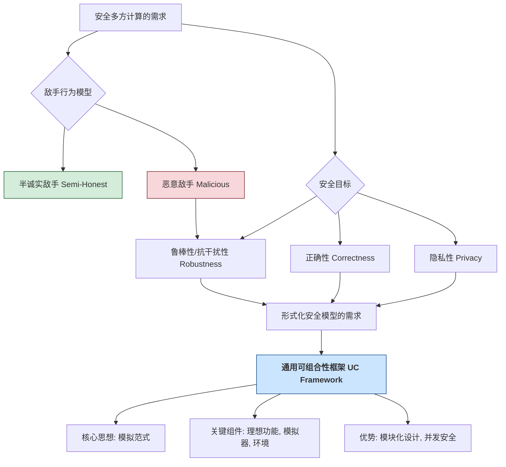

## 4.1 隐私性与恶意安全性 (Privacy and Malicious Security)

我们在第3章非形式化地讨论了半诚实模型下的隐私性，其核心思想是：被攻陷方从协议中获得的所有信息（视图 view）都可以由其自身的输入和应得的输出高效地模拟出来。

### 4.1.1 定义隐私性 (Defining Privacy - Revisited)

回顾一下，隐私性的非形式化定义：
> 如果一个协议总是满足**泄漏值 (leakage value)** 不包含比**允许值 (allowed value)** 更多的信息，那么它具有隐私性。

*   **允许值**: 被攻陷方 $C$ 根据协议定义理应获得的其自身输入 $\{x_j\}_{P_j \in C}$ 和输出 $\{y_j\}_{P_j \in C}$。
*   **泄漏值**: 被攻陷方 $C$ 在协议执行过程中实际观察到的所有信息 $\{view_j\}_{P_j \in C}$。

为了将“不包含更多信息”形式化，我们引入**模拟器 (Simulator)** 的概念：

> 如果存在一个高效的模拟器 $S$，它仅以允许值 $\{x_j, y_j\}_{P_j \in C}$ 作为输入，就能生成一个模拟视图 $S(\{x_j, y_j\}_{P_j \in C})$，该模拟视图与真实协议中的泄漏值 $\{view_j\}_{P_j \in C}$ 具有**不可区分的分布**，那么该协议就被认为是满足隐私性的。

**分布的考虑**: (Page 28, 一个微妙的细节)
当协议涉及诚实方的随机性，或者协议的输出本身是概率性的时，仅仅要求模拟视图与泄漏值的边际分布不可区分是不够的。我们需要考虑它们与**诚实方输出的联合分布 (joint distribution with the outputs of honest parties)**。

*   **例子 (愚蠢的功能 $\mathcal{F}$)**: $P_1$ 获得一个随机比特， $P_2$ 无输出。
    *   **安全协议 $\Pi_{sec}$**: $P_1$ 选择随机比特 $b_{P_1}$ 并输出；$P_2$ 什么都不做。
    *   **不安全协议 $\Pi_{insec}$**: $P_1$ 选择随机比特 $b_{P_1}$ 并输出，然后将 $b_{P_1}$ 发送给 $P_2$。
    
    如果只考虑被攻陷的 $P_2$ 的视图，在 $\Pi_{insec}$ 中，$P_2$ 的视图是 $b_{P_1}$。模拟器 $S$ 可以简单地输出一个随机比特 $b_S$。 $b_S$ 和 $b_{P_1}$ 的分布是相同的。这会错误地判定 $\Pi_{insec}$ 是安全的。
    
    正确的做法是比较联合分布：
    *   真实世界 ($P_2$ 攻陷): $(\text{view}_{P_2}, \text{output}_{P_1}) = (b_{P_1}, b_{P_1})$。
    *   理想世界 (模拟器 $S$ for $P_2$): $(S(\text{allowed for } P_2), \text{output}_{P_1}) = (b_S, b_{P_1})$。
    这两个联合分布是可区分的，因为在真实世界中两部分总是相等，而在理想世界中它们是独立的（有 $1/2$ 的概率不相等）。

**结论**:
*   如果功能是**确定性的 (deterministic)** (输出完全由输入决定)，可以仅考虑被攻陷方的视图。
*   如果功能是**概率性的 (probabilistic)** (输出包含随机性)，则必须考虑被攻陷方视图与诚实方输出的联合分布。

### 4.1.2 定义恶意安全性 (Defining Malicious Security)

恶意安全性关注的是敌手通过偏离协议行为对协议造成的影响，而不仅仅是获取信息。

**核心思想**: 敌手的任何恶意行为所能造成的影响，不应超出其通过合法方式（即仅替换自己的输入）在理想世界中能造成的影响。

**理想世界 (Ideal World)**:
存在一个完全可信的硬件盒子（或可信第三方 TTP），它执行函数 $f$。
1.  各参与方 $P_i$ 将其输入 $x_i$ 安全地发送给盒子。
2.  盒子计算 $(y_1, \dots, y_n) = f(x_1, \dots, x_n)$。
3.  盒子将 $y_i$ 秘密地发送给 $P_i$。
4.  盒子销毁所有内部状态。

在理想世界中，被攻陷方 $C$ 唯一能做的就是：收集 $C$ 中所有成员的原始输入，选择一组新的（可能是恶意的）输入 $\{x_j^*\}_{P_j \in C}$，然后将这些 $x_j^*$ (以及诚实方的真实输入) 发送给盒子。这就是**允许的影响 (allowed influence)**。

**实际影响 (Real-world Influence)**: 在真实协议中，被攻陷方可以发送任意构造的消息。

**恶意安全性的首次尝试定义**:
> 如果一个协议满足其实际影响的效果可以通过允许的影响来获得，那么它是恶意安全的。

更精确地，使用模拟器：
> 如果对于每个（恶意）攻击协议的敌手，都存在一个模拟器 $S$，该模拟器在理想世界中仅通过输入替换就能高效地计算出与真实世界中敌手攻击所产生的**相同效果（输出分布）**，那么该协议是恶意安全的。

*   **例1 (Page 29)**: $f(x_1,x_2,x_3) = (x_1x_2x_3, x_2, x_3)$。 $P_1$ 被攻陷，它将输入 $x_1$ 替换为 $x_1'=1$。最终 $P_1$ 得到 $x_2x_3$。这是允许的影响，因为 $P_1$ 可以在理想世界中通过提交 $x_1'=1$ 达到同样效果。
*   **例2 (Page 29)**: 同上函数，但 $P_1$ 在乘法计算的中间步骤恶意修改了其分享的份额，使得最终 $P_1$ 得到了 $x_3$ (而不是 $x_1x_2x_3$)。这通常是不允许的，因为在理想世界中， $P_1$ 无法通过仅替换其输入 $x_1$ 来稳定地获得 $x_3$（特别是当 $x_1$ 或 $x_2$ 为0时）。这种攻击不仅影响了正确性，还可能泄露了 $x_3$ 的信息给一个本不应完全获得它的 $P_1$。

### 4.1.3 同时获得隐私性和恶意安全性 (Achieving Both Privacy and Malicious Security)

一个完整的安全定义应该同时涵盖隐私性和恶意安全性。这意味着需要存在一个**单一的模拟器**，它既能模拟被攻陷方的视图（保证隐私性），又能将在真实世界中对协议输出的影响转化为理想世界中允许的输入替换（保证恶意安全性）。

### 4.1.4 通用可组合框架概述 (Universal Composability Framework - Overview)

UC 框架通过将参与方建模为**交互式图灵机 (Interactive Turing Machines, ITM)** 来形式化上述思想。

*   **ITM**: 图灵机的扩展，拥有输入/输出纸带用于与其他 ITM 通信，并拥有唯一的身份。
*   **激活 (Activation)**: 在任何时刻，只有一个 ITM 处于激活状态并执行操作。ITM 通过发送消息来激活另一个 ITM。
*   **敌手 $\mathcal{A}$**: 一个特殊的 ITM，在协议开始时首先被激活。
*   **理想功能 (Ideal Functionality) $\mathcal{F}$**: 代表协议要实现的理想化服务（如 TTP）。
*   **模拟器 (Simulator) $\mathcal{S}$**: 在理想世界中，$\mathcal{S}$ 与 $\mathcal{F}$ 交互，并试图模拟真实世界中所有参与方和通信信道对外部观察者（环境）所呈现的接口。

**不可区分性 (Indistinguishability)**:
UC 安全的核心在于引入一个**环境 (Environment) $\mathcal{Z}$**。$\mathcal{Z}$ 是一个特殊的 ITM，它为协议的参与方提供输入，并观察协议的输出，最终输出一个比特来判断自己是在与真实协议交互还是在与理想功能（通过模拟器）交互。

*   **真实世界执行**: $\text{EXEC}_{\Pi, \mathcal{A}, \mathcal{Z}}$，环境 $\mathcal{Z}$ 与协议 $\Pi$ 的实例（由诚实方和敌手 $\mathcal{A}$ 控制的腐败方组成）交互。
*   **理想世界执行**: $\text{EXEC}_{\mathcal{F}, \mathcal{S}, \mathcal{Z}}$，环境 $\mathcal{Z}$ 与理想功能 $\mathcal{F}$ 和模拟器 $\mathcal{S}$（$\mathcal{S}$ 内部可能运行真实敌手 $\mathcal{A}$ 的代码）交互。

> 如果对于任何 PPT 环境 $\mathcal{Z}$，它都无法以不可忽略的优势区分真实世界执行和理想世界执行（即 $\text{EXEC}_{\Pi, \mathcal{A}, \mathcal{Z}} \stackrel{c}{\approx} \text{EXEC}_{\mathcal{F}, \mathcal{S}, \mathcal{Z}}$），那么协议 $\Pi$ 被称为 **UC-安全地实现了 (UC-realizes)** 理想功能 $\mathcal{F}$。

**UC 框架的优势**:
*   **模块化组合**: UC 安全的协议可以作为子模块安全地用于构建更大的 UC 安全协议。
*   **并发安全**: UC 安全的协议在多个实例并发执行时仍然保持安全。

**通用可组合模型与独立 (Stand-alone) 模型的区别**: (Page 32)
*   **独立模型**: 不引入环境 $\mathcal{Z}$（或 $\mathcal{Z}$ 不与敌手实时交互）。协议会话独立运行。安全性证明通常允许模拟器对敌手进行“倒带 (rewind)”。
*   **UC 模型**: 环境 $\mathcal{Z}$ 的引入模拟了任意复杂的外部环境，包括并发协议。不允许模拟器“倒带”敌手，要求“直线式 (straight-line)”模拟。这使得 UC 安全性更难实现，但也更强大。

## 4.2 形式化模型——通用可组合框架 (Formal Model - Universal Composability Framework)

本节将更详细地介绍 UC 框架的组成部分和运行机制。

### 4.2.1 真实协议及其运行 (Real Protocol and its Execution)

考虑一个有 $N$ 个参与方 $P_1, \dots, P_N$ 运行协议 $\Pi$ 的场景。存在一个敌手 $\mathcal{A}$。被攻陷的参与方的行为被整合到 $\mathcal{A}$ 的逻辑中。

**组件 (图 4.1)**:
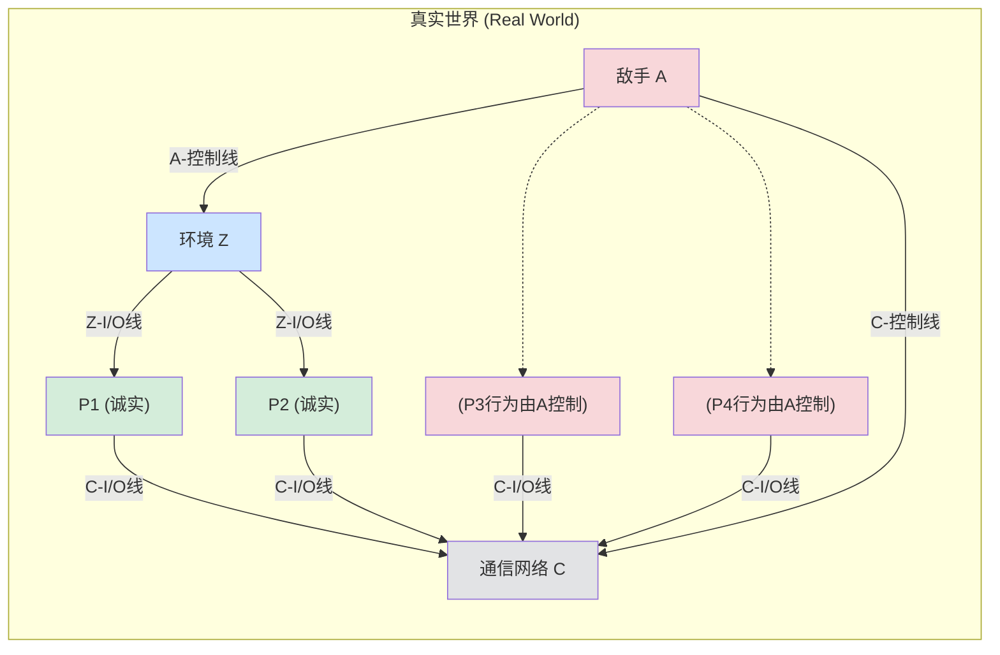

*   **环境 $\mathcal{Z}$**:
    *   为诚实参与方提供协议输入。
    *   从诚实参与方接收协议输出。
    *   与敌手 $\mathcal{A}$ 通过 **A-控制线** 实时交互，可以向 $\mathcal{A}$ 发送指令（如攻陷某个参与方），并从 $\mathcal{A}$ 接收“泄露信息”。
    *   在协议开始前确定哪些参与方被攻陷。
*   **诚实参与方 $P_i$ (Honest Parties)**: 严格按照协议 $\Pi$ 的规定执行。通过 **Z-I/O线** 与环境交互，通过 **C-I/O线** 与通信网络 $C$ 交互。
*   **被攻陷参与方 $P_j$ (Corrupted Parties)**: 其行为完全由敌手 $\mathcal{A}$ 控制。它们与通信网络 $C$ 的交互也通过 $\mathcal{A}$ 代理。
*   **敌手 $\mathcal{A}$ (Adversary)**:
    *   控制所有被攻陷参与方。
    *   通过 **C-控制线** 与通信网络 $C$ 交互，可以：
        *   观察消息元数据（长度、发送方、接收方）。
        *   调度（延迟、重排）消息的传递。
        *   不能直接读取或修改诚实方之间的加密消息内容。
*   **通信网络 $C$ (Communication Network)**:
    *   通常假设提供安全的点对点信道（隐私性和完整性）。
    *   是异步的，消息传递顺序和时间由敌手 $\mathcal{A}$ 控制。

#### 4.2.1.1 真实协议的运行机制

1.  **初始化**: 环境 $\mathcal{Z}$ 启动，确定一组被攻陷方（该信息对 $\mathcal{A}$ 和 $C$ 可见，对诚实方不可见）。
2.  **激活传递**:
    *   $\mathcal{Z}$ 首先被激活，可以向诚实方提供输入，或向 $\mathcal{A}$ 发送控制指令。然后 $\mathcal{Z}$ 将激活传递给某个参与方或 $\mathcal{A}$。
    *   当诚实方 $P_i$ 被激活，它执行协议步骤，可能会向 $C$ 发送消息请求 (格式如 `(Send, (j1, m1), (j2, m2), ...)`，其中 $j_k$ 是接收方，$m_k$ 是消息)。
    *   当 $\mathcal{A}$ 被激活，它可以指示被攻陷方发送消息，或通过 C-控制线影响 $C$ 的行为。
    *   当 $C$ 通过 C-I/O 线收到来自 $P_i$ (或 $\mathcal{A}$ 代表的 $P_i$) 的发送请求 `(Send, ...)` 时，它将这些消息的元组 `(i, j_k, m_k)` 存入内部缓冲区 `buf`，并通过 C-控制线向 $\mathcal{A}$ 发送泄露信息 `(Sent, i, (j1, len(m1)), ...)`。
    *   当 $C$ 通过 C-控制线从 $\mathcal{A}$ 收到传递指令 `(Deliver, k)` (其中 $k$ 是 `buf` 中的索引) 时，如果 `buf[k]` 是 `(i, j, m)`，则 $C$ 将消息 `(Receive, i, m)` 沿着对应的 C-I/O 线发送给 $P_j$ (如果 $P_j$ 诚实) 或 $\mathcal{A}$ (如果 $P_j$ 被攻陷)。
3.  **终止**: 当 $\mathcal{Z}$ 完成所有操作后，它输出一个比特（通常表示它认为自己是在真实世界还是理想世界）。

#### 4.2.1.2 敌手与诚实方的通信

如上所述，在基础模型中，敌手 $\mathcal{A}$ 不直接与诚实方 $P_i$ 通信，所有交互都通过通信网络 $C$ 进行。变体模型可以允许直接通信，此时 $C$ 的作用减弱或消失。

#### 4.2.1.3 平凡敌手 (Dummy Adversary)

平凡敌手 $\mathcal{A}_{\text{triv}}$ 是一个简单的路由器：
*   忠实执行来自 $\mathcal{Z}$ 的控制指令。
*   将从其他机器收到的所有消息（包括泄露信息）转发给 $\mathcal{Z}$。
*   不主动进行任何恶意操作。

#### 4.2.1.4 运行时间考虑

*   **良好环境 (Well-behaved Environment)**: $\mathcal{Z}$ 的运行时间是安全参数 $\lambda$ 的多项式。
*   **兼容的敌手 (Compatible Adversary)**: 对于任何良好环境 $\mathcal{Z}$，敌手 $\mathcal{A}$ 与协议 $\Pi$ 的总运行时间（以压倒性概率）是关于 $\lambda$ 和 $\mathcal{Z}$ 发送的消息总长度的多项式。
*   **高效协议 (Efficient Protocol)**: 如果平凡敌手 $\mathcal{A}_{\text{triv}}$ 与协议 $\Pi$ 是兼容的。

### 4.2.2 理想协议及其运行 (Ideal Protocol and its Execution)

理想协议的运行与真实协议类似，但有关键区别：

**组件 (图 4.2)**:
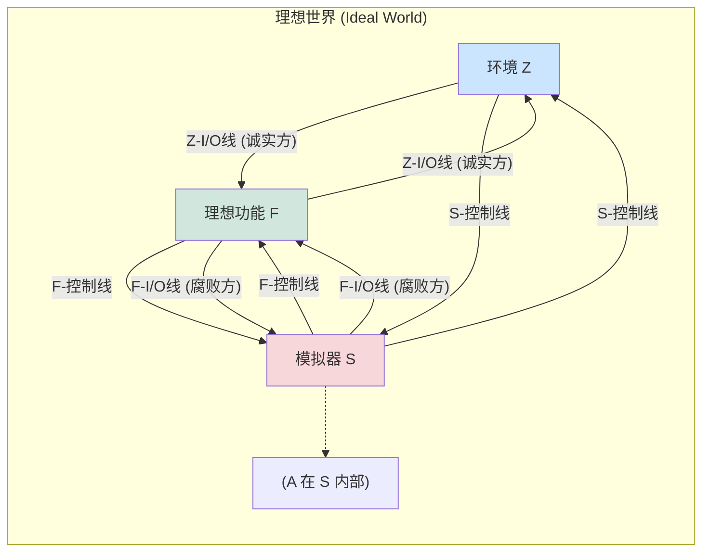

*   **理想功能 $\mathcal{F}$ (Ideal Functionality)**:
    *   代替了真实协议 $\Pi$ 和通信网络 $C$。
    *   直接与环境 $\mathcal{Z}$（代表诚实方）和模拟器 $\mathcal{S}$（代表被攻陷方）交互。
    *   其行为精确定义了协议应该达成的目标（例如，对于安全函数计算，$\mathcal{F}_{\text{sfe}}$ 会接收所有输入，计算函数，并将相应输出发送给各方）。
*   **模拟器 $\mathcal{S}$ (Simulator)**:
    *   代替了真实世界的敌手 $\mathcal{A}$ 与环境 $\mathcal{Z}$ 的直接交互。
    *   $\mathcal{S}$ 的目标是使得环境 $\mathcal{Z}$ 无法区分它是在与真实世界的 $(\Pi, \mathcal{A})$ 交互，还是在与理想世界的 $(\mathcal{F}, \mathcal{S})$ 交互。
    *   $\mathcal{S}$ 可以控制理想世界中被攻陷方的输入给 $\mathcal{F}$，并接收 $\mathcal{F}$ 给被攻陷方的输出。
    *   $\mathcal{S}$ 通过 S-控制线与 $\mathcal{Z}$ 通信，模拟真实世界中 $\mathcal{A}$ 与 $\mathcal{Z}$ 的通信以及通信网络 $C$ 对 $\mathcal{Z}$ 的可见行为。

#### 4.2.2.1 理想协议的运行机制

1.  **初始化**: 环境 $\mathcal{Z}$ 启动，确定一组被攻陷方（该信息对 $\mathcal{S}$ 和 $\mathcal{F}$ 可见）。
2.  **激活传递与交互**:
    *   $\mathcal{Z}$ 向诚实方发送的协议输入，会直接通过 Z-I/O 线路由给 $\mathcal{F}$。
    *   $\mathcal{Z}$ 向被攻陷方发送的协议输入（通过 $\mathcal{S}$ 的 S-控制线模拟），$\mathcal{S}$ 接收后决定实际提供给 $\mathcal{F}$ 的输入（通过 F-I/O 线）。
    *   $\mathcal{F}$ 完成计算后：
        *   给诚实方的输出通过 Z-I/O 线直接给 $\mathcal{Z}$。
        *   给被攻陷方的输出通过 F-I/O 线给 $\mathcal{S}$。$\mathcal{S}$ 再决定如何通过 S-控制线向 $\mathcal{Z}$ 模拟这些输出的到达。
    *   $\mathcal{F}$ 可能会通过 F-控制线向 $\mathcal{S}$ 发送泄露信息（例如，哪个参与方提供了输入）。
    *   $\mathcal{S}$ 可以通过 S-控制线向 $\mathcal{Z}$ 发送泄露信息，模拟真实世界中 $\mathcal{A}$ 或 $C$ 的行为。
    *   $\mathcal{Z}$ 也可以通过 S-控制线向 $\mathcal{S}$ 发送控制指令。

#### 4.2.2.2 运行时间考虑

*   **兼容的模拟器**: 对于任何良好环境 $\mathcal{Z}$，理想功能 $\mathcal{F}$ 和模拟器 $\mathcal{S}$ 的总运行时间（以压倒性概率）是关于 $\lambda$ 和 $\mathcal{Z}$ 发送的消息总长度的多项式。

### 4.2.3 安全函数计算的理想功能 (Ideal Functionality for Secure Function Evaluation, $\mathcal{F}_{\text{sfe}}$)

$\mathcal{F}_{\text{sfe}}$ 是 UC 框架中用于定义安全多方函数计算任务的标准理想功能。

**参数**: 一个公开确定的函数 $f$ (通常表示为电路)。
**行为**:
1.  **接收输入**:
    *   当 $\mathcal{F}_{\text{sfe}}$ 从诚实方 $P_i$ (通过 $\mathcal{Z}$) 或被攻陷方 $P_j$ (通过 $\mathcal{S}$) 收到格式为 `(Input, inputID, x)` 的消息时：
        *   记录该输入。
        *   通过 F-控制线向 $\mathcal{S}$ 发送泄露消息 `(Input, inputID, party_ID)`，通知 $\mathcal{S}$ 哪个参与方提供了哪个输入ID。
2.  **计算并分发输出**:
    *   当 $\mathcal{F}_{\text{sfe}}$ 从 $\mathcal{S}$ 收到格式为 `(Output, outputID, party_ID_receiver)` 的控制消息，并且所有参与方都已提供了计算该 `outputID` 所需的全部输入时：
        *   $\mathcal{F}_{\text{sfe}}$ 计算相应的输出值 $y$。
        *   如果 `party_ID_receiver` 是诚实方，则将 `(Output, outputID, y)` 通过 Z-I/O 线发送给 $\mathcal{Z}$ (代表该诚实方)。
        *   如果 `party_ID_receiver` 是被攻陷方，则将 `(Output, outputID, y)` 通过 F-I/O 线发送给 $\mathcal{S}$。

**概率功能 (Probabilistic Functionality)**: 如果函数 $f$ 本身是概率性的，$\mathcal{F}_{\text{sfe}}$ 会自行生成所需的内部随机性。

### 4.2.4 UC-安全实现 (UC-Secure Realization)

**定义 4.2.2 (特定敌手的 UC 安全)**:
设 $\mathcal{A}$ 是与协议 $\Pi$ 兼容的敌手。如果存在一个与理想功能 $\mathcal{F}$ 兼容的模拟器 $\mathcal{S}$ (可能依赖于 $\mathcal{A}$)，使得对于每个良好环境 $\mathcal{Z}$，都有：
$$
\text{EXEC}_{\Pi, \mathcal{A}, \mathcal{Z}} \stackrel{c}{\approx} \text{EXEC}_{\mathcal{F}, \mathcal{S}, \mathcal{Z}}
$$
那么称协议 $\Pi$ **对于敌手 $\mathcal{A}$ UC-安全地实现了** $\mathcal{F}$。

**定义 4.2.3 (通用 UC 安全)**:
如果对于**每个**与 $\Pi$ 兼容的敌手 $\mathcal{A}$，协议 $\Pi$ 都对于该敌手 $\mathcal{A}$ UC-安全地实现了 $\mathcal{F}$，那么称协议 $\Pi$ **UC-安全地实现了** $\mathcal{F}$。

**图 4.3 (定义 4.2.2 的示意图)**:
*   (a) 真实世界: 环境 $\mathcal{Z}$ 与 $(\Pi, \mathcal{A}, C)$ 交互。
*   (b) 理想世界: 环境 $\mathcal{Z}$ 与 $(\mathcal{F}, \mathcal{S})$ 交互。
目标是使 $\mathcal{Z}$ 无法区分这两种情况。

**定理 4.1 (平凡敌手的完备性 - The Dummy Adversary Completeness Theorem)**: (Page 40)
设 $\Pi$ 是一个高效的协议。如果 $\Pi$ 对于平凡敌手 $\mathcal{A}_{\text{triv}}$ UC-安全地实现了理想功能 $\mathcal{F}$，那么 $\Pi$ UC-安全地实现了 $\mathcal{F}$ (即对于所有兼容敌手都安全)。
这个定理极大地简化了 UC 安全性证明：我们只需要为平凡敌手构造一个模拟器即可。

**证明概要 (图 4.4)**:
假设 $\Pi$ 对平凡敌手 $\mathcal{A}_{\text{triv}}$ 安全，即存在模拟器 $S_{\text{triv}}$ 使得 $\text{EXEC}_{\Pi, \mathcal{A}_{\text{triv}}, \mathcal{Z}} \stackrel{c}{\approx} \text{EXEC}_{\mathcal{F}, S_{\text{triv}}, \mathcal{Z}}$。
对于任意敌手 $\mathcal{A}$，我们可以构造一个新的模拟器 $S_{\mathcal{A}} = S_{\text{triv}}|\mathcal{A}$ (将 $\mathcal{A}$ "嵌入" $S_{\text{triv}}$ 内部运行， $S_{\text{triv}}$ 模拟 $\mathcal{A}$ 与环境和理想功能的交互)。
同时，构造一个新的环境 $\mathcal{Z}|\mathcal{A}$ (将 $\mathcal{A}$ "嵌入" $\mathcal{Z}$ 内部，这个新环境与平凡敌手交互)。
可以证明 $\text{EXEC}_{\Pi, \mathcal{A}, \mathcal{Z}} \equiv \text{EXEC}_{\Pi, \mathcal{A}_{\text{triv}}, \mathcal{Z}|\mathcal{A}}$ (真实世界的等价转换)。
由假设， $\text{EXEC}_{\Pi, \mathcal{A}_{\text{triv}}, \mathcal{Z}|\mathcal{A}} \stackrel{c}{\approx} \text{EXEC}_{\mathcal{F}, S_{\text{triv}}, \mathcal{Z}|\mathcal{A}}$。
又可以证明 $\text{EXEC}_{\mathcal{F}, S_{\text{triv}}, \mathcal{Z}|\mathcal{A}} \equiv \text{EXEC}_{\mathcal{F}, S_{\mathcal{A}}, \mathcal{Z}}$ (理想世界的等价转换)。
从而得到 $\text{EXEC}_{\Pi, \mathcal{A}, \mathcal{Z}} \stackrel{c}{\approx} \text{EXEC}_{\mathcal{F}, S_{\mathcal{A}}, \mathcal{Z}}$。

### 4.2.5 UC-安全实现的效果 (Properties of UC-Secure Realization)

UC 安全性保证了协议在更广泛和复杂的场景下的安全性。

#### 4.2.5.1 并发组合的安全性 (Security under Concurrent Composition)

**定理 4.2 (通用组合定理 / 并发组合定理 - Universal Composition Theorem / Concurrent Composition Theorem)**: (Page 42)
如果一个高效协议 $\Pi$ 在单实例设置中 UC-安全地实现了理想功能 $\mathcal{F}$，那么 $\Pi$ 在任意数量的多实例并发设置中仍然 UC-安全地实现了相应数量的 $\mathcal{F}$ 实例。
这意味着，我们可以将多个 UC 安全的协议实例同时运行，而不用担心它们之间的交叉影响会破坏单个实例的安全性。这对于构建复杂系统至关重要。
**会话 ID (Session ID, sid)** 在此扮演关键角色，用于区分不同协议实例的消息。

#### 4.2.5.2 子协议组合的安全性 (Security under Modular Composition)

**定理 4.3 (子协议组合定理 - Subroutine Composition Theorem / Modular Composition Theorem)**: (Page 44)
假设：
1.  协议 $\Pi^*$ 是一个高效协议，它 UC-安全地实现了理想功能 $\mathcal{F}^*$。
2.  协议 $\Pi$ 是一个高效协议，它在其执行过程中调用 $\Pi^*$ 作为子协议。
3.  混合协议 $\Pi^{\mathcal{F}^*}$ (其中所有对 $\Pi^*$ 的调用都被替换为对理想功能 $\mathcal{F}^*$ 的调用) UC-安全地实现了理想功能 $\mathcal{F}$。

那么，原始协议 $\Pi$ (实际运行子协议 $\Pi^*$ ) UC-安全地实现了理想功能 $\mathcal{F}$。
这个定理允许我们进行模块化的协议设计和证明：先证明子协议 $\Pi^*$ 安全实现 $\mathcal{F}^*$，然后在一个假设 $\mathcal{F}^*$ 存在的理想化模型中证明主协议 $\Pi^{\mathcal{F}^*}$ 安全实现 $\mathcal{F}$，即可推断出 $\Pi$ 的安全性。

#### 4.2.5.3 安全实现的传递性 (Transitivity of Secure Realization)

**定理 4.4**: (Page 46)
假设 $\Pi, \Pi', \Pi''$ 是高效的混合协议。如果 $\Pi$ UC-安全地实现了 $\Pi'$，并且 $\Pi'$ UC-安全地实现了 $\Pi''$，那么 $\Pi$ UC-安全地实现了 $\Pi''$。
这个性质表明 UC-安全实现关系是可传递的。

### 4.2.6 定义半诚实安全性 (Defining Semi-Honest Security in UC)

UC 框架也可以用来定义半诚实安全性。主要区别在于对真实世界敌手和理想世界模拟器的行为进行限制。

#### 4.2.6.1 定义受限框架 (The Restricted Framework)

*   **真实世界的受限敌手**: 被攻陷方仍然遵循协议，但会将其内部状态（随机性、收到的消息）报告给敌手。敌手只能被动观察，不能指示被攻陷方偏离协议。敌手与通信网络 $C$ 的交互仅限于 C-控制线，不能通过 C-I/O 线发送消息。
*   **理想世界的受限模拟器**: 所有 $\mathcal{F}$-I/O 线都直接连接到环境 $\mathcal{Z}$ (对于诚实方) 或保持原样 (对于被攻陷方，$\mathcal{S}$ 仍然可以看到这些消息)。这意味着模拟器 $\mathcal{S}$ 不能更改被攻陷方的输入给 $\mathcal{F}$ 或从 $\mathcal{F}$ 收到的输出。被攻陷方在理想世界中也是“诚实但泄露信息”的：当它们从 $\mathcal{Z}$ 收到输入或从 $\mathcal{F}$ 收到输出时，这些消息也会发送给 $\mathcal{S}$。

#### 4.2.6.2 安全定义及其效果

使用上述受限框架，UC 安全的定义（Def 4.2.2 和 4.2.3）可以类似地应用于半诚实场景。
同样，平凡敌手的完备性定理 (Thm 4.1) 和组合定理 (Thm 4.2, 4.3, 4.4) 在半诚实 UC 模型下也成立，只需将“UC-安全实现”替换为“对于半诚实敌手 UC-安全实现”。

### 4.2.7 不同类型的攻陷方式 (Types of Corruption)

*   **静态攻陷 (Static Corruption)**: 环境 $\mathcal{Z}$ 在协议开始前就确定所有被攻陷方。
*   **适应性攻陷 (Adaptive Corruption)**: 环境 $\mathcal{Z}$ 可以在协议执行过程中的任何时刻指示敌手攻陷某个（之前诚实的）参与方。
    *   **安全擦除 (Secure Erasure)**: 当一个参与方被适应性攻陷时，其过去的内部状态（如随机性、密钥）是否对敌手可用，取决于模型是否包含安全擦除机制。如果包含，则敌手无法获取历史状态。
*   **可移动攻陷与主动安全 (Mobile Corruption and Proactive Security)**: 允许参与方从被攻陷状态恢复到诚实状态（通常需要某种恢复机制），并且在一段时间后，即使之前被攻陷过，也能重新获得安全性。这类模型用于长期运行的系统。


# 第5章 茫然传输和茫然传输扩展 (Oblivious Transfer and Oblivious Transfer Extension)

在深入探讨了安全多方计算的形式化基石——通用可组合框架 (UC framework)之后，本章我们将焦点转向一个基础且至关重要的密码学原语：**茫然传输 (Oblivious Transfer, OT)**。OT 不仅本身具有重要的理论价值，在过去的几十年中受到了研究者们的持续关注，而且它也是构建更复杂 MPC 协议（如安全函数计算）的关键组件。

!!! abstract "本章核心内容"
    *   **OT 基础**: 回顾 OT 的定义，探讨其基本性质、存在的变种及其相互间的等价关系。
    *   **半诚实安全 OT**: 详细构造一个基于 DDH (Decisional Diffie-Hellman) 假设的 OT 协议，并严格证明其在 UC 框架下对于静态半诚实敌手的安全性。
    *   **恶意安全 OT**: 介绍一个需要三方协助的 OT 协议，该协议能够抵抗恶意敌手的攻击，并分析其安全性。
    *   **茫然传输扩展 (OT Extension, OTE)**: 阐述由 Ishai, Kilian, Nissim, Petrank (IKNP) 提出的 OTE 技术，它能够以极高的效率将少量的“基础 OT”实例扩展为大量的 OT 实例，是现代 MPC 实用化的关键技术之一。

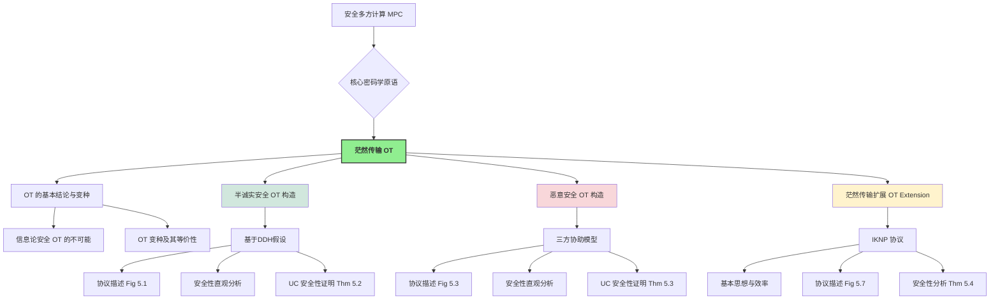

## 5.1 关于 OT 的一些结论 (Some Facts about OT)

!!! definition "1-out-of-2 茫然传输 (OT) 回顾"
    一个 1-out-of-2 OT 协议涉及两方：
    *   **发送者 (Sender, $P_S$)**: 输入两条消息 $(x_0, x_1)$。
    *   **接收者 (Receiver, $P_R$)**: 输入一个选择比特 $b \in \{0, 1\}$。

    协议目标：
    1.  $P_R$ 获得消息 $x_b$。
    2.  $P_S$ 对 $P_R$ 的选择比特 $b$ 一无所知 (发送者隐私)。
    3.  $P_R$ 对另一条消息 $x_{1-b}$ 一无所知 (接收者隐私)。

### 5.1.1 不存在信息论安全的两方 OT 协议 (No Information-Theoretic Secure Two-Party OT)

!!! theorem "定理 5.1: 两方信息论安全 OT 的不可能"
    不存在仅涉及两方（发送者和接收者）且能提供信息论安全（即抵抗计算能力无限的敌手）的茫然传输协议。

这意味着，任何两方 OT 协议的安全性**至少有一方必须依赖于计算困难性假设**。

???+ success "证明思路概要 (Page 49-50)"
    证明过程分为两个主要步骤，层层递进，最终得出结论。

    1.  **步骤一: 从 OT 构造安全与门 (OT $\Rightarrow$ AND)**
        *   **目标**: 证明如果存在一个两方 OT 协议，那么就可以利用它来构造一个安全的两方与门 (AND) 协议。
        *   **AND 协议定义**: 参与方 $P_A$（输入比特 $a$）和 $P_B$（输入比特 $b$）共同计算 $a \land b$，双方都不应得知对方输入的额外信息。
        *   **构造**:
            *   $P_A$ 扮演 OT 发送者 $P_S$，其 OT 输入为 $(x_0=0, x_1=a)$。
            *   $P_B$ 扮演 OT 接收者 $P_R$，其 OT 输入选择比特为 $b$。
        *   **结果**: $P_B$ (即 $P_R$) 得到的 OT 输出 $x_b$ 恰好是 $a \land b$。
            因为 $x_b = (1 \oplus b)x_0 \oplus (b x_1) = (1 \oplus b) \cdot 0 \oplus (b \cdot a) = ab$。
        *   **隐私性分析**:
            *   **$P_A$ (发送方) 的隐私**: OT 的接收者隐私性保证 $P_A$ 不知道 $P_B$ 的选择比特 $b$。
            *   **$P_B$ (接收者) 的隐私**: OT 的发送者隐私性保证 $P_B$ 无法获得关于 $x_{1-b}$ 的信息。
                *   若 $b=0$, $P_B$ 得到 $x_0=0$，无法获得 $x_1=a$。
                *   若 $b=1$, $P_B$ 得到 $x_1=a$ (这是 $ab$ 的一部分)，无法获得 $x_0=0$。
        因此，这是一个安全的两方 AND 协议。

    2.  **步骤二: 不存在信息论安全的两方 AND 协议 (引理 1)**
        *   **假设**: 存在一个两方 AND 协议 $\Pi_{\text{2AND}}$，它满足完美隐私性和完美正确性（信息论安全）。参与方为 $P_0$ (输入 $b_0$) 和 $P_1$ (输入 $b_1$)，共同输出 $y = b_0 \land b_1$。
        *   **记号**: $T(c,d)$ 表示当输入为 $(b_0=c, b_1=d)$ 时，$\Pi_{\text{2AND}}$ 执行过程中所有可能产生的**通信记录 (transcript)** 的集合。
        *   **核心论证 (通过一系列断言导出矛盾)**:
            *   **断言 1: $T(0,0) = T(0,1)$**。
                *   *理由*: 否则，若存在 $T' \in T(0,0)$ 但 $T' \notin T(0,1)$，则当 $P_0$ 被攻陷且观察到 $T'$ 时，它可以推断出 $b_1=0$，这违反了 $P_0$ 对 $P_1$ 输入的隐私性。
            *   **断言 2: $T(0,0) = T(1,0)$**。
                *   *理由*: 同上，考虑 $P_1$ 被攻陷的情况。
            *   **断言 3: $T(0,1) \cap T(1,0) \subset T(1,1)$**。
                *   *理由*: 若一个记录 $T^*$ 同时可能由输入 $(0,1)$ 和 $(1,0)$ 产生，则当双方都输入 $1$ 时，由于各方行为仅依赖其输入和看到的对方消息，也必然会产生记录 $T^*$。
            *   **推导矛盾**:
                由断言1和2，可得 $T(0,1) \cap T(1,0) = T(0,0)$。
                结合断言3，则有 $T(0,0) \subset T(1,1)$。
                然而，输入 $(0,0)$ 时输出 $y=0$，输入 $(1,1)$ 时输出 $y=1$。由于输出是通信记录的一部分，这意味着一个包含 $y=0$ 的记录集合是另一个包含 $y=1$ 的记录集合的子集，这显然是不可能的。因此产生矛盾。
        *   此证明可以推广到允许有可忽略失败概率的情况。

    **最终结论**: 由于可以从 OT 构造 AND，且不存在信息论安全的两方 AND，因此不存在信息论安全的两方 OT。

!!! warning "关于两方 OT 安全性的重要推论"
    任何仅涉及两方的 OT 协议，其安全性**不能同时对发送方和接收方都达到信息论级别**。至少有一方的安全性必须依赖于计算困难性假设。
    在实践中，常见的安全组合是：
    *   接收者隐私性是信息论安全的，发送者隐私性是计算安全的。
    *   或者，发送者隐私性是信息论安全的，接收者隐私性是计算安全的。

### 5.1.2 OT 变种 (OT Variants)

除了标准的 1-out-of-2 OT，还存在多种有用的 OT 变体：

*   **Rabin OT [9]**:
    *   $P_S$ 输入一个消息 $x$。
    *   $P_R$ 以 $1/2$ 的概率得到 $x$，以 $1/2$ 的概率得到 $\perp$ (空信息)。
    *   $P_S$ 不知道 $P_R$ 的输出。
*   **随机 OT (Random OT, ROT)**:
    *   协议无外部输入。
    *   $P_S$ 输出一对随机选择的消息 $(x_0, x_1)$。
    *   $P_R$ 输出一个随机选择的选择比特 $b$ 和对应的随机消息 $x_b$。
*   **1-out-of-N OT**:
    *   $P_S$ 输入 $N$ 条消息 $(x_0, \dots, x_{N-1})$。
    *   $P_R$ 输入一个选择索引 $b \in \{0, \dots, N-1\}$。
    *   $P_R$ 得到 $x_b$。
*   **k-out-of-N OT**:
    *   $P_S$ 输入 $N$ 条消息。
    *   $P_R$ 输入 $k$ 个不同的选择索引 $\{i_0, \dots, i_{k-1}\}$。
    *   $P_R$ 得到相应的 $k$ 条消息 $(x_{i_0}, \dots, x_{i_{k-1}})$。

!!! success "OT 变种的等价性 (Page 51)"
    一个非常重要的结论是，上述主要的 OT 变种在计算上是**等价的**，即它们可以相互构造。
    *   **标准 1-out-of-2 OT $\Leftrightarrow$ 随机 OT (ROT)**:
        *   **OT $\rightarrow$ ROT**: 参与方在本地随机生成 OT 的输入，然后执行标准 OT。输出即为 ROT 的输出。
        *   **ROT $\rightarrow$ OT (教材中的巧妙构造)**:
            1.  **预备 ROT**: $P_S$ 和 $P_R$ 执行一次 ROT。$P_S$ 获得随机对 $(r_0, r_1)$，$P_R$ 获得随机选择 $c$ 和对应值 $r_c$。
            2.  **接收者编码选择**: 设 $P_R$ 在目标 OT 中的真实选择比特为 $b_{OT}$。 $P_R$ 计算 $d = c \oplus b_{OT}$ 并将其发送给 $P_S$。
            3.  **发送者加密消息**: 设 $P_S$ 在目标 OT 中的真实输入消息对为 $(m_0, m_1)$。 $P_S$ 使用从 $P_R$ 收到的 $d$ 和 ROT 中得到的 $(r_0, r_1)$ 来加密这两条消息：
                计算 $y_0 = m_0 \oplus r_d$ (即 $m_0 \oplus r_{c \oplus b_{OT}}$)
                计算 $y_1 = m_1 \oplus r_{d \oplus 1}$ (即 $m_1 \oplus r_{c \oplus b_{OT} \oplus 1}$)
                $P_S$ 将 $(y_0, y_1)$ 发送给 $P_R$。
            4.  **接收者解密**: $P_R$ 使用其 ROT 输出 $r_c$ 和其 OT 选择比特 $b_{OT}$ 来解密：
                输出 $m'_{b_{OT}} = y_{b_{OT}} \oplus r_c$。
                *   **正确性验证**:
                    *   若 $b_{OT}=0$: $P_R$ 计算 $y_0 \oplus r_c = (m_0 \oplus r_{c \oplus 0}) \oplus r_c = (m_0 \oplus r_c) \oplus r_c = m_0$。
                    *   若 $b_{OT}=1$: $P_R$ 计算 $y_1 \oplus r_c = (m_1 \oplus r_{c \oplus 1 \oplus 1}) \oplus r_c = (m_1 \oplus r_c) \oplus r_c = m_1$。
    *   **Rabin OT $\Leftrightarrow$ 标准 1-out-of-2 OT**: 由 Crépeau [10] 证明。
    *   **1-out-of-2 OT $\Rightarrow$ 1-out-of-N OT 和 k-out-of-N OT**: 由 Naor 和 Pinkas [11] 证明。例如，1-out-of-N OT 可以通过 $\log N$ 次 1-out-of-2 OT (选择地址比特) 或使用更复杂的组合技术来实现。

    这一系列等价性意味着，如果我们能够构造出任何一种基础 OT（例如高效的 1-out-of-2 OT），我们就能构造出其他所有变种。

### 5.1.3 一些其他重要结论 (Other Important Conclusions about OT)

*   !!! important "OT 的完备性 (Completeness of OT)"
    基于 1-out-of-2 OT，可以安全地计算**任何**有限函数。这是由 Kilian [12] 首次证明的，后续有更高效的构造（如 Ishai 等人 [13]）。这使得 OT 成为 MPC 领域的一个基础构建模块 ("Yao's theorem" 的一个推论)。

*   **OT 的对称性 (Symmetry of OT)** [14]:
    如果存在一个 OT 协议，其中 Alice 是发送者，Bob 是接收者，那么也存在一个 OT' 协议，其中 Bob 是发送者，Alice 是接收者。

*   **OT 与公钥加密 (PKE) 的关系** [15]:
    不能以**黑盒 (black-box)** 的方式仅使用标准的公钥加密方案来构造 OT 协议。这表明 OT 在某种程度上是比 PKE 更“强大”或需要不同类型基础的原语。

*   **OT 的构造基础**:
    OT 可以基于多种计算困难性假设来构造，包括：
    *   增强的陷门置换 (Enhanced Trapdoor Permutations, TDP) [16-17]
    *   DDH 假设 (Decisional Diffie-Hellman)
    *   RSA 假设 [16]
    *   基于格 (Lattice-based) 的密码学假设 [18]

## 5.2 基于 DDH 假设的 OT 协议（半诚实安全）(DDH-based OT Protocol - Semi-honest Security)

本节详细介绍一个在半诚实敌手模型下，基于 DDH 假设的 1-out-of-2 OT 协议。

!!! protocol "协议 5.1: 基于 DDH 的半诚实 OT (图 5.1)"
    **公共参数**: 阶为素数 $q$ 的循环群 $\mathbb{G}$，生成元 $g$。
    **$P_S$ (发送者) 输入**: 两条消息 $(x_0, x_1 \in \mathbb{G})$ (或可编码为群元素)。
    **$P_R$ (接收者) 输入**: 一个选择比特 $b \in \{0,1\}$。

    **协议流程**:

    1.  **$P_R$ (接收者) - 密钥生成与选择**:
        *   随机选择一个私钥 $sk \leftarrow_{\$} \mathbb{Z}_q$。
        *   计算其选择的公钥 $pk_b = g^{sk}$。
        *   为未选择的那条消息生成一个“伪”公钥：随机选择 $pk_{1-b} \leftarrow_{\$} \mathbb{G}$。
        *   $P_R$ 将公钥对 $(pk_0, pk_1)$ （按标准顺序，例如 $pk_0$ 在前）发送给 $P_S$。

    2.  **$P_S$ (发送者) - 消息加密**:
        *   当收到 $(pk_0, pk_1)$ 后，随机选择一个临时密钥 $r \leftarrow_{\$} \mathbb{Z}_q$。
        *   计算一个公共的随机化因子 $v = g^r$。
        *   使用收到的公钥和临时密钥 $r$ 分别加密两条消息（类似 ElGamal 加密）：
            *   $c_0 = x_0 \cdot (pk_0)^r$
            *   $c_1 = x_1 \cdot (pk_1)^r$
        *   $P_S$ 将 $(v, c_0, c_1)$ 发送给 $P_R$。

    3.  **$P_R$ (接收者) - 消息解密**:
        *   当收到 $(v, c_0, c_1)$ 后， $P_R$ 使用其选择比特 $b$ 和之前生成的私钥 $sk$ 来解密对应的密文：
            输出 $x'_b = c_b / v^{sk}$。

### 5.2.2 安全性的直观说明 (Intuitive Security Analysis under Semi-Honest Model)

!!! success "正确性 (Correctness)"

    接收者 $P_R$ 计算：

    $$
    \begin{align}
    c_b / v^{sk} &= (x_b \cdot (pk_b)^r) / (g^r)^{sk} \\
    &= (x_b \cdot (g^{sk})^r) / g^{r \cdot sk} \\
    &= (x_b \cdot g^{sk \cdot r}) / g^{r \cdot sk} \\
    &= x_b
    \end{align}
    $$

    协议正确地使得 $P_R$ 获得了 $x_b$。

!!!- info "隐私性 (Privacy)"

    *   **发送者 $P_S$ 的隐私 (对 $b$ 的无知)**:
        $P_S$ 观察到的是 $(pk_0, pk_1)$。其中一个 $pk_b = g^{sk}$ 是通过 $g$ 的幂次生成的（$sk$ 随机），另一个 $pk_{1-b}$ 是直接从群 $\mathbb{G}$ 中随机选取的。由于 $sk$ 是随机的，$g^{sk}$ 本身在群 $\mathbb{G}$ 中也是一个（计算上）随机的元素。因此，$(pk_0, pk_1)$ 这对公钥在 $P_S$ 看来，就像是两个独立的随机群元素。$P_S$ 无法从它们的结构上区分哪一个是 $P_R$ 知道对应私钥的那个。因此，$P_S$ 无法得知 $P_R$ 的选择比特 $b$。

    *   **接收者 $P_R$ 的隐私 (对 $x_{1-b}$ 的无知)**:
        $P_R$ 知道其选择比特 $b$，私钥 $sk$，公钥对 $(pk_0, pk_1)$，以及从 $P_S$ 收到的 $(v, c_0, c_1)$。它能正确解密 $c_b$ 得到 $x_b$。
        现在考虑未被选择的密文 $c_{1-b} = x_{1-b} \cdot (pk_{1-b})^r$。$P_R$ 要想从中恢复出 $x_{1-b}$，就需要计算出 $(pk_{1-b})^r$。
        $P_R$ 知道 $v=g^r$ (来自 $P_S$) 和 $pk_{1-b}$ (是它自己生成的随机群元素，其对应的“私钥” $log_g pk_{1-b}$ 是 $P_R$ 不知道的)。
        从 $g^r$ 和 $pk_{1-b}$ 计算 $(pk_{1-b})^r$ 是一个计算性 Diffie-Hellman (CDH) 问题。
        更进一步，DDH 假设表明，对于 $P_R$ 来说，元组 $(v=g^r, pk_{1-b}, (pk_{1-b})^r)$ 与元组 $(v=g^r, pk_{1-b}, e)$ (其中 $e \leftarrow_{\$} \mathbb{G}$ 是一个随机群元素) 在计算上是不可区分的。
        这意味着，项 $(pk_{1-b})^r$ 在 $P_R$ 看来就像一个随机的群元素（因为它不知道 $r$ 也不能从 $pk_{1-b}$ 中轻易得到其与 $g$ 的关系）。
        因此，$c_{1-b} = x_{1-b} \cdot (pk_{1-b})^r$ 在 $P_R$ 看来与 $x_{1-b} \cdot (\text{随机元素})$ 是不可区分的。由于群的性质，一个元素乘以一个随机元素的结果仍然是一个随机元素（除非 $x_{1-b}$ 是单位元）。所以 $P_R$ 无法从 $c_{1-b}$ 中分离出 $x_{1-b}$ 的任何信息。

### 5.2.3 安全性证明 (UC Security Proof)

!!! theorem "定理 5.2: 基于 DDH 的半诚实 OT 的 UC 安全性"
    假设 DDH 问题在群 $\mathbb{G}$ 上是困难的。图 5.1 中描述的协议 $\Pi_{OT}$ 对于静态半诚实敌手，在 UC 框架下安全地实现了理想功能 $F_{OT}$ (其定义参见图 5.2, Page 54)。

!!! abstract "理想功能 $F_{OT}$ (回顾图 5.2)"
    $F_{OT}$ 扮演一个可信第三方的角色，其行为如下：
    ```mermaid
    sequenceDiagram
        participant UserZ as "环境 Z (代表用户)"
        participant SimS as "模拟器 S"
        participant FOT as "理想功能 F_OT"

        UserZ->>FOT: (Input, sid, P_S, (x0,x1)) (若P_S为发送方)
        FOT->>SimS: (Input, sid, P_S) (通知S: P_S已输入)
        UserZ->>FOT: (Input, sid, P_R, b) (若P_R为接收方)
        FOT->>SimS: (Input, sid, P_R) (通知S: P_R已输入)

        alt "双方输入均已记录"
            SimS->>FOT: (Output, sid, P_R) (S指示F_OT输出给P_R)
            FOT->>UserZ: (Output, sid, x_b) (F_OT将x_b发送给P_R，通过Z)
            FOT->>SimS: (Output, sid, x_b) (如果P_R被S模拟/攻陷，S获得输出)
        end
        Note right of FOT: F_OT内部记录了(x0,x1)和b
    ```
    *   当收到 $P_S$ 的输入 `(Input, sid, (x0,x1))` 时，记录该输入，并向模拟器 $S$ 发送通知 `(Input, sid, P_S)`。
    *   当收到 $P_R$ 的输入 `(Input, sid, b)` 时，记录该输入，并向模拟器 $S$ 发送通知 `(Input, sid, P_R)`。
    *   当收到来自 $S$ 的指令 `(Output, sid, P_R)`，并且 $P_S$ 和 $P_R$ 的输入都已被 $F_{OT}$ 记录时，$F_{OT}$ 将计算得到的 $x_b$：
        *   如果 $P_R$ 是诚实的 (由环境 $\mathcal{Z}$ 控制)，则将 $x_b$ 通过 $\mathcal{Z}$ 发送给 $P_R$。
        *   如果 $P_R$ 是被攻陷的 (由 $S$ 控制)，则将 $x_b$ 发送给 $S$。

**证明概要**:
根据 UC 框架的平凡敌手完备性定理 (Thm 4.1)，我们只需为平凡敌手 $\mathcal{A}_{\text{triv}}$ (它仅在环境 $\mathcal{Z}$ 的指示下转发消息) 构造一个模拟器 $\mathcal{S}$。 $\mathcal{S}$ 在其内部运行 $\mathcal{A}_{\text{triv}}$ 的代码，并模拟与 $\mathcal{F}_{OT}$ 的交互，使得 $\mathcal{Z}$ 无法区分其是在与真实协议 $(\Pi_{OT}, \mathcal{A}_{\text{triv}})$ 交互还是在与理想系统 $(\mathcal{F}_{OT}, \mathcal{S})$ 交互。
我们将分两种情况（发送方被攻陷或接收方被攻陷）来描述 $\mathcal{S}$ 的行为。

*   ???+ case "情况 1: 发送者 $P_S$ 被攻陷 (由 $\mathcal{Z}$ 通过 $\mathcal{A}_{\text{triv}}$ 控制)"

        $\mathcal{S}$ 的行为如下：

        1.  **$P_S$ 输入阶段**: 当环境 $\mathcal{Z}$ 通过 $\mathcal{A}_{\text{triv}}$ 向被攻陷的 $P_S$ 提供输入 `(Input, sid, (x0, x1))` 时，$\mathcal{S}$ 截获此输入，并将其同样转发给理想功能 $\mathcal{F}_{OT}$。$\mathcal{S}$ 模拟 $P_S$ 等待来自 $P_R$ 的消息。
        2.  **模拟 $P_R$ 的消息**: 在理想世界中，当诚实的 $P_R$ (由 $\mathcal{Z}$ 控制) 提供了它的输入 $b$ 给 $\mathcal{F}_{OT}$ 后，$\mathcal{F}_{OT}$ 会通知 $\mathcal{S}$ `(Input, sid, P_R)`。此时，$\mathcal{S}$ 仍然不知道 $P_R$ 的真实选择 $b$。然而，$\mathcal{S}$ 需要模拟 $P_R$ 在真实协议中发送给 $P_S$ 的消息 $(pk_0, pk_1)$。
            $\mathcal{S}$ 随机选择两个独立的群元素 $pk'_0 \leftarrow_{\$} \mathbb{G}$ 和 $pk'_1 \leftarrow_{\$} \mathbb{G}$。
            $\mathcal{S}$ 将这对 $(pk'_0, pk'_1)$ 作为模拟的 $P_R$ 消息发送给其内部运行的 $\mathcal{A}_{\text{triv}}$ (即被攻陷的 $P_S$)。
        3.  **$P_S$ 的后续行为**: 被攻陷的 $P_S$ (由 $\mathcal{A}_{\text{triv}}$ 模拟) 会根据收到的 $(pk'_0, pk'_1)$ 和其输入 $(x_0, x_1)$ 计算出 $(v', c'_0, c'_1)$ 并试图发送。$\mathcal{S}$ 截获此消息，并不做任何处理（因为在理想世界中，$P_R$ 的输出由 $\mathcal{F}_{OT}$ 直接提供，与此消息无关）。
        4.  **$P_R$ 的输出**: $P_R$ 是诚实方，它将直接从 $\mathcal{F}_{OT}$ 获得其输出 $x_b$ (当环境 $\mathcal{Z}$ 指示 $\mathcal{F}_{OT}$ 输出给 $P_R$ 时，或通过 $S$ 的 `(Output, sid, P_R)` 指令触发)。$\mathcal{S}$ 在此无需介入。

    *   **不可区分性分析 (当 $P_S$ 被攻陷)**:
        *   **真实世界中 $P_S$ 的视图**: 包含其输入 $(x_0, x_1)$，以及从 $P_R$ 收到的 $(pk_0, pk_1)$。其中 $pk_b = g^{sk}$ ($sk$ 随机) 而 $pk_{1-b}$ 是随机群元素。
        *   **理想世界中被攻陷 $P_S$ (由 $\mathcal{A}_{\text{triv}}$ 扮演) 的视图**: 包含其输入 $(x_0, x_1)$，以及从 $\mathcal{S}$ (模拟 $P_R$) 收到的 $(pk'_0, pk'_1)$，其中 $pk'_0, pk'_1$ 都是随机群元素。
        由于 $g^{sk}$ (当 $sk$ 随机时) 在计算上与一个直接从 $\mathbb{G}$ 中随机选择的元素是不可区分的（这是 DDH 假设的一个弱形式，或者说基于群的随机自可约性），因此，真实世界中 $(pk_0, pk_1)$ 的分布与理想世界中 $(pk'_0, pk'_1)$ 的分布是计算上不可区分的。
        因此，环境 $\mathcal{Z}$ 无法区分它是在与真实协议交互还是在与理想系统交互。

*   ???+ case "情况 2: 接收者 $P_R$ 被攻陷 (由 $\mathcal{Z}$ 通过 $\mathcal{A}_{\text{triv}}$ 控制)"

        $\mathcal{S}$ 的行为如下：

        1.  **$P_R$ 输入与密钥生成阶段**: 当环境 $\mathcal{Z}$ 通过 $\mathcal{A}_{\text{triv}}$ 向被攻陷的 $P_R$ 提供输入 `(Input, sid, b)` 时，$\mathcal{S}$ 截获此输入 $b$，并将其同样转发给理想功能 $\mathcal{F}_{OT}$。
            $\mathcal{S}$ 模拟被攻陷的 $P_R$ (由 $\mathcal{A}_{\text{triv}}$ 控制) 执行协议的第1步：选择 $sk \leftarrow_{\$} \mathbb{Z}_q$，计算 $pk_b = g^{sk}$，选择 $pk_{1-b} \leftarrow_{\$} \mathbb{G}$，并“发送” $(pk_0, pk_1)$。$\mathcal{S}$ 记录下这些值，特别是 $sk$ 和 $pk_b$。
        2.  **模拟 $P_S$ 的消息**: 在理想世界中，当诚实的 $P_S$ (由 $\mathcal{Z}$ 控制) 提供了它的输入 $(x_0, x_1)$ 给 $\mathcal{F}_{OT}$ 后，$\mathcal{F}_{OT}$ 会通知 $\mathcal{S}$ `(Input, sid, P_S)`。此时，$\mathcal{S}$ 仍然不知道 $P_S$ 的真实输入 $(x_0, x_1)$。然而，$\mathcal{S}$ 需要模拟 $P_S$ 在真实协议中发送给 $P_R$ 的消息 $(v, c_0, c_1)$。
            *   **获取 $P_R$ 应得的输出**: $\mathcal{S}$ 首先需要知道被攻陷的 $P_R$ 应该得到什么输出。它向 $\mathcal{F}_{OT}$ 发送指令 `(Output, sid, P_R)`。由于 $P_R$ 被攻陷，$\mathcal{F}_{OT}$ 会将计算出的 $x_b$ (基于 $P_R$ 的输入 $b$ 和 $P_S$ 的真实输入 $x_0, x_1$) 发送给 $\mathcal{S}$。令 $\mathcal{S}$ 收到的这个值为 $x^*_b$。
            *   **构造模拟消息**: $\mathcal{S}$ 构造 $(v', c'_0, c'_1)$ 如下：
                *   $v' \leftarrow_{\$} \mathbb{G}$ (选择一个随机的群元素作为 $v$)。
                *   $c'_b = x^*_b \cdot (pk_b)^{\log_g v'}$ (即 $x^*_b \cdot (v')^{sk}$)。这里 $pk_b$ 和 $sk$ 是 $\mathcal{S}$ 在步骤1中代表 $P_R$ 生成并记录的。
                *   $c'_{1-b} \leftarrow_{\$} \mathbb{G}$ (为未选择的消息生成一个随机的密文部分)。
            $\mathcal{S}$ 将 $(v', c'_0, c'_1)$ 作为模拟的 $P_S$ 消息发送给其内部运行的 $\mathcal{A}_{\text{triv}}$ (即被攻陷的 $P_R$)。
        3.  **$P_R$ 的后续行为**: 被攻陷的 $P_R$ (由 $\mathcal{A}_{\text{triv}}$ 模拟) 会根据收到的 $(v', c'_0, c'_1)$ 和它自己生成的 $sk$ 计算 $c'_b / (v')^{sk}$ 得到 $x^*_b$，并将其作为输出（通过 $\mathcal{A}_{\text{triv}}$ 传递给 $\mathcal{Z}$）。

    *   **不可区分性分析 (当 $P_R$ 被攻陷)**:

        *   **真实世界中 $P_R$ 的视图**: 包含其输入 $b$ 和随机性 $sk$，它生成的 $(pk_0, pk_1)$，以及从 $P_S$ 收到的 $(v=g^r, c_0=x_0 (pk_0)^r, c_1=x_1 (pk_1)^r)$。
        *   **理想世界中被攻陷 $P_R$ (由 $\mathcal{A}_{\text{triv}}$ 扮演) 的视图**: 包含其输入 $b$ 和随机性 $sk$，它生成的 $(pk_0, pk_1)$，以及从 $\mathcal{S}$ (模拟 $P_S$) 收到的 $(v' \text{ (随机)}, c'_b=x^*_b (v')^{sk}, c'_{1-b} \text{ (随机)})$。

        我们需要比较 $(v, c_b, c_{1-b})$ 和 $(v', c'_b, c'_{1-b})$ 的分布。

        *   $v=g^r$ (其中 $r$ 随机) 和 $v'$ (直接随机选取) 都是群中的随机元素，它们的分布是相同的。
        *   $c_b = x_b \cdot (pk_b)^r = x_b \cdot (g^{sk})^r = x_b \cdot v^{sk}$。
            $c'_b = x^*_b \cdot (pk_b)^{\log_g v'} = x^*_b \cdot (v')^{sk}$。
            由于 $x^*_b$ 是 $\mathcal{F}_{OT}$ 计算的真实 $x_b$，且 $v$ 与 $v'$ 同分布，因此 $c_b$ 与 $c'_b$ 的分布是相同的（在给定 $P_R$ 的输入 $b$ 和随机性 $sk$ 的条件下）。
        *   $c_{1-b} = x_{1-b} \cdot (pk_{1-b})^r$。
            $c'_{1-b}$ 是直接从 $\mathbb{G}$ 中随机选取的元素。
            根据 DDH 假设，对于 $P_R$（它不知道 $r$，并且 $pk_{1-b}$ 是它随机选择的，与 $g^r$ 无特定关系），项 $(pk_{1-b})^r$ 在计算上与一个随机群元素不可区分。
            因此，$x_{1-b} \cdot (pk_{1-b})^r$ 在计算上与 $x_{1-b} \cdot (\text{随机元素})$ 不可区分。而一个非单位元素乘以一个随机群元素的结果仍然是一个随机群元素。
            所以，$c_{1-b}$ 的分布与随机群元素 $c'_{1-b}$ 的分布是计算上不可区分的。

        综上所述，被攻陷的 $P_R$ 在真实世界和理想世界中看到的视图是计算上不可区分的。
        由于在这两种攻陷情况下，环境 $\mathcal{Z}$ 都无法区分，因此协议 $\Pi_{OT}$ 在 DDH 假设下对于静态半诚实敌手 UC-安全地实现了 $F_{OT}$。

!!! question "思考题回顾 (Page 55)"
    **问题**: 此处基于类 ElGamal 加密构造了 OT，而之前提到不能以黑盒方式基于 PKE 构造 OT，这是否矛盾？
    **答案**: 不矛盾。这里的构造巧妙地利用了接收方 $P_R$ 能够“选择”一个公钥 $pk_b$ (为其知道私钥) 和另一个公钥 $pk_{1-b}$ (为其不知道私钥，且看起来是随机的) 的能力。标准 PKE 的定义通常不包含这种“选择性生成/伪造公钥”的场景。ElGamal 的代数结构（基于离散对数）使得这种区分性的公钥对的生成变得自然。协议的安全性依赖于发送方 $P_S$ 无法从 $(pk_0, pk_1)$ 中判断哪一个是“真”公钥。这不是对 PKE 的标准黑盒使用。


# 第6章 基于线性秘密分享的协议 (Protocols based on Linear Secret Sharing)

从本章开始，我们将深入探讨几类经典的 MPC 协议。我们将从**半诚实安全 (Semi-Honest Secure)** 的协议入手，这是理解更复杂恶意安全协议的基础。本章的核心是介绍基于**线性秘密分享方案 (Linear Secret Sharing Scheme, LSSS)** 的 MPC 协议。LSSS 的一个关键特性是，秘密的份额可以进行线性组合，从而直接得到原秘密线性组合的份额。

本章主要介绍两类基于 LSSS 的里程碑式协议：

1.  **BGW 协议 (Ben-Or, Goldwasser, Wigderson)**: 该协议主要构建于 **Shamir 秘密分享** 之上，能够为算术电路提供信息论安全（在半诚实模型和特定门限下）。我们将回顾其构造，并为其提供在通用可组合 (UC) 框架下的形式化安全性证明。
2.  **GMW 协议 (Goldreich, Micali, Wigderson)**: 该协议则通常基于更简单的**加法秘密分享** (例如，基于异或的分享来处理布尔电路，或基于模加法来处理算术电路)。其安全性通常是计算安全的，依赖于诸如茫然传输 (OT) 等密码学原语。我们将探讨其在布尔电路和算术电路上的不同版本。

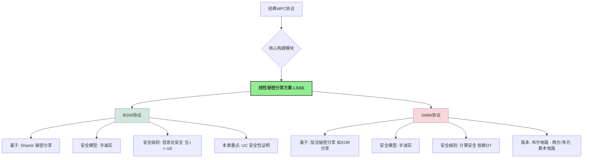

## 6.1 BGW 协议（半诚实安全）(BGW Protocol - Semi-Honest Security)

BGW 协议 [30] 是最早实现对任意函数进行安全多方计算的协议之一，它为后续的 MPC 研究奠定了坚实的基础。

### 6.1.1 协议描述 (Protocol Description - Fig 6.2 / Fig 3.1)

!!! abstract "BGW 协议核心流程 (基于 Shamir $(t,n)$-秘密分享, $t < n/2$)"
    该协议的详细步骤与第3章介绍的“半诚实安全的电路计算协议”完全一致。这里进行概要回顾，并强调其基于 Shamir 分享的特性。

    **协议阶段**:

    1.  **输入分享 (Input Sharing Phase)**:
        *   对于每个参与方 $P_i$ 的私密输入 $x_{i,k} \in \mathbb{F}$ (有限域元素)，$P_i$ 选择一个随机的、阶数最高为 $t$ 的多项式 $q_{i,k}(z)$，使得 $q_{i,k}(0) = x_{i,k}$。
        *   $P_i$ 计算份额 $s_{i,k}^{(j)} = q_{i,k}(\alpha_j)$ (其中 $\alpha_j$ 是公开的、赋予 $P_j$ 的非零域元素)，并将 $s_{i,k}^{(j)}$ 安全地发送给 $P_j$。
        *   最终，对于电路的每个输入导线 $w$ (其值为 $v_w$)，每个参与方 $P_j$ 持有其 Shamir 份额 $[v_w]_j$ (即 $q_w(\alpha_j)$)。

    2.  **计算阶段 (Computation Phase)**:
        参与方按照电路的拓扑顺序，逐个门进行计算。设一个门 $g$ 的输入导线为 $w_a, w_b$，其上的秘密值分别为 $v_a, v_b$，输出导线为 $w_c$，其值为 $v_c$。参与方 $P_j$ 持有份额 $[v_a]_j$ 和 $[v_b]_j$。
        *   **加法门 ($v_c = v_a + v_b$)**:
            每个 $P_j$ 在本地计算其输出份额 $[v_c]_j = [v_a]_j + [v_b]_j$。
            由于 Shamir 分享的线性性，$q_c(z) = q_a(z) + q_b(z)$ 仍是 $t$ 阶多项式，且 $q_c(0) = q_a(0) + q_b(0) = v_a + v_b = v_c$。
        *   **常数乘法门 ($v_c = k \cdot v_a$)**:
            每个 $P_j$ 在本地计算其输出份额 $[v_c]_j = k \cdot [v_a]_j$ (其中 $k$ 是公开常数)。
            $q_c(z) = k \cdot q_a(z)$ 仍是 $t$ 阶多项式，且 $q_c(0) = k \cdot v_a = v_c$。
        *   **乘法门 ($v_c = v_a \cdot v_b$)**:
            1.  **本地份额乘积**: 每个 $P_j$ 计算 $h_j = [v_a]_j \cdot [v_b]_j = q_a(\alpha_j) \cdot q_b(\alpha_j)$。
                这些 $h_j$ 是一个新的多项式 $h(z) = q_a(z) \cdot q_b(z)$ 在点 $\alpha_j$ 上的取值。$h(z)$ 的阶数最高为 $2t$，且 $h(0) = q_a(0)q_b(0) = v_a v_b = v_c$。
            2.  **度降低 / 重新随机化和分享 (Degree Reduction / Re-randomization and Re-sharing)**:
                由于 $h(z)$ 的阶数为 $2t$，而我们希望后续计算仍基于 $t$ 阶多项式的分享。因为 $t < n/2 \Rightarrow 2t < n$, 所以 $2t+1 \le n$。这意味着 $2t+1$ 个点足以唯一确定 $h(z)$。
                *   每个参与方 $P_j$ 将其计算得到的 $h_j = h(\alpha_j)$ 视为一个新的秘密。$P_j$ 对 $h_j$ 进行一次新的、独立的 Shamir $(t,n)$-分享：选择随机 $t$ 阶多项式 $q'_j(z)$ 使得 $q'_j(0) = h_j$，然后将份额 $q'_j(\alpha_k)$ 发送给 $P_k$。
                *   现在，对于秘密 $v_c = h(0)$，我们知道 $v_c = \sum_{j \in S_{recon}} \lambda_j h(\alpha_j)$，其中 $S_{recon}$ 是一个大小为 $2t+1$ 的公开索引集合，$\lambda_j$ 是对应的拉格朗日重构系数。
                *   每个参与方 $P_k$ 计算其关于 $v_c$ 的新的 $t$-阶份额：
                    $$ [v_c]_k = \sum_{j \in S_{recon}} \lambda_j \cdot q'_j(\alpha_k) $$
                    令新的分享多项式为 $q_c(z) = \sum_{j \in S_{recon}} \lambda_j q'_j(z)$。
                    则 $q_c(0) = \sum \lambda_j q'_j(0) = \sum \lambda_j h(\alpha_j) = h(0) = v_c$。
                    且 $q_c(z)$ 的阶数是 $t$（因为每个 $q'_j(z)$ 的阶数是 $t$，$\lambda_j$ 是常数）。
                    因此，$[v_c]_k = q_c(\alpha_k)$。

    3.  **输出重构阶段 (Output Reconstruction Phase)**:
        *   对于需要公开的输出值 $v_{out}$ (其当前分享为 $[v_{out}]$，基于 $t$ 阶多项式 $q_{out}(z)$)，指定的接收方（或所有参与方）收集至少 $t+1$ 个份额。
        *   使用这些份额通过拉格朗日插值计算 $v_{out} = q_{out}(0)$。

### 6.1.2 安全性证明 (Security Proof)

在第3章中，我们对 BGW 协议的安全性进行了较为直观的分析。本节将给出其在 UC 框架下，针对静态半诚实敌手的形式化安全性证明。

!!! theorem "定理 6.1: BGW 协议的半诚实 UC 安全性"
    假设被攻陷的参与方数量不超过 $t$，且 $t < n/2$。BGW 协议 $\Pi_{\text{BGW}}$ (如图 6.2 或 3.1 所述) 对于静态半诚实敌手，在通用可组合 (UC) 框架下，**信息论安全地** (statistically or perfectly securely) 实现了安全函数计算的理想功能 $\mathcal{F}_{\text{sfe}}$ (如图 6.1，即标准的安全函数计算理想功能)。

**证明**:
依据 UC 框架的平凡敌手完备性定理 (Thm 4.1)，我们仅需为平凡敌手 $\mathcal{A}_{\text{triv}}$ 构造一个模拟器 $\mathcal{S}$，使得对于任何环境 $\mathcal{Z}$，真实世界执行 $\text{EXEC}_{\Pi_{\text{BGW}}, \mathcal{A}_{\text{triv}}, \mathcal{Z}}$ 的视图与理想世界执行 $\text{EXEC}_{\mathcal{F}_{\text{sfe}}, \mathcal{S}, \mathcal{Z}}$ 的视图是不可区分的（对于 BGW 协议，实际上可以达到完美或统计不可区分）。

!!! tip "理想功能 $\mathcal{F}_{\text{sfe}}$ (图 6.1 - 回顾)"
    *   当收到 $P_i$ 的输入 `(Input, sid, x_i)` 时，记录 $x_i$，并通知 $\mathcal{S}$ `(Input, sid, P_i)`。
    *   当收到 $\mathcal{S}$ 的指令 `(Output, sid, P_i)`，且所有必需输入已到时，将计算出的 $y_i=f(\vec{x})_i$ 发送给 $P_i$ (若 $P_i$ 诚实，则通过 $\mathcal{Z}$；若 $P_i$ 被攻陷，则给 $\mathcal{S}$)。

**模拟器 $\mathcal{S}$ 的构造**:
设 $C$ 为被攻陷的参与方集合 ($|C| \le t$)。 $\mathcal{S}$ 在内部运行 $\mathcal{A}_{\text{triv}}$，并模拟其与环境 $\mathcal{Z}$ 和协议其余部分的交互。

1.  **处理来自 $\mathcal{F}_{\text{sfe}}$ 的 `(Input, sid, P_i)` 通知**:
    *   **若 $P_i \in C$ (被攻陷方)**: 环境 $\mathcal{Z}$ 已经通过 $\mathcal{A}_{\text{triv}}$ 向 $P_i$ 提供了其真实输入 $x_i$。 $\mathcal{S}$ 知道了 $x_i$。$\mathcal{S}$ 指示其内部的 $\mathcal{A}_{\text{triv}}$ (模拟 $P_i$) 完全按照协议规定，对 $x_i$ 进行 Shamir 分享，并将相应的份额“发送”给 $C$ 中的其他成员（即 $\mathcal{A}_{\text{triv}}$ 的其他部分）。对于要发往诚实方 $P_j \notin C$ 的份额，$\mathcal{S}$ 仅作记录，不实际发送。
    *   **若 $P_i \notin C$ (诚实方)**: $\mathcal{S}$ 并不知道 $P_i$ 的真实输入 $x_i$。$\mathcal{S}$ 设定 $P_i$ 的输入为一个**固定的默认值**（例如，全零向量或0）。然后，$\mathcal{S}$ 模拟 $P_i$ 对这个默认值进行 Shamir 分享，并将产生的份额发送给 $C$ 中的每个成员 $P_k \in C$ (即提供给 $\mathcal{A}_{\text{triv}}$)。

2.  **模拟计算阶段的交互 (主要是乘法门的度降低)**:
    *   **线性门**: 所有计算都是本地的。被攻陷方 $P_i \in C$ 会根据其持有的（可能是混合了真实输入份额和模拟的基于默认值的份额）份额进行计算。$\mathcal{S}$ 遵循此过程。
    *   **乘法门的度降低步骤 (当需要诚实方 $P_j \notin C$ 发起重分享时)**:
        当一个诚实方 $P_j$ 需要对其本地计算的 $2t$ 阶份额 $h_j = q_a(\alpha_j)q_b(\alpha_j)$ 进行 $t$ 阶重分享时，$\mathcal{S}$ 模拟 $P_j$ 的行为如下：$\mathcal{S}$ 选择一个随机的 $t$ 阶多项式 $q'_j(z)$ 使得 $q'_j(0)=0$ (因为 $P_j$ 的“真实”输入被模拟为0，从而其贡献给 $h_j$ 的部分也是基于0的，除非 $h_j$ 的值完全由被攻陷方的份额决定)。然后 $\mathcal{S}$ 将 $q'_j(\alpha_k)$ 作为模拟份额发送给 $C$ 中的每个成员 $P_k \in C$。
        被攻陷方 $P_i \in C$ 接收到所有这些（真实的或模拟的）重分享份额后，会计算其新的 $t$ 阶份额。

3.  **处理来自 $\mathcal{F}_{\text{sfe}}$ 的 `(Output, sid, P_i)` 指令 (当 $P_i \in C$ 是输出接收方)**:
    *   $\mathcal{F}_{\text{sfe}}$ 将真实的输出值 $y_i$ (基于所有参与方的真实输入计算得到的) 发送给 $\mathcal{S}$ (因为 $P_i$ 被攻陷)。
    *   $\mathcal{S}$ 现在需要模拟诚实方 $P_j \notin C$ 在输出重构阶段发送给被攻陷方 $P_i$ 的份额 $q_{y_i}(\alpha_j)$。
    *   $\mathcal{S}$ 知道 $C$ 中所有成员已经持有的关于 $y_i$ 的 $t$ 阶多项式 $q_{y_i}(z)$ 的 $|C|$ 个（模拟的）份额。它还知道 $q_{y_i}(0) = y_i$。
    *   由于 $|C| \le t$，这 $|C|+1$ 个条件（$|C|$ 个份额值和 $q_{y_i}(0)=y_i$）足以唯一确定 $q_{y_i}(z)$ (如果 $|C|=t$)，或者可以找到一个与这些条件一致且系数随机选择的 $q_{y_i}(z)$ (如果 $|C|<t$，因为此时有 $t-|C|$ 个自由度来选择剩余的随机系数)。
    *   $\mathcal{S}$ 构造出这样的 $q_{y_i}(z)$，然后计算 $q_{y_i}(\alpha_j)$ 对于所有 $P_j \notin C$，并将这些模拟的份额提供给 $\mathcal{A}_{\text{triv}}$ (模拟它们是从诚实方 $P_j$ 发送给被攻陷方 $P_i$ 的)。

**不可区分性分析 (完美或统计不可区分)**:
我们需要证明环境 $\mathcal{Z}$ 无法区分它所观察到的被攻陷方 $C$ 的视图。
*   **输入分享阶段**: 来自诚实方 $P_j \notin C$ 的份额，在真实世界中是基于其真实输入 $x_j$ 的 $t$-Shamir份额；在理想世界中，是 $\mathcal{S}$ 模拟的基于默认值（如0）的 $t$-Shamir份额。由于 $|C| \le t$，根据 Shamir 分享的 $t$-隐私性，这两组 $t$ 个份额对于 $C$ 来说都表现为均匀随机的、与原始秘密（$x_j$ 或 0）无关的值（除非秘密本身就是0）。因此， $C$ 的视图在这部分是不可区分的。
*   **计算阶段 (乘法门度降低)**: 当诚实方 $P_j \notin C$ 重分享其 $2t$ 阶份额 $h_j$ 时，它进行的是一次新的 $t$-Shamir 分享。同样，由于 $t$-隐私性， $C$ 收到的份额是均匀随机的，与 $h_j$ 的真实值（或 $\mathcal{S}$ 模拟的0值）无关。
*   **输出重构阶段**:
    *   **引理 6.1 (Page 68, 与引理1, Page 68 类似，但针对 BGW)**:
        令 $\text{Strip}(\text{view}_C)$ 为 $C$ 的视图中移除了输出重构阶段来自诚实方的份额的部分。对于两个不同的诚实方输入向量 $\vec{x}_{honest}^{(0)}$ 和 $\vec{x}_{honest}^{(1)}$ (假设被攻陷方输入不变)， $\text{Strip}(\text{view}_C(\vec{x}_{honest}^{(0)}))$ 和 $\text{Strip}(\text{view}_C(\vec{x}_{honest}^{(1)}))$ 的分布是完美相同的。这是因为所有来自诚实方的中间计算份额（由于 $t$-隐私性）在 $C$ 看来都是随机的。
    *   **引理 6.2 (Page 70, 与引理2, Page 70 类似)**:
        令 $\text{Dress}_{\vec{y}_C}(\text{StrippedView})$ 是一个过程，它获取剥离后的视图和被攻陷方应得的真实输出 $\vec{y}_C$，并“填充回”输出重构阶段来自诚实方的份额。那么，$\text{Dress}_{\vec{y}_C}(\text{Strip}(\text{view}_C))$ 与原始的 $\text{view}_C$ 具有完美相同的分布。这是因为给定 $y_i = q_{y_i}(0)$ 和 $C$ 已知的 $|C| \le t$ 个份额，其余诚实方的份额是被唯一确定（或一致地随机确定）的。
    *   **结合**:
        理想世界中 $\mathcal{S}$ 产生的视图是 $\text{Dress}_{\vec{y}_C}(\text{Strip}(\text{view}_C(\vec{x}_{honest}=\vec{0})))$ （其中 $\vec{y}_C$ 是基于真实输入的）。
        真实世界 $C$ 的视图是 $\text{view}_C(\vec{x}_{honest}=\text{actual values})$。
        由引理1，$\text{Strip}(\text{view}_C(\vec{x}_{honest}=\vec{0})) \stackrel{\text{perf}}{\equiv} \text{Strip}(\text{view}_C(\vec{x}_{honest}=\text{actual values}))$。
        由引理2，应用 $\text{Dress}_{\vec{y}_C}$ 后，两者仍然完美不可区分。
        因此，真实视图和模拟视图是完美不可区分的。

!!! success "结论"
    BGW 协议在 $t < n/2$ 的条件下，对于静态半诚实敌手，信息论安全地（完美地）在 UC 框架下实现了 $\mathcal{F}_{\text{sfe}}$。

!!! question "关于假设输出门之前都有乘法门 (Page 71)"
    这个假设主要简化了引理 6.2 的证明。如果输出门前是线性门，输出多项式 $q_{y_i}(z)$ 的随机性完全由其输入导线的多项式决定。模拟器在构造 $q_{y_i}(z)$ 时，需要确保其随机性与这些“上游”多项式（它们可能是基于真实输入或模拟的0输入）的（模拟的）随机性一致。这使得证明稍微复杂，但协议本身仍然是安全的。乘法门后的度降低步骤会引入新的、独立的随机性到输出多项式中，使得模拟更直接。


# 第7章 通过 Beaver 三元组实现 MPC (MPC via Beaver Triples)

在前面的章节中，无论是 BGW 协议、GMW 协议，还是第一章介绍的简单协议，我们都观察到一个共同点：协议中的**线性门**（如加法、常数乘法、异或、非门）通常具有非常低的计算和通信开销，参与方往往只需在本地对其秘密份额执行相应操作即可。相比之下，**非线性门**（如乘法门、与门）的开销则要大得多，通常需要参与方之间进行多轮交互，并调用相对复杂的子协议（例如 OT 或 OLE）。

为了显著降低非线性门（尤其是乘法门）的在线计算开销，**Beaver 三元组 (Beaver Triple)** [32] 技术应运而生。这一技术的核心思想是将 MPC 协议划分为两个阶段：

1.  **离线阶段 (Offline Phase) / 预处理阶段 (Preprocessing Phase)**: 在这个阶段，参与方共同生成一些与实际输入无关的**相关随机数 (Correlated Randomness)**，最典型的就是 Beaver 三元组。这个阶段可以提前进行，甚至在实际的私密输入可用之前。
2.  **在线阶段 (Online Phase)**: 当实际的私密输入可用时，参与方利用离线阶段生成的这些相关随机数来极大地加速（主要是乘法）运算。

这种设计模式可以将大部分的计算和通信密集型工作转移到离线阶段，使得在线阶段的效率得到显著提升，这对于需要快速响应的 MPC 应用尤为重要。

本章将采用模块化的方法进行介绍：
1.  首先，我们将 Beaver 三元组的生成过程抽象为一个理想功能 $\mathcal{F}_{\text{Beaver}}$。
2.  然后，在 $\mathcal{F}_{\text{Beaver}}$-混合模型 (即假设可以直接从 $\mathcal{F}_{\text{Beaver}}$ 获取三元组) 下，构造一个高效的 MPC 协议，并证明其安全性。
3.  最后，我们将讨论如何实际生成 Beaver 三元组，即如何实现 $\mathcal{F}_{\text{Beaver}}$。

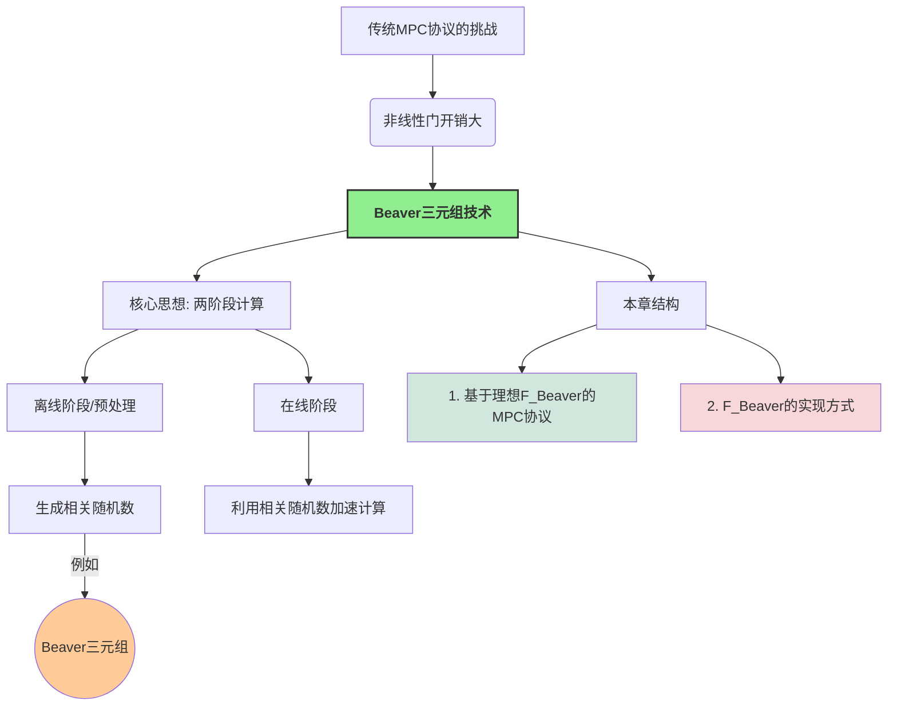

## 7.1 基于 Beaver 三元组的 MPC 协议 (MPC Protocol based on Beaver Triples)

我们将主要关注基于**加法秘密分享 (Additive Secret Sharing)** 的 MPC 协议，其中秘密份额可以直接相加来得到秘密的和。

### 7.1.1 Beaver 三元组 (Beaver Triple)

!!! abstract "Beaver 三元组定义"
    一个 Beaver 三元组（针对某个有限域 $\mathbb{F}$）是指一组秘密分享值 $([a], [b], [c])$，其中 $a, b \in \mathbb{F}$ 是均匀随机选择的元素，而 $c = ab \in \mathbb{F}$。
    这里的 $[x]$ 表示秘密 $x$ 的加法秘密份额的集合，即 $[x] = (x_1, \dots, x_n)$，其中 $x = x_1 + \dots + x_n \pmod p$ (如果 $\mathbb{F}=\mathbb{Z}_p$)。每个参与方 $P_i$ 持有份额 $x_i$。

**符号约定**: (为了简化，这里采用与教材一致的加法分享表示)
*   $[x]$: 秘密 $x \in \mathbb{F}$ 的秘密份额集 $(x_1, \dots, x_n)$，满足 $x = \sum x_i$。
*   **本地加法**: $[x] + [y] = (x_1+y_1, \dots, x_n+y_n) = [x+y]$。
*   **本地常数乘法**: $k \cdot [x] = (k x_1, \dots, k x_n) = [k x]$ (这里需要每个 $P_i$ 知道 $k$，或者 $k$ 是一个公开常数)。
*   **本地常数加法**: $[x] + k = (x_1+k, x_2, \dots, x_n) = [x+k]$ (这里约定常数仅加到 $P_1$ 的份额上，其他参与方份额不变，或者通过某种预定方式分配常数)。教材中 $P_1$ 的份额是 $x_1+c$，其他 $P_i$ 的份额是 $x_i$。

**利用 Beaver 三元组计算乘法**: (Page 80)
假设我们想要计算两个秘密分享值 $[x]$ 和 $[y]$ 的乘积 $[xy]$。参与方已经共同持有一个 Beaver 三元组 $([a], [b], [c])$，其中 $c=ab$。

1.  **盲化 (Blinding) / 计算差值**:
    *   所有参与方在本地计算 $[x]-[a] = [x-a]$。
    *   所有参与方在本地计算 $[y]-[b] = [y-b]$。
2.  **公开差值 (Reveal Differences)**:
    *   参与方共同重构 (reconstruct / open) 秘密 $d = x-a$。
    *   参与方共同重构秘密 $e = y-b$。
    现在，$d$ 和 $e$ 成为公开值。
    !!! warning "隐私性分析"
        由于 $a$ 和 $b$ 是均匀随机的，即使公开了 $d=x-a$ 和 $e=y-b$，也不会泄露关于 $x$ 和 $y$ 的任何信息（因为 $a,b$ 完美地掩盖了 $x,y$）。

3.  **本地计算最终份额 (Local Computation of Final Shares)**:
    我们知道 $x = d+a$ 且 $y = e+b$。
    所以 $xy = (d+a)(e+b) = de + db + ea + ab$。
    将其秘密分享形式化：
    $[xy] = [de + db + ea + ab]$
    由于 $d$ 和 $e$ 是公开值，而 $a, b, c=ab$ 是已经分享的：
    *   $[de]$: $P_1$ 的份额是 $de$，其他 $P_i$ 份额是 $0$ (或任何使和为 $de$ 的分配方式)。
    *   $[db]$: 等于 $d \cdot [b]$ (本地常数乘法)。
    *   $[ea]$: 等于 $e \cdot [a]$ (本地常数乘法)。
    *   $[ab]$: 就是三元组中的 $[c]$。
    因此，每个参与方 $P_i$ 可以本地计算其持有的关于 $xy$ 的份额：
    $(xy)_i = de_i + d \cdot b_i + e \cdot a_i + c_i$
    (这里 $de_i$ 是 $de$ 的第 $i$ 个份额，例如 $de_1=de$, $de_j=0$ for $j \ne 1$)。
    从而，各方共同持有了 $[xy]$。

!!! success "效率对比"
    *   **GMW 乘法 (基于 OT)**: 需要 $O(n^2)$ 次 OT 调用。
    *   **Beaver 三元组乘法 (在线阶段)**: 仅需要两次秘密重构（公开 $d, e$），通信量为 $O(n)$（每个参与方广播其份额给一个指定的重构者，或广播给所有人）。本地计算也非常高效。
    主要的开销被转移到了离线阶段生成 Beaver 三元组。

### 7.1.2 协议描述 (Protocol Description - Fig 7.1)

基于 Beaver 三元组的 MPC 协议，其线性门（加法、常数乘法）的处理方式与第 6.2.3 节中算术电路 GMW 协议的本地份额运算相同。输出重构也类似。核心区别在于乘法门的处理。

**协议 $\Pi_{\text{Beaver}}$ (在 $\mathcal{F}_{\text{Beaver}}$-混合模型下)**:

1.  **输入分享**: 与算术 GMW 类似，每个 $P_i$ 将其输入 $x_{i,k}$ 进行加法秘密分享。
2.  **计算阶段**:
    *   **加法门/常数乘法门**: 本地份额运算。
    *   **乘法门 (计算 $[x][y]$)**:
        1.  从理想功能 $\mathcal{F}_{\text{Beaver}}$ 获取一个未使用的 Beaver 三元组 $([a], [b], [c])$。
        2.  参与方本地计算 $[d] = [x]-[a]$ 和 $[e] = [y]-[b]$。
        3.  参与方共同重构 $d$ 和 $e$ (使其公开)。
        4.  每个参与方 $P_i$ 本地计算其输出份额 $(xy)_i = de_i + d \cdot b_i + e \cdot a_i + c_i$ (其中 $de_i$ 是 $de$ 的第 $i$ 份额)。
3.  **输出重构**: 需要输出时，收集份额并相加。

**理想功能 $\mathcal{F}_{\text{Beaver}}$ (图 7.2)**:
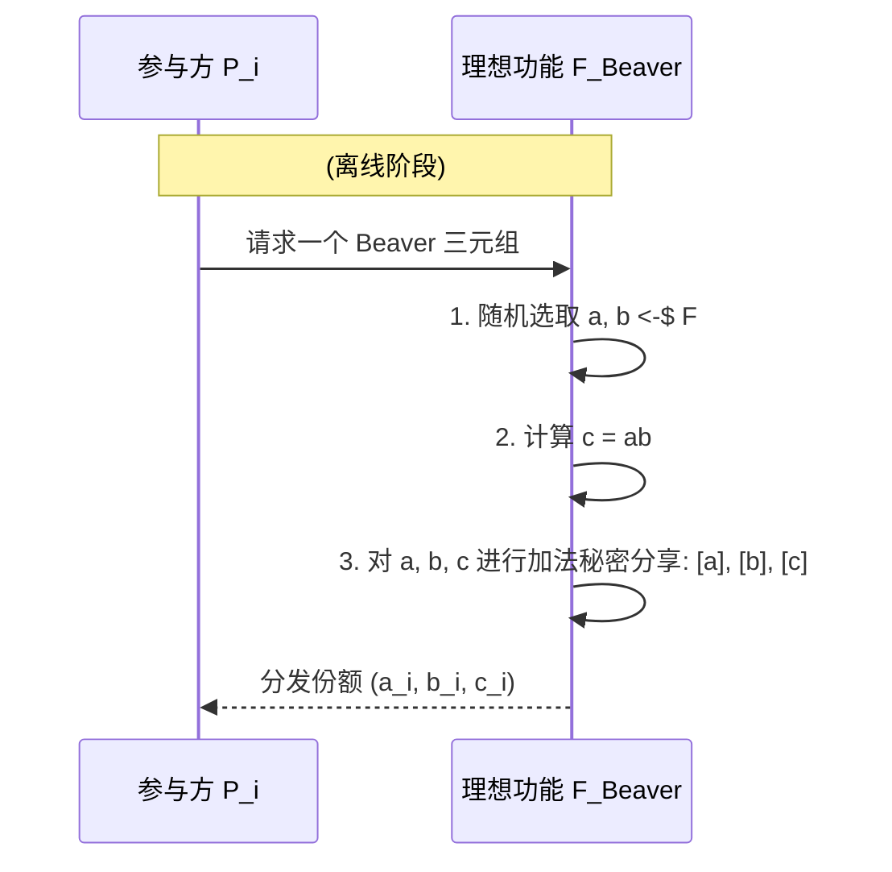
*   **输入**: 参与方无显式输入给 $\mathcal{F}_{\text{Beaver}}$。
*   **功能**:
    1.  $\mathcal{F}_{\text{Beaver}}$ 均匀随机选择 $a, b \in \mathbb{F}$。
    2.  计算 $c = ab$。
    3.  对 $a, b, c$ 分别进行加法秘密分享，例如，随机选择 $a_1, \dots, a_{n-1}$，令 $a_n = a - \sum_{j=1}^{n-1} a_j$，对 $b,c$ 做类似操作。
    4.  将份额 $(a_i, b_i, c_i)$ 安全地发送给每个参与方 $P_i$。

### 7.1.3 安全性证明 (Security Proof)

**定理 7.1**: 假设被攻陷方数量不超过 $n-1$ (对于加法分享的信息论安全门限)。图 7.1 展示的协议 $\Pi_{\text{Beaver}}$ 在 $\mathcal{F}_{\text{Beaver}}$-混合模型下，对于静态半诚实敌手 UC-安全地实现了安全函数计算的理想功能 $\mathcal{F}_{\text{sfe}}$。

**证明**: 我们为平凡敌手 $\mathcal{A}_{\text{triv}}$ 构造模拟器 $\mathcal{S}$。设 $C$ 为被攻陷方集合。

1.  **处理来自 $\mathcal{F}_{\text{sfe}}$ 的输入通知**:
    *   当 $P_i \in C$ 提供输入 $x_i$: $\mathcal{S}$ 获知 $x_i$，并模拟 $P_i$ 诚实地执行加法输入分享。
    *   当 $P_j \notin C$ 提供输入: $\mathcal{S}$ 假设其输入为 $0$，并模拟 $P_j$ 对 $0$ 进行加法分享，将份额发送给 $C$ 中的成员。

2.  **模拟计算阶段**:
    *   **线性门**: 被攻陷方 $P_i \in C$ 根据其持有的（可能是模拟的）份额进行本地计算。$\mathcal{S}$ 遵循此过程。
    *   **乘法门**:
        1.  当协议需要一个 Beaver 三元组时，$\mathcal{S}$ 调用 $\mathcal{F}_{\text{Beaver}}$。
            *   $\mathcal{F}_{\text{Beaver}}$ 会将三元组份额 $(a_k, b_k, c_k)$ 发送给每个 $P_k$。
            *   如果 $P_k \in C$，则 $\mathcal{A}_{\text{triv}}$ (即 $\mathcal{S}$) 收到 $(a_k, b_k, c_k)$。
            *   如果 $P_k \notin C$，则这些份额对 $\mathcal{S}$ 是未知的（但在模拟诚实方行为时，$\mathcal{S}$ 内部可以记录这些由 $\mathcal{F}_{\text{Beaver}}$ 生成的份额）。
        2.  被攻陷方 $P_i \in C$ 本地计算 $[d]$ 和 $[e]$ 的份额。
        3.  **重构 $d, e$**:
            *   真实世界: 所有参与方将其 $[d]$ 和 $[e]$ 的份额发送给一个重构者（或广播），得到公开的 $d, e$。被攻陷方会看到所有份额。
            *   理想世界 (模拟器 $\mathcal{S}$):
                $\mathcal{S}$ 知道被攻陷方 $C$ 持有的关于 $[d]$ 和 $[e]$ 的份额（这些份额是基于其“真实”输入份额和来自 $\mathcal{F}_{\text{Beaver}}$ 的 $[a],[b]$ 份额计算的）。
                $\mathcal{S}$ 不知道诚实方的输入，因此也不知道 $d, e$ 的真实值。
                但是，模拟器可以“伪造” $d, e$ 的公开过程。由于 $a,b$ 是随机的，所以 $d=x-a$ 和 $e=y-b$ 也是随机的（即使 $x,y$ 固定）。
                $\mathcal{S}$ 随机选择 $d^*, e^* \in \mathbb{F}$。
                然后，$\mathcal{S}$ 构造诚实方“应该”拥有的关于 $[d]$ 和 $[e]$ 的份额，使得这些份额与 $C$ 已有的份额以及公开值 $d^*, e^*$ 一致。
                例如，对于 $d^*$，$\mathcal{S}$ 已有 $\sum_{P_k \in C} d_k$。它需要虚构 $\sum_{P_j \notin C} d_j = d^* - \sum_{P_k \in C} d_k$。然后它可以将这个和值分配给一个诚实方，其他诚实方份额为0，或者随机分配。
                $\mathcal{S}$ 将这些模拟的来自诚实方的份额以及 $d^*, e^*$ 提供给 $\mathcal{A}_{\text{triv}}$。
        4.  被攻陷方 $P_i \in C$ 本地计算其最终份额 $(xy)_i$。

3.  **处理来自 $\mathcal{F}_{\text{sfe}}$ 的输出指令 (当 $P_i \in C$ 接收输出 $y_i$)**:
    *   $\mathcal{F}_{\text{sfe}}$ 将真实输出 $y_i$ 发送给 $\mathcal{S}$。
    *   $\mathcal{S}$ 模拟诚实方 $P_j \notin C$ 发送其关于 $y_i$ 的份额给 $P_i$。
        $\mathcal{S}$ 已有 $C$ 中成员持有的关于 $y_i$ 的（模拟的）份额，以及真实值 $y_i$。
        它可以构造一个加法分享 $(s_1, \dots, s_n)$ 使得 $\sum s_k = y_i$，并且对于 $P_k \in C$，$s_k$ 与 $P_k$ 已持有的模拟份额一致。然后将 $s_j$ ($P_j \notin C$) 作为模拟份额发送。

**不可区分性分析**:
关键在于证明被攻陷方 $C$ 的视图在真实世界和理想世界中是不可区分的。
*   **线性门和输入分享**: 与 BGW/GMW 的分析类似，诚实方的份额（或其模拟）对 $C$ 而言是随机的（或可由 $C$ 的信息推断）。
*   **乘法门中的 $d, e$**:
    *   真实世界: $d=x-a, e=y-b$ 被公开。由于 $a,b$ 随机，所以 $d,e$ 也是随机的（对于 $C$ 来说，它们的信息与 $x,y$ 无关）。
    *   理想世界: $\mathcal{S}$ 选择随机的 $d^*, e^*$。
    因此，公开的 $d,e$ 的分布在两边相同。
*   **乘法门中诚实方发送的 $d,e$ 的份额**:
    *   真实世界: 是基于真实 $d,e$ 和真实份额的。
    *   理想世界: $\mathcal{S}$ 构造的份额与 $d^*, e^*$ 以及 $C$ 已有的份额一致。由于 $d^*, e^*$ 与 $d,e$ 同分布，且加法分享的性质，这部分视图也是不可区分的。
*   **输出重构**: 与 BGW/GMW 类似，模拟器可以正确模拟诚实方发送的份额。

因此，协议是 UC 安全的。

## 7.2 Beaver 三元组的生成 (Generation of Beaver Triples)

上一节假设我们可以从理想功能 $\mathcal{F}_{\text{Beaver}}$ 中获取 Beaver 三元组。本节讨论如何实现 $\mathcal{F}_{\text{Beaver}}$。

### 7.2.1 基于半可信第三方的方式 (Using a Semi-Trusted Third Party)

如果存在一个**半可信 (semi-trusted)** 的第三方 TTP，那么生成 Beaver 三元组非常高效：
1.  TTP 随机选择 $a, b \in \mathbb{F}$，计算 $c=ab$。
2.  TTP 对 $a,b,c$ 分别进行加法秘密分享 (如，随机选择 $n-1$ 个份额，计算最后一个份额)。
3.  TTP 将对应的份额 $(a_i, b_i, c_i)$ 分发给每个 $P_i$。

!!! success "半可信的含义"
    1.  **诚实执行 (Honest Execution)**: TTP 会正确地生成满足 $c=ab$ 的三元组并正确分享。
    2.  **不与参与方串通 (No Collusion with Parties)**: TTP 不会将其知道的 $a,b,c$ 的原始值泄露给任何（少于特定门限的）参与方。如果 TTP 与参与方串通，例如将 $a$ 泄露给一个知道 $[x]$ 的恶意方，那么 $d=x-a$ 的公开就会泄露 $x$。

### 7.2.2 分布式生成方式 (Distributed Generation)

在没有半可信第三方的情况下，参与方需要通过一个 MPC 协议来共同生成 Beaver 三元组 $([a],[b],[c])$，其中 $a,b$ 是随机的，$c=ab$。

**基本思路**:
1.  **生成随机分享 $[a]$ 和 $[b]$**:
    *   每个参与方 $P_i$ 在本地随机选择 $a_i \leftarrow_{\$} \mathbb{F}$ 和 $b_i \leftarrow_{\$} \mathbb{F}$。
    *   那么，所有 $a_i$ 构成了对某个随机数 $a = \sum a_i$ 的分享 $[a]$。同理得到 $[b]$。
    *   关键点：没有任何单个参与方（或少于 $n$ 个参与方的子集）知道 $a$ 或 $b$ 的原始值。
2.  **计算乘积的分享 $[c] = [ab]$**:
    *   现在的问题转化为：已知 $[a]$ 和 $[b]$ (其中 $a,b$ 未知但随机)，如何得到 $[c=ab]$？
    *   这正是一个标准的 MPC 乘法问题！参与方可以使用任何已知的安全乘法协议（例如基于 OT 的 GMW 乘法协议，或者如果已经有更小的Beaver三元组，则可以递归使用）来计算 $[a][b]$ 得到 $[c]$。

!!! note "关于效率和循环"
    *   如果使用 GMW 的乘法（基于 OLE/OT）来生成 Beaver 三元组，那么这种分布式生成方式的开销就与直接用 GMW 执行原始计算的乘法门开销相当。
    *   Beaver 三元组的真正优势在于**预计算**：这些与输入无关的三元组可以提前大量生成，分摊其成本。在线阶段则可以非常快速。
    *   实践中，生成 Beaver 三元组本身是 MPC 研究的一个活跃领域，存在多种高效的专用协议，例如基于 OT 扩展的协议 [33-34] 或基于同态加密的协议 [35]。这些协议通常比通用的 GMW 乘法更优化。

本章主要展示了 Beaver 三元组如何工作以及其在 MPC 中的应用，具体的分布式生成协议细节超出了教材此处的范围。

# 第8章 基于混淆电路的协议 (Protocols based on Garbled Circuits)

与前几章主要基于秘密分享的 MPC 方案（如 BGW、GMW）不同，**混淆电路 (Garbled Circuits, GC)** 是安全多方计算（尤其是两方计算）的另一种经典且强大的技术。它最早由姚期智院士在 1986 年提出，因此最初的协议被称为**姚氏混淆电路协议 (Yao's Garbled Circuits protocol, Yao's GC)** [36]。

姚氏混淆电路是第一个通用的两方安全计算 (Secure Two-Party Computation, 2PC) 协议，它的出现标志着 MPC 领域的一个重要里程碑，并迅速成为后续研究和优化的热点。

!!! abstract "本章主要内容"
    1.  **姚氏两方混淆电路协议**:
        *   详细介绍其直观思想和构造方法。
        *   分析其安全性，并讨论其在标准 UC 模型下的局限性，引出**独立模型 (Stand-alone Model)**。
        *   在独立模型下给出姚氏协议的安全性证明。
    2.  **混淆电路的优化**: 介绍一些经典的混淆电路优化技术，以提高其效率。
    3.  **BMR 协议**: 介绍 Beaver-Micali-Rogaway (BMR) 协议 [37]，它将姚氏混淆电路的思想从两方推广到多方场景。

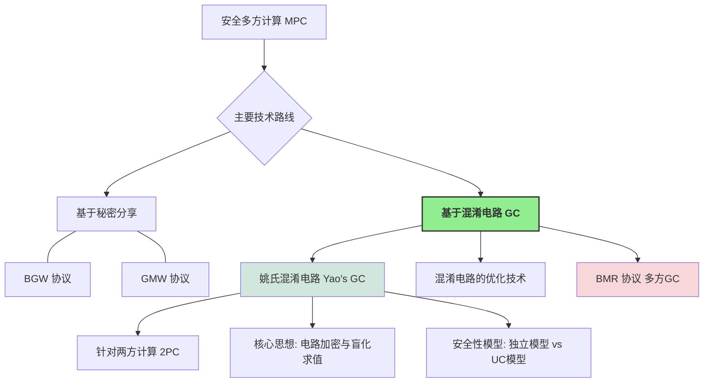

## 8.1 姚氏混淆电路协议 (Yao's Garbled Circuits Protocol)

姚氏协议主要用于两方场景，其中一方称为**混淆者 (Garbler)** 或**构造者 (Constructor)**（通常记为 $P_1$），另一方称为**求值者 (Evaluator)**（通常记为 $P_2$）。

### 8.1.1 直观思想 (Intuitive Idea)

假设 $P_1$ 的输入是 $x$，$P_2$ 的输入是 $y$，他们想共同计算函数 $f(x,y)$，而不泄露各自的输入（除了能从输出中推断的）。

!!! tip "核心步骤的直观理解"
    1.  **电路表示**: 首先，将要计算的函数 $f$ 表示为一个布尔电路 $C$（由AND, OR, NOT等逻辑门组成）。
    2.  **电路混淆 (Garbling)** (由 $P_1$ 完成):
        *   对于电路中的每一根导线 (wire) $w_i$， $P_1$ 随机选择两个密钥（或称为标签、token）$k_{w_i}^0$ 和 $k_{w_i}^1$，分别对应导线 $w_i$ 的逻辑值 $0$ 和 $1$。
        *   对于电路中的每一个逻辑门 $g$（例如一个与门，输入导线为 $w_a, w_b$，输出导线为 $w_c$），$P_1$ 生成一个**混淆表 (garbled table)** 或称为**加密真值表 (encrypted truth table)**。
            *   这个混淆表有四行，对应输入 $(0,0), (0,1), (1,0), (1,1)$ 的所有可能组合。
            *   每一行都使用对应的输入导线密钥来加密输出导线的对应密钥。
            *   例如，对于与门，如果输入 $(w_a=0, w_b=0)$ 对应输出 $w_c=0$，那么混淆表的一行就是 $Enc_{k_{w_a}^0}(Enc_{k_{w_b}^0}(k_{w_c}^0))$。(这里的 $Enc$ 表示对称加密)。
            *   $P_1$ 将混淆表的所有行进行随机置换，以隐藏原始真值表的结构。
        *   $P_1$ 将所有门的混淆表以及关于输出导线的“解密信息”（例如，将输出导线密钥映射回真实逻辑值 $0/1$ 的表）发送给 $P_2$。这个加密和打乱后的电路称为**混淆电路 (Garbled Circuit)**。
    3.  **输入密钥获取 (Input Key Transfer)**:
        *   $P_1$ 将其输入 $x$ 对应的所有输入导线的密钥（例如，如果 $x_i=0$，则发送 $k_{w_{x_i}}^0$）直接发送给 $P_2$。
        *   对于 $P_2$ 的输入 $y$，$P_2$ 不能直接告诉 $P_1$ 它的 $y$ 以获取对应的输入导线密钥（这会泄露 $y$）。这里需要使用 **1-out-of-2 茫然传输 (OT)** 协议。对于 $P_2$ 的每一个输入比特 $y_i$， $P_1$ 作为 OT 的发送者，输入是 $(k_{w_{y_i}}^0, k_{w_{y_i}}^1)$，$P_2$ 作为 OT 的接收者，输入是其真实比特值 $y_i$。协议结束后，$P_2$ 获得了其输入 $y$ 对应的所有输入导线的密钥，而 $P_1$ 不知道 $y$。
    4.  **电路求值 (Evaluation)** (由 $P_2$ 完成):
        *   $P_2$ 现在拥有了混淆电路以及所有输入导线的正确密钥。
        *   $P_2$ 从电路的输入层开始，逐个门进行“解密”和求值：
            *   对于一个门 $g$，如果 $P_2$ 已经获得了其输入导线 $w_a, w_b$ 的密钥 $k_{w_a}^\alpha, k_{w_b}^\beta$ (其中 $\alpha, \beta$ 是这两个导线的真实逻辑值)，$P_2$ 就尝试用这对密钥去解密该门的混淆表的四行。
            *   只有对应于 $(\alpha, \beta)$ 的那一行能够被成功解密（即解密后得到一个合法的密钥格式，而不是乱码），解密结果就是输出导线 $w_c$ 对应的密钥 $k_{w_c}^{g(\alpha,\beta)}$。
        *   $P_2$ 如此层层推进，直到计算出电路输出导线的密钥。
    5.  **输出获取 (Output Retrieval)**:
        *   $P_2$ 使用 $P_1$ 提供的输出导线解密信息，将其获得的输出导线密钥转换回真实的逻辑值，得到最终计算结果 $f(x,y)$。
        *   如果 $P_1$ 也需要结果，$P_2$ 可以将结果发送给 $P_1$。

!!! success "直观安全性分析"
    *   **$P_1$ 的隐私 (对 $y$ 的无知)**: OT 协议保证了 $P_1$ 无法知道 $P_2$ 的输入 $y$。
    *   **$P_2$ 的隐私 (对 $x$ 和中间值的无知)**:
        *   $P_1$ 的输入密钥 $k_{w_x}^{\text{val}(x)}$ 是随机的，不泄露 $x$ 的信息（除非 $P_2$ 知道密钥与值的映射，但 $P_2$ 只知道 $P_1$ 给它的那个）。
        *   混淆表是加密的，并且行被打乱。$P_2$ 每次只能解密混淆表中的一行，得到下一根导线的密钥。由于密钥看起来是随机的， $P_2$ 无法从密钥本身推断出导线的真实逻辑值，也无法解密其他三行（因为缺少对应的输入密钥）。因此，$P_2$ 只能沿着一条由其实际输入决定的路径“盲目地”计算电路，而不知道中间导线的真实逻辑值。

???+ example "与门示例 (表 8.1, 8.2, 8.3, 8.4)"

    教材中通过一个与门的例子详细解释了上述过程，并讨论了如何确保 $P_2$ 只能解密正确的一行。

    *   **表 8.1: 与门的真值表**
        | x | y | z = x ∧ y |
        |---|---|-----------|
        | 0 | 0 | 0         |
        | 0 | 1 | 0         |
        | 1 | 0 | 0         |
        | 1 | 1 | 1         |

    *   **表 8.2: 与门加密后的真值表（概念性）**
        | x 的对应密钥 | y 的对应密钥 | 加密的 z                               |
        |--------------|--------------|----------------------------------------|
        | $k_X^0$      | $k_Y^0$      | $Enc_{k_X^0}(Enc_{k_Y^0}(k_Z^0))$       |
        | $k_X^0$      | $k_Y^1$      | $Enc_{k_X^0}(Enc_{k_Y^1}(k_Z^0))$       |
        | $k_X^1$      | $k_Y^0$      | $Enc_{k_X^1}(Enc_{k_Y^0}(k_Z^0))$       |
        | $k_X^1$      | $k_Y^1$      | $Enc_{k_X^1}(Enc_{k_Y^1}(k_Z^1))$       |

    *   **问题**: $P_2$ 如何判断解密结果是正确的密钥，而不是一串随机数？
    *   **解决方案 (表 8.4 的思想)**: 在要加密的密钥后附加一个固定长度的（比如 $\kappa$ 个）零比特串，即加密 $k_Z^{\text{val}(Z)} || 0^\kappa$。当 $P_2$ 解密时，如果解密结果的后 $\kappa$ 位是 $0^\kappa$，则认为是正确的密钥。错误密钥对解密后得到全零后缀的概率是可忽略的 ($2^{-\kappa}$)。
        **表 8.4: 与门的查找表（添加验证后缀 $0^\kappa$）**
        | $w_a$ 的对应密钥 | $w_b$ 的对应密钥 | $w_c$ 的对应密钥 | 查找表条目                                           |
        |-----------------|-----------------|-----------------|------------------------------------------------------|
        | $k_a^0$         | $k_b^0$         | $k_c^0$         | $Enc_{k_a^0}(Enc_{k_b^0}(k_c^0 || 0^\kappa))$         |
        | $k_a^0$         | $k_b^1$         | $k_c^0$         | $Enc_{k_a^0}(Enc_{k_b^1}(k_c^0 || 0^\kappa))$         |
        | $k_a^1$         | $k_b^0$         | $k_c^0$         | $Enc_{k_a^1}(Enc_{k_b^0}(k_c^0 || 0^\kappa))$         |
        | $k_a^1$         | $k_b^1$         | $k_c^1$         | $Enc_{k_a^1}(Enc_{k_b^1}(k_c^1 || 0^\kappa))$         |

!!! important "从查找表到电路混淆"
    对于任意函数 $z=f(x,y)$，如果 $x,y$ 的定义域较小，可以将其视为一个大的查找表。$P_1$ 加密整个查找表的输出项，然后通过 OT 让 $P_2$ 获取其输入 $(x,y)$ 对应的那一项。但当输入空间很大时（如 $x,y$ 是64位整数），查找表会变得异常巨大 ($2^{64} \times 2^{64}$ 项)，这种方法不可行。姚氏协议通过将函数分解为基本逻辑门，对每个小门（通常是2输入1输出）的查找表（真值表，仅4行）进行混淆，从而解决了这个问题。

### 8.1.2 协议描述 (Formal Protocol Description)

这里我们介绍 Lindell 和 Pinkas [38] 论文中对姚氏协议的描述，它使用了一些更现代的密码学工具和定义。

!!! definition "协议使用的“特殊”对称加密方案 (定义 8.1.1)"
    协议中使用的对称加密方案 $(Gen, Enc, Dec)$ 需要满足以下两个额外性质 (除了基础的正确性和 IND-CPA 安全外)：

    1.  **不可知的密文空间 (Elusive Range)**:
        对于一个随机选择的密钥 $k \leftarrow Gen(1^\lambda)$，任何 PPT 敌手 $\mathcal{A}$ 输出一个密文 $c$ 使得 $c \in \text{Range}_n(k) = \{Enc_k(x) | x \in \{0,1\}^n\}$ 的概率是可忽略的。
        $$ \Pr[k \leftarrow Gen(1^\lambda); \mathcal{A}(1^\lambda) \in \text{Range}_n(k)] < \text{negl}(\lambda) $$
        这意味着敌手无法轻易伪造一个看起来合法的、由特定密钥加密的密文。

    2.  **可验证的密文空间 (Efficiently Verifiable Range)**:
        存在一个 PPT 算法 $M(1^\lambda, k, c)$，当且仅当 $c \in \text{Range}_n(k)$ 时输出 $1$。
        这允许给定密钥 $k$ 和密文 $c$ 时，高效地检查 $c$ 是否确实是用 $k$ 加密某个 $n$-比特串得到的。

    ???+ example "满足上述性质的加密构造"
        教材中给出的构造例子：
        $$ Enc_k(x) = \langle r, F_k(r) \oplus (x || 0^\lambda) \rangle $$
        其中 $x \in \{0,1\}^n$, $F_k$ 是以 $k$ 为密钥的伪随机函数 (PRF) $F_k: \{0,1\}^\lambda \to \{0,1\}^{n+\lambda}$，$r \leftarrow_{\$} \{0,1\}^\lambda$ 是随机数。
        *   **验证 $c=\langle r, s \rangle$ 是否在 $\text{Range}_n(k)$**: 计算 $s \oplus F_k(r)$，检查其后 $\lambda$ 位是否全为0。
        *   **不可知性**: 伪造这样的 $c$ 意味着能预测 $F_k(r)$ 的后 $\lambda$ 位（对于随机 $r$），或者找到一个 $r'$ 使 $F_k(r')$ 的后 $\lambda$ 位与给定串匹配。这在PRF安全下是困难的。
        *   **IND-CPA 安全性**: 由于 $F_k(r)$ 是伪随机的，$F_k(r) \oplus (x || 0^\lambda)$ 对于不同的 $x$ 看起来是独立的随机串，满足 IND-CPA。

!!! definition "双重加密安全 (Secure under Chosen Double Encryption - 定义 8.1.2)"
    这是一个比标准 IND-CPA 更强的加密属性，用于姚氏协议的安全性证明。
    直观上，如果用两对独立密钥进行双重加密，如 $Enc_{k_0}(Enc_{k_1}(m))$，那么即使敌手拥有部分“外层”或“内层”的解密能力（通过预言机），也无法区分加密的是哪条消息。

    **游戏 $\text{Game}^{\text{double}}_{\mathcal{A}}(n)$**:

    1.  敌手 $\mathcal{A}$ 以 $1^n$ 为输入，输出两对密钥 $(k_0, k_1)$ 和两个消息三元组 $(x_0, y_0, z_0), (x_1, y_1, z_1)$。
    2.  挑战者随机选择一个比特 $b \leftarrow_{\$} \{0,1\}$，并随机选择两个新密钥 $k'_0, k'_1 \leftarrow Gen(1^n)$。
    3.  挑战者计算并发送挑战密文 $C = \langle Enc_{k_0}(Enc_{k'_1}(x_b)), Enc_{k'_0}(Enc_{k_1}(y_b)), Enc_{k'_0}(Enc_{k'_1}(z_b)) \rangle$ 给 $\mathcal{A}$。
    4.  $\mathcal{A}$ 可以访问两个预言机：
        *   $O_1(k,m) \rightarrow Enc_{k}(Enc_{k'_1}(m))$ (固定内层密钥 $k'_1$)
        *   $O_2(k,m) \rightarrow Enc_{k'_0}(Enc_{k}(m))$ (固定外层密钥 $k'_0$)
        最后 $\mathcal{A}$ 输出其猜测比特 $b'$。
    5.  如果 $b' = b$，游戏输出 1，否则输出 0。

    如果对于任意 PPT 敌手 $\mathcal{A}$，$\Pr[\text{Game}^{\text{double}}_{\mathcal{A}}(n)=1] \le 1/2 + \text{negl}(n)$，则称该对称加密方案在选择明文攻击下具有**双重加密安全**。

!!! lemma "引理 8.1 (IND-CPA $\Rightarrow$ 双重加密安全)"
    如果一个对称加密方案 $(Gen, Enc, Dec)$ 在选择明文攻击下具有不可区分性 (IND-CPA secure)，那么它在选择明文攻击下也具有双重加密安全。
    (证明概要：通过一系列混合游戏 (hybrid games) 将双重加密游戏的敌手优势归约到对单条消息进行 IND-CPA 攻击的敌手优势。)

!!! abstract "姚氏混淆电路构造 (形式化)"
    令 $C$ 为一个布尔电路，其输入为 $x, y \in \{0,1\}^n$，输出为 $C(x,y) \in \{0,1\}^n$。假设 $C$ 的每条输出导线不是其他任何门的输入导线。

    1.  **密钥生成 (Key Generation)**:
        对于电路 $C$ 中的每一条导线 $w_i$ (假设共有 $m$ 条导线，从输入导线到输出导线按拓扑序编号)，混淆者 $P_1$ 随机选择一对独立的密钥 $(k_{w_i}^0, k_{w_i}^1)$，其中每个密钥都是通过 $Gen(1^\lambda)$ 生成的 $\lambda$ 比特串。

    2.  **混淆门 (Garbling Gates)**:
        对于电路中的每一个逻辑门 $g$（假设其输入导线为 $w_a, w_b$，输出导线为 $w_c$）：
        $P_1$ 计算四行混淆表条目。对于每一种可能的输入逻辑值组合 $(\alpha, \beta) \in \{(0,0), (0,1), (1,0), (1,1)\}$，对应的条目是：

        $$ 
        T_{g,\alpha,\beta} = Enc_{k_{w_a}^\alpha}(Enc_{k_{w_b}^\beta}(k_{w_c}^{g(\alpha,\beta)})) 
        $$

        其中 $g(\alpha,\beta)$ 是门 $g$ 对于输入 $(\alpha, \beta)$ 的输出逻辑值。
        $P_1$ 将这四个加密条目 $(T_{g,0,0}, T_{g,0,1}, T_{g,1,0}, T_{g,1,1})$ 进行随机排列，形成门 $g$ 的混淆表 $(c_{g,0}, c_{g,1}, c_{g,2}, c_{g,3})$。

    3.  **混淆电路 $G(C)$ 的组成**:
        混淆电路 $G(C)$ 由以下部分组成：
        *   所有逻辑门的混淆表。
        *   对于电路的每一条输出导线 $w_j$ (假设其对应函数 $f$ 的第 $j$ 个输出比特)，需要一个输出解密信息表 (output decoding information table) 或称为“翻译表”(translation table)。这个表通常是 $\{(k_{w_j}^0, 0), (k_{w_j}^1, 1)\}$，允许求值者将最终得到的输出导线密钥映射回真实的逻辑值 $0$ 或 $1$。

!!! lemma "引理 8.2 (混淆电路的本地正确性/密钥恢复的唯一性)"
    假设使用的对称加密方案 $(Gen, Enc, Dec)$ 具有不可知密文空间和可验证密文空间。令 $g$ 是一个门，输入导线为 $w_a, w_b$，输出导线为 $w_c$。给定 $w_a$ 的一个密钥 $k_a = k_{w_a}^{\text{val}(w_a)}$ 和 $w_b$ 的一个密钥 $k_b = k_{w_b}^{\text{val}(w_b)}$ (其中 $\text{val}(w_a), \text{val}(w_b)$ 是 $w_a, w_b$ 的真实逻辑值)，以及门 $g$ 的（随机排列后的）混淆表 $(c_0, c_1, c_2, c_3)$。
    那么，求值者可以高效地找到**唯一一个**索引 $j \in \{0,1,2,3\}$ 使得 $c_j$ 可以被 $k_a, k_b$ 成功双重解密，并且解密结果 $k_c = Dec_{k_b}(Dec_{k_a}(c_j))$ 是输出导线 $w_c$ 的对应于真实逻辑值 $g(\text{val}(w_a), \text{val}(w_b))$ 的密钥 $k_{w_c}^{g(\text{val}(w_a), \text{val}(w_b))}$。尝试解密其他三项将会失败（输出 $\perp$）的概率是压倒性的。
    (证明基于加密方案的不可知密文空间和可验证密文空间性质。如果能成功解密两项，意味着可以区分一个随机串和一个真实密文，或者可以伪造密文，这都与假设矛盾。)

!!! protocol "姚氏混淆电路协议 (图 8.1)"
    **公共输入**: 布尔电路 $C$ (计算函数 $f$)。
    **$P_1$ (混淆者) 的输入**: $x \in \{0,1\}^n$。
    **$P_2$ (求值者) 的输入**: $y \in \{0,1\}^n$。

    1.  **电路混淆与发送 ($P_1 \to P_2$)**:
        $P_1$ 按照上述方式计算混淆电路 $G(C)$（包括所有门的混淆表和输出导线的解密信息表）。
        $P_1$ 将 $G(C)$ 发送给 $P_2$。

    2.  **输入密钥传输**:
        设 $w_{x_1}, \dots, w_{x_n}$ 是对应 $P_1$ 输入 $x$ 的电路输入导线。
        设 $w_{y_1}, \dots, w_{y_n}$ 是对应 $P_2$ 输入 $y$ 的电路输入导线。
        (a) **$P_1$ 的输入密钥 ($P_1 \to P_2$)**: $P_1$ 对于其每个输入比特 $x_i$，将其对应的输入导线 $w_{x_i}$ 的密钥 $k_{w_{x_i}}^{x_i}$ 发送给 $P_2$。
        (b) **$P_2$ 的输入密钥 (通过 $F_{OT}$)**: 对于 $P_2$ 的每个输入比特 $y_i$ (对应输入导线 $w_{y_i}$)，$P_1$ 和 $P_2$ 调用理想的 1-out-of-2 OT 功能 $F_{OT}$：
            *   $P_1$ 作为 $F_{OT}$ 的发送者，输入消息对 $(k_{w_{y_i}}^0, k_{w_{y_i}}^1)$。
            *   $P_2$ 作为 $F_{OT}$ 的接收者，输入其选择比特 $y_i$。
            协议结束后，$P_2$ 获得密钥 $k_{w_{y_i}}^{y_i}$。这一步对所有 $i \in [n]$ 并行执行。

    3.  **电路求值与输出 ($P_2$)**:
        $P_2$ 现在拥有混淆电路 $G(C)$ 以及所有 $2n$ 条输入导线的正确活动密钥。
        $P_2$ 从电路的输入层开始，按照拓扑顺序逐个门进行计算：对于每个门 $g$，使用其已获得的输入导线密钥，通过尝试解密该门混淆表的四行（或根据标识置换直接解密特定行）来获得输出导线的活动密钥。
        当计算到电路的输出导线时，$P_2$ 获得输出导线的活动密钥。然后，$P_2$ 使用 $G(C)$ 中包含的输出解密信息表，将这些密钥转换为最终的逻辑值，得到计算结果 $f(x,y)$。

    4.  **结果共享 ($P_2 \to P_1$, 可选)**:
        如果 $P_1$ 也需要知道计算结果，则 $P_2$ 将其计算得到的 $f(x,y)$ 发送给 $P_1$。

### 8.1.3 安全性分析 (Security Analysis)

我们将在**独立模型 (Stand-alone Model)** 下，在 **$F_{OT}$-混合模型** (即假设存在理想的 OT 功能，其安全性由 $F_{OT}$ 保证) 中证明姚氏协议的安全性。

**正确性**:
由引理 8.2 可知，如果使用的对称加密方案满足所需性质（不可知和可验证的密文空间），并且 $F_{OT}$ 协议是正确实现的（即 $P_2$ 确实得到了其选择的密钥），那么 $P_2$ 在每一步都能唯一且正确地恢复出下一根导线的活动密钥。因此，最终 $P_2$ 能够计算出正确的函数输出 $f(x,y)$。

**隐私性**:

*   **$P_1$ 被攻陷 (模拟器 $S_1$)**:
    $P_1$ 的视图 $view_1^\Pi(x,y; r_1)$ 包含其输入 $x$，其内部随机性 $r_1$ (用于生成密钥、排列混淆表、以及作为 OT 发送方的随机性)，以及从 $P_2$ 收到的最终结果 $f(x,y)$。
    在 $F_{OT}$-混合模型中，$P_1$ 作为 OT 的发送方，不会从 $F_{OT}$ 收到任何关于 $P_2$ 选择比特 $y_i$ 的信息。
    **模拟器 $S_1(x, f(x,y))$**:
    1.  $S_1$ 选择一个随机串 $r'_1$ (与真实运行中的 $r_1$ 同分布)。
    2.  $S_1$ 使用输入 $x$ 和随机性 $r'_1$ 模拟 $P_1$ 执行协议的所有本地计算（如生成混淆电路，准备 OT 输入）。
    3.  $S_1$ 模拟从 $P_2$ 处接收到结果 $f(x,y)$。
    输出模拟视图 $(x, r'_1, \text{messages from } F_{OT} \text{ to } P_1, f(x,y))$。(注意：$F_{OT}$ 给 $P_1$ 的消息是空的或不依赖于 $y$ 的)。
    这个模拟视图与真实视图具有相同的分布（实际上是完美不可区分的）。

*   **$P_2$ 被攻陷 (模拟器 $S_2$)**:
    $P_2$ 的视图 $view_2^\Pi(x,y; r_2)$ 包含其输入 $y$，其内部随机性 $r_2$ (作为 OT 接收方的随机性)，收到的混淆电路 $G(C)$，收到的 $P_1$ 的输入密钥 $\{k_{w_{x_i}}^{x_i}\}_{i=1}^n$，以及其在 $F_{OT}$ 中获得的输入密钥 $\{k_{w_{y_i}}^{y_i}\}_{i=1}^n$ (以及 $F_{OT}$ 的交互记录)。
    **模拟器 $S_2(y, f(x,y))$**:
    $S_2$ 的目标是生成一个与真实视图计算上不可区分的模拟视图，而不依赖于 $P_1$ 的真实输入 $x$。
    1.  **构造“假的”混淆电路 $\tilde{G}(C)$**:
        $S_2$ 不知道 $x$。
        *   对于电路的每条导线 $w_j$，$S_2$ 随机选择一对密钥 $(\tilde{k}_j^0, \tilde{k}_j^1) \leftarrow Gen(1^\lambda)$。
        *   对于每个门 $g$ (输入 $w_a, w_b$，输出 $w_c$)：$S_2$ 需要确定当 $P_1$ 的输入未知，$P_2$ 的输入为 $y$ 时，导线 $w_c$ 的“期望”逻辑值 $\text{val}_c^*$(这个值应该能让最终输出为 $f(x,y)$)。$S_2$ 可以通过计算 $f(\mathbf{0}^n, y)$ (或任何固定的 $x_{fixed}$) 来得到一条路径上的所有中间值，并最终得到 $f(x_{fixed}, y)$。然后，确保构造的 $\tilde{G}(C)$ 在输入 $(x_{fixed} \text{ 的密钥}, y \text{ 的密钥})$ 时，输出的密钥能解密成 $f(x_{fixed},y)$。
        *   更具体地，对于门 $g$，其四行混淆表条目 $T'_{g,\alpha,\beta}$ 都加密同一个输出密钥 $\tilde{k}_c^{\text{val}_c^*}$，其中 $\text{val}_c^*$ 是 $w_c$ 在 $f(x,y)$ 计算路径上的值 (或者一个能最终导出 $f(x,y)$ 的值)。即：

            $$ 
            T'_{g,\alpha,\beta} = Enc_{\tilde{k}_a^\alpha}(Enc_{\tilde{k}_b^\beta}(\tilde{k}_c^{\text{val}_c^*})) \quad \forall \alpha, \beta \in \{0,1\} 
            $$

            这些条目随后随机排列。
        *   输出解密表：对于输出导线 $w_j$ (其在 $f(x,y)$ 中的真实值为 $z_j$)，解密表是 $\{(\tilde{k}_j^{z_j}, z_j), (\tilde{k}_j^{1-z_j}, \text{random_bit_if_needed})\}$。
    2.  **模拟 $P_1$ 的输入密钥**: $S_2$ 选择一组密钥 $\{\tilde{k}_{w_{x_i}}^{0}\}_{i=1}^n$ (即假设 $P_1$ 的所有输入比特都为0，或者选择对应于计算 $f(\mathbf{0}^n, y)$ 路径的密钥) 发送给 $P_2$。
    3.  **模拟 $F_{OT}$ 交互**: $S_2$ 扮演 $F_{OT}$ 中 $P_1$ (发送方) 的角色。当 $P_2$ 以其真实输入 $y_i$ 调用 $F_{OT}$ 时，$S_2$ (作为 $F_{OT}$) 提供密钥对 $(\tilde{k}_{w_{y_i}}^0, \tilde{k}_{w_{y_i}}^1)$，使得 $P_2$ 获得 $\tilde{k}_{w_{y_i}}^{y_i}$。
    输出模拟视图 $(y, r'_2, \tilde{G}(C), \{\tilde{k}_{w_{x_i}}^{0}\}, \{\tilde{k}_{w_{y_i}}^{y_i}\}, \text{simulated } F_{OT} \text{ transcript})$。

    **不可区分性 (基于混合论证 - Page 99)**:
    通过一系列 $|C|+1$ 个混合实验 $H_0(x,y), H_1(x,y), \dots, H_{|C|}(x,y)$ 来证明。
    *   $H_0(x,y)$: 真实协议执行，$P_2$ 的视图是 $\text{view}_2^\Pi(x,y)$。
    *   $H_{|C|}(x,y)$: 完全由模拟器 $S_2$ 生成的视图（如上所述，其中所有门的混淆表都是“假的”，加密固定路径上的输出密钥）。
    *   $H_k(x,y)$: 电路中按拓扑序排列的前 $k$ 个门的混淆表是“假的”，而从第 $k+1$ 个门开始的混淆表是“真实的”（即由 $P_1$ 的真实输入 $x$ 和真实密钥生成的）。
    
    要证明 $\text{view}(H_{k-1}(x,y)) \stackrel{c}{\approx} \text{view}(H_k(x,y))$。
    这两个混合实验的区别仅在于第 $k$ 个门 $g_k$ 的混淆表。
    *   在 $H_{k-1}$ 中，$g_k$ 的混淆表是真实的，即四行分别加密对应真实输出逻辑值的密钥。
    *   在 $H_k$ 中，$g_k$ 的混淆表是假的，即四行都加密同一个由 $f(x,y)$ 决定的路径上的输出密钥。
    
    假设存在区分器 $\mathcal{D}$ 能区分 $H_{k-1}$ 和 $H_k$。可以利用 $\mathcal{D}$ 构造一个敌手 $\mathcal{A}_E$ 来攻破所用对称加密方案的**双重加密安全性** (引理 8.1)。
    $\mathcal{A}_E$ 会将 $g_k$ 的输入导线密钥 $(k_a^0, k_a^1, k_b^0, k_b^1)$ 作为双重加密游戏中的 $(k_0, k_1)$ （需要巧妙映射），并根据 $g_k$ 的真值表和“假”表的需求构造消息三元组。挑战者返回的挑战密文对应于 $g_k$ 混淆表的一行。$\mathcal{A}_E$ 将其余电路部分（前 $k-1$ 个门的假表，后 $|C|-k$ 个门的真表）和输入密钥与这个挑战行组合起来给 $\mathcal{D}$。$\mathcal{D}$ 的输出即为 $\mathcal{A}_E$ 的猜测。
    由于双重加密是安全的，所以 $\mathcal{D}$ 无法区分，因此 $H_{k-1}$ 和 $H_k$ 是计算上不可区分的。
    
    由于 $|C|$ 是输入规模的多项式，通过混合引理， $H_0(x,y) \stackrel{c}{\approx} H_{|C|}(x,y)$。而 $H_{|C|}(x,y)$ 的分布与 $S_2(y,f(x,y))$ 生成的视图相同。
    因此，模拟器 $S_2$ 成功。

!!! theorem "定理 8.4 (姚氏协议的独立模型安全性)"
    令 $f$ 是一个单一输出的确定性功能。假设使用的对称加密方案是 IND-CPA 安全的（因此也具有双重加密安全），并且具有不可知密文空间和可验证密文空间。那么，图 8.1 展示的姚氏混淆电路协议 $\Pi_{\text{Yao}}$ 在 $F_{OT}$-混合模型下，对于半诚实敌手在**独立模型**中安全地实现了功能 $f$。

!!! success "推论 8.5 (扩展到概率功能)"
    如果 $f$ 是任意（可能是多输出的）概率功能，姚氏协议仍然可以通过适当修改（例如，将随机性作为额外输入，或者将多输出视为多个单输出电路的组合）来安全实现。更一般地，如第 8.1.4 节末尾所述，能够安全实现单一输出确定性功能的两方协议，通常可以扩展到实现任意两方功能。

### 8.1.4 独立模型 (Stand-alone Model)

!!! abstract "独立模型与 UC 模型的关键对比"
    *   **环境交互**:
        *   **UC 模型**: 环境 $\mathcal{Z}$ 可以与协议**实时、动态地交互**。它可以根据协议的中间状态提供输入，并影响敌手的行为。模拟器 $\mathcal{S}$ 必须能够实时响应 $\mathcal{Z}$ 的所有可能行为。
        *   **独立模型**: （在半诚实情况下）协议的输入在执行开始前就已固定。模拟器 $\mathcal{S}$ 的任务是基于被攻陷方的（固定的）输入和最终输出，来生成一个与被攻陷方真实视图不可区分的模拟视图。交互不是实时的。
    *   **并发性**:
        *   **UC 模型**: 其核心优势之一是保证**并发安全**。UC 安全的协议可以像积木一样安全地组合。
        *   **独立模型**: 通常不直接保证并发安全。一个在独立模型下安全的协议，当与其他协议（甚至是其自身的多个实例）并发执行时，其安全性可能会被破坏。
    *   **模拟器的能力 (尤其是对恶意敌手)**:
        *   **UC 模型**: 通常要求模拟器是“直线式”的，不允许对环境或敌手进行“倒带”(rewind)。
        *   **独立模型 (恶意敌手)**: 模拟器通常被允许对（黑盒的）恶意敌手进行“倒带”操作，以便提取其输入或确保一致性。
    *   **证明的复杂度与模型的强度**:
        *   **独立模型**: 证明相对简单，但提供的安全保证较弱，主要适用于协议单独运行的场景。
        *   **UC 模型**: 证明通常更复杂，但提供了非常强的安全保证，适用于复杂的、模块化的、并发的系统。

!!! important "姚氏协议与 UC 安全"
    标准的姚氏混淆电路协议（如图 8.1）**不满足 UC 安全性**。主要原因是模拟器 $S_2$ 在构造“假的”混淆电路时，需要预先知道 $P_2$ 的输入 $y$ 和最终输出 $f(x,y)$，以便确保求值路径上的密钥被正确设置。然而，在 UC 模型中，当 $P_1$ (混淆者) 发送混淆电路 $G(C)$ 给 $P_2$ 时，环境 $\mathcal{Z}$ 可能还没有决定并提供 $P_2$ 的输入 $y$。如果 $y$ 在 $G(C)$ 发送之后才确定，模拟器 $S_2$ 就无法提前构造出依赖于 $y$ 和 $f(x,y)$ 的“假”电路。
    因此，姚氏协议的安全性通常在更弱的独立模型中进行分析。

### 8.1.5 安全性证明 (Security Proof in Stand-alone Model - 总结)

定理 8.4 的证明已在 8.1.3 节通过模拟器 $S_1$ 和 $S_2$ 的构造以及混合论证进行了概述。核心依赖于：
*   $F_{OT}$ 的理想性，保护了各方的 OT 输入。
*   对称加密方案的双重加密安全性，用于证明“真实”混淆表与“部分伪造”的混淆表之间的不可区分性。
*   对称加密方案的不可知和可验证密文空间性质，保证了混淆电路本地求值的正确性和唯一性。

### 8.1.6 混淆电路的优化 (Optimizations of Garbled Circuits)

原始的姚氏协议在通信开销（混淆电路的大小，每个门4个密文）和计算开销（求值方平均每个门2.5次解密尝试）方面存在优化空间。

!!! success "主要优化技术概览 (表 8.6 是一个很好的总结)"

    1.  **标识置换 (Point-and-Permute)** [37] (Beaver, Micali, Rogaway - BMR 协议中也用到此思想)
        *   **核心**: 为每个导线 $w_a$ 的每个逻辑值 $\alpha \in \{0,1\}$ 分配一个密钥 $k_a^\alpha$ 和一个**标识比特 (permutation bit / selector bit)** $p_a^\alpha$，满足 $p_a^0 = 1 - p_a^1$。$L_a^\alpha = k_a^\alpha || p_a^\alpha$ 称为标签。
        *   **效果**: 混淆表的行根据其输入标签的标识比特进行固定排序（例如，第 $2p_a^\alpha + p_b^\beta + 1$ 行）。求值者只需进行**一次**解密。
        *   **输出**: 加密的内容是输出导线的完整标签 $L_c^\gamma = k_c^\gamma || p_c^\gamma$。
        *   **验证**: 由于解密是确定性的，不再需要在密钥后附加 $0^\kappa$ 来验证。

    2.  **混淆表行缩减 (Garbled Row Reduction, GRR)**:
        *   **GRR3 (4行 $\to$ 3行)** [41] (Naor, Pinkas, Sumner - NPS 技术)
            *   **思想**: 在随机谕示机模型 (ROM) 下，令其中一个混淆表条目（例如对应 $(k_a^0, k_b^0)$ 的）加密的输出标签 $L_c^{g(0,0)}$ 等于 $H(k_a^0 || k_b^0 || \text{gate_id})$。这样，该条目本身（即 $H(\cdot) \oplus L_c^{g(0,0)}$）就变成了全零，无需传输。求值者通过计算 $H(\cdot)$ 直接获得 $L_c^{g(0,0)}$。
            *   需要将对称加密 $Enc_k(m)$ 实现为 $H(k || \text{nonce}) \oplus m$。
        *   **GRR2 (4行 $\to$ 2行)** [42] (Pinkas, Schneider, Smart, Williams - PSSW 技术)
            *   **思想**: 利用多项式插值。对“奇门”（如AND，输出0和1的个数为1和3）和“偶门”（如XOR，输出0和1的个数为2和2）采用不同的插值策略。
            *   **奇门 (图 8.2)**: 三个加密相同输出密钥的条目所对应的“对称加密密钥”部分 $(K_1, K_2, K_3)$ 用于插值一个二次多项式 $P(X)$。第四个条目对应的“对称加密密钥” $K_4$ 和 $P(5), P(6)$ 用于插值另一个二次多项式 $Q(X)$。新的输出密钥为 $L_c^0 = P(0), L_c^1 = Q(0)$。传输的混淆表仅包含两个插值点（如 $P(5)$ 或 $Q(5)$，取决于哪个多项式用于该路径）和4个加密后的标识比特。
            *   **偶门 (图 8.3)**: 类似，但插值方式不同。
            *   **开销**: 每个门 $2\kappa + 4$ 比特 (2个密钥长度的值，4个单比特标识)。
        *   **Free-XOR** [43] (Kolesnikov, Schneider)
            *   **思想**: 通过为整个电路选择一个全局的随机**偏移量 (offset)** $\Delta \in \{0,1\}^\kappa$，并要求每条导线 $w_i$ 的两个密钥满足 $k_i^1 = k_i^0 \oplus \Delta$。
            *   对于异或门 $w_c = w_a \oplus w_b$，其输出标签可以直接通过输入标签异或得到：$L_c^{\text{val}(w_c)} = L_a^{\text{val}(w_a)} \oplus L_b^{\text{val}(w_b)}$ (如果标识比特也满足 $p_c = p_a \oplus p_b$)。
            *   **效果**: 异或门的计算完全免费，无需传输混淆表，也无需解密。
            *   **兼容性**: Free-XOR 与 GRR3 (标识置换) 兼容。与 GRR2 不兼容。
        *   **半门 (Half-Gates)** [44] (Zahur, Rosulek, Evans - ZRE 技术)
            *   **目标**: 同时实现 **2 行混淆表** (对奇门) 和 **免费异或门**。
            *   **思想**: 将奇门（如 AND 门 $v_c = v_a \land v_b$）分解为两个特殊的“半门”和一个异或门: $v_c = \text{HalfGate}_G(v_a, r) \oplus \text{HalfGate}_E(v_a, r \oplus v_b)$。其中 $r$ 是混淆者选的随机比特。$\text{HalfGate}_G$ 由混淆者（知道 $v_a$）构造，$\text{HalfGate}_E$ 由求值者（知道 $v_a$）“贡献”其 $r \oplus v_b$ 部分。
            *   每个半门的混淆表只有2行，可通过GRR3思想缩减到1行密文。
            *   **结果**: 奇门的混淆表大小降至 2 行密文。

!!! table "表 8.6: 混淆电路优化方案及其开销总结"
    | 方案                      | 混淆表大小 (密文数) | 计算开销 (对称操作数) | 备注                         |
    |---------------------------|-------------------|--------------------|------------------------------|
    |                           | 异或门   | 与门     | 生成 (异或/与) | 求值 (异或/与) |                              |
    | 经典方案 [36]             | 4        | 4       | 4 / 4              | 2.5 / 2.5          |                              |
    | + 标识置换 [37]           | 4        | 4       | 4 / 4              | 1 / 1              | 求值方确定性解密             |
    | + GRR3 [41]               | 3        | 3       | 4 / 4              | 1 / 1              | ROM, 1行隐式为0           |
    | + GRR2 [42]               | 2        | 2       | 4 / 4              | 1 / 1              | 多项式插值，更复杂        |
    | + Free-XOR + GRR3 [43]    | 0        | 3       | 0 / 4              | 0 / 1              | 异或门免费，与门3行       |
    | 半门 (Half-Gates) [44]    | 0        | 2       | 0 / 4              | 0 / 2              | 异或门免费，与门2行 (最优) |

    *注：计算开销大致指加密/解密/哈希操作次数。生成开销是混淆者的，求值开销是求值者的。*

## 8.2 BMR 协议 (Beaver-Micali-Rogaway Protocol)

上一节介绍的姚氏混淆电路协议及其各种优化主要适用于**两方计算 (2PC)** 的场景。如果希望将混淆电路的思想推广到**多方计算 (MPC)**，即 $n > 2$ 个参与方，那么 BMR 协议 [37] (Beaver, Micali, Rogaway) 提供了一个经典的解决方案。

**从两方到多方的挑战**:
在姚氏协议中，一个关键步骤是混淆者 $P_1$ 将其输入对应的密钥发送给求值者 $P_2$，并且 $P_1$ 和 $P_2$ 通过 OT 协议来让 $P_2$ 获得其输入对应的密钥。
如果直接将此模式推广到多方：
1.  **谁是混淆者？谁是求值者？** 如果只有一个混淆者，那么该混淆者会知道所有其他方的输入密钥（通过 OT），这会泄露信息。如果每个人都扮演求值者，那么混淆电路和输入密钥需要在所有参与方之间安全地分发和组合，这非常复杂。
2.  **密钥管理**: 在姚氏协议中，导线密钥由混淆者 $P_1$ 单独生成。在多方场景下，如果密钥仍然由单个参与方生成和控制，那么该参与方被攻陷将导致整个方案的崩溃。

**BMR 协议的直观想法 (Page 108)**:
BMR 协议的核心思想是让所有参与方**共同参与**到混淆电路的“生成”和求值过程中，特别是导线密钥的生成和管理。

1.  **分布式密钥生成**: 对于电路中的每一条导线 $w_i$，不再是由单个参与方 $P_1$ 选择一对密钥 $(k_{w_i}^0, k_{w_i}^1)$。而是，每一对密钥 $(K_{w_i}^0, K_{w_i}^1)$ （这里用大写 $K$ 表示多方场景下的组合密钥）本身是通过一个 MPC 过程生成的，或者说，每个参与方 $P_j$ 持有这对密钥的“份额”或“子密钥”。
    *   具体来说，对于导线 $w_i$ 和其可能的逻辑值 $v \in \{0,1\}$，其对应的全局密钥 $K_{w_i}^v$ 是所有参与方 $P_j$ 持有的子密钥 $k_{w_i,j}^v$ 的某种组合（例如，异或和：$K_{w_i}^v = \bigoplus_{j=1}^n k_{w_i,j}^v$）。每个 $P_j$ 随机选择其子密钥 $k_{w_i,j}^0$ 和 $k_{w_i,j}^1$。

2.  **共同“混淆”门**: 对于每个门 $g$ (输入 $w_a, w_b$，输出 $w_c$)，所有参与方 $P_j$ 共同计算出门 $g$ 的混淆表。混淆表的每一行仍然是使用输入导线的全局密钥 $(K_{w_a}^\alpha, K_{w_b}^\beta)$ 来加密输出导线的全局密钥 $K_{w_c}^{g(\alpha,\beta)}$。这个加密过程本身也需要通过 MPC 来完成，因为全局密钥是以份额形式存在的。

3.  **输入提供**: 当参与方 $P_j$ 要提供其输入比特 $x_j$ (对应电路输入导线 $w_{in}$) 时，所有参与方共同计算出 $w_{in}$ 对应的活动全局密钥 $K_{w_{in}}^{x_j}$ 的份额，并使得每个参与方都能获得这个活动密钥的份额（或者一个能用于后续计算的形式）。

4.  **共同求值**: 所有参与方利用他们共同持有的输入导线活动密钥的份额，共同“解密”第一个门的混淆表，得到输出导线的活动密钥的份额。然后继续处理下一层门，直到获得最终输出导线活动密钥的份额。

5.  **输出重构**: 参与方共同重构最终输出导线的活动密钥，并使用类似于姚氏协议的输出解密信息将其转换为真实逻辑值。

!!! warning "效率问题"
    如果完全按照上述“所有事情都通过通用 MPC 完成”的思路，那么 BMR 协议的效率会非常低，因为对每个门的混淆和求值（尤其是加密操作）本身都需要运行一个复杂的 MPC 子协议。这将比直接运行一个基于秘密分享的 MPC 协议（如 BGW）来计算原始函数 $f$ 还要慢得多。

BMR 协议的巧妙之处在于它如何高效地实现上述分布式密钥管理和混淆/求值过程。

### 8.2.1 直观思想 (BMR 的实际构造思路 - Page 109)

BMR 协议的实际构造借鉴并扩展了姚氏协议中的**标识置换 (Point-and-Permute)** 和 **Free-XOR** 的思想。

1.  **标签与掩码比特 (Labels and Masking Bits)**:
    *   对于每条导线 $w_i$，每个参与方 $P_j$ 随机选择两个**子标签 (seed / sub-label)** $s_{i,j}^0, s_{i,j}^1 \in \{0,1\}^\kappa$ (其中 $\kappa$ 是安全参数)。
    *   $P_j$ 还为导线 $w_i$ 随机选择一个**子掩码比特 (sub-masking bit)** $\lambda_{i,j} \in \{0,1\}$。
    *   导线 $w_i$ 的全局**外部值 (external value)** $p_i$ (即标识比特) 是所有子掩码比特的异或和： $p_i = \bigoplus_{j=1}^n \lambda_{i,j}$。(注意：这里的 $p_i$ 对应的是姚氏协议中标识置换的 $p_a^\alpha$，即导线 $w_i$ 取某个逻辑值时，其标签末尾附加的那个用于置换的比特。)
    *   导线 $w_i$ 的**全局标签 (superseed / global label)** $S_i^0$ (对应外部值 $p_i=0$) 和 $S_i^1$ (对应外部值 $p_i=1$) 由所有参与方的子标签连接而成，并在末尾附加该外部值 (0 或 1)。
        例如，$S_i^0 = s_{i,1}^{p_i=0} || s_{i,2}^{p_i=0} || \dots || s_{i,n}^{p_i=0} || 0$
        $S_i^1 = s_{i,1}^{p_i=1} || s_{i,2}^{p_i=1} || \dots || s_{i,n}^{p_i=1} || 1$
        这里 $s_{i,j}^{p_i=v}$ 表示 $P_j$ 为导线 $w_i$ 的外部值 $v$ 所选的子标签。(教材中 $S_i^0$ 和 $S_i^1$ 的定义是固定的，即 $S_i^0$ 总是对应逻辑值0的标签， $S_i^1$ 总是对应逻辑值1的标签。而导线的真实值 $v_i$ 与其外部值 $p_i$ 的关系由全局掩码 $\Lambda_i = \bigoplus_j \lambda_{i,j}$ 决定： $p_i = v_i \oplus \Lambda_i$。)
        
        **更准确的 BMR 标签定义 (Page 109)**:
        *   全局掩码 $\Lambda_i = \bigoplus_{j=1}^n \lambda_{i,j}$。
        *   导线 $w_i$ 的真实逻辑值为 $v_i$。其**外部值 (标识比特)** 为 $p_i = v_i \oplus \Lambda_i$。
        *   $P_j$ 为导线 $w_i$ 生成两个子标签：$s_{i,j}^0$ (对应 $w_i$ 外部值为0) 和 $s_{i,j}^1$ (对应 $w_i$ 外部值为1)。
        *   导线 $w_i$ 的**全局标签** $S_i^{p_i}$ (对应外部值 $p_i$) 定义为：
            $S_i^{p_i} = s_{i,1}^{p_i} || s_{i,2}^{p_i} || \dots || s_{i,n}^{p_i} || p_i$。

2.  **使用伪随机数生成器 (PRG)**:
    一个全局标签 $S_i^v$ (长度约为 $n\kappa$) 被用作一个伪随机数生成器 $G: \{0,1\}^{n\kappa+1} \to \{0,1\}^{2n\kappa+2}$ 的种子。
    $G(S_i^v)$ 的输出被分为两部分：$g(S_i^v)$ (前 $n\kappa+1$ 比特) 和 $h(S_i^v)$ (后 $n\kappa+1$ 比特)。
    这些 $g(\cdot)$ 和 $h(\cdot)$ 的输出将用于构造混淆表的加密密钥，类似于 Free-XOR 中的 $\Delta$ 或 GRR 中的 $H(\cdot)$。

3.  **混淆门 (Garbling Gate) $g_{gate}$ : $w_c = \text{gate_type}(w_a, w_b)$)**:
    混淆表的每一行仍然加密输出导线 $w_c$ 的一个全局标签 $S_c^{p_c}$。
    加密方式：对于输入导线 $w_a, w_b$ 的外部值 $(p_a, p_b)$，对应的混淆表条目（例如 $A_g, B_g, C_g, D_g$ 中的一项）是：

    $$ 
    \text{Entry}(p_a, p_b) = \left( \bigoplus_{j=1}^n \text{func1}(s_{a,j}^{p_a}) \right) \oplus \left( \bigoplus_{j=1}^n \text{func2}(s_{b,j}^{p_b}) \right) \oplus S_c^{p_c^*} 
    $$

    其中 $\text{func1}, \text{func2}$ 是 $g$ 或 $h$ (取决于该条目在 $A_g, B_g, C_g, D_g$ 中的位置，例如 $A_g$ 用 $g(s_{a,j}^{p_a=0})$ 和 $g(s_{b,j}^{p_b=0})$ )，而 $p_c^*$ 是由 $g_{gate}(\Lambda_a, \Lambda_b) \oplus \Lambda_c$ (真实值之间的门运算关系) 和当前输入的外部值 $(p_a, p_b)$ 共同决定的输出导线的外部值。
    (Page 109 的公式):

    $$
    \begin{align}
    A_g &= \left( \bigoplus_j g(s_{a,j}^0) \right) \oplus \left( \bigoplus_j g(s_{b,j}^0) \right) \oplus S_c^{p_c^0} \\
    B_g &= \left( \bigoplus_j h(s_{a,j}^0) \right) \oplus \left( \bigoplus_j g(s_{b,j}^1) \right) \oplus S_c^{p_c^1} \\
    C_g &= \left( \bigoplus_j g(s_{a,j}^1) \right) \oplus \left( \bigoplus_j h(s_{b,j}^0) \right) \oplus S_c^{p_c^2} \\
    D_g &= \left( \bigoplus_j h(s_{a,j}^1) \right) \oplus \left( \bigoplus_j h(s_{b,j}^1) \right) \oplus S_c^{p_c^3}
    \end{align}
    $$

    其中 $S_c^{p_c^k}$ 是根据 $g_{gate}(\Lambda_a, \Lambda_b) = \Lambda_c$ 是否成立以及 $(p_a,p_b)$ 的具体取值来选择 $S_c^0$ 还是 $S_c^1$。
    例如，如果 $g_{gate}(\Lambda_a, \Lambda_b) = \Lambda_c$，那么当 $(p_a, p_b)=(0,0)$ 时，$g_{gate}(v_a,v_b)=v_c \Rightarrow g_{gate}(0\oplus\Lambda_a, 0\oplus\Lambda_b) = 0\oplus\Lambda_c \Rightarrow p_c = 0$。则 $A_g$ 中加密的是 $S_c^0$。

    **关键点**:
    *   混淆表的每一项是 $n$ 个参与方贡献的“部分加密密钥”的异或和，再加上被加密的输出标签。
    *   每个参与方 $P_j$ 可以独立计算其贡献的部分，例如 $g(s_{a,j}^{p_a})$。
    *   这些部分随后需要通过一个 MPC 协议（例如 BGW 或 GMW，因为是异或求和）进行安全地聚合，以得到最终的混淆表条目。

4.  **输入提供**:
    对于每个输入导线 $w_i$ (其真实值为 $v_i$，由某个 $P_k$ 提供)，所有参与方 $P_j$ 首先公开其子掩码比特 $\lambda_{i,j}$。
    由此可以计算出全局掩码 $\Lambda_i = \bigoplus \lambda_{i,j}$ 和外部值 $p_i = v_i \oplus \Lambda_i$。
    然后，每个参与方 $P_j$ 公开其子标签 $s_{i,j}^{p_i}$ (对应外部值 $p_i$ 的那个子标签)。
    所有参与方组合这些公开的子标签得到全局活动输入标签 $S_i^{p_i} = s_{i,1}^{p_i} || \dots || s_{i,n}^{p_i} || p_i$。

5.  **电路求值**:
    所有参与方都拥有完整的混淆电路（所有门的混淆表 $A_g, B_g, C_g, D_g$）和所有输入导线的活动全局标签。
    他们可以并行地、本地地“解密”电路：
    对于一个门 $g$，如果其输入导线 $w_a, w_b$ 的活动标签是 $S_a^{p_a}, S_b^{p_b}$ (已知 $p_a, p_b$)，则对应的混淆表条目是（例如，如果 $(p_a,p_b)=(0,0)$, 则是 $A_g$）。
    输出标签 $S_c^{p_c}$ 可以通过 $A_g \oplus (\bigoplus g(s_{a,j}^{p_a=0})) \oplus (\bigoplus g(s_{b,j}^{p_b=0}))$ 计算得到。
    由于 $S_a^{p_a=0}$ 的子标签 $s_{a,j}^{0}$ 是已知的（因为 $S_a^0$ 是活动输入标签），所以 $\bigoplus g(s_{a,j}^{0})$ 可以被每个参与方本地计算。

6.  **输出获取**:
    当计算到输出导线 $w_j$ 时，所有参与方都获得了其活动标签 $S_j^{p_j}$。
    他们需要共同得到 $p_j$ (标签的最后一位) 和全局掩码 $\Lambda_j$ (可以通过 MPC 计算 $\bigoplus \lambda_{i,j}$，或者如果 $\lambda_{i,j}$ 在输入阶段已公开，则直接本地计算)。
    最终输出逻辑值 $v_j = p_j \oplus \Lambda_j$。

### 8.2.2 协议描述 (Formal Protocol Description - Fig 8.4, 8.5)

教材中的图 8.4 和 8.5 给出了 BMR 协议的更形式化的两阶段描述。

!!! protocol "BMR 协议 (第一部分 - 图 8.4)"
    **公共输入**: 布尔电路 $C$，$G:\{0,1\}^\kappa \to \{0,1\}^{2n\kappa+2}$。
    **$P_i$ 的输入**: $x_i$ (一个比特或多个比特)。

    **阶段 1: 预处理与密钥生成 (Offline-like Phase)**
    1.  **输入秘密分享**: 每个 $P_i$ 将其输入 $x_i$ 的每个比特进行秘密分享（例如，加法分享）。
    2.  **导线材料生成**: 对于电路 $C$ 的每条导线 $w_k$:
        *   每个参与方 $P_j$ 随机选择子标签 $s_{k,j}^0, s_{k,j}^1 \in \{0,1\}^\kappa$ 和子掩码比特 $\lambda_{k,j} \in \{0,1\}$。
        *   (这些是 $P_j$ 的秘密，但它们的组合将构成全局值)。
    3.  **混淆表生成 (通过 MPC)**: 对于电路 $C$ 的每个门 $g$ (输入 $w_a, w_b$，输出 $w_c$):
        *   所有参与方 $P_j$ 以其持有的 $\{s_{a,j}^0, s_{a,j}^1, s_{b,j}^0, s_{b,j}^1, s_{c,j}^0, s_{c,j}^1\}$ 和 $\{\lambda_{a,j}, \lambda_{b,j}, \lambda_{c,j}\}$ 作为 MPC 的输入。
        *   他们共同运行一个 MPC 协议来计算混淆表 $(A_g, B_g, C_g, D_g)$ 的**秘密分享**。
            例如，对于 $A_g = (\bigoplus_j g(s_{a,j}^0)) \oplus (\bigoplus_j g(s_{b,j}^0)) \oplus S_c^{p_c^*}$，
            每个 $P_l$ 得到 $A_g$ 的一个份额 $(A_g)_l$。
            (这里 $g(\cdot)$ 和 $h(\cdot)$ 是 $G$ 的前半部分和后半部分)。
    4.  **输入标签计算 (通过 MPC)**: 对于每个输入导线 $w_k$ (其真实值为 $v_k$，当前是以秘密分享形式存在的)：
        *   所有参与方 $P_j$ 通过 MPC 计算全局掩码 $\Lambda_k = \bigoplus_j \lambda_{k,j}$ 的份额。
        *   通过 MPC 计算外部值 $p_k = v_k \oplus \Lambda_k$ 的份额。
        *   然后，对于每个 $P_j$，它需要将其子标签 $s_{k,j}^{p_k}$ (这个 $p_k$ 是秘密分享的) 作为“公开”值（在后续步骤中）。这是一个棘手的部分，通常 $p_k$ 会被重构并公开。
        *   **教材图 8.4 步骤4**: 对于每条输入导线 $w_i$ (其值 $v_i$ 已被秘密分享)，参与方通过 MPC 安全计算 $p_i = v_i \oplus \Lambda_i$ 并**公开 $p_i$**。然后，每个参与方 $P_j$ **广播其子标签 $s_{i,j}^{p_i}$**。所有参与方组合这些子标签得到全局输入标签 $S_i^{p_i}$。

!!! protocol "BMR 协议 (第二部分 - 图 8.5)"
    **阶段 2: 电路求值 (Online-like Phase)**
    5.  **信息公布**:
        (a) 对于每条**输出**导线 $w_j$，所有参与方 $P_k$ 公开其子掩码比特 $\lambda_{j,k}$，从而所有方都可以计算全局输出掩码 $\Lambda_j$。
        (b) 所有参与方公开在步骤3中计算得到的**混淆表 $(A_g, B_g, C_g, D_g)$ 的所有份额**，从而所有方都可以重构出完整的混淆表。
        (c) 所有参与方已经拥有在步骤4中得到的每条**输入**导线的**全局活动标签 $S_i^{p_i}$**。
        此时，所有参与方都拥有：完整的混淆电路（所有门的混淆表），所有输入导线的活动标签，以及所有输出导线的全局掩码。
    6.  **本地电路求值**: 每个参与方 $P_k$ **独立地、本地地**计算整个混淆电路：
        (a) 从已知的输入导线活动标签开始。
        (b) 对于每个门 $g$ (输入 $w_a, w_b$ 活动标签 $S_a^{p_a}, S_b^{p_b}$，输出 $w_c$)：
            *   根据 $(p_a, p_b)$ 确定要使用的混淆表条目 (例如 $A_g$ if $p_a=0, p_b=0$)。
            *   计算 $\text{KeyPart}_a = \bigoplus_{j=1}^n g(s_{a,j}^{p_a})$ (其中 $s_{a,j}^{p_a}$ 是 $S_a^{p_a}$ 的第 $j$ 部分)。
            *   计算 $\text{KeyPart}_b = \bigoplus_{j=1}^n g(s_{b,j}^{p_b})$ (或用 $h(\cdot)$，取决于条目)。
            *   计算输出标签 $S_c^{p_c} = \text{Entry} \oplus \text{KeyPart}_a \oplus \text{KeyPart}_b$。
        (c) 如此迭代，直到获得所有输出导线的活动标签 $S_j^{p_j}$。
        (d) 对于每个输出导线 $w_j$，其外部值 $p_j$ 是 $S_j^{p_j}$ 的最后一位。
        (e) 计算真实输出逻辑值 $v_j = p_j \oplus \Lambda_j$ (其中 $\Lambda_j$ 已在步骤 5a 得到)。

!!! success "BMR 协议的轮数复杂度"
    *   **阶段1**:
        *   步骤1 (输入分享): 1 轮 (或常数轮，取决于分享方案)。
        *   步骤2 (本地选择): 0 轮。
        *   步骤3 (MPC计算混淆表份额): 取决于底层 MPC 的轮数（例如，如果用BGW/GMW，轮数与电路深度成正比，但这里是为**每个门**的混淆表计算，这些计算可以并行）。关键是，混淆表的结构不依赖于实际输入，只依赖于导线标签和掩码的子份额。
        *   步骤4 (MPC计算输入标签的 $p_i$ 并公开，然后广播子标签): 公开 $p_i$ 需要重构，广播子标签是1轮。
    *   **阶段2**:
        *   步骤5 (信息公布): 1 轮 (所有参与方广播所需信息)。
        *   步骤6 (本地求值): 0 轮。

    BMR 协议的原始论文 [37] 强调其能够实现**常数轮**的安全多方计算（在预处理之后）。这是因为阶段1的大部分（特别是步骤3）可以被视为与输入无关的**预处理**。一旦预处理完成（即所有混淆表的份额和输入标签的$p_i$份额都已计算好），在线阶段（从参与方获得真实输入开始）到最终输出，轮数是常数的（主要是步骤4中公开 $p_i$ 和广播子标签，以及步骤5的公布）。
    如果将步骤3中为每个门计算混淆表份额的 MPC 视为一个整体的复杂函数计算，其轮数确实会依赖于这个“混淆表生成电路”的深度。但BMR的巧妙在于，求值阶段（步骤6）是完全本地的。

### 8.2.3 安全性分析 (Security Analysis)

BMR 协议的安全性依赖于其底层组件的安全性：
*   用于秘密分享和 MPC 计算（步骤1, 3, 4中）的协议（例如 BGW 或 GMW）。
*   PRG $G$ 的伪随机性。
*   标识置换和 Free-XOR 类似的思想保证了每个门求值的正确性和隐私性（即求值者只能得到一个输出标签，无法知道真实逻辑值或另一个标签）。

**模拟器构造概要**:
模拟器的构造会比较复杂，因为它需要模拟底层 MPC 的执行视图以及 BMR 协议本身的视图。
*   当有参与方被攻陷时，模拟器需要能够：
    *   在不知道诚实方输入的情况下，提供看起来合法的子标签和子掩码比特份额。
    *   模拟底层 MPC 的执行，使得被攻陷方看到的关于混淆表份额或输入 $p_i$ 份额的消息是一致的。
    *   最终确保被攻陷方获得的关于电路求值的信息（如公开的混淆表、输入标签）与真实执行一致，但这些信息本身不泄露诚实方的秘密输入。

!!! theorem "定理 8.6 (BMR 协议的安全性)"
    假设被攻陷方数量满足底层 MPC 协议（用于步骤1,3,4）的安全门限（例如，对于 BGW， $t < n/2$）。假设伪随机数生成器 $G$ 是安全的。那么，BMR 协议（如图 8.4 和 8.5 所示）对于半诚实敌手安全地实现了函数 $f$（在相应的混合模型下，例如，如果底层 MPC 是 UC 安全的，则 BMR 也是 UC 安全的）。
    该协议的计算复杂度和通信复杂度是关于电路大小 $|C|$ 和安全参数 $\kappa$ 的多项式。如果底层 MPC 是常数轮的（例如，在预处理模型下），则 BMR 的在线阶段也是常数轮的。

!!! note "BMR 的重要性"
    BMR 协议不仅将混淆电路推广到多方，更重要的是它揭示了 MPC 轮数可以与电路深度无关（达到常数轮，尤其是在有预处理的场景下）。它也启发了后续许多关于高效 MPC（特别是常数轮 MPC）的研究。
    姚氏混淆电路和 BMR 协议通常在“对称密码模型”中分析，即主要依赖对称加密、哈希函数、PRG 等工具，而较少依赖公钥密码操作（除了OT的实现可能需要）。

好的，我们继续第九章《恶意安全性》的笔记。

# 第9章 恶意安全性 (Malicious Security)

在前面的章节中，我们主要讨论了在**半诚实敌手模型 (Semi-Honest Adversary Model)** 下的安全多方计算协议。在该模型中，所有参与方都会遵循协议的规定执行，但可能会试图从其收到的消息中推断出额外的信息。然而，在现实世界的许多应用场景中，我们必须考虑到参与方可能是**恶意的 (Malicious)**。恶意敌手可能会采取任何可能的偏离协议的行为，以达到其目的，例如破坏协议的正确性、获取其他参与方的私密信息，或者使得诚实方无法得到正确的输出。

本章将介绍几种实现恶意安全 MPC 的关键技术和代表性协议。

**本章主要内容**:
1.  **GMW 编译器 (GMW Compiler)**: 一种通用的编译器技术，利用零知识证明将任意半诚实安全的协议转化为恶意安全的协议。
2.  **切分选择技术 (Cut-and-Choose)**: 一种专门用于增强基于混淆电路的协议（如姚氏协议）以抵抗恶意行为的技术。
3.  **恶意安全的 BGW 协议**: 介绍 BGW 协议的恶意安全版本，它使用了**可验证秘密分享 (Verifiable Secret Sharing, VSS)** 来确保参与方诚实地分享其输入。
4.  **BDOZ 和 SPDZ 协议**: 简要介绍基于 Beaver 三元组和消息认证码 (MAC) 的更现代的高效恶意安全 MPC 协议。

```mermaid
graph TD
    A[MPC 安全性需求] --> B{敌手模型};
    B --> B1[半诚实敌手];
    B --> B2[恶意敌手];
    B2 --> C[挑战: 如何在任意偏离下保证安全?];
    C --> D[主要技术与协议];
    D --> D1[GMW 编译器 (通用)];
    D1 --> D1a[核心: 零知识证明];
    D --> D2[切分选择 针对GC];
    D2 --> D2a[核心: 随机抽查与多数表决];
    D --> D3[恶意安全 BGW];
    D3 --> D3a[核心: 可验证秘密分享 VSS];
    D --> D4[BDOZ / SPDZ 协议];
    D4 --> D4a[核心: MACs, Beaver三元组的认证];

    style B2 fill:#f8d7da,stroke:#721c24,font-weight:bold
    style D1 fill:#cce5ff
    style D2 fill:#d4edda
    style D3 fill:#fff3cd
    style D4 fill:#e2e3e5
```

## 9.1 GMW 编译器 (GMW Compiler)

GMW 编译器 [17] (Goldreich, Micali, Wigderson) 提供了一种强大的范式：如果一个协议在半诚实模型下是安全的，那么可以通过在该协议的每一步执行之后，让执行方使用**零知识证明 (Zero-Knowledge Proof, ZKP)** 来向其他参与方证明其行为确实遵循了协议规定，从而将该协议转化为一个在恶意模型下也安全的协议。

!!! abstract "零知识证明 (Zero-Knowledge Proof)"
    零知识证明是一种两方协议，其中：
    *   **证明者 (Prover, P)** 想要向**验证者 (Verifier, V)** 证明某个**陈述 (Statement)** $x$ 是真实的，并且证明者知道一个**见证 (Witness)** $w$ 使得某个公开的 NP 关系 $R(x,w)$ 成立（即 $w$ 是 $x \in L$ 的证据，其中 $L$ 是一个 NP 语言）。
    *   **完备性 (Completeness)**: 如果陈述 $x$ 是真实的且证明者 $P$ 是诚实的（知道 $w$），那么验证者 $V$ 将以高概率（通常是1）接受证明。
    *   **可靠性 (Soundness)**: 如果陈述 $x$ 是虚假的，那么无论恶意的证明者 $P^*$ 如何尝试，验证者 $V$ 都会以高概率（通常是 $1 - \text{negl}(\lambda)$）拒绝证明。
    *   **零知识性 (Zero-Knowledge)**: 如果陈述 $x$ 是真实的，验证者 $V$（即使是恶意的）在与诚实的证明者 $P$ 交互后，除了得知“$x$ 是真实的”这一事实外，无法获得关于见证 $w$ 的任何额外信息。这意味着存在一个模拟器，它仅知道 $x$ (和 $x$ 为真这一事实)，就能生成一个与真实交互不可区分的对话脚本。

???+ example "一个零知识证明的例子：图同构的证明 (教材未直接给出，但这是经典例子)"
    *   **陈述 $x$**: 两个图 $G_0, G_1$ 是同构的。
    *   **见证 $w$**: $G_0$ 到 $G_1$ 的一个同构映射 $\pi$ (即一个顶点置换)。
    *   **协议 (简化版，多次重复以降低错误率)**:
        1.  P 随机选择一个置换 $\rho$，计算 $H = \rho(G_0)$ (即对 $G_0$ 的顶点进行 $\rho$ 置换得到新图 $H$)。P 将 $H$ 发送给 V。
        2.  V 随机选择一个比特 $b \leftarrow_{\$} \{0,1\}$ 并发送给 P。
        3.  P 回复：
            *   如果 $b=0$，P 发送 $\rho$。V 检查 $H = \rho(G_0)$ 是否成立。
            *   如果 $b=1$，P 发送 $\sigma = \pi \circ \rho^{-1}$ (或 $\rho \circ \pi^{-1}$，取决于定义)。V 检查 $H = \sigma(G_1)$ 是否成立。(因为 $H=\rho(G_0)$ 且 $G_0=\pi^{-1}(G_1)$, 则 $H = \rho(\pi^{-1}(G_1))$，所以 $\sigma = \rho \circ \pi^{-1}$ )
    *   **完备性**: 显然。
    *   **可靠性**: 如果 $G_0, G_1$ 不同构，P 只能准备一个能通过 $b=0$ 或 $b=1$ 检查的 $H$。P 猜对 $b$ 的概率是 $1/2$。多次重复后，P 作弊成功的概率指数级下降。
    *   **零知识性**: 模拟器知道 $G_0, G_1$ 同构。当模拟器被 V 要求生成一个会话时：
        1.  模拟器随机选择比特 $b' \in \{0,1\}$ 和置换 $\rho'$。
        2.  如果 $b'=0$，模拟器计算 $H'=\rho'(G_0)$。
        3.  如果 $b'=1$，模拟器计算 $H'=\rho'(G_1)$。
        模拟器将 $H'$ 发送给 V。当 V 发送其挑战 $b$ 时：
        *   如果 $b=b'$，模拟器按规则回复 $\rho'$ (如果 $b'=0$) 或 $\rho'$ (如果 $b'=1$，这里应该是 $\rho'$ 而非 $\sigma$，因为模拟器不知道 $\pi$)。V 会接受。
        *   如果 $b \ne b'$，模拟器“卡住”了。但模拟器可以“倒带”V 到它选择 $b$ 之前，然后重新尝试上面的步骤，直到 $b=b'$。由于 $b$ 是随机的，期望尝试次数是2。生成的会话与真实会话不可区分。

!!! important "Sigma 协议 (Sigma Protocols - 定义 9.1.1)"
    Sigma 协议是一类特殊的3步公共硬币 (public-coin) 零知识证明系统，其交互形式为：
    1.  **承诺 (Commit)**: P $\to$ V: $a \leftarrow C(x,w;r)$ (初始消息或承诺)
    2.  **挑战 (Challenge)**: V $\to$ P: $e \leftarrow_{\$} \{0,1\}^\mu$ (随机挑战)
    3.  **回应 (Response)**: P $\to$ V: $z \leftarrow Z(x,w,r,e)$ (回答消息)
    V 通过检查 $(x,a,e,z)$ 是否满足某个验证关系来接受或拒绝。

    Sigma 协议通常具有以下性质：
    *   **完备性 (Completeness)**
    *   **特殊可靠性 (Special Soundness)**: 如果对于同一个初始消息 $a$，存在两个不同的挑战 $e \ne e'$ 及对应的有效回应 $(z, z')$，那么可以高效地从 $(a,e,z,e',z')$ 中提取出见证 $w$。
    *   **诚实验证者零知识性 (Honest-Verifier Zero-Knowledge, HVZK)**: 存在一个模拟器 $S_{HVZK}$，它可以在不知道 $w$ 的情况下，给定 $x$ 和一个随机挑战 $e$，生成一个看起来合法的 $(a,z)$ 对，使得 $(a,e,z)$ 是一个可接受的会话。

???+ example "图 9.1: 一个基于 ElGamal 的 Sigma 协议 (零知识证明 $c=(c_1,c_2)$ 是对消息 $m$ 的加密)"
    这个例子展示了证明者 P 知道随机数 $r$ 使得 $c_1 = g^r$ 且 $c_2 = m \cdot h^r$，而不泄露 $r$。
    **陈述 $x$**: $(g, h, c_1, c_2, m)$ (均为公开值)
    **见证 $w$**: $r$
    **NP 关系 $R(x,w)$**: $c_1 = g^r \land c_2 = m \cdot h^r$

    **协议流程**:
    1.  **P (证明者)**:
        *   随机选择 $r' \leftarrow_{\$} \mathbb{Z}_q$。
        *   计算 $a_1 = g^{r'}$，$a_2 = h^{r'}$。
        *   P $\to$ V: $(a_1, a_2)$。
    2.  **V (验证者)**:
        *   随机选择挑战 $e \leftarrow_{\$} \mathbb{Z}_q$。
        *   V $\to$ P: $e$。
    3.  **P (证明者)**:
        *   计算回应 $z = r' + e \cdot r \pmod q$。
        *   P $\to$ V: $z$。
    4.  **V (验证者) 验证**:
        *   检查 $g^z \stackrel{?}{=} a_1 \cdot (c_1)^e$
        *   检查 $h^z \stackrel{?}{=} a_2 \cdot (c_2/m)^e$
        如果两个等式都成立，则接受；否则拒绝。

    **教材定理 9.1**: 该协议满足完备性、特殊可靠性和诚实验证者零知识性。

**GMW 编译器的应用**:
对于一个半诚实安全的协议 $\Pi_{semi-honest}$，GMW 编译器通过以下方式将其转换为恶意安全的协议 $\Pi_{malicious}$:
1.  **承诺阶段**: 在协议开始时，每个参与方 $P_i$ 对其输入 $x_i$ 和将要使用的随机带 $\rho_i$ 进行密码学承诺，并将承诺值公开。
2.  **抛硬币阶段 (可选，用于生成公共随机性)**: 如果协议需要公共随机数，参与方可以通过一个安全的抛硬币子协议来生成。
3.  **执行与证明阶段**: 参与方按照 $\Pi_{semi-honest}$ 的步骤执行。每当 $P_i$ 需要发送一条消息 $m_i$ 时，它首先计算 $m_i$，然后使用零知识证明向接收方（或其他所有方）证明：
    *   "$m_i$ 是根据我之前承诺的输入 $x_i$、随机带 $\rho_i$ 以及我到目前为止收到的所有消息，并严格遵循协议 $\Pi_{semi-honest}$ 的规定计算出来的。"
    *   这个陈述的见证就是 $x_i, \rho_i$ 以及收到的历史消息。
    如果零知识证明验证失败，则接收方可以认为 $P_i$ 作弊并中止协议（或采取其他纠错措施）。

!!! success "GMW 编译器的效果"
    *   **可靠性**: 由于零知识证明的可靠性，恶意参与方无法在偏离协议的情况下让验证者接受其伪造的消息（除非以可忽略的概率）。
    *   **零知识性**: 证明过程不泄露诚实参与方的任何额外信息（如其输入和随机带）。
    *   **结果**: 如果原始半诚实协议是安全的，并且使用的 ZKP 系统是安全的，那么编译后的协议在恶意模型下也是安全的。

!!! warning "GMW 编译器的开销"
    虽然 GMW 编译器在理论上非常强大，但它的主要缺点是效率。为协议的每一步都执行一次通用的零知识证明通常会带来巨大的计算和通信开销，使得编译后的协议在实践中对于复杂功能可能不够高效。因此，研究者们也致力于设计更直接的、针对特定问题的恶意安全协议，或者更高效的 ZKP 系统。

## 9.2 切分选择 (Cut-and-Choose)

切分选择是一种专门用于抵抗恶意混淆者 (Garbler) 的技术，尤其适用于姚氏混淆电路协议。在姚氏协议中，如果混淆者 $P_1$ 是恶意的，它可以构造一个错误的或恶意的混淆电路 $G(C')$ 而不是正确的 $G(C)$，这个 $G(C')$ 可能会泄露求值者 $P_2$ 的输入，或者产生错误的输出。

### 9.2.1 直观思想 (Intuitive Idea)

**核心思想**: 让混淆者 $P_1$ 生成大量的（例如 $s$ 个）相同功能 $f$ 的混淆电路副本。然后，求值者 $P_2$ 随机选择其中的一部分（例如 $s/2$ 个）要求 $P_1$ **打开 (open)** 并检查其正确性。如果所有被打开的电路都验证通过，那么 $P_2$ 就有较高的统计置信度认为剩余未打开的电路中，大部分也是正确的。$P_2$ 随后对所有未打开的电路进行求值，并取其输出的**多数结果**作为最终输出。

1.  **生成副本 ($P_1$)**: $P_1$ 生成 $s$ 个混淆电路 $GC_1, GC_2, \dots, GC_s$，它们都声称是计算函数 $f$ 的。$P_1$ 还为每个电路的每条输入导线的每个可能值生成对应的密钥（标签）。
2.  **承诺 ($P_1$)**: $P_1$ 对所有这些电路和密钥进行承诺，并将承诺值发送给 $P_2$。
3.  **随机选择 ($P_2$)**: $P_2$ 随机选择一个大小为 $s/2$ 的索引子集 $J_{check} \subset \{1, \dots, s\}$。这些电路将作为“检查电路”(check circuits)。剩余的 $s/2$ 个电路 $J_{eval}$ 将作为“求值电路”(evaluation circuits)。$P_2$ 将 $J_{check}$ 发送给 $P_1$。
4.  **打开与检查 ($P_1, P_2$)**: $P_1$ 揭示 $J_{check}$ 中所有电路的全部信息（包括所有导线密钥、随机性等）。$P_2$ 验证这些电路是否确实是根据函数 $f$ 和 $P_1$ 承诺的随机性正确生成的。如果有任何一个检查电路不正确，$P_2$ 中止协议，判定 $P_1$ 作弊。
5.  **OT 阶段 ($P_1, P_2$)**: 如果所有检查电路都通过验证，对于**所有** $s$ 个电路（包括检查电路和求值电路），$P_1$ 和 $P_2$ 为 $P_2$ 的输入 $y$ 执行 OT，使得 $P_2$ 获得其输入 $y$ 对应的每个求值电路 $GC_j$ ($j \in J_{eval}$) 的输入密钥。（对于检查电路， $P_2$ 已经从打开阶段获得了所有密钥，不需要再为它们做 OT，但为了防止 $P_1$ 根据 OT 的选择来构造恶意电路，通常 OT 是针对所有 $s$ 个电路的输入密钥进行的，或者在承诺阶段就完成）。
    更常见的做法是：$P_2$ 只为 $J_{eval}$ 中的电路执行 OT 获取其输入 $y$ 的密钥。对于 $P_1$ 的输入 $x$，$P_1$ 将其输入 $x$ 对应的密钥（对于 $J_{eval}$ 中的每个电路）发送给 $P_2$。
6.  **求值与多数表决 ($P_2$)**: $P_2$ 对 $J_{eval}$ 中的所有电路进行求值，得到 $s/2$ 个输出结果。$P_2$ 取这些结果中的多数作为最终输出 $f(x,y)$。

**安全性分析 (作弊概率)**:
假设 $P_1$ 是恶意的，它想让 $P_2$ 接受一个错误的输出或者泄露 $P_2$ 的信息。为此，它可能在 $s$ 个电路中混入一些“坏”的电路。
*   如果 $P_1$ 构造的坏电路少于 $s/2$ 个，那么它期望所有被 $P_2$ 选中检查的电路都是好的。
*   设 $P_1$ 构造了 $k$ 个坏电路。$P_2$ 随机选择 $s/2$ 个电路进行检查。这 $s/2$ 个电路全都是好电路（即 $P_1$ 的作弊未被发现）的概率是 $\binom{s-k}{s/2} / \binom{s}{s/2}$。
*   如果 $k \approx s/2$ (例如， $P_1$ 构造了一半坏电路，一半好电路)，那么未被发现的概率大约是 $2^{-s/2}$ (这是一个粗略估计，实际计算更复杂，如教材 Page 120 的推导)。
*   通过选择足够大的 $s$ (例如 $s=80$ 或 $s=160$)，这个概率可以变得非常小 (例如 $2^{-40}$)。
*   如果作弊未被发现， $J_{eval}$ 中可能仍有坏电路。但只要 $J_{eval}$ 中好电路的数量占多数，多数表决就能得到正确结果。如果 $P_1$ 想要操纵最终输出，它需要确保 $J_{eval}$ 中坏电路占多数，这要求它在初始的 $s$ 个电路中构造远超 $s/2$ 个的坏电路，这样被发现的概率会非常高。

**教材 Page 120 的概率分析**:
$\text{Pr}[\text{noAbort} \land \text{badMaj}] < 2^{-s/4+1}$ (其中 badMaj 表示求值电路中坏电路过半)。
如果希望这个概率小于 $2^{-40}$，则 $s/4 - 1 > 40 \Rightarrow s/4 > 41 \Rightarrow s > 164$。所以 $s$ 通常取几十到几百。

**切分选择需要解决的问题**:

*   **电路一致性 (Circuit Consistency)**: 我们需要确保 $P_1$ 生成的所有 $s$ 个混淆电路确实是针对同一个函数 $f$ 的。如果 $P_1$ 为检查电路生成 $G(C)$，为求值电路生成 $G(C')$，那么检查就没有意义。
    *   **解决方案**: $P_1$ 首先承诺一个电路描述 $C$，然后再基于这个 $C$ 生成 $s$ 个混淆电路。打开检查电路时，$P_2$ 验证它们是否与承诺的 $C$ 一致。
*   **输入一致性 (Input Consistency - Page 121)**: 需要确保 $P_1$ 对所有 $s$ 个求值电路都使用其相同的真实输入 $x$，而不是为不同的求值电路使用不同的 $x_j$ 来试图探测 $P_2$ 的输入 $y$。
    *   **解决方案**: $P_1$ 对其输入 $x$ 进行承诺。在 OT 阶段，当 $P_1$ 提供其输入密钥给 $P_2$ 时（或者更早，在生成电路时），$P_1$ 需要使用零知识证明来证明它为所有 $s$ 个电路的相同输入导线提供的密钥确实对应于同一个逻辑值（即它承诺的 $x$ 的对应比特）。
*   **选择性中止攻击 (Selective Abort Attack / Selective Failure Attack - Page 121)**:
    即使 $P_1$ 构造的电路都是正确的，它仍然可以通过在 OT 阶段恶意行为来探测 $P_2$ 的输入。
    例如，对于 $P_2$ 的某个输入比特 $y_i$，OT 的两个消息是 $(k^0, k^1)$。$P_1$ 可以恶意地将 OT 的输入设为 $(k^0, \text{garbage})$。
    *   如果 $P_2$ 的选择比特 $y_i=0$， $P_2$ 得到 $k^0$，协议正常进行。
    *   如果 $P_2$ 的选择比特 $y_i=1$， $P_2$ 得到 garbage，无法解密后续电路，只能中止。
    $P_1$ 通过观察 $P_2$ 是否中止，就能知道 $y_i$ 的值。
    *   **解决方案**:
        1.  **承诺式 OT (Committing OT)**: 在 OT 执行过程中，发送方 $P_1$ 对其输入的两条消息进行承诺。在切分选择的打开阶段，如果某个电路的 OT 被“打开检查”，$P_1$ 必须揭示其在该 OT 中使用的两条消息， $P_2$ 验证它们是否与 $P_1$ 最初承诺的导线密钥一致。
        2.  **切分选择 OT (Cut-and-Choose OT, CCOT)**: LP11 协议中引入的一种新的 OT 变体，将 OT 和切分选择检查更紧密地结合起来。

*   **$P_1$ 的输出真实性 (Output Authenticity)**: 如果 $P_1$ 也需要输出，那么恶意的 $P_2$ 在计算完 $f(x,y)$ 后，可能会发送一个错误的输出给 $P_1$。
    *   **解决方案**: $P_2$ 在发送输出给 $P_1$ 时，需要同时发送一个**消息认证码 (MAC)**，或者通过零知识证明来证明其发送的输出确实是大多数求值电路计算得到的结果。

!!! abstract "基于切分选择的混淆电路协议概览 (Page 122)"
    1.  $P_1$ 生成 $s$ 个混淆电路 $GC_1, \dots, GC_s$。
    2.  对于 $P_2$ 的每个输入比特 $y_i$，$P_1$ 和 $P_2$ 执行 $s$ 次**承诺式OT** (或 CCOT 的准备阶段)，使得 $P_2$ 能潜在地获得每个 $GC_j$ 中 $w_{y_i}$ 导线对应的两个密钥之一。
    3.  $P_1$ 向 $P_2$ 发送 $s$ 个混淆电路，以及 $P_1$ 输入导线密钥的承诺值。
    4.  $P_2$ 随机选择 $s/2$ 个电路作为检查电路 $J_{check}$，并将索引发送给 $P_1$。
    5.  $P_1$ **打开** $J_{check}$ 中的所有电路（包括电路结构、所有导线密钥、生成电路的随机性）以及这些电路在承诺式OT中对应的输入（即密钥对）。$P_2$ 验证这些电路的正确性以及OT输入的正确性。
    6.  $P_1$ 向 $P_2$ 发送其在**求值电路** $J_{eval}$ 中输入 $x$ 对应的导线密钥，并使用 ZKP 证明输入一致性（即所有求值电路中 $P_1$ 使用的是相同的 $x$，且该 $x$ 与其承诺的输入一致）。
    7.  $P_2$ 使用其在步骤2中通过 OT 获得的 $y$ 对应的密钥，以及在步骤6中获得的 $x$ 对应的密钥，对 $J_{eval}$ 中的所有电路进行求值。取多数结果作为输出。
    8.  (如果 $P_1$ 也需要输出) $P_2$ 将输出和 MAC (或 ZKP) 发送给 $P_1$。$P_1$ 验证。

### 9.2.2 LP11 协议 (Lindell-Pinkas 2011 Protocol)

LP11 协议 [53] 是一个有代表性的、基于切分选择的恶意安全两方混淆电路协议。它主要在以下两点对上述概览流程进行了具体实现和优化：

1.  **引入切分选择 OT (Cut-and-Choose OT, CCOT)**: (图 9.2)
    *   **FCCOT (理想功能)**:
        *   发送方 $P_S$ 输入 $s$ 对消息 $\{(x_{j,0}, x_{j,1})\}_{j=1}^s$。
        *   接收方 $P_R$ 输入 $s$ 个选择比特 $\sigma_1, \dots, \sigma_s$ 和一个大小为 $s/2$ 的“检查索引集” $J \subset [s]$。
        *   输出:
            *   对于 $j \in J$ (检查索引): $P_R$ 获得 $(x_{j,0}, x_{j,1})$ (两个都得到)。
            *   对于 $j \notin J$ (求值索引): $P_R$ 获得 $x_{j, \sigma_j}$ (只得到选的那个)。
            *   $P_S$ 对 $\sigma_j$ 和 $J$ 一无所知。
    *   **FSCCOT (单一选择 CCOT 理想功能)**: $P_R$ 只有一个全局选择比特 $\sigma$ (用于所有 $j \notin J$)。这是为了保证 $P_2$ 在所有求值电路中使用相同的 $y_i$。
    *   **构造思路 (基于 PVW OT [18] 的变体 - 图 9.3, 9.7)**:
        PVW OT 协议基于格密码，并在公共参考字符串 (CRS) 模型下构造。LP11 将其适配到标准模型（或更准确地说是 $\mathbb{Z}_p^*$ 这种 DDH 群）。
        *   **CRS 模拟**: 接收方 $P_R$ 生成类似 CRS 的参数 $(g_0, g_1, h_0, h_1)$。其中 $g_1 = g_0^y$ ($y$ 随机)，$h_0=g_0^{\alpha_0}, h_1=g_1^{\alpha_1}$。
        *   对于每个 OT 实例 $j$:
            *   如果 $j \in J$ (检查): $P_R$ 设置 $h_{j,0}, h_{j,1}$ 使得它们是 DH 元组相对于 $(g_0,g_1)$ (即 $h_{j,1} = (h_{j,0})^y$)。这样 $P_S$ 就可以恢复出 $P_R$ 用来加密的两把“钥匙”，从而 $P_R$ 实际上能解密两个消息。
            *   如果 $j \notin J$ (求值): $P_R$ 设置 $h_{j,0}, h_{j,1}$ 使得它们相对于 $(g_0,g_1)$ **不是** DH 元组（例如 $h_{j,1} = g_1^{\alpha_j+1}$ 而 $h_{j,0} = g_0^{\alpha_j}$）。这样 $P_S$ 无法区分 $P_R$ 用的是哪一把“钥匙”，$P_R$ 只能得到一个消息。
        *   $P_R$ 需要使用零知识证明向 $P_S$ 证明它构造的这 $s$ 对 $(h_{j,0}, h_{j,1})$ 中，恰好有 $s/2$ 对是 DH 元组（对应 $J$），另外 $s/2$ 对不是 DH 元组（对应 $J^c$）（见图 9.5, 9.6，CDS 组合证明）。
        *   **传输阶段**: 对于每个实例 $j$，$P_S$ 使用 $P_R$ 提供的 $(g_0,g_1,h_{j,0},h_{j,1})$ 和它自己的两个输入消息 $(m_{j,0}, m_{j,1})$ 来生成两个密文，发送给 $P_R$。$P_R$ 根据 $j$ 是否在 $J$ 中以及其选择比特 $\sigma_j$ 来解密。

2.  **高效的输入一致性零知识证明 (图 9.10)**:
    *   **背景**: $P_1$ 的输入比特为 $x_i \in \{0,1\}$。对于第 $j$ 个电路，其输入导线密钥是 $k_{i,j}^0 = H(g^{a_i^0} \cdot (g^{r_j}))$ 和 $k_{i,j}^1 = H(g^{a_i^1} \cdot (g^{r_j}))$ (这里 $H$ 是随机数提取器)。$P_1$ 公开承诺 $h_{i,0}=g^{a_i^0}, h_{i,1}=g^{a_i^1}$ 和 $u_j=g^{r_j}$。
    *   当 $P_1$ 发送其实际输入 $x_i$ 对应的密钥给 $P_2$ 时（对于求值电路 $j \notin J$），它发送的是 $k'_{i,j} = g^{a_i^{x_i}} \cdot u_j = g^{a_i^{x_i} + r_j}$。
    *   $P_1$ 需要向 $P_2$ 证明：对于所有 $j \notin J$，它发送的 $k'_{i,j}$ 所使用的 $a_i^{x_i}$ 是相同的（即 $x_i$ 对所有求值电路是一致的），并且这个 $a_i^{x_i}$ 确实是 $a_i^0$ 或 $a_i^1$ 之一（即 $x_i$ 是0或1）。
    *   **证明**: 证明存在一个 $a \in \mathbb{Z}_q$ 使得 “( $h_{i,0} = g^a$ 且对所有 $j \notin J$, $k'_{i,j}/u_j = g^a$ ) 或 ( $h_{i,1} = g^a$ 且对所有 $j \notin J$, $k'_{i,j}/u_j = g^a$ )”。
        这是一个关于多个 DH 元组的复合陈述，可以使用图 9.8 中拓展的 DH 元组 ZKP 的思想来高效证明。
        V 选择随机的 $\gamma_j$，然后 P 和 V 本地计算 $\tilde{u} = \prod (u_j)^{\gamma_j}$ 和 $\tilde{k}'_i = \prod (k'_{i,j})^{\gamma_j}$。
        然后 P 证明 “( $g, h_{i,0}, \tilde{u}, \tilde{k}'_i/ \tilde{u} $ 是 DH 元组) 或 ($g, h_{i,1}, \tilde{u}, \tilde{k}'_i/\tilde{u}$ 是 DH 元组)”。

!!! protocol "LP11 协议流程概览 (图 9.11, 9.12)"
    1.  **构造混淆电路 ($P_1$)**:
        (a) $P_1$ 选择其输入承诺值 $a_i^0, a_i^1$ 和每个电路的随机值 $r_j$。
        (b) $P_1$ 构造 $s$ 个混淆电路 $GC_1, \dots, GC_s$，其中 $P_1$ 的输入导线密钥 $k_{i,j}^b = H(g^{a_i^b} \cdot g^{r_j})$。
    2.  **切分选择 OT (CCOT 执行)**: $P_1$ 和 $P_2$ 执行批处理单一选择 CCOT (基于图 9.7, 9.8 的构造)。$P_2$ 为其每个输入比特 $y_i$ 选择一个全局的 $\sigma_i (=y_i)$，并选择检查集 $J$。
        *   对于 $j \in J$，$P_2$ 获得 $GC_j$ 中 $P_2$ 输入导线对应的两个密钥。
        *   对于 $j \notin J$，$P_2$ 获得 $GC_j$ 中 $P_2$ 输入导线对应的 $y_i$ 密钥。
    3.  **发送电路和承诺 ($P_1 \to P_2$)**: $P_1$ 发送 $s$ 个混淆电路 $GC_j$，随机数提取器 $H$ 的定义，以及承诺 $\{(i,0,g^{a_i^0}), (i,1,g^{a_i^1})\}_{i=1}^\ell$ 和 $\{(j,g^{r_j})\}_{j=1}^s$。
    4.  **发送切分选择挑战 ($P_2 \to P_1$)**: $P_2$ 发送检查集 $J$ 以及在 CCOT 中获得的 $\{GC_j\}_{j \in J}$ 中 $P_2$ 输入导线对应的两个密钥。 ($P_1$ 验证这些密钥是否正确，若不正确则中止，这隐含在 CCOT 的可靠性中)。
    5.  **发送“检查电路”中 $P_1$ 的所有输入密钥 ($P_1 \to P_2$)**: 对于每个 $j \in J$，$P_1$ 发送 $r_j$。 $P_2$ 检查 $g^{r_j}$ 是否与步骤3中承诺的一致。
    6.  **“检查电路”正确性检验 ($P_2$)**: 对于每个 $j \in J$，$P_2$ 现在拥有该电路的所有输入导线的两套密钥（$P_1$的 $a_i^0, a_i^1, r_j$ 和 $P_2$的 CCOT 结果）。$P_2$ 验证 $GC_j$ 是否被正确构造。若有误，中止。
    7.  **发送“求值电路”中 $P_1$ 的活动输入密钥 ($P_1 \to P_2$)**: 对于每个 $j \notin J$ 和 $P_1$ 的每个输入比特 $x_i$，$P_1$ 发送 $k'_{i,j} = g^{a_i^{x_i}} \cdot g^{r_j}$。
        $P_1$ 同时使用图 9.10 的 ZKP 证明：对于每个 $i$，所有发送的 $k'_{i,j}$ ($j \notin J$) 都使用了相同的 $a_i^{x_i}$，且该 $a_i^{x_i}$ 是之前承诺的 $a_i^0$ 或 $a_i^1$ 之一。若证明失败，$P_2$ 中止。
    8.  **对电路求值 ($P_2$)**: $P_2$ 对所有求值电路 $\{GC_j\}_{j \notin J}$ 进行求值。如果某个电路计算失败，将其结果记为 $\perp$。取大多数结果作为协议输出。

### 9.2.3 安全性证明 (LP11 Security Proof)

**定理 9.5**: 假设 DDH 问题在群 $\mathbb{G}$ 中是困难的，ZKP 具有完备性、可靠性和零知识性，构造混淆电路使用的对称加密方案是安全的（如姚氏协议中要求的性质）。那么，图 9.11 和 9.12 中的 LP11 协议在 $F_{\text{CCOT}}^{\text{S,B}}$-混合模型（批处理单一选择 CCOT 的理想功能）下，对于恶意敌手在独立模型中安全地实现了功能 $f$。

**证明概要 (Page 133-135)**:
与姚氏协议的半诚实证明类似，需要为 $P_1$ 被攻陷和 $P_2$ 被攻陷分别构造模拟器。

*   **$P_1$ 被攻陷 (模拟器 $S_1$)**:
    $S_1$ 知道 $P_1$ 的输入 $x$ 和最终输出 $f(x,y)$。
    1.  $S_1$ 诚实地模拟 $P_1$ 生成电路和承诺 (步骤1, 3)。
    2.  $S_1$ 模拟 $P_2$ 与 $F_{\text{CCOT}}^{\text{S,B}}$ 的交互：$S_1$ 从 $P_1$ (真实敌手) 处获得其 CCOT 输入，并将其提交给 $F_{\text{CCOT}}^{\text{S,B}}$。当 $F_{\text{CCOT}}^{\text{S,B}}$ 需要 $P_2$ 的输入时，$S_1$ 随机选择一个检查集 $J'$ 和选择比特 $\sigma'$ (模拟 $P_2$ 的选择)。
    3.  $P_1$ (真实敌手) 收到来自 $S_1$ (模拟 $P_2$) 的挑战 $J'$ 和密钥 (步骤4)。
    4.  $S_1$ 从 $P_1$ 处获得 $\{r_j\}_{j \in J'}$ (步骤5) 并验证。
    5.  $S_1$ 从 $P_1$ 处获得 $\{k'_{i,j}\}_{j \notin J'}$ 及 ZKP (步骤7)，并验证 ZKP。如果 ZKP 验证失败，$S_1$ 知道 $P_1$ 作弊，但它需要一个能与真实输出 $f(x,y)$ 一致的“提取的” $x$。由于 ZKP 的可靠性，如果证明通过，那么 $P_1$ 确实对所有 $j \notin J'$ 使用了一致的 $x_i$ 值。$S_1$ 可以从 ZKP 的交互中（如果 ZKP 是可提取的）或从 $k'_{i,j}$ 中提取出这个被 $P_1$ “实际使用”的输入 $x^*$ (这个 $x^*$ 可能与 $P_1$ 的真实输入 $x$ 不同，如果 $P_1$ 在 ZKP 中作弊或提供了错误的 $k'_{i,j}$ 但仍通过了某种形式的验证——理想的 ZKP 不应允许此情况)。
    6.  $S_1$ 将 $(x^*, y_{\text{sim}})$ (其中 $y_{\text{sim}}$ 是 $S_1$ 在步骤2中为 $P_2$ 选的随机输入) 作为理想功能 $f$ 的输入，得到 $f(x^*, y_{\text{sim}})$。如果这个结果与 $P_1$ 期望的 $f(x,y)$ 不同，则模拟可能失败。
        这里的关键在于，如果所有检查都通过，那么 $P_1$ 只能通过其最初的选择 $x$ 来影响结果。模拟器 $S_1$ 就用这个 $x$ 和一个随机的 $y$ 来计算 $f(x,y_{rand})$，这个 $f(x,y_{rand})$ 就是模拟的 $P_1$ 的输出。
    关键是 $P_1$ 的视图与其输入 $x$、随机性以及最终输出 $f(x,y)$（或者说，在恶意情况下，是 $P_1$ 能够使其输出的那个值）一致。由于 CCOT 的隐私性， $P_1$ 无法知道 $P_2$ 的输入 $y$ 或检查集 $J$。

*   **$P_2$ 被攻陷 (模拟器 $S_2$)**:
    $S_2$ 知道 $P_2$ 的输入 $y$ 和最终输出 $f(x,y)$。
    1.  $S_2$ 需要模拟 $P_1$ 发送的 $s$ 个混淆电路和承诺。
        *   对于“检查电路” $j \in J$ ( $J$ 是 $S_2$ 为 $P_2$ 随机选择的): $S_2$ 生成**真实**的混淆电路 $GC_j$ 和对应的承诺 $a_i^0, a_i^1, r_j$ (使用随机的 $x_{fixed}$ 作为 $P_1$ 的输入，或者基于 $f(x,y)$ 反推)。
        *   对于“求值电路” $j \notin J$: $S_2$ 生成**假**的混淆电路 $\tilde{GC}_j$ (如姚氏协议半诚实证明中 $S_2$ 的构造，使其输出总是 $f(x,y)$ 的对应部分，无论 $P_1$ 的“真实”输入密钥是什么)，并生成对应的假承诺（例如，都承诺0）。
    2.  $S_2$ 模拟与 $F_{\text{CCOT}}^{\text{S,B}}$ 的交互。它作为 $P_1$ 向 $F_{\text{CCOT}}^{\text{S,B}}$ 提供输入（对于检查电路是真实密钥，对于求值电路是假密钥）。$P_2$ (真实敌手) 与 $F_{\text{CCOT}}^{\text{S,B}}$ 交互。
    3.  当 $P_2$ 发送挑战 $J$ 时，如果 $J$ 与 $S_2$ 预设的不符，则模拟失败（概率可忽略，因为 $J$ 是随机的）。
    4.  $S_2$ 模拟 $P_1$ 打开检查电路，并发送求值电路的“活动”密钥（这些密钥是指向假电路正确路径的密钥）。$S_2$ 模拟输入一致性的 ZKP （由于它构造的求值电路都是基于同一个“假想的” $P_1$ 输入，所以可以诚实地完成证明）。
    最终 $P_2$ 会计算得到 $f(x,y)$。
    **不可区分性**: 依赖于真实混淆电路与“假”混淆电路的不可区分性（已在姚氏协议中证明），以及 ZKP 的零知识性。
    如果 $P_2$ 试图通过检查打开的电路来区分，由于这些电路是真实构造的（或者说与真实构造不可区分），它无法区分。
    如果 $P_2$ 试图从求值电路中学习信息，由于它们是“假的”且导向固定输出，它也无法学习到 $P_1$ 的真实输入 $x$。

**UC 安全性 (定理 9.6)**:
LP11 协议的上述证明是在独立模型下的。要在 UC 模型下获得安全性，主要的障碍是 ZKP 的模拟通常需要“倒带”。如果在公共参考字符串 (CRS) 模型下，存在可以将 Sigma 协议转化为 UC 安全 ZKP 的高效构造 [64-65]。因此，如果将 LP11 中的 ZKP 替换为 UC 安全的 ZKP，并在 CRS 模型和 DDH 假设下，LP11 协议可以实现对恶意敌手的 UC 安全。