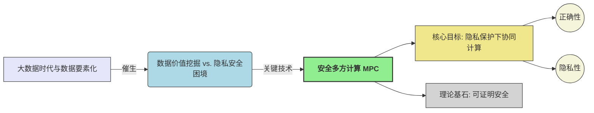
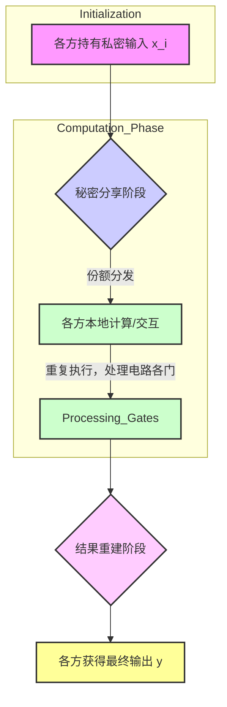

# 第1章 引言 (Introduction)

本章概述安全多方计算 (Secure Multi-Party Computation, MPC) 的基本概念、核心问题、应用场景以及本书的组织结构。

## 1.1 安全多方计算 (Secure Multi-Party Computation)

!!! abstract "MPC 定义与目标"

    **安全多方计算 (MPC)** 是一种密码学分支，旨在允许多个互不信任的参与方 $P_1, \dots, P_n$，在各自持有私密输入 $x_1, \dots, x_n$ 的情况下，共同计算一个约定函数 $y = f(x_1, \dots, x_n)$，并确保：
    
    -   **正确性 (Correctness)**: 协议输出的 $y$ 与函数 $f$ 的真实计算结果一致。
    
    -   **隐私性 (Privacy)**: 协议执行过程中，任何参与方（或其子集）除了其应得的计算结果外，不能获取关于其他参与方私密输入的任何额外信息。
    
    其核心价值在于打破数据孤岛，实现“数据可用不可见”。

!!! danger "可信第三方 (TTP) 模型的局限性"

    一个理想化的 TTP 可以轻易解决 MPC 问题，但现实中：
    
    -   **信任根难以建立**: 绝对中立且技术上无懈可击的 TTP 难寻。
    
    -   **单点故障 (Single Point of Failure)**: TTP 被攻破将导致所有数据泄露。
    
    MPC 的研究动力即源于摆脱对 TTP 的依赖。

???+ example "案例：第一价格密封拍卖 (First-Price Sealed-Bid Auction)"

    -   **目标**: 确定最高出价者及其出价，不泄露其他竞拍者的出价。
    
    -   **函数**: $f(x_1, \dots, x_n) = (\max(x_i), \text{argmax}(x_i))$
    
    -   **隐私挑战**: 如何在比较过程中隐藏非中标出价？

## 1.2 基础协议构造思想

本节通过构造简单的安全加法和乘法协议，初步展示 MPC 的实现思路。这些协议基于**秘密分享 (Secret Sharing)** 和一些基础的密码学操作。

### 1.2.1 秘密分享机制 (Secret Sharing)

!!! definition "秘密分享"

    将一个秘密 $s$ 分割成 $n$ 个份额 (shares) $s_1, \dots, s_n$，分发给 $n$ 个参与方。
    
    -   **隐私性**: 少于特定数量（门限 $t$）的份额无法恢复 $s$。
    
    -   **正确性/可恢复性**: 达到或超过门限数量的份额可以唯一确定 $s$。

???+ tip "教材示例：复制秘密分享 (Replicated Secret Sharing) for $n=3$, threshold $t=2$"

    针对秘密 $x \in \mathbb{Z}_p$ (素数 $p$ 为模数)：
    
    1.  **份额生成 ($P_S$ 持有秘密 $x$)**:
    
        -   $P_S$ 随机选择 $r_1, r_2 \in \mathbb{Z}_p$。
        -   计算 $r_3 = (x - r_1 - r_2) \pmod p$。
        -   此时，$x \equiv r_1 + r_2 + r_3 \pmod p$。
    
    2.  **份额分配**: (教材中 $P_1$ 生成份额并分配)
    
        -   $P_1$ 自己保留 $(r_2, r_3)$。
        -   $P_1$ 发送 $(r_1, r_3)$ 给 $P_2$。
        -   $P_1$ 发送 $(r_1, r_2)$ 给 $P_3$。
    
    3.  **秘密恢复**:
    
        -   任何单个参与方（例如 $P_2$ 持有 $r_1, r_3$）无法独自恢复 $x$ (因为 $r_2$ 未知)。
        -   三方合作，收集所有 $r_1, r_2, r_3$ 即可计算 $x = (r_1 + r_2 + r_3) \pmod p$。

### 1.2.2 安全加法协议 (Secure Addition Protocol)

**目标**: $n=3$ 个参与方 $P_1, P_2, P_3$ 各自持有秘密输入 $x_1, x_2, x_3 \in \mathbb{Z}_p$，共同计算 $y = (x_1 + x_2 + x_3) \pmod p$。

???+ protocol "安全加法协议流程 ($n=3$)"

    1.  **输入分享 (Input Sharing)**:
    
        -   每个 $P_i$ 将其输入 $x_i$ 进行上述复制秘密分享，得到份额 $(r_{i,1}, r_{i,2}, r_{i,3})$。
        -   $P_i$ 将其产生的份额按规则分配给其他参与方和自己。
        -   结果：$P_k$ (对于 $k \in \{1,2,3\}$) 会持有其他两方分享给它的对应部分的份额，以及自己输入对应部分的份额。例如，$P_1$ 持有自己输入产生的 $(r_{1,2}, r_{1,3})$，并收到来自 $P_2$ 的 $(r_{2,1}, r_{2,3})$ 中的 $r_{2,1}$ (若 $P_1$ 对应第一个部分和) 和 $r_{2,3}$ (若 $P_1$ 对应第三个部分和)，以及来自 $P_3$ 的类似份额。
            (教材描述：$P_i$ 对 $x_i$ 分享后，每个参与方 $P_j$ 持有 $r_{i,j}$，这里符号指 $x_i$ 的第 $j$ 个份额给了 $P_j$。然后每个 $P_k$ 计算 $s_k = \sum_{i=1}^3 r_{i,k}$。)
            **按教材逻辑 (Page 2, 1.1.2 Secret Sharing)**：
            $P_1$ 的输入 $x_1$，分享为 $x_1 = r_{1,1}+r_{1,2}+r_{1,3}$。
            $P_1$ 发送 $r_{1,1}, r_{1,3}$ 给 $P_2$；发送 $r_{1,1}, r_{1,2}$ 给 $P_3$；自己保留 $r_{1,2}, r_{1,3}$。
            其他 $P_i$ 对 $x_i$ 做类似操作。
            **本地计算 (Page 3, step 3)**：
            每个参与方 $P_i$ 将三个对应的秘密份额相加。即，对于 $l \neq i$，$P_i$ 计算 $s_l = r_{1,l} + r_{2,l} + r_{3,l} \pmod p$ 并公布 $s_l$。每个参与方计算并公布两个值。
            例如，$P_1$ 计算并公布 $s_2 = r_{1,2}+r_{2,2}+r_{3,2}$ 和 $s_3 = r_{1,3}+r_{2,3}+r_{3,3}$。
    2.  **结果重建 (Output Reconstruction)**:
    
        *   每个参与方（例如 $P_1$）收集所有公布的 $s_l$ (这里是 $s_2, s_3$)，并计算其未公布的 $s_i$ (例如 $s_1 = r_{1,1}+r_{2,1}+r_{3,1}$，注意 $P_1$ 没有 $r_{1,1}$，这部分的份额 $s_1$ 是通过其他方公布的 $s_2, s_3$ 及最终结果 $y$ 推算出来的，或者 $s_1$ 也是由某个参与方公布)。
        *   **按教材 (Page 3, step 4)**：每个参与方计算结果 $y = s_1 + s_2 + s_3 \pmod p$。（这里假设 $s_1, s_2, s_3$ 都是公开的）。

!!! success "正确性"
    $$
    y = \sum_{l=1}^3 s_l = \sum_{l=1}^3 \sum_{i=1}^3 r_{i,l} = \sum_{i=1}^3 \sum_{l=1}^3 r_{i,l} = \sum_{i=1}^3 x_i \pmod p
    $$

!!!- info "隐私性直观分析 (基于模拟的视角)"

    -   以 $P_1$ 为例，它知道自己的输入 $x_1$ 和最终输出 $y$。
    -   在协议中，$P_1$ 公布了 $s_2, s_3$ (由其持有的 $x_1, x_2, x_3$ 的份额计算得到)。
    -   $P_1$ 可以从 $y, s_2, s_3$ 推断出 $s_1 = y - s_2 - s_3 \pmod p$。
    -   关键在于，$s_1$ (或 $P_1$ 公布的 $s_2, s_3$) 并不直接泄露 $x_2, x_3$ 的原始值，因为它们是多个随机份额的线性组合。
    -   **模拟器 (Simulator)**: 模拟器仅知道 $P_1$ 的输入 $x_1$ 和输出 $y$。它可以随机选择 $s'_2, s'_3$，然后计算 $s'_1 = y - s'_2 - s'_3$。这个 $(s'_1, s'_2, s'_3)$ 的分布与真实协议中 $P_1$ 观察到的 $(s_1, s_2, s_3)$ 的分布是不可区分的（因为原始份额是随机的）。

### 1.2.3 安全乘法协议 (Secure Multiplication Protocol)

**目标**: 计算 $ab \pmod p$，其中 $a, b$ 已经通过复制秘密分享方案分享给 $P_1, P_2, P_3$。

???+ protocol "安全乘法协议流程 ($n=3$)"

    假设 $P_1$ 输入 $a$, $P_2$ 输入 $b$, $P_3$ 无输入。
    $a = a_1+a_2+a_3$, $b = b_1+b_2+b_3$。
    $ab = \sum a_i b_j$。
    1.  **份额分发 (Share Distribution)**:
    
        *   $P_1$ 对 $a$ 进行复制秘密分享，分发份额 $(a_1, a_2, a_3)$。
        *   $P_2$ 对 $b$ 进行复制秘密分享，分发份额 $(b_1, b_2, b_3)$。
    2.  **本地乘积项计算 (Local Product Term Computation)**: (按 Page 4, step 2)
    
        *   $P_1$ 计算 $u_1 = (a_2 b_2 + a_2 b_3 + a_3 b_2) \pmod p$。
        *   $P_2$ 计算 $u_2 = (a_3 b_3 + a_1 b_3 + a_3 b_1) \pmod p$。
        *   $P_3$ 计算 $u_3 = (a_1 b_1 + a_1 b_2 + a_2 b_1) \pmod p$。
        *   $u_1, u_2, u_3$ 是各个参与方的私有中间值。
    3.  **安全加法 (Secure Addition)**:
        *   参与方以 $u_1, u_2, u_3$ 作为各自的秘密输入，执行上一节的安全加法协议。
        *   输出 $y = (u_1 + u_2 + u_3) \pmod p = ab \pmod p$。

!!! success "正确性"
    $$
    u_1+u_2+u_3 = (a_2b_2+a_2b_3+a_3b_2) + (a_3b_3+a_1b_3+a_3b_1) + (a_1b_1+a_1b_2+a_2b_1) = \sum_{i,j} a_ib_j = ab \pmod p
    $$

!!!- info "隐私性分析"

    -   本地计算阶段，每个 $P_i$ 只使用其持有的份额，不泄露 $a, b$。
    -   安全加法阶段的隐私性依赖于安全加法协议本身的隐私性。
    -   因此，在半诚实模型下，该协议是隐私的。

## 1.3 安全威胁与对策初步

上述协议均假设参与方**半诚实 (Semi-Honest)**：遵循协议但试图从记录中推断信息。现实中需考虑**恶意 (Malicious)** 行为。

### 1.3.1 输入替换 (Input Replacement)

!!! warning "固有限制"

    -   恶意方 $P_i^*$ 可以自由选择其输入 $x_i^*$ 参与协议。
    -   协议层面无法完全阻止，因为 $P_i^*$ 控制其本地输入。
    -   **应对**: 通常依赖应用层机制或博弈论。

### 1.3.2 协议偏离 (Protocol Deviation)

恶意方不遵循协议指令。

!!! danger "协议偏离的风险"

    -   破坏正确性。
    -   破坏隐私性。

???+ check "一致性校验 (Consistency Check)"

    -   **思想**: 增加冗余和交叉验证。
    -   **例子 (安全加法 - 秘密分享阶段)**: (Page 5)
        1.  当 $P_1$ 向 $P_2$ 和 $P_3$ 分享 $x_1$ 的份额时，例如发送 $(r_{1,1}, r_{1,3})$ 给 $P_2$ 和 $(r_{1,1}, r_{1,2})$ 给 $P_3$。
        2.  $P_2$ 和 $P_3$ 可以互相发送它们共同收到的份额 (如 $r_{1,1}$)。
        3.  如果 $P_2$ 从 $P_3$ 处收到的 $r_{1,1}'$ 与自己从 $P_1$ 处收到的 $r_{1,1}$ 不同，则检测到 $P_1$ 作弊。
    -   **例子 (安全加法 - 部分和公布阶段)**: (Page 5)
        1.  当 $P_1$ 公布 $s_2$ 时 ($s_2 = r_{1,2}+r_{2,2}+r_{3,2}$)，$P_3$ 也需要计算 $s_2$ 并公布。
        2.  所有参与方可以比较 $P_1$ 公布的 $s_2$ 和 $P_3$ 公布的 $s_2$ 是否一致。

!!! key "恶意安全 (Malicious Security)"
    如果协议能确保任何（除了输入替换外的）恶意偏离行为都会被高概率检测到，并且在检测到作弊时，协议能安全中止，不泄露诚实方信息，则称协议是**恶意安全的**。

## 1.4 通用解决方案与展望

!!! success "通用性"

    -   任何可以在 $\mathbb{Z}_p$ 上表示的计算（算术电路）都可以通过组合安全加法和安全乘法协议来实现。
    -   任何布尔电路都可转化为算术电路。

!!!- enlightenment "本书后续内容"

    -   **第2章**: 密码学基础，可证明安全。
    -   **第3章**: 更通用的MPC协议示例 (Shamir秘密分享)。
    -   **第4章**: 形式化的安全模型 (UC框架)。
    -   **后续章节**: 半诚实协议 (OT, BGW, GMW, Yao's GC, BMR) 和恶意安全协议。

## 1.5 协议执行流程图 (抽象)

