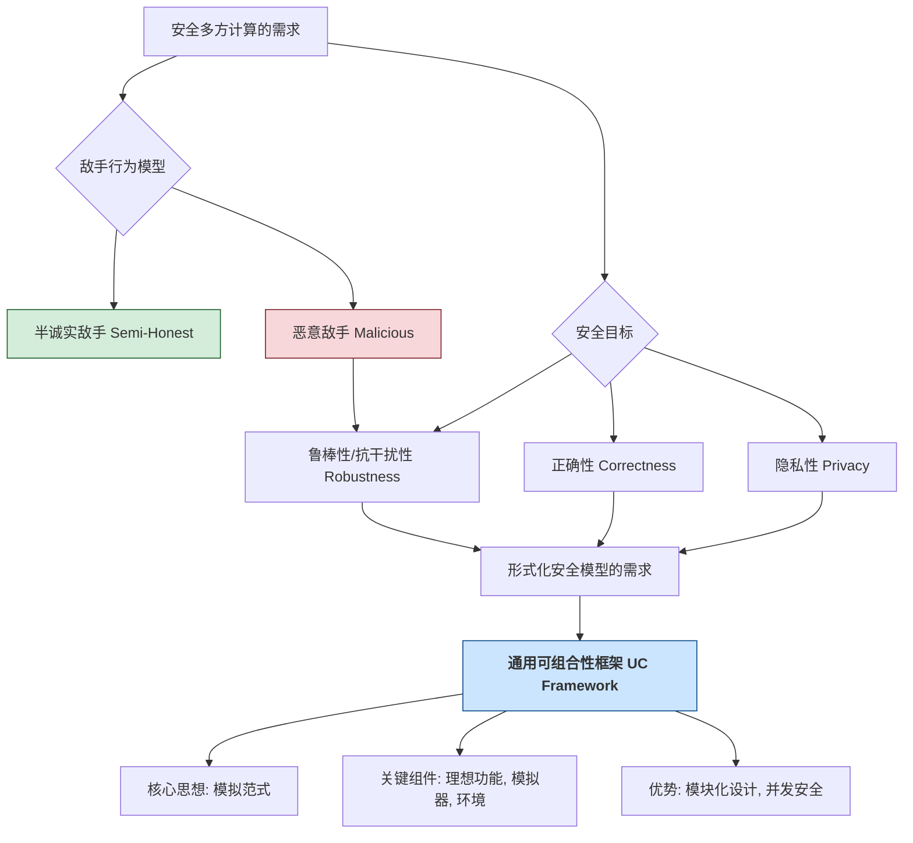
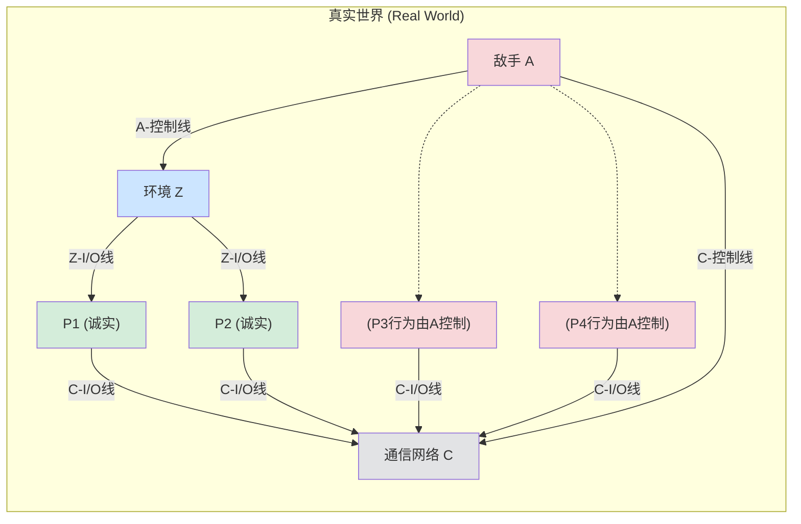
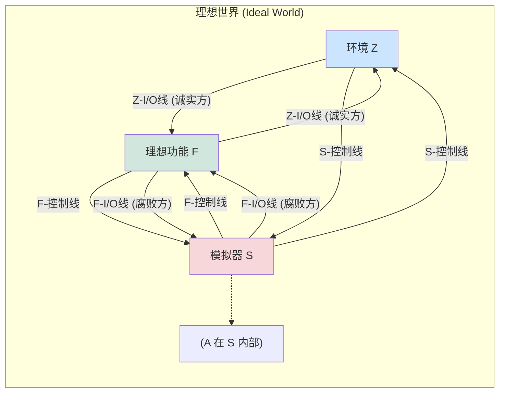

# 第4章 安全模型 (Security Models)

在上一章中，我们介绍了一个具有完美正确性和完美隐私性的 MPC 协议，但其安全性是建立在所有参与方都诚实遵守协议（即**半诚实敌手模型 (Semi-Honest Adversary Model)** 或**被动安全模型 (Passively Secure Model)**）的假设之上的。然而，在现实场景中，参与方可能会恶意偏离协议以获取额外利益或破坏协议执行（即**恶意敌手模型 (Malicious Adversary Model)** 或**主动安全模型 (Actively Secure Model)**）。

本章的核心目标是引入一个形式化的、强大的密码学安全模型——**通用可组合性框架 (Universal Composability framework, UC framework)**。这个框架由 Canetti 提出，旨在为密码学协议（尤其是 MPC 协议）提供一个统一且模块化的安全性分析标准。UC 安全的协议具有优秀的性质，即它们在任意环境下（包括与其他协议并发执行或作为更大协议的子模块时）仍然保持其安全性。

在深入 UC 框架的细节之前，我们将首先延续上一章对隐私性的讨论，并探讨如何以类似的方式定义恶意安全性，进而阐明为何需要一个统一的框架来同时刻画这两个属性。

## 4.1 隐私性与恶意安全性 (Privacy and Malicious Security)

我们在第3章非形式化地讨论了半诚实模型下的隐私性，其核心思想是：被攻陷方从协议中获得的所有信息（视图 view）都可以由其自身的输入和应得的输出高效地模拟出来。

### 4.1.1 定义隐私性 (Defining Privacy - Revisited)

回顾一下，隐私性的非形式化定义：
> 如果一个协议总是满足**泄漏值 (leakage value)** 不包含比**允许值 (allowed value)** 更多的信息，那么它具有隐私性。

*   **允许值**: 被攻陷方 $C$ 根据协议定义理应获得的其自身输入 $\{x_j\}_{P_j \in C}$ 和输出 $\{y_j\}_{P_j \in C}$。
*   **泄漏值**: 被攻陷方 $C$ 在协议执行过程中实际观察到的所有信息 $\{view_j\}_{P_j \in C}$。

为了将“不包含更多信息”形式化，我们引入**模拟器 (Simulator)** 的概念：

> 如果存在一个高效的模拟器 $S$，它仅以允许值 $\{x_j, y_j\}_{P_j \in C}$ 作为输入，就能生成一个模拟视图 $S(\{x_j, y_j\}_{P_j \in C})$，该模拟视图与真实协议中的泄漏值 $\{view_j\}_{P_j \in C}$ 具有**不可区分的分布**，那么该协议就被认为是满足隐私性的。

**分布的考虑**: (Page 28, 一个微妙的细节)
当协议涉及诚实方的随机性，或者协议的输出本身是概率性的时，仅仅要求模拟视图与泄漏值的边际分布不可区分是不够的。我们需要考虑它们与**诚实方输出的联合分布 (joint distribution with the outputs of honest parties)**。

*   **例子 (愚蠢的功能 $\mathcal{F}$)**: $P_1$ 获得一个随机比特， $P_2$ 无输出。
    *   **安全协议 $\Pi_{sec}$**: $P_1$ 选择随机比特 $b_{P_1}$ 并输出；$P_2$ 什么都不做。
    *   **不安全协议 $\Pi_{insec}$**: $P_1$ 选择随机比特 $b_{P_1}$ 并输出，然后将 $b_{P_1}$ 发送给 $P_2$。
    
    如果只考虑被攻陷的 $P_2$ 的视图，在 $\Pi_{insec}$ 中，$P_2$ 的视图是 $b_{P_1}$。模拟器 $S$ 可以简单地输出一个随机比特 $b_S$。 $b_S$ 和 $b_{P_1}$ 的分布是相同的。这会错误地判定 $\Pi_{insec}$ 是安全的。
    
    正确的做法是比较联合分布：
    *   真实世界 ($P_2$ 攻陷): $(\text{view}_{P_2}, \text{output}_{P_1}) = (b_{P_1}, b_{P_1})$。
    *   理想世界 (模拟器 $S$ for $P_2$): $(S(\text{allowed for } P_2), \text{output}_{P_1}) = (b_S, b_{P_1})$。
    这两个联合分布是可区分的，因为在真实世界中两部分总是相等，而在理想世界中它们是独立的（有 $1/2$ 的概率不相等）。

**结论**:
*   如果功能是**确定性的 (deterministic)** (输出完全由输入决定)，可以仅考虑被攻陷方的视图。
*   如果功能是**概率性的 (probabilistic)** (输出包含随机性)，则必须考虑被攻陷方视图与诚实方输出的联合分布。

### 4.1.2 定义恶意安全性 (Defining Malicious Security)

恶意安全性关注的是敌手通过偏离协议行为对协议造成的影响，而不仅仅是获取信息。

**核心思想**: 敌手的任何恶意行为所能造成的影响，不应超出其通过合法方式（即仅替换自己的输入）在理想世界中能造成的影响。

**理想世界 (Ideal World)**:
存在一个完全可信的硬件盒子（或可信第三方 TTP），它执行函数 $f$。
1.  各参与方 $P_i$ 将其输入 $x_i$ 安全地发送给盒子。
2.  盒子计算 $(y_1, \dots, y_n) = f(x_1, \dots, x_n)$。
3.  盒子将 $y_i$ 秘密地发送给 $P_i$。
4.  盒子销毁所有内部状态。

在理想世界中，被攻陷方 $C$ 唯一能做的就是：收集 $C$ 中所有成员的原始输入，选择一组新的（可能是恶意的）输入 $\{x_j^*\}_{P_j \in C}$，然后将这些 $x_j^*$ (以及诚实方的真实输入) 发送给盒子。这就是**允许的影响 (allowed influence)**。

**实际影响 (Real-world Influence)**: 在真实协议中，被攻陷方可以发送任意构造的消息。

**恶意安全性的首次尝试定义**:
> 如果一个协议满足其实际影响的效果可以通过允许的影响来获得，那么它是恶意安全的。

更精确地，使用模拟器：
> 如果对于每个（恶意）攻击协议的敌手，都存在一个模拟器 $S$，该模拟器在理想世界中仅通过输入替换就能高效地计算出与真实世界中敌手攻击所产生的**相同效果（输出分布）**，那么该协议是恶意安全的。

*   **例1 (Page 29)**: $f(x_1,x_2,x_3) = (x_1x_2x_3, x_2, x_3)$。 $P_1$ 被攻陷，它将输入 $x_1$ 替换为 $x_1'=1$。最终 $P_1$ 得到 $x_2x_3$。这是允许的影响，因为 $P_1$ 可以在理想世界中通过提交 $x_1'=1$ 达到同样效果。
*   **例2 (Page 29)**: 同上函数，但 $P_1$ 在乘法计算的中间步骤恶意修改了其分享的份额，使得最终 $P_1$ 得到了 $x_3$ (而不是 $x_1x_2x_3$)。这通常是不允许的，因为在理想世界中， $P_1$ 无法通过仅替换其输入 $x_1$ 来稳定地获得 $x_3$（特别是当 $x_1$ 或 $x_2$ 为0时）。这种攻击不仅影响了正确性，还可能泄露了 $x_3$ 的信息给一个本不应完全获得它的 $P_1$。

### 4.1.3 同时获得隐私性和恶意安全性 (Achieving Both Privacy and Malicious Security)

一个完整的安全定义应该同时涵盖隐私性和恶意安全性。这意味着需要存在一个**单一的模拟器**，它既能模拟被攻陷方的视图（保证隐私性），又能将在真实世界中对协议输出的影响转化为理想世界中允许的输入替换（保证恶意安全性）。

### 4.1.4 通用可组合框架概述 (Universal Composability Framework - Overview)

UC 框架通过将参与方建模为**交互式图灵机 (Interactive Turing Machines, ITM)** 来形式化上述思想。

*   **ITM**: 图灵机的扩展，拥有输入/输出纸带用于与其他 ITM 通信，并拥有唯一的身份。
*   **激活 (Activation)**: 在任何时刻，只有一个 ITM 处于激活状态并执行操作。ITM 通过发送消息来激活另一个 ITM。
*   **敌手 $\mathcal{A}$**: 一个特殊的 ITM，在协议开始时首先被激活。
*   **理想功能 (Ideal Functionality) $\mathcal{F}$**: 代表协议要实现的理想化服务（如 TTP）。
*   **模拟器 (Simulator) $\mathcal{S}$**: 在理想世界中，$\mathcal{S}$ 与 $\mathcal{F}$ 交互，并试图模拟真实世界中所有参与方和通信信道对外部观察者（环境）所呈现的接口。

**不可区分性 (Indistinguishability)**:
UC 安全的核心在于引入一个**环境 (Environment) $\mathcal{Z}$**。$\mathcal{Z}$ 是一个特殊的 ITM，它为协议的参与方提供输入，并观察协议的输出，最终输出一个比特来判断自己是在与真实协议交互还是在与理想功能（通过模拟器）交互。

*   **真实世界执行**: $\text{EXEC}_{\Pi, \mathcal{A}, \mathcal{Z}}$，环境 $\mathcal{Z}$ 与协议 $\Pi$ 的实例（由诚实方和敌手 $\mathcal{A}$ 控制的腐败方组成）交互。
*   **理想世界执行**: $\text{EXEC}_{\mathcal{F}, \mathcal{S}, \mathcal{Z}}$，环境 $\mathcal{Z}$ 与理想功能 $\mathcal{F}$ 和模拟器 $\mathcal{S}$（$\mathcal{S}$ 内部可能运行真实敌手 $\mathcal{A}$ 的代码）交互。

> 如果对于任何 PPT 环境 $\mathcal{Z}$，它都无法以不可忽略的优势区分真实世界执行和理想世界执行（即 $\text{EXEC}_{\Pi, \mathcal{A}, \mathcal{Z}} \stackrel{c}{\approx} \text{EXEC}_{\mathcal{F}, \mathcal{S}, \mathcal{Z}}$），那么协议 $\Pi$ 被称为 **UC-安全地实现了 (UC-realizes)** 理想功能 $\mathcal{F}$。

**UC 框架的优势**:
*   **模块化组合**: UC 安全的协议可以作为子模块安全地用于构建更大的 UC 安全协议。
*   **并发安全**: UC 安全的协议在多个实例并发执行时仍然保持安全。

**通用可组合模型与独立 (Stand-alone) 模型的区别**: (Page 32)
*   **独立模型**: 不引入环境 $\mathcal{Z}$（或 $\mathcal{Z}$ 不与敌手实时交互）。协议会话独立运行。安全性证明通常允许模拟器对敌手进行“倒带 (rewind)”。
*   **UC 模型**: 环境 $\mathcal{Z}$ 的引入模拟了任意复杂的外部环境，包括并发协议。不允许模拟器“倒带”敌手，要求“直线式 (straight-line)”模拟。这使得 UC 安全性更难实现，但也更强大。

## 4.2 形式化模型——通用可组合框架 (Formal Model - Universal Composability Framework)

本节将更详细地介绍 UC 框架的组成部分和运行机制。

### 4.2.1 真实协议及其运行 (Real Protocol and its Execution)

考虑一个有 $N$ 个参与方 $P_1, \dots, P_N$ 运行协议 $\Pi$ 的场景。存在一个敌手 $\mathcal{A}$。被攻陷的参与方的行为被整合到 $\mathcal{A}$ 的逻辑中。

**组件 (图 4.1)**:

*   **环境 $\mathcal{Z}$**:
    *   为诚实参与方提供协议输入。
    *   从诚实参与方接收协议输出。
    *   与敌手 $\mathcal{A}$ 通过 **A-控制线** 实时交互，可以向 $\mathcal{A}$ 发送指令（如攻陷某个参与方），并从 $\mathcal{A}$ 接收“泄露信息”。
    *   在协议开始前确定哪些参与方被攻陷。
*   **诚实参与方 $P_i$ (Honest Parties)**: 严格按照协议 $\Pi$ 的规定执行。通过 **Z-I/O线** 与环境交互，通过 **C-I/O线** 与通信网络 $C$ 交互。
*   **被攻陷参与方 $P_j$ (Corrupted Parties)**: 其行为完全由敌手 $\mathcal{A}$ 控制。它们与通信网络 $C$ 的交互也通过 $\mathcal{A}$ 代理。
*   **敌手 $\mathcal{A}$ (Adversary)**:
    *   控制所有被攻陷参与方。
    *   通过 **C-控制线** 与通信网络 $C$ 交互，可以：
        *   观察消息元数据（长度、发送方、接收方）。
        *   调度（延迟、重排）消息的传递。
        *   不能直接读取或修改诚实方之间的加密消息内容。
*   **通信网络 $C$ (Communication Network)**:
    *   通常假设提供安全的点对点信道（隐私性和完整性）。
    *   是异步的，消息传递顺序和时间由敌手 $\mathcal{A}$ 控制。

#### 4.2.1.1 真实协议的运行机制

1.  **初始化**: 环境 $\mathcal{Z}$ 启动，确定一组被攻陷方（该信息对 $\mathcal{A}$ 和 $C$ 可见，对诚实方不可见）。
2.  **激活传递**:
    *   $\mathcal{Z}$ 首先被激活，可以向诚实方提供输入，或向 $\mathcal{A}$ 发送控制指令。然后 $\mathcal{Z}$ 将激活传递给某个参与方或 $\mathcal{A}$。
    *   当诚实方 $P_i$ 被激活，它执行协议步骤，可能会向 $C$ 发送消息请求 (格式如 `(Send, (j1, m1), (j2, m2), ...)`，其中 $j_k$ 是接收方，$m_k$ 是消息)。
    *   当 $\mathcal{A}$ 被激活，它可以指示被攻陷方发送消息，或通过 C-控制线影响 $C$ 的行为。
    *   当 $C$ 通过 C-I/O 线收到来自 $P_i$ (或 $\mathcal{A}$ 代表的 $P_i$) 的发送请求 `(Send, ...)` 时，它将这些消息的元组 `(i, j_k, m_k)` 存入内部缓冲区 `buf`，并通过 C-控制线向 $\mathcal{A}$ 发送泄露信息 `(Sent, i, (j1, len(m1)), ...)`。
    *   当 $C$ 通过 C-控制线从 $\mathcal{A}$ 收到传递指令 `(Deliver, k)` (其中 $k$ 是 `buf` 中的索引) 时，如果 `buf[k]` 是 `(i, j, m)`，则 $C$ 将消息 `(Receive, i, m)` 沿着对应的 C-I/O 线发送给 $P_j$ (如果 $P_j$ 诚实) 或 $\mathcal{A}$ (如果 $P_j$ 被攻陷)。
3.  **终止**: 当 $\mathcal{Z}$ 完成所有操作后，它输出一个比特（通常表示它认为自己是在真实世界还是理想世界）。

#### 4.2.1.2 敌手与诚实方的通信

如上所述，在基础模型中，敌手 $\mathcal{A}$ 不直接与诚实方 $P_i$ 通信，所有交互都通过通信网络 $C$ 进行。变体模型可以允许直接通信，此时 $C$ 的作用减弱或消失。

#### 4.2.1.3 平凡敌手 (Dummy Adversary)

平凡敌手 $\mathcal{A}_{\text{triv}}$ 是一个简单的路由器：
*   忠实执行来自 $\mathcal{Z}$ 的控制指令。
*   将从其他机器收到的所有消息（包括泄露信息）转发给 $\mathcal{Z}$。
*   不主动进行任何恶意操作。

#### 4.2.1.4 运行时间考虑

*   **良好环境 (Well-behaved Environment)**: $\mathcal{Z}$ 的运行时间是安全参数 $\lambda$ 的多项式。
*   **兼容的敌手 (Compatible Adversary)**: 对于任何良好环境 $\mathcal{Z}$，敌手 $\mathcal{A}$ 与协议 $\Pi$ 的总运行时间（以压倒性概率）是关于 $\lambda$ 和 $\mathcal{Z}$ 发送的消息总长度的多项式。
*   **高效协议 (Efficient Protocol)**: 如果平凡敌手 $\mathcal{A}_{\text{triv}}$ 与协议 $\Pi$ 是兼容的。

### 4.2.2 理想协议及其运行 (Ideal Protocol and its Execution)

理想协议的运行与真实协议类似，但有关键区别：

**组件 (图 4.2)**:

*   **理想功能 $\mathcal{F}$ (Ideal Functionality)**:
    *   代替了真实协议 $\Pi$ 和通信网络 $C$。
    *   直接与环境 $\mathcal{Z}$（代表诚实方）和模拟器 $\mathcal{S}$（代表被攻陷方）交互。
    *   其行为精确定义了协议应该达成的目标（例如，对于安全函数计算，$\mathcal{F}_{\text{sfe}}$ 会接收所有输入，计算函数，并将相应输出发送给各方）。
*   **模拟器 $\mathcal{S}$ (Simulator)**:
    *   代替了真实世界的敌手 $\mathcal{A}$ 与环境 $\mathcal{Z}$ 的直接交互。
    *   $\mathcal{S}$ 的目标是使得环境 $\mathcal{Z}$ 无法区分它是在与真实世界的 $(\Pi, \mathcal{A})$ 交互，还是在与理想世界的 $(\mathcal{F}, \mathcal{S})$ 交互。
    *   $\mathcal{S}$ 可以控制理想世界中被攻陷方的输入给 $\mathcal{F}$，并接收 $\mathcal{F}$ 给被攻陷方的输出。
    *   $\mathcal{S}$ 通过 S-控制线与 $\mathcal{Z}$ 通信，模拟真实世界中 $\mathcal{A}$ 与 $\mathcal{Z}$ 的通信以及通信网络 $C$ 对 $\mathcal{Z}$ 的可见行为。

#### 4.2.2.1 理想协议的运行机制

1.  **初始化**: 环境 $\mathcal{Z}$ 启动，确定一组被攻陷方（该信息对 $\mathcal{S}$ 和 $\mathcal{F}$ 可见）。
2.  **激活传递与交互**:
    *   $\mathcal{Z}$ 向诚实方发送的协议输入，会直接通过 Z-I/O 线路由给 $\mathcal{F}$。
    *   $\mathcal{Z}$ 向被攻陷方发送的协议输入（通过 $\mathcal{S}$ 的 S-控制线模拟），$\mathcal{S}$ 接收后决定实际提供给 $\mathcal{F}$ 的输入（通过 F-I/O 线）。
    *   $\mathcal{F}$ 完成计算后：
        *   给诚实方的输出通过 Z-I/O 线直接给 $\mathcal{Z}$。
        *   给被攻陷方的输出通过 F-I/O 线给 $\mathcal{S}$。$\mathcal{S}$ 再决定如何通过 S-控制线向 $\mathcal{Z}$ 模拟这些输出的到达。
    *   $\mathcal{F}$ 可能会通过 F-控制线向 $\mathcal{S}$ 发送泄露信息（例如，哪个参与方提供了输入）。
    *   $\mathcal{S}$ 可以通过 S-控制线向 $\mathcal{Z}$ 发送泄露信息，模拟真实世界中 $\mathcal{A}$ 或 $C$ 的行为。
    *   $\mathcal{Z}$ 也可以通过 S-控制线向 $\mathcal{S}$ 发送控制指令。

#### 4.2.2.2 运行时间考虑

*   **兼容的模拟器**: 对于任何良好环境 $\mathcal{Z}$，理想功能 $\mathcal{F}$ 和模拟器 $\mathcal{S}$ 的总运行时间（以压倒性概率）是关于 $\lambda$ 和 $\mathcal{Z}$ 发送的消息总长度的多项式。

### 4.2.3 安全函数计算的理想功能 (Ideal Functionality for Secure Function Evaluation, $\mathcal{F}_{\text{sfe}}$)

$\mathcal{F}_{\text{sfe}}$ 是 UC 框架中用于定义安全多方函数计算任务的标准理想功能。

**参数**: 一个公开确定的函数 $f$ (通常表示为电路)。
**行为**:
1.  **接收输入**:
    *   当 $\mathcal{F}_{\text{sfe}}$ 从诚实方 $P_i$ (通过 $\mathcal{Z}$) 或被攻陷方 $P_j$ (通过 $\mathcal{S}$) 收到格式为 `(Input, inputID, x)` 的消息时：
        *   记录该输入。
        *   通过 F-控制线向 $\mathcal{S}$ 发送泄露消息 `(Input, inputID, party_ID)`，通知 $\mathcal{S}$ 哪个参与方提供了哪个输入ID。
2.  **计算并分发输出**:
    *   当 $\mathcal{F}_{\text{sfe}}$ 从 $\mathcal{S}$ 收到格式为 `(Output, outputID, party_ID_receiver)` 的控制消息，并且所有参与方都已提供了计算该 `outputID` 所需的全部输入时：
        *   $\mathcal{F}_{\text{sfe}}$ 计算相应的输出值 $y$。
        *   如果 `party_ID_receiver` 是诚实方，则将 `(Output, outputID, y)` 通过 Z-I/O 线发送给 $\mathcal{Z}$ (代表该诚实方)。
        *   如果 `party_ID_receiver` 是被攻陷方，则将 `(Output, outputID, y)` 通过 F-I/O 线发送给 $\mathcal{S}$。

**概率功能 (Probabilistic Functionality)**: 如果函数 $f$ 本身是概率性的，$\mathcal{F}_{\text{sfe}}$ 会自行生成所需的内部随机性。

### 4.2.4 UC-安全实现 (UC-Secure Realization)

**定义 4.2.2 (特定敌手的 UC 安全)**:
设 $\mathcal{A}$ 是与协议 $\Pi$ 兼容的敌手。如果存在一个与理想功能 $\mathcal{F}$ 兼容的模拟器 $\mathcal{S}$ (可能依赖于 $\mathcal{A}$)，使得对于每个良好环境 $\mathcal{Z}$，都有：
$$
\text{EXEC}_{\Pi, \mathcal{A}, \mathcal{Z}} \stackrel{c}{\approx} \text{EXEC}_{\mathcal{F}, \mathcal{S}, \mathcal{Z}}
$$
那么称协议 $\Pi$ **对于敌手 $\mathcal{A}$ UC-安全地实现了** $\mathcal{F}$。

**定义 4.2.3 (通用 UC 安全)**:
如果对于**每个**与 $\Pi$ 兼容的敌手 $\mathcal{A}$，协议 $\Pi$ 都对于该敌手 $\mathcal{A}$ UC-安全地实现了 $\mathcal{F}$，那么称协议 $\Pi$ **UC-安全地实现了** $\mathcal{F}$。

**图 4.3 (定义 4.2.2 的示意图)**:
*   (a) 真实世界: 环境 $\mathcal{Z}$ 与 $(\Pi, \mathcal{A}, C)$ 交互。
*   (b) 理想世界: 环境 $\mathcal{Z}$ 与 $(\mathcal{F}, \mathcal{S})$ 交互。
目标是使 $\mathcal{Z}$ 无法区分这两种情况。

**定理 4.1 (平凡敌手的完备性 - The Dummy Adversary Completeness Theorem)**: (Page 40)
设 $\Pi$ 是一个高效的协议。如果 $\Pi$ 对于平凡敌手 $\mathcal{A}_{\text{triv}}$ UC-安全地实现了理想功能 $\mathcal{F}$，那么 $\Pi$ UC-安全地实现了 $\mathcal{F}$ (即对于所有兼容敌手都安全)。
这个定理极大地简化了 UC 安全性证明：我们只需要为平凡敌手构造一个模拟器即可。

**证明概要 (图 4.4)**:
假设 $\Pi$ 对平凡敌手 $\mathcal{A}_{\text{triv}}$ 安全，即存在模拟器 $S_{\text{triv}}$ 使得 $\text{EXEC}_{\Pi, \mathcal{A}_{\text{triv}}, \mathcal{Z}} \stackrel{c}{\approx} \text{EXEC}_{\mathcal{F}, S_{\text{triv}}, \mathcal{Z}}$。
对于任意敌手 $\mathcal{A}$，我们可以构造一个新的模拟器 $S_{\mathcal{A}} = S_{\text{triv}}|\mathcal{A}$ (将 $\mathcal{A}$ "嵌入" $S_{\text{triv}}$ 内部运行， $S_{\text{triv}}$ 模拟 $\mathcal{A}$ 与环境和理想功能的交互)。
同时，构造一个新的环境 $\mathcal{Z}|\mathcal{A}$ (将 $\mathcal{A}$ "嵌入" $\mathcal{Z}$ 内部，这个新环境与平凡敌手交互)。
可以证明 $\text{EXEC}_{\Pi, \mathcal{A}, \mathcal{Z}} \equiv \text{EXEC}_{\Pi, \mathcal{A}_{\text{triv}}, \mathcal{Z}|\mathcal{A}}$ (真实世界的等价转换)。
由假设， $\text{EXEC}_{\Pi, \mathcal{A}_{\text{triv}}, \mathcal{Z}|\mathcal{A}} \stackrel{c}{\approx} \text{EXEC}_{\mathcal{F}, S_{\text{triv}}, \mathcal{Z}|\mathcal{A}}$。
又可以证明 $\text{EXEC}_{\mathcal{F}, S_{\text{triv}}, \mathcal{Z}|\mathcal{A}} \equiv \text{EXEC}_{\mathcal{F}, S_{\mathcal{A}}, \mathcal{Z}}$ (理想世界的等价转换)。
从而得到 $\text{EXEC}_{\Pi, \mathcal{A}, \mathcal{Z}} \stackrel{c}{\approx} \text{EXEC}_{\mathcal{F}, S_{\mathcal{A}}, \mathcal{Z}}$。

### 4.2.5 UC-安全实现的效果 (Properties of UC-Secure Realization)

UC 安全性保证了协议在更广泛和复杂的场景下的安全性。

#### 4.2.5.1 并发组合的安全性 (Security under Concurrent Composition)

**定理 4.2 (通用组合定理 / 并发组合定理 - Universal Composition Theorem / Concurrent Composition Theorem)**: (Page 42)
如果一个高效协议 $\Pi$ 在单实例设置中 UC-安全地实现了理想功能 $\mathcal{F}$，那么 $\Pi$ 在任意数量的多实例并发设置中仍然 UC-安全地实现了相应数量的 $\mathcal{F}$ 实例。
这意味着，我们可以将多个 UC 安全的协议实例同时运行，而不用担心它们之间的交叉影响会破坏单个实例的安全性。这对于构建复杂系统至关重要。
**会话 ID (Session ID, sid)** 在此扮演关键角色，用于区分不同协议实例的消息。

#### 4.2.5.2 子协议组合的安全性 (Security under Modular Composition)

**定理 4.3 (子协议组合定理 - Subroutine Composition Theorem / Modular Composition Theorem)**: (Page 44)
假设：
1.  协议 $\Pi^*$ 是一个高效协议，它 UC-安全地实现了理想功能 $\mathcal{F}^*$。
2.  协议 $\Pi$ 是一个高效协议，它在其执行过程中调用 $\Pi^*$ 作为子协议。
3.  混合协议 $\Pi^{\mathcal{F}^*}$ (其中所有对 $\Pi^*$ 的调用都被替换为对理想功能 $\mathcal{F}^*$ 的调用) UC-安全地实现了理想功能 $\mathcal{F}$。

那么，原始协议 $\Pi$ (实际运行子协议 $\Pi^*$ ) UC-安全地实现了理想功能 $\mathcal{F}$。
这个定理允许我们进行模块化的协议设计和证明：先证明子协议 $\Pi^*$ 安全实现 $\mathcal{F}^*$，然后在一个假设 $\mathcal{F}^*$ 存在的理想化模型中证明主协议 $\Pi^{\mathcal{F}^*}$ 安全实现 $\mathcal{F}$，即可推断出 $\Pi$ 的安全性。

#### 4.2.5.3 安全实现的传递性 (Transitivity of Secure Realization)

**定理 4.4**: (Page 46)
假设 $\Pi, \Pi', \Pi''$ 是高效的混合协议。如果 $\Pi$ UC-安全地实现了 $\Pi'$，并且 $\Pi'$ UC-安全地实现了 $\Pi''$，那么 $\Pi$ UC-安全地实现了 $\Pi''$。
这个性质表明 UC-安全实现关系是可传递的。

### 4.2.6 定义半诚实安全性 (Defining Semi-Honest Security in UC)

UC 框架也可以用来定义半诚实安全性。主要区别在于对真实世界敌手和理想世界模拟器的行为进行限制。

#### 4.2.6.1 定义受限框架 (The Restricted Framework)

*   **真实世界的受限敌手**: 被攻陷方仍然遵循协议，但会将其内部状态（随机性、收到的消息）报告给敌手。敌手只能被动观察，不能指示被攻陷方偏离协议。敌手与通信网络 $C$ 的交互仅限于 C-控制线，不能通过 C-I/O 线发送消息。
*   **理想世界的受限模拟器**: 所有 $\mathcal{F}$-I/O 线都直接连接到环境 $\mathcal{Z}$ (对于诚实方) 或保持原样 (对于被攻陷方，$\mathcal{S}$ 仍然可以看到这些消息)。这意味着模拟器 $\mathcal{S}$ 不能更改被攻陷方的输入给 $\mathcal{F}$ 或从 $\mathcal{F}$ 收到的输出。被攻陷方在理想世界中也是“诚实但泄露信息”的：当它们从 $\mathcal{Z}$ 收到输入或从 $\mathcal{F}$ 收到输出时，这些消息也会发送给 $\mathcal{S}$。

#### 4.2.6.2 安全定义及其效果

使用上述受限框架，UC 安全的定义（Def 4.2.2 和 4.2.3）可以类似地应用于半诚实场景。
同样，平凡敌手的完备性定理 (Thm 4.1) 和组合定理 (Thm 4.2, 4.3, 4.4) 在半诚实 UC 模型下也成立，只需将“UC-安全实现”替换为“对于半诚实敌手 UC-安全实现”。

### 4.2.7 不同类型的攻陷方式 (Types of Corruption)

*   **静态攻陷 (Static Corruption)**: 环境 $\mathcal{Z}$ 在协议开始前就确定所有被攻陷方。
*   **适应性攻陷 (Adaptive Corruption)**: 环境 $\mathcal{Z}$ 可以在协议执行过程中的任何时刻指示敌手攻陷某个（之前诚实的）参与方。
    *   **安全擦除 (Secure Erasure)**: 当一个参与方被适应性攻陷时，其过去的内部状态（如随机性、密钥）是否对敌手可用，取决于模型是否包含安全擦除机制。如果包含，则敌手无法获取历史状态。
*   **可移动攻陷与主动安全 (Mobile Corruption and Proactive Security)**: 允许参与方从被攻陷状态恢复到诚实状态（通常需要某种恢复机制），并且在一段时间后，即使之前被攻陷过，也能重新获得安全性。这类模型用于长期运行的系统。