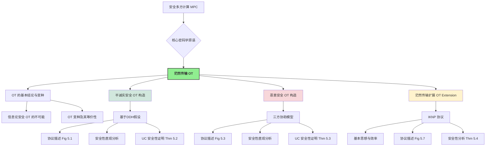

# 第5章 茫然传输和茫然传输扩展 (Oblivious Transfer and Oblivious Transfer Extension)

在深入探讨了安全多方计算的形式化基石——通用可组合框架 (UC framework)之后，本章我们将焦点转向一个基础且至关重要的密码学原语：**茫然传输 (Oblivious Transfer, OT)**。OT 不仅本身具有重要的理论价值，在过去的几十年中受到了研究者们的持续关注，而且它也是构建更复杂 MPC 协议（如安全函数计算）的关键组件。

!!! abstract "本章核心内容"
    *   **OT 基础**: 回顾 OT 的定义，探讨其基本性质、存在的变种及其相互间的等价关系。
    *   **半诚实安全 OT**: 详细构造一个基于 DDH (Decisional Diffie-Hellman) 假设的 OT 协议，并严格证明其在 UC 框架下对于静态半诚实敌手的安全性。
    *   **恶意安全 OT**: 介绍一个需要三方协助的 OT 协议，该协议能够抵抗恶意敌手的攻击，并分析其安全性。
    *   **茫然传输扩展 (OT Extension, OTE)**: 阐述由 Ishai, Kilian, Nissim, Petrank (IKNP) 提出的 OTE 技术，它能够以极高的效率将少量的“基础 OT”实例扩展为大量的 OT 实例，是现代 MPC 实用化的关键技术之一。



## 5.1 关于 OT 的一些结论 (Some Facts about OT)

!!! definition "1-out-of-2 茫然传输 (OT) 回顾"
    一个 1-out-of-2 OT 协议涉及两方：
    *   **发送者 (Sender, $P_S$)**: 输入两条消息 $(x_0, x_1)$。
    *   **接收者 (Receiver, $P_R$)**: 输入一个选择比特 $b \in \{0, 1\}$。

    协议目标：
    1.  $P_R$ 获得消息 $x_b$。
    2.  $P_S$ 对 $P_R$ 的选择比特 $b$ 一无所知 (发送者隐私)。
    3.  $P_R$ 对另一条消息 $x_{1-b}$ 一无所知 (接收者隐私)。

### 5.1.1 不存在信息论安全的两方 OT 协议 (No Information-Theoretic Secure Two-Party OT)

!!! theorem "定理 5.1: 两方信息论安全 OT 的不可能"
    不存在仅涉及两方（发送者和接收者）且能提供信息论安全（即抵抗计算能力无限的敌手）的茫然传输协议。

这意味着，任何两方 OT 协议的安全性**至少有一方必须依赖于计算困难性假设**。

???+ success "证明思路概要 (Page 49-50)"
    证明过程分为两个主要步骤，层层递进，最终得出结论。

    1.  **步骤一: 从 OT 构造安全与门 (OT $\Rightarrow$ AND)**
        *   **目标**: 证明如果存在一个两方 OT 协议，那么就可以利用它来构造一个安全的两方与门 (AND) 协议。
        *   **AND 协议定义**: 参与方 $P_A$（输入比特 $a$）和 $P_B$（输入比特 $b$）共同计算 $a \land b$，双方都不应得知对方输入的额外信息。
        *   **构造**:
            *   $P_A$ 扮演 OT 发送者 $P_S$，其 OT 输入为 $(x_0=0, x_1=a)$。
            *   $P_B$ 扮演 OT 接收者 $P_R$，其 OT 输入选择比特为 $b$。
        *   **结果**: $P_B$ (即 $P_R$) 得到的 OT 输出 $x_b$ 恰好是 $a \land b$。
            因为 $x_b = (1 \oplus b)x_0 \oplus (b x_1) = (1 \oplus b) \cdot 0 \oplus (b \cdot a) = ab$。
        *   **隐私性分析**:
            *   **$P_A$ (发送方) 的隐私**: OT 的接收者隐私性保证 $P_A$ 不知道 $P_B$ 的选择比特 $b$。
            *   **$P_B$ (接收者) 的隐私**: OT 的发送者隐私性保证 $P_B$ 无法获得关于 $x_{1-b}$ 的信息。
                *   若 $b=0$, $P_B$ 得到 $x_0=0$，无法获得 $x_1=a$。
                *   若 $b=1$, $P_B$ 得到 $x_1=a$ (这是 $ab$ 的一部分)，无法获得 $x_0=0$。
        因此，这是一个安全的两方 AND 协议。

    2.  **步骤二: 不存在信息论安全的两方 AND 协议 (引理 1)**
        *   **假设**: 存在一个两方 AND 协议 $\Pi_{\text{2AND}}$，它满足完美隐私性和完美正确性（信息论安全）。参与方为 $P_0$ (输入 $b_0$) 和 $P_1$ (输入 $b_1$)，共同输出 $y = b_0 \land b_1$。
        *   **记号**: $T(c,d)$ 表示当输入为 $(b_0=c, b_1=d)$ 时，$\Pi_{\text{2AND}}$ 执行过程中所有可能产生的**通信记录 (transcript)** 的集合。
        *   **核心论证 (通过一系列断言导出矛盾)**:
            *   **断言 1: $T(0,0) = T(0,1)$**。
                *   *理由*: 否则，若存在 $T' \in T(0,0)$ 但 $T' \notin T(0,1)$，则当 $P_0$ 被攻陷且观察到 $T'$ 时，它可以推断出 $b_1=0$，这违反了 $P_0$ 对 $P_1$ 输入的隐私性。
            *   **断言 2: $T(0,0) = T(1,0)$**。
                *   *理由*: 同上，考虑 $P_1$ 被攻陷的情况。
            *   **断言 3: $T(0,1) \cap T(1,0) \subset T(1,1)$**。
                *   *理由*: 若一个记录 $T^*$ 同时可能由输入 $(0,1)$ 和 $(1,0)$ 产生，则当双方都输入 $1$ 时，由于各方行为仅依赖其输入和看到的对方消息，也必然会产生记录 $T^*$。
            *   **推导矛盾**:
                由断言1和2，可得 $T(0,1) \cap T(1,0) = T(0,0)$。
                结合断言3，则有 $T(0,0) \subset T(1,1)$。
                然而，输入 $(0,0)$ 时输出 $y=0$，输入 $(1,1)$ 时输出 $y=1$。由于输出是通信记录的一部分，这意味着一个包含 $y=0$ 的记录集合是另一个包含 $y=1$ 的记录集合的子集，这显然是不可能的。因此产生矛盾。
        *   此证明可以推广到允许有可忽略失败概率的情况。

    **最终结论**: 由于可以从 OT 构造 AND，且不存在信息论安全的两方 AND，因此不存在信息论安全的两方 OT。

!!! warning "关于两方 OT 安全性的重要推论"
    任何仅涉及两方的 OT 协议，其安全性**不能同时对发送方和接收方都达到信息论级别**。至少有一方的安全性必须依赖于计算困难性假设。
    在实践中，常见的安全组合是：
    *   接收者隐私性是信息论安全的，发送者隐私性是计算安全的。
    *   或者，发送者隐私性是信息论安全的，接收者隐私性是计算安全的。

### 5.1.2 OT 变种 (OT Variants)

除了标准的 1-out-of-2 OT，还存在多种有用的 OT 变体：

*   **Rabin OT [9]**:
    *   $P_S$ 输入一个消息 $x$。
    *   $P_R$ 以 $1/2$ 的概率得到 $x$，以 $1/2$ 的概率得到 $\perp$ (空信息)。
    *   $P_S$ 不知道 $P_R$ 的输出。
*   **随机 OT (Random OT, ROT)**:
    *   协议无外部输入。
    *   $P_S$ 输出一对随机选择的消息 $(x_0, x_1)$。
    *   $P_R$ 输出一个随机选择的选择比特 $b$ 和对应的随机消息 $x_b$。
*   **1-out-of-N OT**:
    *   $P_S$ 输入 $N$ 条消息 $(x_0, \dots, x_{N-1})$。
    *   $P_R$ 输入一个选择索引 $b \in \{0, \dots, N-1\}$。
    *   $P_R$ 得到 $x_b$。
*   **k-out-of-N OT**:
    *   $P_S$ 输入 $N$ 条消息。
    *   $P_R$ 输入 $k$ 个不同的选择索引 $\{i_0, \dots, i_{k-1}\}$。
    *   $P_R$ 得到相应的 $k$ 条消息 $(x_{i_0}, \dots, x_{i_{k-1}})$。

!!! success "OT 变种的等价性 (Page 51)"
    一个非常重要的结论是，上述主要的 OT 变种在计算上是**等价的**，即它们可以相互构造。
    *   **标准 1-out-of-2 OT $\Leftrightarrow$ 随机 OT (ROT)**:
        *   **OT $\rightarrow$ ROT**: 参与方在本地随机生成 OT 的输入，然后执行标准 OT。输出即为 ROT 的输出。
        *   **ROT $\rightarrow$ OT (教材中的巧妙构造)**:
            1.  **预备 ROT**: $P_S$ 和 $P_R$ 执行一次 ROT。$P_S$ 获得随机对 $(r_0, r_1)$，$P_R$ 获得随机选择 $c$ 和对应值 $r_c$。
            2.  **接收者编码选择**: 设 $P_R$ 在目标 OT 中的真实选择比特为 $b_{OT}$。 $P_R$ 计算 $d = c \oplus b_{OT}$ 并将其发送给 $P_S$。
            3.  **发送者加密消息**: 设 $P_S$ 在目标 OT 中的真实输入消息对为 $(m_0, m_1)$。 $P_S$ 使用从 $P_R$ 收到的 $d$ 和 ROT 中得到的 $(r_0, r_1)$ 来加密这两条消息：
                计算 $y_0 = m_0 \oplus r_d$ (即 $m_0 \oplus r_{c \oplus b_{OT}}$)
                计算 $y_1 = m_1 \oplus r_{d \oplus 1}$ (即 $m_1 \oplus r_{c \oplus b_{OT} \oplus 1}$)
                $P_S$ 将 $(y_0, y_1)$ 发送给 $P_R$。
            4.  **接收者解密**: $P_R$ 使用其 ROT 输出 $r_c$ 和其 OT 选择比特 $b_{OT}$ 来解密：
                输出 $m'_{b_{OT}} = y_{b_{OT}} \oplus r_c$。
                *   **正确性验证**:
                    *   若 $b_{OT}=0$: $P_R$ 计算 $y_0 \oplus r_c = (m_0 \oplus r_{c \oplus 0}) \oplus r_c = (m_0 \oplus r_c) \oplus r_c = m_0$。
                    *   若 $b_{OT}=1$: $P_R$ 计算 $y_1 \oplus r_c = (m_1 \oplus r_{c \oplus 1 \oplus 1}) \oplus r_c = (m_1 \oplus r_c) \oplus r_c = m_1$。
    *   **Rabin OT $\Leftrightarrow$ 标准 1-out-of-2 OT**: 由 Crépeau [10] 证明。
    *   **1-out-of-2 OT $\Rightarrow$ 1-out-of-N OT 和 k-out-of-N OT**: 由 Naor 和 Pinkas [11] 证明。例如，1-out-of-N OT 可以通过 $\log N$ 次 1-out-of-2 OT (选择地址比特) 或使用更复杂的组合技术来实现。

    这一系列等价性意味着，如果我们能够构造出任何一种基础 OT（例如高效的 1-out-of-2 OT），我们就能构造出其他所有变种。

### 5.1.3 一些其他重要结论 (Other Important Conclusions about OT)

*   !!! important "OT 的完备性 (Completeness of OT)"
    基于 1-out-of-2 OT，可以安全地计算**任何**有限函数。这是由 Kilian [12] 首次证明的，后续有更高效的构造（如 Ishai 等人 [13]）。这使得 OT 成为 MPC 领域的一个基础构建模块 ("Yao's theorem" 的一个推论)。

*   **OT 的对称性 (Symmetry of OT)** [14]:
    如果存在一个 OT 协议，其中 Alice 是发送者，Bob 是接收者，那么也存在一个 OT' 协议，其中 Bob 是发送者，Alice 是接收者。

*   **OT 与公钥加密 (PKE) 的关系** [15]:
    不能以**黑盒 (black-box)** 的方式仅使用标准的公钥加密方案来构造 OT 协议。这表明 OT 在某种程度上是比 PKE 更“强大”或需要不同类型基础的原语。

*   **OT 的构造基础**:
    OT 可以基于多种计算困难性假设来构造，包括：
    *   增强的陷门置换 (Enhanced Trapdoor Permutations, TDP) [16-17]
    *   DDH 假设 (Decisional Diffie-Hellman)
    *   RSA 假设 [16]
    *   基于格 (Lattice-based) 的密码学假设 [18]

## 5.2 基于 DDH 假设的 OT 协议（半诚实安全）(DDH-based OT Protocol - Semi-honest Security)

本节详细介绍一个在半诚实敌手模型下，基于 DDH 假设的 1-out-of-2 OT 协议。

!!! protocol "协议 5.1: 基于 DDH 的半诚实 OT (图 5.1)"
    **公共参数**: 阶为素数 $q$ 的循环群 $\mathbb{G}$，生成元 $g$。
    **$P_S$ (发送者) 输入**: 两条消息 $(x_0, x_1 \in \mathbb{G})$ (或可编码为群元素)。
    **$P_R$ (接收者) 输入**: 一个选择比特 $b \in \{0,1\}$。

    **协议流程**:

    1.  **$P_R$ (接收者) - 密钥生成与选择**:
        *   随机选择一个私钥 $sk \leftarrow_{\$} \mathbb{Z}_q$。
        *   计算其选择的公钥 $pk_b = g^{sk}$。
        *   为未选择的那条消息生成一个“伪”公钥：随机选择 $pk_{1-b} \leftarrow_{\$} \mathbb{G}$。
        *   $P_R$ 将公钥对 $(pk_0, pk_1)$ （按标准顺序，例如 $pk_0$ 在前）发送给 $P_S$。

    2.  **$P_S$ (发送者) - 消息加密**:
        *   当收到 $(pk_0, pk_1)$ 后，随机选择一个临时密钥 $r \leftarrow_{\$} \mathbb{Z}_q$。
        *   计算一个公共的随机化因子 $v = g^r$。
        *   使用收到的公钥和临时密钥 $r$ 分别加密两条消息（类似 ElGamal 加密）：
            *   $c_0 = x_0 \cdot (pk_0)^r$
            *   $c_1 = x_1 \cdot (pk_1)^r$
        *   $P_S$ 将 $(v, c_0, c_1)$ 发送给 $P_R$。

    3.  **$P_R$ (接收者) - 消息解密**:
        *   当收到 $(v, c_0, c_1)$ 后， $P_R$ 使用其选择比特 $b$ 和之前生成的私钥 $sk$ 来解密对应的密文：
            输出 $x'_b = c_b / v^{sk}$。

### 5.2.2 安全性的直观说明 (Intuitive Security Analysis under Semi-Honest Model)

!!! success "正确性 (Correctness)"

    接收者 $P_R$ 计算：

    $$
    \begin{align}
    c_b / v^{sk} &= (x_b \cdot (pk_b)^r) / (g^r)^{sk} \\
    &= (x_b \cdot (g^{sk})^r) / g^{r \cdot sk} \\
    &= (x_b \cdot g^{sk \cdot r}) / g^{r \cdot sk} \\
    &= x_b
    \end{align}
    $$

    协议正确地使得 $P_R$ 获得了 $x_b$。

!!!- info "隐私性 (Privacy)"

    *   **发送者 $P_S$ 的隐私 (对 $b$ 的无知)**:
        $P_S$ 观察到的是 $(pk_0, pk_1)$。其中一个 $pk_b = g^{sk}$ 是通过 $g$ 的幂次生成的（$sk$ 随机），另一个 $pk_{1-b}$ 是直接从群 $\mathbb{G}$ 中随机选取的。由于 $sk$ 是随机的，$g^{sk}$ 本身在群 $\mathbb{G}$ 中也是一个（计算上）随机的元素。因此，$(pk_0, pk_1)$ 这对公钥在 $P_S$ 看来，就像是两个独立的随机群元素。$P_S$ 无法从它们的结构上区分哪一个是 $P_R$ 知道对应私钥的那个。因此，$P_S$ 无法得知 $P_R$ 的选择比特 $b$。

    *   **接收者 $P_R$ 的隐私 (对 $x_{1-b}$ 的无知)**:
        $P_R$ 知道其选择比特 $b$，私钥 $sk$，公钥对 $(pk_0, pk_1)$，以及从 $P_S$ 收到的 $(v, c_0, c_1)$。它能正确解密 $c_b$ 得到 $x_b$。
        现在考虑未被选择的密文 $c_{1-b} = x_{1-b} \cdot (pk_{1-b})^r$。$P_R$ 要想从中恢复出 $x_{1-b}$，就需要计算出 $(pk_{1-b})^r$。
        $P_R$ 知道 $v=g^r$ (来自 $P_S$) 和 $pk_{1-b}$ (是它自己生成的随机群元素，其对应的“私钥” $log_g pk_{1-b}$ 是 $P_R$ 不知道的)。
        从 $g^r$ 和 $pk_{1-b}$ 计算 $(pk_{1-b})^r$ 是一个计算性 Diffie-Hellman (CDH) 问题。
        更进一步，DDH 假设表明，对于 $P_R$ 来说，元组 $(v=g^r, pk_{1-b}, (pk_{1-b})^r)$ 与元组 $(v=g^r, pk_{1-b}, e)$ (其中 $e \leftarrow_{\$} \mathbb{G}$ 是一个随机群元素) 在计算上是不可区分的。
        这意味着，项 $(pk_{1-b})^r$ 在 $P_R$ 看来就像一个随机的群元素（因为它不知道 $r$ 也不能从 $pk_{1-b}$ 中轻易得到其与 $g$ 的关系）。
        因此，$c_{1-b} = x_{1-b} \cdot (pk_{1-b})^r$ 在 $P_R$ 看来与 $x_{1-b} \cdot (\text{随机元素})$ 是不可区分的。由于群的性质，一个元素乘以一个随机元素的结果仍然是一个随机元素（除非 $x_{1-b}$ 是单位元）。所以 $P_R$ 无法从 $c_{1-b}$ 中分离出 $x_{1-b}$ 的任何信息。

### 5.2.3 安全性证明 (UC Security Proof)

!!! theorem "定理 5.2: 基于 DDH 的半诚实 OT 的 UC 安全性"
    假设 DDH 问题在群 $\mathbb{G}$ 上是困难的。图 5.1 中描述的协议 $\Pi_{OT}$ 对于静态半诚实敌手，在 UC 框架下安全地实现了理想功能 $F_{OT}$ (其定义参见图 5.2, Page 54)。

!!! abstract "理想功能 $F_{OT}$ (回顾图 5.2)"
    $F_{OT}$ 扮演一个可信第三方的角色，其行为如下：
    ```mermaid
    sequenceDiagram
        participant UserZ as "环境 Z (代表用户)"
        participant SimS as "模拟器 S"
        participant FOT as "理想功能 F_OT"

        UserZ->>FOT: (Input, sid, P_S, (x0,x1)) (若P_S为发送方)
        FOT->>SimS: (Input, sid, P_S) (通知S: P_S已输入)
        UserZ->>FOT: (Input, sid, P_R, b) (若P_R为接收方)
        FOT->>SimS: (Input, sid, P_R) (通知S: P_R已输入)

        alt "双方输入均已记录"
            SimS->>FOT: (Output, sid, P_R) (S指示F_OT输出给P_R)
            FOT->>UserZ: (Output, sid, x_b) (F_OT将x_b发送给P_R，通过Z)
            FOT->>SimS: (Output, sid, x_b) (如果P_R被S模拟/攻陷，S获得输出)
        end
        Note right of FOT: F_OT内部记录了(x0,x1)和b
    ```
    *   当收到 $P_S$ 的输入 `(Input, sid, (x0,x1))` 时，记录该输入，并向模拟器 $S$ 发送通知 `(Input, sid, P_S)`。
    *   当收到 $P_R$ 的输入 `(Input, sid, b)` 时，记录该输入，并向模拟器 $S$ 发送通知 `(Input, sid, P_R)`。
    *   当收到来自 $S$ 的指令 `(Output, sid, P_R)`，并且 $P_S$ 和 $P_R$ 的输入都已被 $F_{OT}$ 记录时，$F_{OT}$ 将计算得到的 $x_b$：
        *   如果 $P_R$ 是诚实的 (由环境 $\mathcal{Z}$ 控制)，则将 $x_b$ 通过 $\mathcal{Z}$ 发送给 $P_R$。
        *   如果 $P_R$ 是被攻陷的 (由 $S$ 控制)，则将 $x_b$ 发送给 $S$。

**证明概要**:
根据 UC 框架的平凡敌手完备性定理 (Thm 4.1)，我们只需为平凡敌手 $\mathcal{A}_{\text{triv}}$ (它仅在环境 $\mathcal{Z}$ 的指示下转发消息) 构造一个模拟器 $\mathcal{S}$。 $\mathcal{S}$ 在其内部运行 $\mathcal{A}_{\text{triv}}$ 的代码，并模拟与 $\mathcal{F}_{OT}$ 的交互，使得 $\mathcal{Z}$ 无法区分其是在与真实协议 $(\Pi_{OT}, \mathcal{A}_{\text{triv}})$ 交互还是在与理想系统 $(\mathcal{F}_{OT}, \mathcal{S})$ 交互。
我们将分两种情况（发送方被攻陷或接收方被攻陷）来描述 $\mathcal{S}$ 的行为。

*   ???+ case "情况 1: 发送者 $P_S$ 被攻陷 (由 $\mathcal{Z}$ 通过 $\mathcal{A}_{\text{triv}}$ 控制)"

        $\mathcal{S}$ 的行为如下：

        1.  **$P_S$ 输入阶段**: 当环境 $\mathcal{Z}$ 通过 $\mathcal{A}_{\text{triv}}$ 向被攻陷的 $P_S$ 提供输入 `(Input, sid, (x0, x1))` 时，$\mathcal{S}$ 截获此输入，并将其同样转发给理想功能 $\mathcal{F}_{OT}$。$\mathcal{S}$ 模拟 $P_S$ 等待来自 $P_R$ 的消息。
        2.  **模拟 $P_R$ 的消息**: 在理想世界中，当诚实的 $P_R$ (由 $\mathcal{Z}$ 控制) 提供了它的输入 $b$ 给 $\mathcal{F}_{OT}$ 后，$\mathcal{F}_{OT}$ 会通知 $\mathcal{S}$ `(Input, sid, P_R)`。此时，$\mathcal{S}$ 仍然不知道 $P_R$ 的真实选择 $b$。然而，$\mathcal{S}$ 需要模拟 $P_R$ 在真实协议中发送给 $P_S$ 的消息 $(pk_0, pk_1)$。
            $\mathcal{S}$ 随机选择两个独立的群元素 $pk'_0 \leftarrow_{\$} \mathbb{G}$ 和 $pk'_1 \leftarrow_{\$} \mathbb{G}$。
            $\mathcal{S}$ 将这对 $(pk'_0, pk'_1)$ 作为模拟的 $P_R$ 消息发送给其内部运行的 $\mathcal{A}_{\text{triv}}$ (即被攻陷的 $P_S$)。
        3.  **$P_S$ 的后续行为**: 被攻陷的 $P_S$ (由 $\mathcal{A}_{\text{triv}}$ 模拟) 会根据收到的 $(pk'_0, pk'_1)$ 和其输入 $(x_0, x_1)$ 计算出 $(v', c'_0, c'_1)$ 并试图发送。$\mathcal{S}$ 截获此消息，并不做任何处理（因为在理想世界中，$P_R$ 的输出由 $\mathcal{F}_{OT}$ 直接提供，与此消息无关）。
        4.  **$P_R$ 的输出**: $P_R$ 是诚实方，它将直接从 $\mathcal{F}_{OT}$ 获得其输出 $x_b$ (当环境 $\mathcal{Z}$ 指示 $\mathcal{F}_{OT}$ 输出给 $P_R$ 时，或通过 $S$ 的 `(Output, sid, P_R)` 指令触发)。$\mathcal{S}$ 在此无需介入。

    *   **不可区分性分析 (当 $P_S$ 被攻陷)**:
        *   **真实世界中 $P_S$ 的视图**: 包含其输入 $(x_0, x_1)$，以及从 $P_R$ 收到的 $(pk_0, pk_1)$。其中 $pk_b = g^{sk}$ ($sk$ 随机) 而 $pk_{1-b}$ 是随机群元素。
        *   **理想世界中被攻陷 $P_S$ (由 $\mathcal{A}_{\text{triv}}$ 扮演) 的视图**: 包含其输入 $(x_0, x_1)$，以及从 $\mathcal{S}$ (模拟 $P_R$) 收到的 $(pk'_0, pk'_1)$，其中 $pk'_0, pk'_1$ 都是随机群元素。
        由于 $g^{sk}$ (当 $sk$ 随机时) 在计算上与一个直接从 $\mathbb{G}$ 中随机选择的元素是不可区分的（这是 DDH 假设的一个弱形式，或者说基于群的随机自可约性），因此，真实世界中 $(pk_0, pk_1)$ 的分布与理想世界中 $(pk'_0, pk'_1)$ 的分布是计算上不可区分的。
        因此，环境 $\mathcal{Z}$ 无法区分它是在与真实协议交互还是在与理想系统交互。

*   ???+ case "情况 2: 接收者 $P_R$ 被攻陷 (由 $\mathcal{Z}$ 通过 $\mathcal{A}_{\text{triv}}$ 控制)"

        $\mathcal{S}$ 的行为如下：

        1.  **$P_R$ 输入与密钥生成阶段**: 当环境 $\mathcal{Z}$ 通过 $\mathcal{A}_{\text{triv}}$ 向被攻陷的 $P_R$ 提供输入 `(Input, sid, b)` 时，$\mathcal{S}$ 截获此输入 $b$，并将其同样转发给理想功能 $\mathcal{F}_{OT}$。
            $\mathcal{S}$ 模拟被攻陷的 $P_R$ (由 $\mathcal{A}_{\text{triv}}$ 控制) 执行协议的第1步：选择 $sk \leftarrow_{\$} \mathbb{Z}_q$，计算 $pk_b = g^{sk}$，选择 $pk_{1-b} \leftarrow_{\$} \mathbb{G}$，并“发送” $(pk_0, pk_1)$。$\mathcal{S}$ 记录下这些值，特别是 $sk$ 和 $pk_b$。
        2.  **模拟 $P_S$ 的消息**: 在理想世界中，当诚实的 $P_S$ (由 $\mathcal{Z}$ 控制) 提供了它的输入 $(x_0, x_1)$ 给 $\mathcal{F}_{OT}$ 后，$\mathcal{F}_{OT}$ 会通知 $\mathcal{S}$ `(Input, sid, P_S)`。此时，$\mathcal{S}$ 仍然不知道 $P_S$ 的真实输入 $(x_0, x_1)$。然而，$\mathcal{S}$ 需要模拟 $P_S$ 在真实协议中发送给 $P_R$ 的消息 $(v, c_0, c_1)$。
            *   **获取 $P_R$ 应得的输出**: $\mathcal{S}$ 首先需要知道被攻陷的 $P_R$ 应该得到什么输出。它向 $\mathcal{F}_{OT}$ 发送指令 `(Output, sid, P_R)`。由于 $P_R$ 被攻陷，$\mathcal{F}_{OT}$ 会将计算出的 $x_b$ (基于 $P_R$ 的输入 $b$ 和 $P_S$ 的真实输入 $x_0, x_1$) 发送给 $\mathcal{S}$。令 $\mathcal{S}$ 收到的这个值为 $x^*_b$。
            *   **构造模拟消息**: $\mathcal{S}$ 构造 $(v', c'_0, c'_1)$ 如下：
                *   $v' \leftarrow_{\$} \mathbb{G}$ (选择一个随机的群元素作为 $v$)。
                *   $c'_b = x^*_b \cdot (pk_b)^{\log_g v'}$ (即 $x^*_b \cdot (v')^{sk}$)。这里 $pk_b$ 和 $sk$ 是 $\mathcal{S}$ 在步骤1中代表 $P_R$ 生成并记录的。
                *   $c'_{1-b} \leftarrow_{\$} \mathbb{G}$ (为未选择的消息生成一个随机的密文部分)。
            $\mathcal{S}$ 将 $(v', c'_0, c'_1)$ 作为模拟的 $P_S$ 消息发送给其内部运行的 $\mathcal{A}_{\text{triv}}$ (即被攻陷的 $P_R$)。
        3.  **$P_R$ 的后续行为**: 被攻陷的 $P_R$ (由 $\mathcal{A}_{\text{triv}}$ 模拟) 会根据收到的 $(v', c'_0, c'_1)$ 和它自己生成的 $sk$ 计算 $c'_b / (v')^{sk}$ 得到 $x^*_b$，并将其作为输出（通过 $\mathcal{A}_{\text{triv}}$ 传递给 $\mathcal{Z}$）。

    *   **不可区分性分析 (当 $P_R$ 被攻陷)**:

        *   **真实世界中 $P_R$ 的视图**: 包含其输入 $b$ 和随机性 $sk$，它生成的 $(pk_0, pk_1)$，以及从 $P_S$ 收到的 $(v=g^r, c_0=x_0 (pk_0)^r, c_1=x_1 (pk_1)^r)$。
        *   **理想世界中被攻陷 $P_R$ (由 $\mathcal{A}_{\text{triv}}$ 扮演) 的视图**: 包含其输入 $b$ 和随机性 $sk$，它生成的 $(pk_0, pk_1)$，以及从 $\mathcal{S}$ (模拟 $P_S$) 收到的 $(v' \text{ (随机)}, c'_b=x^*_b (v')^{sk}, c'_{1-b} \text{ (随机)})$。

        我们需要比较 $(v, c_b, c_{1-b})$ 和 $(v', c'_b, c'_{1-b})$ 的分布。

        *   $v=g^r$ (其中 $r$ 随机) 和 $v'$ (直接随机选取) 都是群中的随机元素，它们的分布是相同的。
        *   $c_b = x_b \cdot (pk_b)^r = x_b \cdot (g^{sk})^r = x_b \cdot v^{sk}$。
            $c'_b = x^*_b \cdot (pk_b)^{\log_g v'} = x^*_b \cdot (v')^{sk}$。
            由于 $x^*_b$ 是 $\mathcal{F}_{OT}$ 计算的真实 $x_b$，且 $v$ 与 $v'$ 同分布，因此 $c_b$ 与 $c'_b$ 的分布是相同的（在给定 $P_R$ 的输入 $b$ 和随机性 $sk$ 的条件下）。
        *   $c_{1-b} = x_{1-b} \cdot (pk_{1-b})^r$。
            $c'_{1-b}$ 是直接从 $\mathbb{G}$ 中随机选取的元素。
            根据 DDH 假设，对于 $P_R$（它不知道 $r$，并且 $pk_{1-b}$ 是它随机选择的，与 $g^r$ 无特定关系），项 $(pk_{1-b})^r$ 在计算上与一个随机群元素不可区分。
            因此，$x_{1-b} \cdot (pk_{1-b})^r$ 在计算上与 $x_{1-b} \cdot (\text{随机元素})$ 不可区分。而一个非单位元素乘以一个随机群元素的结果仍然是一个随机群元素。
            所以，$c_{1-b}$ 的分布与随机群元素 $c'_{1-b}$ 的分布是计算上不可区分的。

        综上所述，被攻陷的 $P_R$ 在真实世界和理想世界中看到的视图是计算上不可区分的。
        由于在这两种攻陷情况下，环境 $\mathcal{Z}$ 都无法区分，因此协议 $\Pi_{OT}$ 在 DDH 假设下对于静态半诚实敌手 UC-安全地实现了 $F_{OT}$。

!!! question "思考题回顾 (Page 55)"
    **问题**: 此处基于类 ElGamal 加密构造了 OT，而之前提到不能以黑盒方式基于 PKE 构造 OT，这是否矛盾？
    **答案**: 不矛盾。这里的构造巧妙地利用了接收方 $P_R$ 能够“选择”一个公钥 $pk_b$ (为其知道私钥) 和另一个公钥 $pk_{1-b}$ (为其不知道私钥，且看起来是随机的) 的能力。标准 PKE 的定义通常不包含这种“选择性生成/伪造公钥”的场景。ElGamal 的代数结构（基于离散对数）使得这种区分性的公钥对的生成变得自然。协议的安全性依赖于发送方 $P_S$ 无法从 $(pk_0, pk_1)$ 中判断哪一个是“真”公钥。这不是对 PKE 的标准黑盒使用。