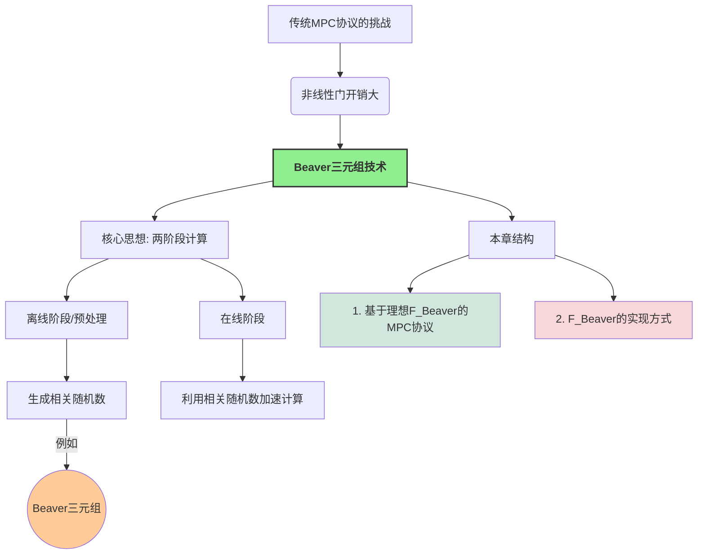
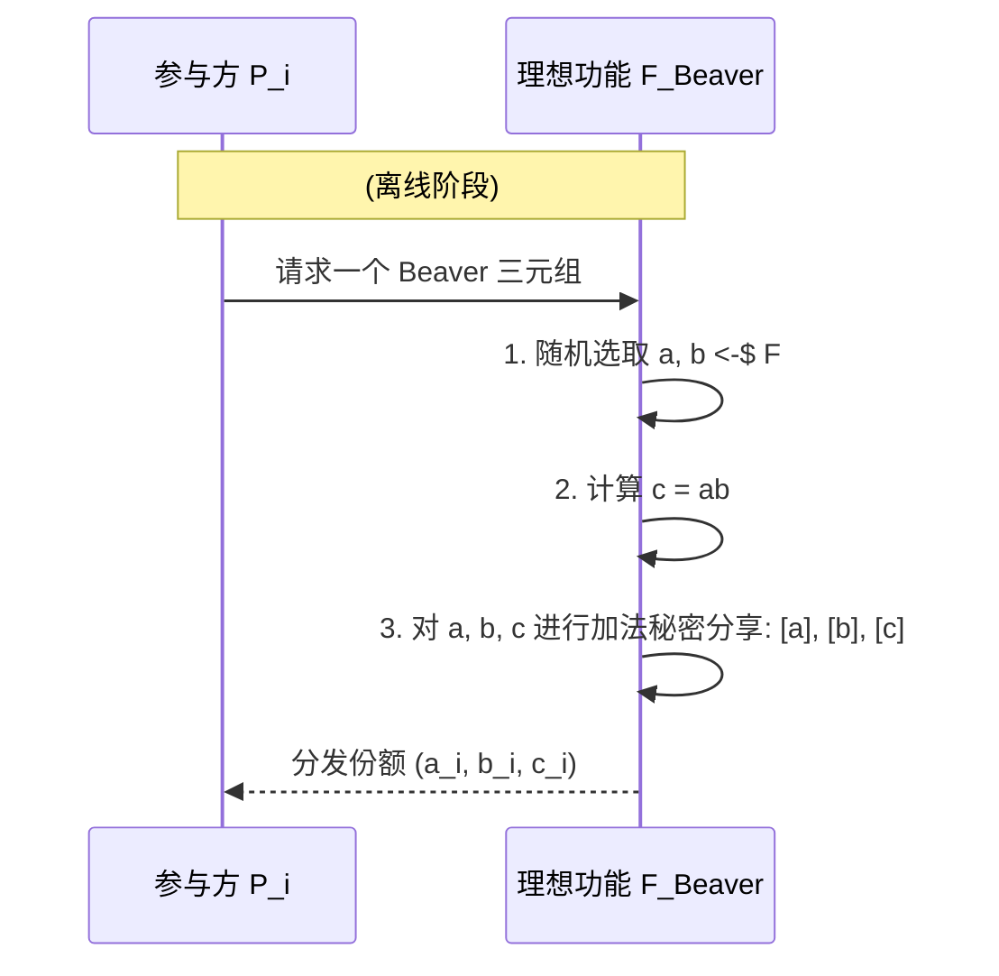

# 第7章 通过 Beaver 三元组实现 MPC (MPC via Beaver Triples)

在前面的章节中，无论是 BGW 协议、GMW 协议，还是第一章介绍的简单协议，我们都观察到一个共同点：协议中的**线性门**（如加法、常数乘法、异或、非门）通常具有非常低的计算和通信开销，参与方往往只需在本地对其秘密份额执行相应操作即可。相比之下，**非线性门**（如乘法门、与门）的开销则要大得多，通常需要参与方之间进行多轮交互，并调用相对复杂的子协议（例如 OT 或 OLE）。

为了显著降低非线性门（尤其是乘法门）的在线计算开销，**Beaver 三元组 (Beaver Triple)** [32] 技术应运而生。这一技术的核心思想是将 MPC 协议划分为两个阶段：

1.  **离线阶段 (Offline Phase) / 预处理阶段 (Preprocessing Phase)**: 在这个阶段，参与方共同生成一些与实际输入无关的**相关随机数 (Correlated Randomness)**，最典型的就是 Beaver 三元组。这个阶段可以提前进行，甚至在实际的私密输入可用之前。
2.  **在线阶段 (Online Phase)**: 当实际的私密输入可用时，参与方利用离线阶段生成的这些相关随机数来极大地加速（主要是乘法）运算。

这种设计模式可以将大部分的计算和通信密集型工作转移到离线阶段，使得在线阶段的效率得到显著提升，这对于需要快速响应的 MPC 应用尤为重要。

本章将采用模块化的方法进行介绍：
1.  首先，我们将 Beaver 三元组的生成过程抽象为一个理想功能 $\mathcal{F}_{\text{Beaver}}$。
2.  然后，在 $\mathcal{F}_{\text{Beaver}}$-混合模型 (即假设可以直接从 $\mathcal{F}_{\text{Beaver}}$ 获取三元组) 下，构造一个高效的 MPC 协议，并证明其安全性。
3.  最后，我们将讨论如何实际生成 Beaver 三元组，即如何实现 $\mathcal{F}_{\text{Beaver}}$。

## 7.1 基于 Beaver 三元组的 MPC 协议 (MPC Protocol based on Beaver Triples)

我们将主要关注基于**加法秘密分享 (Additive Secret Sharing)** 的 MPC 协议，其中秘密份额可以直接相加来得到秘密的和。

### 7.1.1 Beaver 三元组 (Beaver Triple)

!!! abstract "Beaver 三元组定义"
    一个 Beaver 三元组（针对某个有限域 $\mathbb{F}$）是指一组秘密分享值 $([a], [b], [c])$，其中 $a, b \in \mathbb{F}$ 是均匀随机选择的元素，而 $c = ab \in \mathbb{F}$。
    这里的 $[x]$ 表示秘密 $x$ 的加法秘密份额的集合，即 $[x] = (x_1, \dots, x_n)$，其中 $x = x_1 + \dots + x_n \pmod p$ (如果 $\mathbb{F}=\mathbb{Z}_p$)。每个参与方 $P_i$ 持有份额 $x_i$。

**符号约定**: (为了简化，这里采用与教材一致的加法分享表示)
*   $[x]$: 秘密 $x \in \mathbb{F}$ 的秘密份额集 $(x_1, \dots, x_n)$，满足 $x = \sum x_i$。
*   **本地加法**: $[x] + [y] = (x_1+y_1, \dots, x_n+y_n) = [x+y]$。
*   **本地常数乘法**: $k \cdot [x] = (k x_1, \dots, k x_n) = [k x]$ (这里需要每个 $P_i$ 知道 $k$，或者 $k$ 是一个公开常数)。
*   **本地常数加法**: $[x] + k = (x_1+k, x_2, \dots, x_n) = [x+k]$ (这里约定常数仅加到 $P_1$ 的份额上，其他参与方份额不变，或者通过某种预定方式分配常数)。教材中 $P_1$ 的份额是 $x_1+c$，其他 $P_i$ 的份额是 $x_i$。

**利用 Beaver 三元组计算乘法**: (Page 80)
假设我们想要计算两个秘密分享值 $[x]$ 和 $[y]$ 的乘积 $[xy]$。参与方已经共同持有一个 Beaver 三元组 $([a], [b], [c])$，其中 $c=ab$。

1.  **盲化 (Blinding) / 计算差值**:
    *   所有参与方在本地计算 $[x]-[a] = [x-a]$。
    *   所有参与方在本地计算 $[y]-[b] = [y-b]$。
2.  **公开差值 (Reveal Differences)**:
    *   参与方共同重构 (reconstruct / open) 秘密 $d = x-a$。
    *   参与方共同重构秘密 $e = y-b$。
    现在，$d$ 和 $e$ 成为公开值。
    !!! warning "隐私性分析"
        由于 $a$ 和 $b$ 是均匀随机的，即使公开了 $d=x-a$ 和 $e=y-b$，也不会泄露关于 $x$ 和 $y$ 的任何信息（因为 $a,b$ 完美地掩盖了 $x,y$）。

3.  **本地计算最终份额 (Local Computation of Final Shares)**:
    我们知道 $x = d+a$ 且 $y = e+b$。
    所以 $xy = (d+a)(e+b) = de + db + ea + ab$。
    将其秘密分享形式化：
    $[xy] = [de + db + ea + ab]$
    由于 $d$ 和 $e$ 是公开值，而 $a, b, c=ab$ 是已经分享的：
    *   $[de]$: $P_1$ 的份额是 $de$，其他 $P_i$ 份额是 $0$ (或任何使和为 $de$ 的分配方式)。
    *   $[db]$: 等于 $d \cdot [b]$ (本地常数乘法)。
    *   $[ea]$: 等于 $e \cdot [a]$ (本地常数乘法)。
    *   $[ab]$: 就是三元组中的 $[c]$。
    因此，每个参与方 $P_i$ 可以本地计算其持有的关于 $xy$ 的份额：
    $(xy)_i = de_i + d \cdot b_i + e \cdot a_i + c_i$
    (这里 $de_i$ 是 $de$ 的第 $i$ 个份额，例如 $de_1=de$, $de_j=0$ for $j \ne 1$)。
    从而，各方共同持有了 $[xy]$。

!!! success "效率对比"
    *   **GMW 乘法 (基于 OT)**: 需要 $O(n^2)$ 次 OT 调用。
    *   **Beaver 三元组乘法 (在线阶段)**: 仅需要两次秘密重构（公开 $d, e$），通信量为 $O(n)$（每个参与方广播其份额给一个指定的重构者，或广播给所有人）。本地计算也非常高效。
    主要的开销被转移到了离线阶段生成 Beaver 三元组。

### 7.1.2 协议描述 (Protocol Description - Fig 7.1)

基于 Beaver 三元组的 MPC 协议，其线性门（加法、常数乘法）的处理方式与第 6.2.3 节中算术电路 GMW 协议的本地份额运算相同。输出重构也类似。核心区别在于乘法门的处理。

**协议 $\Pi_{\text{Beaver}}$ (在 $\mathcal{F}_{\text{Beaver}}$-混合模型下)**:

1.  **输入分享**: 与算术 GMW 类似，每个 $P_i$ 将其输入 $x_{i,k}$ 进行加法秘密分享。
2.  **计算阶段**:
    *   **加法门/常数乘法门**: 本地份额运算。
    *   **乘法门 (计算 $[x][y]$)**:
        1.  从理想功能 $\mathcal{F}_{\text{Beaver}}$ 获取一个未使用的 Beaver 三元组 $([a], [b], [c])$。
        2.  参与方本地计算 $[d] = [x]-[a]$ 和 $[e] = [y]-[b]$。
        3.  参与方共同重构 $d$ 和 $e$ (使其公开)。
        4.  每个参与方 $P_i$ 本地计算其输出份额 $(xy)_i = de_i + d \cdot b_i + e \cdot a_i + c_i$ (其中 $de_i$ 是 $de$ 的第 $i$ 份额)。
3.  **输出重构**: 需要输出时，收集份额并相加。

**理想功能 $\mathcal{F}_{\text{Beaver}}$ (图 7.2)**:

*   **输入**: 参与方无显式输入给 $\mathcal{F}_{\text{Beaver}}$。
*   **功能**:
    1.  $\mathcal{F}_{\text{Beaver}}$ 均匀随机选择 $a, b \in \mathbb{F}$。
    2.  计算 $c = ab$。
    3.  对 $a, b, c$ 分别进行加法秘密分享，例如，随机选择 $a_1, \dots, a_{n-1}$，令 $a_n = a - \sum_{j=1}^{n-1} a_j$，对 $b,c$ 做类似操作。
    4.  将份额 $(a_i, b_i, c_i)$ 安全地发送给每个参与方 $P_i$。

### 7.1.3 安全性证明 (Security Proof)

**定理 7.1**: 假设被攻陷方数量不超过 $n-1$ (对于加法分享的信息论安全门限)。图 7.1 展示的协议 $\Pi_{\text{Beaver}}$ 在 $\mathcal{F}_{\text{Beaver}}$-混合模型下，对于静态半诚实敌手 UC-安全地实现了安全函数计算的理想功能 $\mathcal{F}_{\text{sfe}}$。

**证明**: 我们为平凡敌手 $\mathcal{A}_{\text{triv}}$ 构造模拟器 $\mathcal{S}$。设 $C$ 为被攻陷方集合。

1.  **处理来自 $\mathcal{F}_{\text{sfe}}$ 的输入通知**:
    *   当 $P_i \in C$ 提供输入 $x_i$: $\mathcal{S}$ 获知 $x_i$，并模拟 $P_i$ 诚实地执行加法输入分享。
    *   当 $P_j \notin C$ 提供输入: $\mathcal{S}$ 假设其输入为 $0$，并模拟 $P_j$ 对 $0$ 进行加法分享，将份额发送给 $C$ 中的成员。

2.  **模拟计算阶段**:
    *   **线性门**: 被攻陷方 $P_i \in C$ 根据其持有的（可能是模拟的）份额进行本地计算。$\mathcal{S}$ 遵循此过程。
    *   **乘法门**:
        1.  当协议需要一个 Beaver 三元组时，$\mathcal{S}$ 调用 $\mathcal{F}_{\text{Beaver}}$。
            *   $\mathcal{F}_{\text{Beaver}}$ 会将三元组份额 $(a_k, b_k, c_k)$ 发送给每个 $P_k$。
            *   如果 $P_k \in C$，则 $\mathcal{A}_{\text{triv}}$ (即 $\mathcal{S}$) 收到 $(a_k, b_k, c_k)$。
            *   如果 $P_k \notin C$，则这些份额对 $\mathcal{S}$ 是未知的（但在模拟诚实方行为时，$\mathcal{S}$ 内部可以记录这些由 $\mathcal{F}_{\text{Beaver}}$ 生成的份额）。
        2.  被攻陷方 $P_i \in C$ 本地计算 $[d]$ 和 $[e]$ 的份额。
        3.  **重构 $d, e$**:
            *   真实世界: 所有参与方将其 $[d]$ 和 $[e]$ 的份额发送给一个重构者（或广播），得到公开的 $d, e$。被攻陷方会看到所有份额。
            *   理想世界 (模拟器 $\mathcal{S}$):
                $\mathcal{S}$ 知道被攻陷方 $C$ 持有的关于 $[d]$ 和 $[e]$ 的份额（这些份额是基于其“真实”输入份额和来自 $\mathcal{F}_{\text{Beaver}}$ 的 $[a],[b]$ 份额计算的）。
                $\mathcal{S}$ 不知道诚实方的输入，因此也不知道 $d, e$ 的真实值。
                但是，模拟器可以“伪造” $d, e$ 的公开过程。由于 $a,b$ 是随机的，所以 $d=x-a$ 和 $e=y-b$ 也是随机的（即使 $x,y$ 固定）。
                $\mathcal{S}$ 随机选择 $d^*, e^* \in \mathbb{F}$。
                然后，$\mathcal{S}$ 构造诚实方“应该”拥有的关于 $[d]$ 和 $[e]$ 的份额，使得这些份额与 $C$ 已有的份额以及公开值 $d^*, e^*$ 一致。
                例如，对于 $d^*$，$\mathcal{S}$ 已有 $\sum_{P_k \in C} d_k$。它需要虚构 $\sum_{P_j \notin C} d_j = d^* - \sum_{P_k \in C} d_k$。然后它可以将这个和值分配给一个诚实方，其他诚实方份额为0，或者随机分配。
                $\mathcal{S}$ 将这些模拟的来自诚实方的份额以及 $d^*, e^*$ 提供给 $\mathcal{A}_{\text{triv}}$。
        4.  被攻陷方 $P_i \in C$ 本地计算其最终份额 $(xy)_i$。

3.  **处理来自 $\mathcal{F}_{\text{sfe}}$ 的输出指令 (当 $P_i \in C$ 接收输出 $y_i$)**:
    *   $\mathcal{F}_{\text{sfe}}$ 将真实输出 $y_i$ 发送给 $\mathcal{S}$。
    *   $\mathcal{S}$ 模拟诚实方 $P_j \notin C$ 发送其关于 $y_i$ 的份额给 $P_i$。
        $\mathcal{S}$ 已有 $C$ 中成员持有的关于 $y_i$ 的（模拟的）份额，以及真实值 $y_i$。
        它可以构造一个加法分享 $(s_1, \dots, s_n)$ 使得 $\sum s_k = y_i$，并且对于 $P_k \in C$，$s_k$ 与 $P_k$ 已持有的模拟份额一致。然后将 $s_j$ ($P_j \notin C$) 作为模拟份额发送。

**不可区分性分析**:
关键在于证明被攻陷方 $C$ 的视图在真实世界和理想世界中是不可区分的。
*   **线性门和输入分享**: 与 BGW/GMW 的分析类似，诚实方的份额（或其模拟）对 $C$ 而言是随机的（或可由 $C$ 的信息推断）。
*   **乘法门中的 $d, e$**:
    *   真实世界: $d=x-a, e=y-b$ 被公开。由于 $a,b$ 随机，所以 $d,e$ 也是随机的（对于 $C$ 来说，它们的信息与 $x,y$ 无关）。
    *   理想世界: $\mathcal{S}$ 选择随机的 $d^*, e^*$。
    因此，公开的 $d,e$ 的分布在两边相同。
*   **乘法门中诚实方发送的 $d,e$ 的份额**:
    *   真实世界: 是基于真实 $d,e$ 和真实份额的。
    *   理想世界: $\mathcal{S}$ 构造的份额与 $d^*, e^*$ 以及 $C$ 已有的份额一致。由于 $d^*, e^*$ 与 $d,e$ 同分布，且加法分享的性质，这部分视图也是不可区分的。
*   **输出重构**: 与 BGW/GMW 类似，模拟器可以正确模拟诚实方发送的份额。

因此，协议是 UC 安全的。

## 7.2 Beaver 三元组的生成 (Generation of Beaver Triples)

上一节假设我们可以从理想功能 $\mathcal{F}_{\text{Beaver}}$ 中获取 Beaver 三元组。本节讨论如何实现 $\mathcal{F}_{\text{Beaver}}$。

### 7.2.1 基于半可信第三方的方式 (Using a Semi-Trusted Third Party)

如果存在一个**半可信 (semi-trusted)** 的第三方 TTP，那么生成 Beaver 三元组非常高效：
1.  TTP 随机选择 $a, b \in \mathbb{F}$，计算 $c=ab$。
2.  TTP 对 $a,b,c$ 分别进行加法秘密分享 (如，随机选择 $n-1$ 个份额，计算最后一个份额)。
3.  TTP 将对应的份额 $(a_i, b_i, c_i)$ 分发给每个 $P_i$。

!!! success "半可信的含义"
    1.  **诚实执行 (Honest Execution)**: TTP 会正确地生成满足 $c=ab$ 的三元组并正确分享。
    2.  **不与参与方串通 (No Collusion with Parties)**: TTP 不会将其知道的 $a,b,c$ 的原始值泄露给任何（少于特定门限的）参与方。如果 TTP 与参与方串通，例如将 $a$ 泄露给一个知道 $[x]$ 的恶意方，那么 $d=x-a$ 的公开就会泄露 $x$。

### 7.2.2 分布式生成方式 (Distributed Generation)

在没有半可信第三方的情况下，参与方需要通过一个 MPC 协议来共同生成 Beaver 三元组 $([a],[b],[c])$，其中 $a,b$ 是随机的，$c=ab$。

**基本思路**:
1.  **生成随机分享 $[a]$ 和 $[b]$**:
    *   每个参与方 $P_i$ 在本地随机选择 $a_i \leftarrow_{\$} \mathbb{F}$ 和 $b_i \leftarrow_{\$} \mathbb{F}$。
    *   那么，所有 $a_i$ 构成了对某个随机数 $a = \sum a_i$ 的分享 $[a]$。同理得到 $[b]$。
    *   关键点：没有任何单个参与方（或少于 $n$ 个参与方的子集）知道 $a$ 或 $b$ 的原始值。
2.  **计算乘积的分享 $[c] = [ab]$**:
    *   现在的问题转化为：已知 $[a]$ 和 $[b]$ (其中 $a,b$ 未知但随机)，如何得到 $[c=ab]$？
    *   这正是一个标准的 MPC 乘法问题！参与方可以使用任何已知的安全乘法协议（例如基于 OT 的 GMW 乘法协议，或者如果已经有更小的Beaver三元组，则可以递归使用）来计算 $[a][b]$ 得到 $[c]$。

!!! note "关于效率和循环"
    *   如果使用 GMW 的乘法（基于 OLE/OT）来生成 Beaver 三元组，那么这种分布式生成方式的开销就与直接用 GMW 执行原始计算的乘法门开销相当。
    *   Beaver 三元组的真正优势在于**预计算**：这些与输入无关的三元组可以提前大量生成，分摊其成本。在线阶段则可以非常快速。
    *   实践中，生成 Beaver 三元组本身是 MPC 研究的一个活跃领域，存在多种高效的专用协议，例如基于 OT 扩展的协议 [33-34] 或基于同态加密的协议 [35]。这些协议通常比通用的 GMW 乘法更优化。

本章主要展示了 Beaver 三元组如何工作以及其在 MPC 中的应用，具体的分布式生成协议细节超出了教材此处的范围。