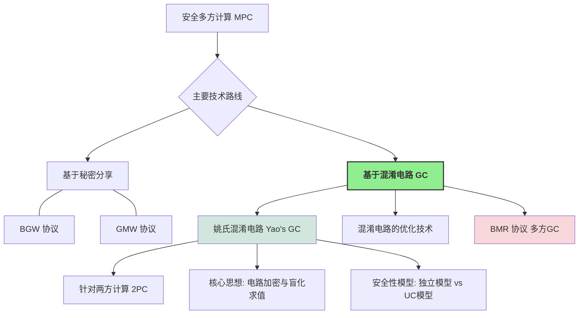

# 第8章 基于混淆电路的协议 (Protocols based on Garbled Circuits)

与前几章主要基于秘密分享的 MPC 方案（如 BGW、GMW）不同，**混淆电路 (Garbled Circuits, GC)** 是安全多方计算（尤其是两方计算）的另一种经典且强大的技术。它最早由姚期智院士在 1986 年提出，因此最初的协议被称为**姚氏混淆电路协议 (Yao's Garbled Circuits protocol, Yao's GC)** [36]。

姚氏混淆电路是第一个通用的两方安全计算 (Secure Two-Party Computation, 2PC) 协议，它的出现标志着 MPC 领域的一个重要里程碑，并迅速成为后续研究和优化的热点。

!!! abstract "本章主要内容"
    1.  **姚氏两方混淆电路协议**:
        *   详细介绍其直观思想和构造方法。
        *   分析其安全性，并讨论其在标准 UC 模型下的局限性，引出**独立模型 (Stand-alone Model)**。
        *   在独立模型下给出姚氏协议的安全性证明。
    2.  **混淆电路的优化**: 介绍一些经典的混淆电路优化技术，以提高其效率。
    3.  **BMR 协议**: 介绍 Beaver-Micali-Rogaway (BMR) 协议 [37]，它将姚氏混淆电路的思想从两方推广到多方场景。

## 8.1 姚氏混淆电路协议 (Yao's Garbled Circuits Protocol)

姚氏协议主要用于两方场景，其中一方称为**混淆者 (Garbler)** 或**构造者 (Constructor)**（通常记为 $P_1$），另一方称为**求值者 (Evaluator)**（通常记为 $P_2$）。

### 8.1.1 直观思想 (Intuitive Idea)

假设 $P_1$ 的输入是 $x$，$P_2$ 的输入是 $y$，他们想共同计算函数 $f(x,y)$，而不泄露各自的输入（除了能从输出中推断的）。

!!! tip "核心步骤的直观理解"
    1.  **电路表示**: 首先，将要计算的函数 $f$ 表示为一个布尔电路 $C$（由AND, OR, NOT等逻辑门组成）。
    2.  **电路混淆 (Garbling)** (由 $P_1$ 完成):

        *   对于电路中的每一根导线 (wire) $w_i$， $P_1$ 随机选择两个密钥（或称为标签、token）$k_{w_i}^0$ 和 $k_{w_i}^1$，分别对应导线 $w_i$ 的逻辑值 $0$ 和 $1$。
        *   对于电路中的每一个逻辑门 $g$（例如一个与门，输入导线为 $w_a, w_b$，输出导线为 $w_c$），$P_1$ 生成一个**混淆表 (garbled table)** 或称为**加密真值表 (encrypted truth table)**。
            *   这个混淆表有四行，对应输入 $(0,0), (0,1), (1,0), (1,1)$ 的所有可能组合。
            *   每一行都使用对应的输入导线密钥来加密输出导线的对应密钥。
            *   例如，对于与门，如果输入 $(w_a=0, w_b=0)$ 对应输出 $w_c=0$，那么混淆表的一行就是 $Enc_{k_{w_a}^0}(Enc_{k_{w_b}^0}(k_{w_c}^0))$。(这里的 $Enc$ 表示对称加密)。
            *   $P_1$ 将混淆表的所有行进行随机置换，以隐藏原始真值表的结构。
        *   $P_1$ 将所有门的混淆表以及关于输出导线的“解密信息”（例如，将输出导线密钥映射回真实逻辑值 $0/1$ 的表）发送给 $P_2$。这个加密和打乱后的电路称为**混淆电路 (Garbled Circuit)**。
    3.  **输入密钥获取 (Input Key Transfer)**:

        *   $P_1$ 将其输入 $x$ 对应的所有输入导线的密钥（例如，如果 $x_i=0$，则发送 $k_{w_{x_i}}^0$）直接发送给 $P_2$。
        *   对于 $P_2$ 的输入 $y$，$P_2$ 不能直接告诉 $P_1$ 它的 $y$ 以获取对应的输入导线密钥（这会泄露 $y$）。这里需要使用 **1-out-of-2 茫然传输 (OT)** 协议。对于 $P_2$ 的每一个输入比特 $y_i$， $P_1$ 作为 OT 的发送者，输入是 $(k_{w_{y_i}}^0, k_{w_{y_i}}^1)$，$P_2$ 作为 OT 的接收者，输入是其真实比特值 $y_i$。协议结束后，$P_2$ 获得了其输入 $y$ 对应的所有输入导线的密钥，而 $P_1$ 不知道 $y$。
    4.  **电路求值 (Evaluation)** (由 $P_2$ 完成):

        *   $P_2$ 现在拥有了混淆电路以及所有输入导线的正确密钥。
        *   $P_2$ 从电路的输入层开始，逐个门进行“解密”和求值：
            *   对于一个门 $g$，如果 $P_2$ 已经获得了其输入导线 $w_a, w_b$ 的密钥 $k_{w_a}^\alpha, k_{w_b}^\beta$ (其中 $\alpha, \beta$ 是这两个导线的真实逻辑值)，$P_2$ 就尝试用这对密钥去解密该门的混淆表的四行。
            *   只有对应于 $(\alpha, \beta)$ 的那一行能够被成功解密（即解密后得到一个合法的密钥格式，而不是乱码），解密结果就是输出导线 $w_c$ 对应的密钥 $k_{w_c}^{g(\alpha,\beta)}$。
        *   $P_2$ 如此层层推进，直到计算出电路输出导线的密钥。
    5.  **输出获取 (Output Retrieval)**:

        *   $P_2$ 使用 $P_1$ 提供的输出导线解密信息，将其获得的输出导线密钥转换回真实的逻辑值，得到最终计算结果 $f(x,y)$。
        *   如果 $P_1$ 也需要结果，$P_2$ 可以将结果发送给 $P_1$。

!!! success "直观安全性分析"
    *   **$P_1$ 的隐私 (对 $y$ 的无知)**: OT 协议保证了 $P_1$ 无法知道 $P_2$ 的输入 $y$。
    *   **$P_2$ 的隐私 (对 $x$ 和中间值的无知)**:
        *   $P_1$ 的输入密钥 $k_{w_x}^{\text{val}(x)}$ 是随机的，不泄露 $x$ 的信息（除非 $P_2$ 知道密钥与值的映射，但 $P_2$ 只知道 $P_1$ 给它的那个）。
        *   混淆表是加密的，并且行被打乱。$P_2$ 每次只能解密混淆表中的一行，得到下一根导线的密钥。由于密钥看起来是随机的， $P_2$ 无法从密钥本身推断出导线的真实逻辑值，也无法解密其他三行（因为缺少对应的输入密钥）。因此，$P_2$ 只能沿着一条由其实际输入决定的路径“盲目地”计算电路，而不知道中间导线的真实逻辑值。

???+ example "与门示例 (表 8.1, 8.2, 8.3, 8.4)"

    教材中通过一个与门的例子详细解释了上述过程，并讨论了如何确保 $P_2$ 只能解密正确的一行。

    *   **表 8.1: 与门的真值表**
        | x | y | z = x ∧ y |
        |---|---|-----------|
        | 0 | 0 | 0         |
        | 0 | 1 | 0         |
        | 1 | 0 | 0         |
        | 1 | 1 | 1         |

    *   **表 8.2: 与门加密后的真值表（概念性）**
        | x 的对应密钥 | y 的对应密钥 | 加密的 z                               |
        |--------------|--------------|----------------------------------------|
        | $k_X^0$      | $k_Y^0$      | $Enc_{k_X^0}(Enc_{k_Y^0}(k_Z^0))$       |
        | $k_X^0$      | $k_Y^1$      | $Enc_{k_X^0}(Enc_{k_Y^1}(k_Z^0))$       |
        | $k_X^1$      | $k_Y^0$      | $Enc_{k_X^1}(Enc_{k_Y^0}(k_Z^0))$       |
        | $k_X^1$      | $k_Y^1$      | $Enc_{k_X^1}(Enc_{k_Y^1}(k_Z^1))$       |

    *   **问题**: $P_2$ 如何判断解密结果是正确的密钥，而不是一串随机数？
    *   **解决方案 (表 8.4 的思想)**: 在要加密的密钥后附加一个固定长度的（比如 $\kappa$ 个）零比特串，即加密 $k_Z^{\text{val}(Z)} || 0^\kappa$。当 $P_2$ 解密时，如果解密结果的后 $\kappa$ 位是 $0^\kappa$，则认为是正确的密钥。错误密钥对解密后得到全零后缀的概率是可忽略的 ($2^{-\kappa}$)。
        **表 8.4: 与门的查找表（添加验证后缀 $0^\kappa$）**
        | $w_a$ 的对应密钥 | $w_b$ 的对应密钥 | $w_c$ 的对应密钥 | 查找表条目                                           |
        |-----------------|-----------------|-----------------|------------------------------------------------------|
        | $k_a^0$         | $k_b^0$         | $k_c^0$         | $Enc_{k_a^0}(Enc_{k_b^0}(k_c^0 || 0^\kappa))$         |
        | $k_a^0$         | $k_b^1$         | $k_c^0$         | $Enc_{k_a^0}(Enc_{k_b^1}(k_c^0 || 0^\kappa))$         |
        | $k_a^1$         | $k_b^0$         | $k_c^0$         | $Enc_{k_a^1}(Enc_{k_b^0}(k_c^0 || 0^\kappa))$         |
        | $k_a^1$         | $k_b^1$         | $k_c^1$         | $Enc_{k_a^1}(Enc_{k_b^1}(k_c^1 || 0^\kappa))$         |

!!! important "从查找表到电路混淆"
    对于任意函数 $z=f(x,y)$，如果 $x,y$ 的定义域较小，可以将其视为一个大的查找表。$P_1$ 加密整个查找表的输出项，然后通过 OT 让 $P_2$ 获取其输入 $(x,y)$ 对应的那一项。但当输入空间很大时（如 $x,y$ 是64位整数），查找表会变得异常巨大 ($2^{64} \times 2^{64}$ 项)，这种方法不可行。姚氏协议通过将函数分解为基本逻辑门，对每个小门（通常是2输入1输出）的查找表（真值表，仅4行）进行混淆，从而解决了这个问题。

### 8.1.2 协议描述 (Formal Protocol Description)

这里我们介绍 Lindell 和 Pinkas [38] 论文中对姚氏协议的描述，它使用了一些更现代的密码学工具和定义。

!!! definition "协议使用的“特殊”对称加密方案 (定义 8.1.1)"
    协议中使用的对称加密方案 $(Gen, Enc, Dec)$ 需要满足以下两个额外性质 (除了基础的正确性和 IND-CPA 安全外)：

    1.  **不可知的密文空间 (Elusive Range)**:
        对于一个随机选择的密钥 $k \leftarrow Gen(1^\lambda)$，任何 PPT 敌手 $\mathcal{A}$ 输出一个密文 $c$ 使得 $c \in \text{Range}_n(k) = \{Enc_k(x) | x \in \{0,1\}^n\}$ 的概率是可忽略的。
        $$ \Pr[k \leftarrow Gen(1^\lambda); \mathcal{A}(1^\lambda) \in \text{Range}_n(k)] < \text{negl}(\lambda) $$
        这意味着敌手无法轻易伪造一个看起来合法的、由特定密钥加密的密文。

    2.  **可验证的密文空间 (Efficiently Verifiable Range)**:
        存在一个 PPT 算法 $M(1^\lambda, k, c)$，当且仅当 $c \in \text{Range}_n(k)$ 时输出 $1$。
        这允许给定密钥 $k$ 和密文 $c$ 时，高效地检查 $c$ 是否确实是用 $k$ 加密某个 $n$-比特串得到的。

    ???+ example "满足上述性质的加密构造"
        教材中给出的构造例子：
        $$ Enc_k(x) = \langle r, F_k(r) \oplus (x || 0^\lambda) \rangle $$
        其中 $x \in \{0,1\}^n$, $F_k$ 是以 $k$ 为密钥的伪随机函数 (PRF) $F_k: \{0,1\}^\lambda \to \{0,1\}^{n+\lambda}$，$r \leftarrow_{\$} \{0,1\}^\lambda$ 是随机数。
        *   **验证 $c=\langle r, s \rangle$ 是否在 $\text{Range}_n(k)$**: 计算 $s \oplus F_k(r)$，检查其后 $\lambda$ 位是否全为0。
        *   **不可知性**: 伪造这样的 $c$ 意味着能预测 $F_k(r)$ 的后 $\lambda$ 位（对于随机 $r$），或者找到一个 $r'$ 使 $F_k(r')$ 的后 $\lambda$ 位与给定串匹配。这在PRF安全下是困难的。
        *   **IND-CPA 安全性**: 由于 $F_k(r)$ 是伪随机的，$F_k(r) \oplus (x || 0^\lambda)$ 对于不同的 $x$ 看起来是独立的随机串，满足 IND-CPA。

!!! definition "双重加密安全 (Secure under Chosen Double Encryption - 定义 8.1.2)"
    这是一个比标准 IND-CPA 更强的加密属性，用于姚氏协议的安全性证明。
    直观上，如果用两对独立密钥进行双重加密，如 $Enc_{k_0}(Enc_{k_1}(m))$，那么即使敌手拥有部分“外层”或“内层”的解密能力（通过预言机），也无法区分加密的是哪条消息。

    **游戏 $\text{Game}^{\text{double}}_{\mathcal{A}}(n)$**:

    1.  敌手 $\mathcal{A}$ 以 $1^n$ 为输入，输出两对密钥 $(k_0, k_1)$ 和两个消息三元组 $(x_0, y_0, z_0), (x_1, y_1, z_1)$。
    2.  挑战者随机选择一个比特 $b \leftarrow_{\$} \{0,1\}$，并随机选择两个新密钥 $k'_0, k'_1 \leftarrow Gen(1^n)$。
    3.  挑战者计算并发送挑战密文 $C = \langle Enc_{k_0}(Enc_{k'_1}(x_b)), Enc_{k'_0}(Enc_{k_1}(y_b)), Enc_{k'_0}(Enc_{k'_1}(z_b)) \rangle$ 给 $\mathcal{A}$。
    4.  $\mathcal{A}$ 可以访问两个预言机：
        *   $O_1(k,m) \rightarrow Enc_{k}(Enc_{k'_1}(m))$ (固定内层密钥 $k'_1$)
        *   $O_2(k,m) \rightarrow Enc_{k'_0}(Enc_{k}(m))$ (固定外层密钥 $k'_0$)
        最后 $\mathcal{A}$ 输出其猜测比特 $b'$。
    5.  如果 $b' = b$，游戏输出 1，否则输出 0。

    如果对于任意 PPT 敌手 $\mathcal{A}$，$\Pr[\text{Game}^{\text{double}}_{\mathcal{A}}(n)=1] \le 1/2 + \text{negl}(n)$，则称该对称加密方案在选择明文攻击下具有**双重加密安全**。

!!! lemma "引理 8.1 (IND-CPA $\Rightarrow$ 双重加密安全)"
    如果一个对称加密方案 $(Gen, Enc, Dec)$ 在选择明文攻击下具有不可区分性 (IND-CPA secure)，那么它在选择明文攻击下也具有双重加密安全。
    (证明概要：通过一系列混合游戏 (hybrid games) 将双重加密游戏的敌手优势归约到对单条消息进行 IND-CPA 攻击的敌手优势。)

!!! abstract "姚氏混淆电路构造 (形式化)"
    令 $C$ 为一个布尔电路，其输入为 $x, y \in \{0,1\}^n$，输出为 $C(x,y) \in \{0,1\}^n$。假设 $C$ 的每条输出导线不是其他任何门的输入导线。

    1.  **密钥生成 (Key Generation)**:
        对于电路 $C$ 中的每一条导线 $w_i$ (假设共有 $m$ 条导线，从输入导线到输出导线按拓扑序编号)，混淆者 $P_1$ 随机选择一对独立的密钥 $(k_{w_i}^0, k_{w_i}^1)$，其中每个密钥都是通过 $Gen(1^\lambda)$ 生成的 $\lambda$ 比特串。

    2.  **混淆门 (Garbling Gates)**:
        对于电路中的每一个逻辑门 $g$（假设其输入导线为 $w_a, w_b$，输出导线为 $w_c$）：
        $P_1$ 计算四行混淆表条目。对于每一种可能的输入逻辑值组合 $(\alpha, \beta) \in \{(0,0), (0,1), (1,0), (1,1)\}$，对应的条目是：

        $$ 
        T_{g,\alpha,\beta} = Enc_{k_{w_a}^\alpha}(Enc_{k_{w_b}^\beta}(k_{w_c}^{g(\alpha,\beta)})) 
        $$

        其中 $g(\alpha,\beta)$ 是门 $g$ 对于输入 $(\alpha, \beta)$ 的输出逻辑值。
        $P_1$ 将这四个加密条目 $(T_{g,0,0}, T_{g,0,1}, T_{g,1,0}, T_{g,1,1})$ 进行随机排列，形成门 $g$ 的混淆表 $(c_{g,0}, c_{g,1}, c_{g,2}, c_{g,3})$。

    3.  **混淆电路 $G(C)$ 的组成**:
        混淆电路 $G(C)$ 由以下部分组成：
        *   所有逻辑门的混淆表。
        *   对于电路的每一条输出导线 $w_j$ (假设其对应函数 $f$ 的第 $j$ 个输出比特)，需要一个输出解密信息表 (output decoding information table) 或称为“翻译表”(translation table)。这个表通常是 $\{(k_{w_j}^0, 0), (k_{w_j}^1, 1)\}$，允许求值者将最终得到的输出导线密钥映射回真实的逻辑值 $0$ 或 $1$。

!!! lemma "引理 8.2 (混淆电路的本地正确性/密钥恢复的唯一性)"
    假设使用的对称加密方案 $(Gen, Enc, Dec)$ 具有不可知密文空间和可验证密文空间。令 $g$ 是一个门，输入导线为 $w_a, w_b$，输出导线为 $w_c$。给定 $w_a$ 的一个密钥 $k_a = k_{w_a}^{\text{val}(w_a)}$ 和 $w_b$ 的一个密钥 $k_b = k_{w_b}^{\text{val}(w_b)}$ (其中 $\text{val}(w_a), \text{val}(w_b)$ 是 $w_a, w_b$ 的真实逻辑值)，以及门 $g$ 的（随机排列后的）混淆表 $(c_0, c_1, c_2, c_3)$。
    那么，求值者可以高效地找到**唯一一个**索引 $j \in \{0,1,2,3\}$ 使得 $c_j$ 可以被 $k_a, k_b$ 成功双重解密，并且解密结果 $k_c = Dec_{k_b}(Dec_{k_a}(c_j))$ 是输出导线 $w_c$ 的对应于真实逻辑值 $g(\text{val}(w_a), \text{val}(w_b))$ 的密钥 $k_{w_c}^{g(\text{val}(w_a), \text{val}(w_b))}$。尝试解密其他三项将会失败（输出 $\perp$）的概率是压倒性的。
    (证明基于加密方案的不可知密文空间和可验证密文空间性质。如果能成功解密两项，意味着可以区分一个随机串和一个真实密文，或者可以伪造密文，这都与假设矛盾。)

!!! protocol "姚氏混淆电路协议 (图 8.1)"
    **公共输入**: 布尔电路 $C$ (计算函数 $f$)。
    **$P_1$ (混淆者) 的输入**: $x \in \{0,1\}^n$。
    **$P_2$ (求值者) 的输入**: $y \in \{0,1\}^n$。

    1.  **电路混淆与发送 ($P_1 \to P_2$)**:
        $P_1$ 按照上述方式计算混淆电路 $G(C)$（包括所有门的混淆表和输出导线的解密信息表）。
        $P_1$ 将 $G(C)$ 发送给 $P_2$。

    2.  **输入密钥传输**:
        设 $w_{x_1}, \dots, w_{x_n}$ 是对应 $P_1$ 输入 $x$ 的电路输入导线。
        设 $w_{y_1}, \dots, w_{y_n}$ 是对应 $P_2$ 输入 $y$ 的电路输入导线。
        (a) **$P_1$ 的输入密钥 ($P_1 \to P_2$)**: $P_1$ 对于其每个输入比特 $x_i$，将其对应的输入导线 $w_{x_i}$ 的密钥 $k_{w_{x_i}}^{x_i}$ 发送给 $P_2$。
        (b) **$P_2$ 的输入密钥 (通过 $F_{OT}$)**: 对于 $P_2$ 的每个输入比特 $y_i$ (对应输入导线 $w_{y_i}$)，$P_1$ 和 $P_2$ 调用理想的 1-out-of-2 OT 功能 $F_{OT}$：
            *   $P_1$ 作为 $F_{OT}$ 的发送者，输入消息对 $(k_{w_{y_i}}^0, k_{w_{y_i}}^1)$。
            *   $P_2$ 作为 $F_{OT}$ 的接收者，输入其选择比特 $y_i$。
            协议结束后，$P_2$ 获得密钥 $k_{w_{y_i}}^{y_i}$。这一步对所有 $i \in [n]$ 并行执行。

    3.  **电路求值与输出 ($P_2$)**:
        $P_2$ 现在拥有混淆电路 $G(C)$ 以及所有 $2n$ 条输入导线的正确活动密钥。
        $P_2$ 从电路的输入层开始，按照拓扑顺序逐个门进行计算：对于每个门 $g$，使用其已获得的输入导线密钥，通过尝试解密该门混淆表的四行（或根据标识置换直接解密特定行）来获得输出导线的活动密钥。
        当计算到电路的输出导线时，$P_2$ 获得输出导线的活动密钥。然后，$P_2$ 使用 $G(C)$ 中包含的输出解密信息表，将这些密钥转换为最终的逻辑值，得到计算结果 $f(x,y)$。

    4.  **结果共享 ($P_2 \to P_1$, 可选)**:
        如果 $P_1$ 也需要知道计算结果，则 $P_2$ 将其计算得到的 $f(x,y)$ 发送给 $P_1$。

### 8.1.3 安全性分析 (Security Analysis)

我们将在**独立模型 (Stand-alone Model)** 下，在 **$F_{OT}$-混合模型** (即假设存在理想的 OT 功能，其安全性由 $F_{OT}$ 保证) 中证明姚氏协议的安全性。

**正确性**:
由引理 8.2 可知，如果使用的对称加密方案满足所需性质（不可知和可验证的密文空间），并且 $F_{OT}$ 协议是正确实现的（即 $P_2$ 确实得到了其选择的密钥），那么 $P_2$ 在每一步都能唯一且正确地恢复出下一根导线的活动密钥。因此，最终 $P_2$ 能够计算出正确的函数输出 $f(x,y)$。

**隐私性**:

*   **$P_1$ 被攻陷 (模拟器 $S_1$)**:
    $P_1$ 的视图 $view_1^\Pi(x,y; r_1)$ 包含其输入 $x$，其内部随机性 $r_1$ (用于生成密钥、排列混淆表、以及作为 OT 发送方的随机性)，以及从 $P_2$ 收到的最终结果 $f(x,y)$。
    在 $F_{OT}$-混合模型中，$P_1$ 作为 OT 的发送方，不会从 $F_{OT}$ 收到任何关于 $P_2$ 选择比特 $y_i$ 的信息。
    **模拟器 $S_1(x, f(x,y))$**:
    1.  $S_1$ 选择一个随机串 $r'_1$ (与真实运行中的 $r_1$ 同分布)。
    2.  $S_1$ 使用输入 $x$ 和随机性 $r'_1$ 模拟 $P_1$ 执行协议的所有本地计算（如生成混淆电路，准备 OT 输入）。
    3.  $S_1$ 模拟从 $P_2$ 处接收到结果 $f(x,y)$。
    输出模拟视图 $(x, r'_1, \text{messages from } F_{OT} \text{ to } P_1, f(x,y))$。(注意：$F_{OT}$ 给 $P_1$ 的消息是空的或不依赖于 $y$ 的)。
    这个模拟视图与真实视图具有相同的分布（实际上是完美不可区分的）。

*   **$P_2$ 被攻陷 (模拟器 $S_2$)**:
    $P_2$ 的视图 $view_2^\Pi(x,y; r_2)$ 包含其输入 $y$，其内部随机性 $r_2$ (作为 OT 接收方的随机性)，收到的混淆电路 $G(C)$，收到的 $P_1$ 的输入密钥 $\{k_{w_{x_i}}^{x_i}\}_{i=1}^n$，以及其在 $F_{OT}$ 中获得的输入密钥 $\{k_{w_{y_i}}^{y_i}\}_{i=1}^n$ (以及 $F_{OT}$ 的交互记录)。
    **模拟器 $S_2(y, f(x,y))$**:
    $S_2$ 的目标是生成一个与真实视图计算上不可区分的模拟视图，而不依赖于 $P_1$ 的真实输入 $x$。
    1.  **构造“假的”混淆电路 $\tilde{G}(C)$**:
        $S_2$ 不知道 $x$。
        *   对于电路的每条导线 $w_j$，$S_2$ 随机选择一对密钥 $(\tilde{k}_j^0, \tilde{k}_j^1) \leftarrow Gen(1^\lambda)$。
        *   对于每个门 $g$ (输入 $w_a, w_b$，输出 $w_c$)：$S_2$ 需要确定当 $P_1$ 的输入未知，$P_2$ 的输入为 $y$ 时，导线 $w_c$ 的“期望”逻辑值 $\text{val}_c^*$(这个值应该能让最终输出为 $f(x,y)$)。$S_2$ 可以通过计算 $f(\mathbf{0}^n, y)$ (或任何固定的 $x_{fixed}$) 来得到一条路径上的所有中间值，并最终得到 $f(x_{fixed}, y)$。然后，确保构造的 $\tilde{G}(C)$ 在输入 $(x_{fixed} \text{ 的密钥}, y \text{ 的密钥})$ 时，输出的密钥能解密成 $f(x_{fixed},y)$。
        *   更具体地，对于门 $g$，其四行混淆表条目 $T'_{g,\alpha,\beta}$ 都加密同一个输出密钥 $\tilde{k}_c^{\text{val}_c^*}$，其中 $\text{val}_c^*$ 是 $w_c$ 在 $f(x,y)$ 计算路径上的值 (或者一个能最终导出 $f(x,y)$ 的值)。即：

            $$ 
            T'_{g,\alpha,\beta} = Enc_{\tilde{k}_a^\alpha}(Enc_{\tilde{k}_b^\beta}(\tilde{k}_c^{\text{val}_c^*})) \quad \forall \alpha, \beta \in \{0,1\} 
            $$

            这些条目随后随机排列。
        *   输出解密表：对于输出导线 $w_j$ (其在 $f(x,y)$ 中的真实值为 $z_j$)，解密表是 $\{(\tilde{k}_j^{z_j}, z_j), (\tilde{k}_j^{1-z_j}, \text{random_bit_if_needed})\}$。
    2.  **模拟 $P_1$ 的输入密钥**: $S_2$ 选择一组密钥 $\{\tilde{k}_{w_{x_i}}^{0}\}_{i=1}^n$ (即假设 $P_1$ 的所有输入比特都为0，或者选择对应于计算 $f(\mathbf{0}^n, y)$ 路径的密钥) 发送给 $P_2$。
    3.  **模拟 $F_{OT}$ 交互**: $S_2$ 扮演 $F_{OT}$ 中 $P_1$ (发送方) 的角色。当 $P_2$ 以其真实输入 $y_i$ 调用 $F_{OT}$ 时，$S_2$ (作为 $F_{OT}$) 提供密钥对 $(\tilde{k}_{w_{y_i}}^0, \tilde{k}_{w_{y_i}}^1)$，使得 $P_2$ 获得 $\tilde{k}_{w_{y_i}}^{y_i}$。
    输出模拟视图 $(y, r'_2, \tilde{G}(C), \{\tilde{k}_{w_{x_i}}^{0}\}, \{\tilde{k}_{w_{y_i}}^{y_i}\}, \text{simulated } F_{OT} \text{ transcript})$。

    **不可区分性 (基于混合论证 - Page 99)**:
    通过一系列 $|C|+1$ 个混合实验 $H_0(x,y), H_1(x,y), \dots, H_{|C|}(x,y)$ 来证明。
    *   $H_0(x,y)$: 真实协议执行，$P_2$ 的视图是 $\text{view}_2^\Pi(x,y)$。
    *   $H_{|C|}(x,y)$: 完全由模拟器 $S_2$ 生成的视图（如上所述，其中所有门的混淆表都是“假的”，加密固定路径上的输出密钥）。
    *   $H_k(x,y)$: 电路中按拓扑序排列的前 $k$ 个门的混淆表是“假的”，而从第 $k+1$ 个门开始的混淆表是“真实的”（即由 $P_1$ 的真实输入 $x$ 和真实密钥生成的）。
    
    要证明 $\text{view}(H_{k-1}(x,y)) \stackrel{c}{\approx} \text{view}(H_k(x,y))$。
    这两个混合实验的区别仅在于第 $k$ 个门 $g_k$ 的混淆表。
    *   在 $H_{k-1}$ 中，$g_k$ 的混淆表是真实的，即四行分别加密对应真实输出逻辑值的密钥。
    *   在 $H_k$ 中，$g_k$ 的混淆表是假的，即四行都加密同一个由 $f(x,y)$ 决定的路径上的输出密钥。
    
    假设存在区分器 $\mathcal{D}$ 能区分 $H_{k-1}$ 和 $H_k$。可以利用 $\mathcal{D}$ 构造一个敌手 $\mathcal{A}_E$ 来攻破所用对称加密方案的**双重加密安全性** (引理 8.1)。
    $\mathcal{A}_E$ 会将 $g_k$ 的输入导线密钥 $(k_a^0, k_a^1, k_b^0, k_b^1)$ 作为双重加密游戏中的 $(k_0, k_1)$ （需要巧妙映射），并根据 $g_k$ 的真值表和“假”表的需求构造消息三元组。挑战者返回的挑战密文对应于 $g_k$ 混淆表的一行。$\mathcal{A}_E$ 将其余电路部分（前 $k-1$ 个门的假表，后 $|C|-k$ 个门的真表）和输入密钥与这个挑战行组合起来给 $\mathcal{D}$。$\mathcal{D}$ 的输出即为 $\mathcal{A}_E$ 的猜测。
    由于双重加密是安全的，所以 $\mathcal{D}$ 无法区分，因此 $H_{k-1}$ 和 $H_k$ 是计算上不可区分的。
    
    由于 $|C|$ 是输入规模的多项式，通过混合引理， $H_0(x,y) \stackrel{c}{\approx} H_{|C|}(x,y)$。而 $H_{|C|}(x,y)$ 的分布与 $S_2(y,f(x,y))$ 生成的视图相同。
    因此，模拟器 $S_2$ 成功。

!!! theorem "定理 8.4 (姚氏协议的独立模型安全性)"
    令 $f$ 是一个单一输出的确定性功能。假设使用的对称加密方案是 IND-CPA 安全的（因此也具有双重加密安全），并且具有不可知密文空间和可验证密文空间。那么，图 8.1 展示的姚氏混淆电路协议 $\Pi_{\text{Yao}}$ 在 $F_{OT}$-混合模型下，对于半诚实敌手在**独立模型**中安全地实现了功能 $f$。

!!! success "推论 8.5 (扩展到概率功能)"
    如果 $f$ 是任意（可能是多输出的）概率功能，姚氏协议仍然可以通过适当修改（例如，将随机性作为额外输入，或者将多输出视为多个单输出电路的组合）来安全实现。更一般地，如第 8.1.4 节末尾所述，能够安全实现单一输出确定性功能的两方协议，通常可以扩展到实现任意两方功能。

### 8.1.4 独立模型 (Stand-alone Model)

!!! abstract "独立模型与 UC 模型的关键对比"
    *   **环境交互**:
        *   **UC 模型**: 环境 $\mathcal{Z}$ 可以与协议**实时、动态地交互**。它可以根据协议的中间状态提供输入，并影响敌手的行为。模拟器 $\mathcal{S}$ 必须能够实时响应 $\mathcal{Z}$ 的所有可能行为。
        *   **独立模型**: （在半诚实情况下）协议的输入在执行开始前就已固定。模拟器 $\mathcal{S}$ 的任务是基于被攻陷方的（固定的）输入和最终输出，来生成一个与被攻陷方真实视图不可区分的模拟视图。交互不是实时的。
    *   **并发性**:
        *   **UC 模型**: 其核心优势之一是保证**并发安全**。UC 安全的协议可以像积木一样安全地组合。
        *   **独立模型**: 通常不直接保证并发安全。一个在独立模型下安全的协议，当与其他协议（甚至是其自身的多个实例）并发执行时，其安全性可能会被破坏。
    *   **模拟器的能力 (尤其是对恶意敌手)**:
        *   **UC 模型**: 通常要求模拟器是“直线式”的，不允许对环境或敌手进行“倒带”(rewind)。
        *   **独立模型 (恶意敌手)**: 模拟器通常被允许对（黑盒的）恶意敌手进行“倒带”操作，以便提取其输入或确保一致性。
    *   **证明的复杂度与模型的强度**:
        *   **独立模型**: 证明相对简单，但提供的安全保证较弱，主要适用于协议单独运行的场景。
        *   **UC 模型**: 证明通常更复杂，但提供了非常强的安全保证，适用于复杂的、模块化的、并发的系统。

!!! important "姚氏协议与 UC 安全"
    标准的姚氏混淆电路协议（如图 8.1）**不满足 UC 安全性**。主要原因是模拟器 $S_2$ 在构造“假的”混淆电路时，需要预先知道 $P_2$ 的输入 $y$ 和最终输出 $f(x,y)$，以便确保求值路径上的密钥被正确设置。然而，在 UC 模型中，当 $P_1$ (混淆者) 发送混淆电路 $G(C)$ 给 $P_2$ 时，环境 $\mathcal{Z}$ 可能还没有决定并提供 $P_2$ 的输入 $y$。如果 $y$ 在 $G(C)$ 发送之后才确定，模拟器 $S_2$ 就无法提前构造出依赖于 $y$ 和 $f(x,y)$ 的“假”电路。
    因此，姚氏协议的安全性通常在更弱的独立模型中进行分析。

### 8.1.5 安全性证明 (Security Proof in Stand-alone Model - 总结)

定理 8.4 的证明已在 8.1.3 节通过模拟器 $S_1$ 和 $S_2$ 的构造以及混合论证进行了概述。核心依赖于：
*   $F_{OT}$ 的理想性，保护了各方的 OT 输入。
*   对称加密方案的双重加密安全性，用于证明“真实”混淆表与“部分伪造”的混淆表之间的不可区分性。
*   对称加密方案的不可知和可验证密文空间性质，保证了混淆电路本地求值的正确性和唯一性。

### 8.1.6 混淆电路的优化 (Optimizations of Garbled Circuits)

原始的姚氏协议在通信开销（混淆电路的大小，每个门4个密文）和计算开销（求值方平均每个门2.5次解密尝试）方面存在优化空间。

!!! success "主要优化技术概览 (表 8.6 是一个很好的总结)"

    1.  **标识置换 (Point-and-Permute)** [37] (Beaver, Micali, Rogaway - BMR 协议中也用到此思想)
        *   **核心**: 为每个导线 $w_a$ 的每个逻辑值 $\alpha \in \{0,1\}$ 分配一个密钥 $k_a^\alpha$ 和一个**标识比特 (permutation bit / selector bit)** $p_a^\alpha$，满足 $p_a^0 = 1 - p_a^1$。$L_a^\alpha = k_a^\alpha || p_a^\alpha$ 称为标签。
        *   **效果**: 混淆表的行根据其输入标签的标识比特进行固定排序（例如，第 $2p_a^\alpha + p_b^\beta + 1$ 行）。求值者只需进行**一次**解密。
        *   **输出**: 加密的内容是输出导线的完整标签 $L_c^\gamma = k_c^\gamma || p_c^\gamma$。
        *   **验证**: 由于解密是确定性的，不再需要在密钥后附加 $0^\kappa$ 来验证。

    2.  **混淆表行缩减 (Garbled Row Reduction, GRR)**:
        *   **GRR3 (4行 $\to$ 3行)** [41] (Naor, Pinkas, Sumner - NPS 技术)
            *   **思想**: 在随机谕示机模型 (ROM) 下，令其中一个混淆表条目（例如对应 $(k_a^0, k_b^0)$ 的）加密的输出标签 $L_c^{g(0,0)}$ 等于 $H(k_a^0 || k_b^0 || \text{gate_id})$。这样，该条目本身（即 $H(\cdot) \oplus L_c^{g(0,0)}$）就变成了全零，无需传输。求值者通过计算 $H(\cdot)$ 直接获得 $L_c^{g(0,0)}$。
            *   需要将对称加密 $Enc_k(m)$ 实现为 $H(k || \text{nonce}) \oplus m$。
        *   **GRR2 (4行 $\to$ 2行)** [42] (Pinkas, Schneider, Smart, Williams - PSSW 技术)
            *   **思想**: 利用多项式插值。对“奇门”（如AND，输出0和1的个数为1和3）和“偶门”（如XOR，输出0和1的个数为2和2）采用不同的插值策略。
            *   **奇门 (图 8.2)**: 三个加密相同输出密钥的条目所对应的“对称加密密钥”部分 $(K_1, K_2, K_3)$ 用于插值一个二次多项式 $P(X)$。第四个条目对应的“对称加密密钥” $K_4$ 和 $P(5), P(6)$ 用于插值另一个二次多项式 $Q(X)$。新的输出密钥为 $L_c^0 = P(0), L_c^1 = Q(0)$。传输的混淆表仅包含两个插值点（如 $P(5)$ 或 $Q(5)$，取决于哪个多项式用于该路径）和4个加密后的标识比特。
            *   **偶门 (图 8.3)**: 类似，但插值方式不同。
            *   **开销**: 每个门 $2\kappa + 4$ 比特 (2个密钥长度的值，4个单比特标识)。
        *   **Free-XOR** [43] (Kolesnikov, Schneider)
            *   **思想**: 通过为整个电路选择一个全局的随机**偏移量 (offset)** $\Delta \in \{0,1\}^\kappa$，并要求每条导线 $w_i$ 的两个密钥满足 $k_i^1 = k_i^0 \oplus \Delta$。
            *   对于异或门 $w_c = w_a \oplus w_b$，其输出标签可以直接通过输入标签异或得到：$L_c^{\text{val}(w_c)} = L_a^{\text{val}(w_a)} \oplus L_b^{\text{val}(w_b)}$ (如果标识比特也满足 $p_c = p_a \oplus p_b$)。
            *   **效果**: 异或门的计算完全免费，无需传输混淆表，也无需解密。
            *   **兼容性**: Free-XOR 与 GRR3 (标识置换) 兼容。与 GRR2 不兼容。
        *   **半门 (Half-Gates)** [44] (Zahur, Rosulek, Evans - ZRE 技术)
            *   **目标**: 同时实现 **2 行混淆表** (对奇门) 和 **免费异或门**。
            *   **思想**: 将奇门（如 AND 门 $v_c = v_a \land v_b$）分解为两个特殊的“半门”和一个异或门: $v_c = \text{HalfGate}_G(v_a, r) \oplus \text{HalfGate}_E(v_a, r \oplus v_b)$。其中 $r$ 是混淆者选的随机比特。$\text{HalfGate}_G$ 由混淆者（知道 $v_a$）构造，$\text{HalfGate}_E$ 由求值者（知道 $v_a$）“贡献”其 $r \oplus v_b$ 部分。
            *   每个半门的混淆表只有2行，可通过GRR3思想缩减到1行密文。
            *   **结果**: 奇门的混淆表大小降至 2 行密文。

!!! table "表 8.6: 混淆电路优化方案及其开销总结"
    | 方案                      | 混淆表大小 (密文数) | 计算开销 (对称操作数) | 备注                         |
    |---------------------------|-------------------|--------------------|------------------------------|
    |                           | 异或门   | 与门     | 生成 (异或/与) | 求值 (异或/与) |                              |
    | 经典方案 [36]             | 4        | 4       | 4 / 4              | 2.5 / 2.5          |                              |
    | + 标识置换 [37]           | 4        | 4       | 4 / 4              | 1 / 1              | 求值方确定性解密             |
    | + GRR3 [41]               | 3        | 3       | 4 / 4              | 1 / 1              | ROM, 1行隐式为0           |
    | + GRR2 [42]               | 2        | 2       | 4 / 4              | 1 / 1              | 多项式插值，更复杂        |
    | + Free-XOR + GRR3 [43]    | 0        | 3       | 0 / 4              | 0 / 1              | 异或门免费，与门3行       |
    | 半门 (Half-Gates) [44]    | 0        | 2       | 0 / 4              | 0 / 2              | 异或门免费，与门2行 (最优) |

    *注：计算开销大致指加密/解密/哈希操作次数。生成开销是混淆者的，求值开销是求值者的。*

## 8.2 BMR 协议 (Beaver-Micali-Rogaway Protocol)

上一节介绍的姚氏混淆电路协议及其各种优化主要适用于**两方计算 (2PC)** 的场景。如果希望将混淆电路的思想推广到**多方计算 (MPC)**，即 $n > 2$ 个参与方，那么 BMR 协议 [37] (Beaver, Micali, Rogaway) 提供了一个经典的解决方案。

**从两方到多方的挑战**:
在姚氏协议中，一个关键步骤是混淆者 $P_1$ 将其输入对应的密钥发送给求值者 $P_2$，并且 $P_1$ 和 $P_2$ 通过 OT 协议来让 $P_2$ 获得其输入对应的密钥。
如果直接将此模式推广到多方：
1.  **谁是混淆者？谁是求值者？** 如果只有一个混淆者，那么该混淆者会知道所有其他方的输入密钥（通过 OT），这会泄露信息。如果每个人都扮演求值者，那么混淆电路和输入密钥需要在所有参与方之间安全地分发和组合，这非常复杂。
2.  **密钥管理**: 在姚氏协议中，导线密钥由混淆者 $P_1$ 单独生成。在多方场景下，如果密钥仍然由单个参与方生成和控制，那么该参与方被攻陷将导致整个方案的崩溃。

**BMR 协议的直观想法 (Page 108)**:
BMR 协议的核心思想是让所有参与方**共同参与**到混淆电路的“生成”和求值过程中，特别是导线密钥的生成和管理。

1.  **分布式密钥生成**: 对于电路中的每一条导线 $w_i$，不再是由单个参与方 $P_1$ 选择一对密钥 $(k_{w_i}^0, k_{w_i}^1)$。而是，每一对密钥 $(K_{w_i}^0, K_{w_i}^1)$ （这里用大写 $K$ 表示多方场景下的组合密钥）本身是通过一个 MPC 过程生成的，或者说，每个参与方 $P_j$ 持有这对密钥的“份额”或“子密钥”。
    *   具体来说，对于导线 $w_i$ 和其可能的逻辑值 $v \in \{0,1\}$，其对应的全局密钥 $K_{w_i}^v$ 是所有参与方 $P_j$ 持有的子密钥 $k_{w_i,j}^v$ 的某种组合（例如，异或和：$K_{w_i}^v = \bigoplus_{j=1}^n k_{w_i,j}^v$）。每个 $P_j$ 随机选择其子密钥 $k_{w_i,j}^0$ 和 $k_{w_i,j}^1$。

2.  **共同“混淆”门**: 对于每个门 $g$ (输入 $w_a, w_b$，输出 $w_c$)，所有参与方 $P_j$ 共同计算出门 $g$ 的混淆表。混淆表的每一行仍然是使用输入导线的全局密钥 $(K_{w_a}^\alpha, K_{w_b}^\beta)$ 来加密输出导线的全局密钥 $K_{w_c}^{g(\alpha,\beta)}$。这个加密过程本身也需要通过 MPC 来完成，因为全局密钥是以份额形式存在的。

3.  **输入提供**: 当参与方 $P_j$ 要提供其输入比特 $x_j$ (对应电路输入导线 $w_{in}$) 时，所有参与方共同计算出 $w_{in}$ 对应的活动全局密钥 $K_{w_{in}}^{x_j}$ 的份额，并使得每个参与方都能获得这个活动密钥的份额（或者一个能用于后续计算的形式）。

4.  **共同求值**: 所有参与方利用他们共同持有的输入导线活动密钥的份额，共同“解密”第一个门的混淆表，得到输出导线的活动密钥的份额。然后继续处理下一层门，直到获得最终输出导线活动密钥的份额。

5.  **输出重构**: 参与方共同重构最终输出导线的活动密钥，并使用类似于姚氏协议的输出解密信息将其转换为真实逻辑值。

!!! warning "效率问题"
    如果完全按照上述“所有事情都通过通用 MPC 完成”的思路，那么 BMR 协议的效率会非常低，因为对每个门的混淆和求值（尤其是加密操作）本身都需要运行一个复杂的 MPC 子协议。这将比直接运行一个基于秘密分享的 MPC 协议（如 BGW）来计算原始函数 $f$ 还要慢得多。

BMR 协议的巧妙之处在于它如何高效地实现上述分布式密钥管理和混淆/求值过程。

### 8.2.1 直观思想 (BMR 的实际构造思路 - Page 109)

BMR 协议的实际构造借鉴并扩展了姚氏协议中的**标识置换 (Point-and-Permute)** 和 **Free-XOR** 的思想。

1.  **标签与掩码比特 (Labels and Masking Bits)**:
    *   对于每条导线 $w_i$，每个参与方 $P_j$ 随机选择两个**子标签 (seed / sub-label)** $s_{i,j}^0, s_{i,j}^1 \in \{0,1\}^\kappa$ (其中 $\kappa$ 是安全参数)。
    *   $P_j$ 还为导线 $w_i$ 随机选择一个**子掩码比特 (sub-masking bit)** $\lambda_{i,j} \in \{0,1\}$。
    *   导线 $w_i$ 的全局**外部值 (external value)** $p_i$ (即标识比特) 是所有子掩码比特的异或和： $p_i = \bigoplus_{j=1}^n \lambda_{i,j}$。(注意：这里的 $p_i$ 对应的是姚氏协议中标识置换的 $p_a^\alpha$，即导线 $w_i$ 取某个逻辑值时，其标签末尾附加的那个用于置换的比特。)
    *   导线 $w_i$ 的**全局标签 (superseed / global label)** $S_i^0$ (对应外部值 $p_i=0$) 和 $S_i^1$ (对应外部值 $p_i=1$) 由所有参与方的子标签连接而成，并在末尾附加该外部值 (0 或 1)。
        例如，$S_i^0 = s_{i,1}^{p_i=0} || s_{i,2}^{p_i=0} || \dots || s_{i,n}^{p_i=0} || 0$
        $S_i^1 = s_{i,1}^{p_i=1} || s_{i,2}^{p_i=1} || \dots || s_{i,n}^{p_i=1} || 1$
        这里 $s_{i,j}^{p_i=v}$ 表示 $P_j$ 为导线 $w_i$ 的外部值 $v$ 所选的子标签。(教材中 $S_i^0$ 和 $S_i^1$ 的定义是固定的，即 $S_i^0$ 总是对应逻辑值0的标签， $S_i^1$ 总是对应逻辑值1的标签。而导线的真实值 $v_i$ 与其外部值 $p_i$ 的关系由全局掩码 $\Lambda_i = \bigoplus_j \lambda_{i,j}$ 决定： $p_i = v_i \oplus \Lambda_i$。)
        
        **更准确的 BMR 标签定义 (Page 109)**:
        *   全局掩码 $\Lambda_i = \bigoplus_{j=1}^n \lambda_{i,j}$。
        *   导线 $w_i$ 的真实逻辑值为 $v_i$。其**外部值 (标识比特)** 为 $p_i = v_i \oplus \Lambda_i$。
        *   $P_j$ 为导线 $w_i$ 生成两个子标签：$s_{i,j}^0$ (对应 $w_i$ 外部值为0) 和 $s_{i,j}^1$ (对应 $w_i$ 外部值为1)。
        *   导线 $w_i$ 的**全局标签** $S_i^{p_i}$ (对应外部值 $p_i$) 定义为：
            $S_i^{p_i} = s_{i,1}^{p_i} || s_{i,2}^{p_i} || \dots || s_{i,n}^{p_i} || p_i$。

2.  **使用伪随机数生成器 (PRG)**:
    一个全局标签 $S_i^v$ (长度约为 $n\kappa$) 被用作一个伪随机数生成器 $G: \{0,1\}^{n\kappa+1} \to \{0,1\}^{2n\kappa+2}$ 的种子。
    $G(S_i^v)$ 的输出被分为两部分：$g(S_i^v)$ (前 $n\kappa+1$ 比特) 和 $h(S_i^v)$ (后 $n\kappa+1$ 比特)。
    这些 $g(\cdot)$ 和 $h(\cdot)$ 的输出将用于构造混淆表的加密密钥，类似于 Free-XOR 中的 $\Delta$ 或 GRR 中的 $H(\cdot)$。

3.  **混淆门 (Garbling Gate) $g_{gate}$ : $w_c = \text{gate_type}(w_a, w_b)$)**:
    混淆表的每一行仍然加密输出导线 $w_c$ 的一个全局标签 $S_c^{p_c}$。
    加密方式：对于输入导线 $w_a, w_b$ 的外部值 $(p_a, p_b)$，对应的混淆表条目（例如 $A_g, B_g, C_g, D_g$ 中的一项）是：

    $$ 
    \text{Entry}(p_a, p_b) = \left( \bigoplus_{j=1}^n \text{func1}(s_{a,j}^{p_a}) \right) \oplus \left( \bigoplus_{j=1}^n \text{func2}(s_{b,j}^{p_b}) \right) \oplus S_c^{p_c^*} 
    $$

    其中 $\text{func1}, \text{func2}$ 是 $g$ 或 $h$ (取决于该条目在 $A_g, B_g, C_g, D_g$ 中的位置，例如 $A_g$ 用 $g(s_{a,j}^{p_a=0})$ 和 $g(s_{b,j}^{p_b=0})$ )，而 $p_c^*$ 是由 $g_{gate}(\Lambda_a, \Lambda_b) \oplus \Lambda_c$ (真实值之间的门运算关系) 和当前输入的外部值 $(p_a, p_b)$ 共同决定的输出导线的外部值。
    (Page 109 的公式):

    $$
    \begin{align}
    A_g &= \left( \bigoplus_j g(s_{a,j}^0) \right) \oplus \left( \bigoplus_j g(s_{b,j}^0) \right) \oplus S_c^{p_c^0} \\
    B_g &= \left( \bigoplus_j h(s_{a,j}^0) \right) \oplus \left( \bigoplus_j g(s_{b,j}^1) \right) \oplus S_c^{p_c^1} \\
    C_g &= \left( \bigoplus_j g(s_{a,j}^1) \right) \oplus \left( \bigoplus_j h(s_{b,j}^0) \right) \oplus S_c^{p_c^2} \\
    D_g &= \left( \bigoplus_j h(s_{a,j}^1) \right) \oplus \left( \bigoplus_j h(s_{b,j}^1) \right) \oplus S_c^{p_c^3}
    \end{align}
    $$

    其中 $S_c^{p_c^k}$ 是根据 $g_{gate}(\Lambda_a, \Lambda_b) = \Lambda_c$ 是否成立以及 $(p_a,p_b)$ 的具体取值来选择 $S_c^0$ 还是 $S_c^1$。
    例如，如果 $g_{gate}(\Lambda_a, \Lambda_b) = \Lambda_c$，那么当 $(p_a, p_b)=(0,0)$ 时，$g_{gate}(v_a,v_b)=v_c \Rightarrow g_{gate}(0\oplus\Lambda_a, 0\oplus\Lambda_b) = 0\oplus\Lambda_c \Rightarrow p_c = 0$。则 $A_g$ 中加密的是 $S_c^0$。

    **关键点**:
    *   混淆表的每一项是 $n$ 个参与方贡献的“部分加密密钥”的异或和，再加上被加密的输出标签。
    *   每个参与方 $P_j$ 可以独立计算其贡献的部分，例如 $g(s_{a,j}^{p_a})$。
    *   这些部分随后需要通过一个 MPC 协议（例如 BGW 或 GMW，因为是异或求和）进行安全地聚合，以得到最终的混淆表条目。

4.  **输入提供**:
    对于每个输入导线 $w_i$ (其真实值为 $v_i$，由某个 $P_k$ 提供)，所有参与方 $P_j$ 首先公开其子掩码比特 $\lambda_{i,j}$。
    由此可以计算出全局掩码 $\Lambda_i = \bigoplus \lambda_{i,j}$ 和外部值 $p_i = v_i \oplus \Lambda_i$。
    然后，每个参与方 $P_j$ 公开其子标签 $s_{i,j}^{p_i}$ (对应外部值 $p_i$ 的那个子标签)。
    所有参与方组合这些公开的子标签得到全局活动输入标签 $S_i^{p_i} = s_{i,1}^{p_i} || \dots || s_{i,n}^{p_i} || p_i$。

5.  **电路求值**:
    所有参与方都拥有完整的混淆电路（所有门的混淆表 $A_g, B_g, C_g, D_g$）和所有输入导线的活动全局标签。
    他们可以并行地、本地地“解密”电路：
    对于一个门 $g$，如果其输入导线 $w_a, w_b$ 的活动标签是 $S_a^{p_a}, S_b^{p_b}$ (已知 $p_a, p_b$)，则对应的混淆表条目是（例如，如果 $(p_a,p_b)=(0,0)$, 则是 $A_g$）。
    输出标签 $S_c^{p_c}$ 可以通过 $A_g \oplus (\bigoplus g(s_{a,j}^{p_a=0})) \oplus (\bigoplus g(s_{b,j}^{p_b=0}))$ 计算得到。
    由于 $S_a^{p_a=0}$ 的子标签 $s_{a,j}^{0}$ 是已知的（因为 $S_a^0$ 是活动输入标签），所以 $\bigoplus g(s_{a,j}^{0})$ 可以被每个参与方本地计算。

6.  **输出获取**:
    当计算到输出导线 $w_j$ 时，所有参与方都获得了其活动标签 $S_j^{p_j}$。
    他们需要共同得到 $p_j$ (标签的最后一位) 和全局掩码 $\Lambda_j$ (可以通过 MPC 计算 $\bigoplus \lambda_{i,j}$，或者如果 $\lambda_{i,j}$ 在输入阶段已公开，则直接本地计算)。
    最终输出逻辑值 $v_j = p_j \oplus \Lambda_j$。

### 8.2.2 协议描述 (Formal Protocol Description - Fig 8.4, 8.5)

教材中的图 8.4 和 8.5 给出了 BMR 协议的更形式化的两阶段描述。

!!! protocol "BMR 协议 (第一部分 - 图 8.4)"
    **公共输入**: 布尔电路 $C$，$G:\{0,1\}^\kappa \to \{0,1\}^{2n\kappa+2}$。
    **$P_i$ 的输入**: $x_i$ (一个比特或多个比特)。

    **阶段 1: 预处理与密钥生成 (Offline-like Phase)**

    1.  **输入秘密分享**: 每个 $P_i$ 将其输入 $x_i$ 的每个比特进行秘密分享（例如，加法分享）。
    2.  **导线材料生成**: 对于电路 $C$ 的每条导线 $w_k$:
        *   每个参与方 $P_j$ 随机选择子标签 $s_{k,j}^0, s_{k,j}^1 \in \{0,1\}^\kappa$ 和子掩码比特 $\lambda_{k,j} \in \{0,1\}$。
        *   (这些是 $P_j$ 的秘密，但它们的组合将构成全局值)。
    3.  **混淆表生成 (通过 MPC)**: 对于电路 $C$ 的每个门 $g$ (输入 $w_a, w_b$，输出 $w_c$):
        *   所有参与方 $P_j$ 以其持有的 $\{s_{a,j}^0, s_{a,j}^1, s_{b,j}^0, s_{b,j}^1, s_{c,j}^0, s_{c,j}^1\}$ 和 $\{\lambda_{a,j}, \lambda_{b,j}, \lambda_{c,j}\}$ 作为 MPC 的输入。
        *   他们共同运行一个 MPC 协议来计算混淆表 $(A_g, B_g, C_g, D_g)$ 的**秘密分享**。
            例如，对于 $A_g = (\bigoplus_j g(s_{a,j}^0)) \oplus (\bigoplus_j g(s_{b,j}^0)) \oplus S_c^{p_c^*}$，
            每个 $P_l$ 得到 $A_g$ 的一个份额 $(A_g)_l$。
            (这里 $g(\cdot)$ 和 $h(\cdot)$ 是 $G$ 的前半部分和后半部分)。
    4.  **输入标签计算 (通过 MPC)**: 对于每个输入导线 $w_k$ (其真实值为 $v_k$，当前是以秘密分享形式存在的)：
        *   所有参与方 $P_j$ 通过 MPC 计算全局掩码 $\Lambda_k = \bigoplus_j \lambda_{k,j}$ 的份额。
        *   通过 MPC 计算外部值 $p_k = v_k \oplus \Lambda_k$ 的份额。
        *   然后，对于每个 $P_j$，它需要将其子标签 $s_{k,j}^{p_k}$ (这个 $p_k$ 是秘密分享的) 作为“公开”值（在后续步骤中）。这是一个棘手的部分，通常 $p_k$ 会被重构并公开。
        *   **教材图 8.4 步骤4**: 对于每条输入导线 $w_i$ (其值 $v_i$ 已被秘密分享)，参与方通过 MPC 安全计算 $p_i = v_i \oplus \Lambda_i$ 并**公开 $p_i$**。然后，每个参与方 $P_j$ **广播其子标签 $s_{i,j}^{p_i}$**。所有参与方组合这些子标签得到全局输入标签 $S_i^{p_i}$。

!!! protocol "BMR 协议 (第二部分 - 图 8.5)"
    **阶段 2: 电路求值 (Online-like Phase)**

    5.  **信息公布**:

        (a) 对于每条**输出**导线 $w_j$，所有参与方 $P_k$ 公开其子掩码比特 $\lambda_{j,k}$，从而所有方都可以计算全局输出掩码 $\Lambda_j$。

        (b) 所有参与方公开在步骤3中计算得到的**混淆表 $(A_g, B_g, C_g, D_g)$ 的所有份额**，从而所有方都可以重构出完整的混淆表。

        (c) 所有参与方已经拥有在步骤4中得到的每条**输入**导线的**全局活动标签 $S_i^{p_i}$**。

        此时，所有参与方都拥有：完整的混淆电路（所有门的混淆表），所有输入导线的活动标签，以及所有输出导线的全局掩码。
    6.  **本地电路求值**: 每个参与方 $P_k$ **独立地、本地地**计算整个混淆电路：

        (a) 从已知的输入导线活动标签开始。

        (b) 对于每个门 $g$ (输入 $w_a, w_b$ 活动标签 $S_a^{p_a}, S_b^{p_b}$，输出 $w_c$)：

        *   根据 $(p_a, p_b)$ 确定要使用的混淆表条目 (例如 $A_g$ if $p_a=0, p_b=0$)。
        *   计算 $\text{KeyPart}_a = \bigoplus_{j=1}^n g(s_{a,j}^{p_a})$ (其中 $s_{a,j}^{p_a}$ 是 $S_a^{p_a}$ 的第 $j$ 部分)。
        *   计算 $\text{KeyPart}_b = \bigoplus_{j=1}^n g(s_{b,j}^{p_b})$ (或用 $h(\cdot)$，取决于条目)。
        *   计算输出标签 $S_c^{p_c} = \text{Entry} \oplus \text{KeyPart}_a \oplus \text{KeyPart}_b$。

        (c) 如此迭代，直到获得所有输出导线的活动标签 $S_j^{p_j}$。

        (d) 对于每个输出导线 $w_j$，其外部值 $p_j$ 是 $S_j^{p_j}$ 的最后一位。

        (e) 计算真实输出逻辑值 $v_j = p_j \oplus \Lambda_j$ (其中 $\Lambda_j$ 已在步骤 5a 得到)。

!!! success "BMR 协议的轮数复杂度"
    *   **阶段1**:
        *   步骤1 (输入分享): 1 轮 (或常数轮，取决于分享方案)。
        *   步骤2 (本地选择): 0 轮。
        *   步骤3 (MPC计算混淆表份额): 取决于底层 MPC 的轮数（例如，如果用BGW/GMW，轮数与电路深度成正比，但这里是为**每个门**的混淆表计算，这些计算可以并行）。关键是，混淆表的结构不依赖于实际输入，只依赖于导线标签和掩码的子份额。
        *   步骤4 (MPC计算输入标签的 $p_i$ 并公开，然后广播子标签): 公开 $p_i$ 需要重构，广播子标签是1轮。
    *   **阶段2**:
        *   步骤5 (信息公布): 1 轮 (所有参与方广播所需信息)。
        *   步骤6 (本地求值): 0 轮。

    BMR 协议的原始论文 [37] 强调其能够实现**常数轮**的安全多方计算（在预处理之后）。这是因为阶段1的大部分（特别是步骤3）可以被视为与输入无关的**预处理**。一旦预处理完成（即所有混淆表的份额和输入标签的$p_i$份额都已计算好），在线阶段（从参与方获得真实输入开始）到最终输出，轮数是常数的（主要是步骤4中公开 $p_i$ 和广播子标签，以及步骤5的公布）。
    如果将步骤3中为每个门计算混淆表份额的 MPC 视为一个整体的复杂函数计算，其轮数确实会依赖于这个“混淆表生成电路”的深度。但BMR的巧妙在于，求值阶段（步骤6）是完全本地的。

### 8.2.3 安全性分析 (Security Analysis)

BMR 协议的安全性依赖于其底层组件的安全性：
*   用于秘密分享和 MPC 计算（步骤1, 3, 4中）的协议（例如 BGW 或 GMW）。
*   PRG $G$ 的伪随机性。
*   标识置换和 Free-XOR 类似的思想保证了每个门求值的正确性和隐私性（即求值者只能得到一个输出标签，无法知道真实逻辑值或另一个标签）。

**模拟器构造概要**:
模拟器的构造会比较复杂，因为它需要模拟底层 MPC 的执行视图以及 BMR 协议本身的视图。
*   当有参与方被攻陷时，模拟器需要能够：
    *   在不知道诚实方输入的情况下，提供看起来合法的子标签和子掩码比特份额。
    *   模拟底层 MPC 的执行，使得被攻陷方看到的关于混淆表份额或输入 $p_i$ 份额的消息是一致的。
    *   最终确保被攻陷方获得的关于电路求值的信息（如公开的混淆表、输入标签）与真实执行一致，但这些信息本身不泄露诚实方的秘密输入。

!!! theorem "定理 8.6 (BMR 协议的安全性)"
    假设被攻陷方数量满足底层 MPC 协议（用于步骤1,3,4）的安全门限（例如，对于 BGW， $t < n/2$）。假设伪随机数生成器 $G$ 是安全的。那么，BMR 协议（如图 8.4 和 8.5 所示）对于半诚实敌手安全地实现了函数 $f$（在相应的混合模型下，例如，如果底层 MPC 是 UC 安全的，则 BMR 也是 UC 安全的）。
    该协议的计算复杂度和通信复杂度是关于电路大小 $|C|$ 和安全参数 $\kappa$ 的多项式。如果底层 MPC 是常数轮的（例如，在预处理模型下），则 BMR 的在线阶段也是常数轮的。

!!! note "BMR 的重要性"
    BMR 协议不仅将混淆电路推广到多方，更重要的是它揭示了 MPC 轮数可以与电路深度无关（达到常数轮，尤其是在有预处理的场景下）。它也启发了后续许多关于高效 MPC（特别是常数轮 MPC）的研究。
    姚氏混淆电路和 BMR 协议通常在“对称密码模型”中分析，即主要依赖对称加密、哈希函数、PRG 等工具，而较少依赖公钥密码操作（除了OT的实现可能需要）。

好的，我们继续第九章《恶意安全性》的笔记。