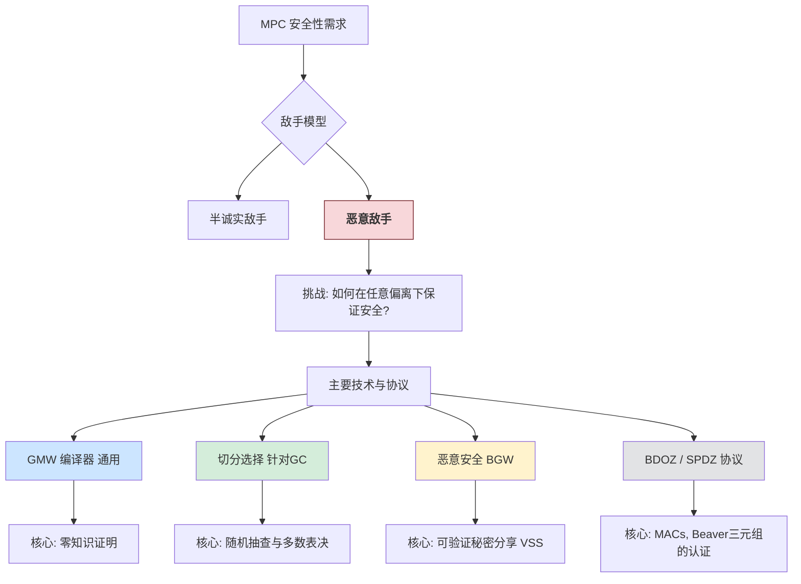

# 第9章 恶意安全性 (Malicious Security)

在前面的章节中，我们主要讨论了在**半诚实敌手模型 (Semi-Honest Adversary Model)** 下的安全多方计算协议。在该模型中，所有参与方都会遵循协议的规定执行，但可能会试图从其收到的消息中推断出额外的信息。然而，在现实世界的许多应用场景中，我们必须考虑到参与方可能是**恶意的 (Malicious)**。恶意敌手可能会采取任何可能的偏离协议的行为，以达到其目的，例如破坏协议的正确性、获取其他参与方的私密信息，或者使得诚实方无法得到正确的输出。

本章将介绍几种实现恶意安全 MPC 的关键技术和代表性协议。

**本章主要内容**:

1. **GMW 编译器 (GMW Compiler)**: 一种通用的编译器技术，利用零知识证明将任意半诚实安全的协议转化为恶意安全的协议。
2. **切分选择技术 (Cut-and-Choose)**: 一种专门用于增强基于混淆电路的协议（如姚氏协议）以抵抗恶意行为的技术。
3. **恶意安全的 BGW 协议**: 介绍 BGW 协议的恶意安全版本，它使用了**可验证秘密分享 (Verifiable Secret Sharing, VSS)** 来确保参与方诚实地分享其输入。
4. **BDOZ 和 SPDZ 协议**: 简要介绍基于 Beaver 三元组和消息认证码 (MAC) 的更现代的高效恶意安全 MPC 协议。

## 9.1 GMW 编译器 (GMW Compiler)

GMW 编译器 [17] (Goldreich, Micali, Wigderson) 提供了一种强大的范式：如果一个协议在半诚实模型下是安全的，那么可以通过在该协议的每一步执行之后，让执行方使用**零知识证明 (Zero-Knowledge Proof, ZKP)** 来向其他参与方证明其行为确实遵循了协议规定，从而将该协议转化为一个在恶意模型下也安全的协议。

!!! abstract "零知识证明 (Zero-Knowledge Proof)"
    零知识证明是一种两方协议，其中：
    *   **证明者 (Prover, P)** 想要向**验证者 (Verifier, V)** 证明某个**陈述 (Statement)** $x$ 是真实的，并且证明者知道一个**见证 (Witness)** $w$ 使得某个公开的 NP 关系 $R(x,w)$ 成立（即 $w$ 是 $x \in L$ 的证据，其中 $L$ 是一个 NP 语言）。
    *   **完备性 (Completeness)**: 如果陈述 $x$ 是真实的且证明者 $P$ 是诚实的（知道 $w$），那么验证者 $V$ 将以高概率（通常是1）接受证明。
    *   **可靠性 (Soundness)**: 如果陈述 $x$ 是虚假的，那么无论恶意的证明者 $P^*$ 如何尝试，验证者 $V$ 都会以高概率（通常是 $1 - \text{negl}(\lambda)$）拒绝证明。
    *   **零知识性 (Zero-Knowledge)**: 如果陈述 $x$ 是真实的，验证者 $V$（即使是恶意的）在与诚实的证明者 $P$ 交互后，除了得知“$x$ 是真实的”这一事实外，无法获得关于见证 $w$ 的任何额外信息。这意味着存在一个模拟器，它仅知道 $x$ (和 $x$ 为真这一事实)，就能生成一个与真实交互不可区分的对话脚本。

???+ example "一个零知识证明的例子：图同构的证明 (教材未直接给出，但这是经典例子)"
    *   **陈述 $x$**: 两个图 $G_0, G_1$ 是同构的。
    *   **见证 $w$**: $G_0$ 到 $G_1$ 的一个同构映射 $\pi$ (即一个顶点置换)。
    *   **协议 (简化版，多次重复以降低错误率)**:
        1.  P 随机选择一个置换 $\rho$，计算 $H = \rho(G_0)$ (即对 $G_0$ 的顶点进行 $\rho$ 置换得到新图 $H$)。P 将 $H$ 发送给 V。
        2.  V 随机选择一个比特 $b \leftarrow_{\$} \{0,1\}$ 并发送给 P。
        3.  P 回复：
            *   如果 $b=0$，P 发送 $\rho$。V 检查 $H = \rho(G_0)$ 是否成立。
            *   如果 $b=1$，P 发送 $\sigma = \pi \circ \rho^{-1}$ (或 $\rho \circ \pi^{-1}$，取决于定义)。V 检查 $H = \sigma(G_1)$ 是否成立。(因为 $H=\rho(G_0)$ 且 $G_0=\pi^{-1}(G_1)$, 则 $H = \rho(\pi^{-1}(G_1))$，所以 $\sigma = \rho \circ \pi^{-1}$ )
    *   **完备性**: 显然。
    *   **可靠性**: 如果 $G_0, G_1$ 不同构，P 只能准备一个能通过 $b=0$ 或 $b=1$ 检查的 $H$。P 猜对 $b$ 的概率是 $1/2$。多次重复后，P 作弊成功的概率指数级下降。
    *   **零知识性**: 模拟器知道 $G_0, G_1$ 同构。当模拟器被 V 要求生成一个会话时：
        1.  模拟器随机选择比特 $b' \in \{0,1\}$ 和置换 $\rho'$。
        2.  如果 $b'=0$，模拟器计算 $H'=\rho'(G_0)$。
        3.  如果 $b'=1$，模拟器计算 $H'=\rho'(G_1)$。
        模拟器将 $H'$ 发送给 V。当 V 发送其挑战 $b$ 时：
        *   如果 $b=b'$，模拟器按规则回复 $\rho'$ (如果 $b'=0$) 或 $\rho'$ (如果 $b'=1$，这里应该是 $\rho'$ 而非 $\sigma$，因为模拟器不知道 $\pi$)。V 会接受。
        *   如果 $b \ne b'$，模拟器“卡住”了。但模拟器可以“倒带”V 到它选择 $b$ 之前，然后重新尝试上面的步骤，直到 $b=b'$。由于 $b$ 是随机的，期望尝试次数是2。生成的会话与真实会话不可区分。

!!! important "Sigma 协议 (Sigma Protocols - 定义 9.1.1)"
    Sigma 协议是一类特殊的3步公共硬币 (public-coin) 零知识证明系统，其交互形式为：
    1.  **承诺 (Commit)**: P $\to$ V: $a \leftarrow C(x,w;r)$ (初始消息或承诺)
    2.  **挑战 (Challenge)**: V $\to$ P: $e \leftarrow_{\$} \{0,1\}^\mu$ (随机挑战)
    3.  **回应 (Response)**: P $\to$ V: $z \leftarrow Z(x,w,r,e)$ (回答消息)
    V 通过检查 $(x,a,e,z)$ 是否满足某个验证关系来接受或拒绝。

    Sigma 协议通常具有以下性质：
    ***完备性 (Completeness)**
    *   **特殊可靠性 (Special Soundness)**: 如果对于同一个初始消息 $a$，存在两个不同的挑战 $e \ne e'$ 及对应的有效回应 $(z, z')$，那么可以高效地从 $(a,e,z,e',z')$ 中提取出见证 $w$。
    *   **诚实验证者零知识性 (Honest-Verifier Zero-Knowledge, HVZK)**: 存在一个模拟器 $S_{HVZK}$，它可以在不知道 $w$ 的情况下，给定 $x$ 和一个随机挑战 $e$，生成一个看起来合法的 $(a,z)$ 对，使得 $(a,e,z)$ 是一个可接受的会话。

???+ example "图 9.1: 一个基于 ElGamal 的 Sigma 协议 (零知识证明 $c=(c_1,c_2)$ 是对消息 $m$ 的加密)"
    这个例子展示了证明者 P 知道随机数 $r$ 使得 $c_1 = g^r$ 且 $c_2 = m \cdot h^r$，而不泄露 $r$。
    **陈述 $x$**: $(g, h, c_1, c_2, m)$ (均为公开值)
    **见证 $w$**: $r$
    **NP 关系 $R(x,w)$**: $c_1 = g^r \land c_2 = m \cdot h^r$

    **协议流程**:
    1.  **P (证明者)**:
        *   随机选择 $r' \leftarrow_{\$} \mathbb{Z}_q$。
        *   计算 $a_1 = g^{r'}$，$a_2 = h^{r'}$。
        *   P $\to$ V: $(a_1, a_2)$。
    2.  **V (验证者)**:
        *   随机选择挑战 $e \leftarrow_{\$} \mathbb{Z}_q$。
        *   V $\to$ P: $e$。
    3.  **P (证明者)**:
        *   计算回应 $z = r' + e \cdot r \pmod q$。
        *   P $\to$ V: $z$。
    4.  **V (验证者) 验证**:
        *   检查 $g^z \stackrel{?}{=} a_1 \cdot (c_1)^e$
        *   检查 $h^z \stackrel{?}{=} a_2 \cdot (c_2/m)^e$
        如果两个等式都成立，则接受；否则拒绝。

    **教材定理 9.1**: 该协议满足完备性、特殊可靠性和诚实验证者零知识性。

**GMW 编译器的应用**:
对于一个半诚实安全的协议 $\Pi_{semi-honest}$，GMW 编译器通过以下方式将其转换为恶意安全的协议 $\Pi_{malicious}$:

1. **承诺阶段**: 在协议开始时，每个参与方 $P_i$ 对其输入 $x_i$ 和将要使用的随机带 $\rho_i$ 进行密码学承诺，并将承诺值公开。
2. **抛硬币阶段 (可选，用于生成公共随机性)**: 如果协议需要公共随机数，参与方可以通过一个安全的抛硬币子协议来生成。
3. **执行与证明阶段**: 参与方按照 $\Pi_{semi-honest}$ 的步骤执行。每当 $P_i$ 需要发送一条消息 $m_i$ 时，它首先计算 $m_i$，然后使用零知识证明向接收方（或其他所有方）证明：
   * "$m_i$ 是根据我之前承诺的输入 $x_i$、随机带 $\rho_i$ 以及我到目前为止收到的所有消息，并严格遵循协议 $\Pi_{semi-honest}$ 的规定计算出来的。"
   * 这个陈述的见证就是 $x_i, \rho_i$ 以及收到的历史消息。
     如果零知识证明验证失败，则接收方可以认为 $P_i$ 作弊并中止协议（或采取其他纠错措施）。

!!! success "GMW 编译器的效果"
    *   **可靠性**: 由于零知识证明的可靠性，恶意参与方无法在偏离协议的情况下让验证者接受其伪造的消息（除非以可忽略的概率）。
    *   **零知识性**: 证明过程不泄露诚实参与方的任何额外信息（如其输入和随机带）。
    *   **结果**: 如果原始半诚实协议是安全的，并且使用的 ZKP 系统是安全的，那么编译后的协议在恶意模型下也是安全的。

!!! warning "GMW 编译器的开销"
    虽然 GMW 编译器在理论上非常强大，但它的主要缺点是效率。为协议的每一步都执行一次通用的零知识证明通常会带来巨大的计算和通信开销，使得编译后的协议在实践中对于复杂功能可能不够高效。因此，研究者们也致力于设计更直接的、针对特定问题的恶意安全协议，或者更高效的 ZKP 系统。

## 9.2 切分选择 (Cut-and-Choose)

切分选择是一种专门用于抵抗恶意混淆者 (Garbler) 的技术，尤其适用于姚氏混淆电路协议。在姚氏协议中，如果混淆者 $P_1$ 是恶意的，它可以构造一个错误的或恶意的混淆电路 $G(C')$ 而不是正确的 $G(C)$，这个 $G(C')$ 可能会泄露求值者 $P_2$ 的输入，或者产生错误的输出。

### 9.2.1 直观思想 (Intuitive Idea)

**核心思想**: 让混淆者 $P_1$ 生成大量的（例如 $s$ 个）相同功能 $f$ 的混淆电路副本。然后，求值者 $P_2$ 随机选择其中的一部分（例如 $s/2$ 个）要求 $P_1$ **打开 (open)** 并检查其正确性。如果所有被打开的电路都验证通过，那么 $P_2$ 就有较高的统计置信度认为剩余未打开的电路中，大部分也是正确的。$P_2$ 随后对所有未打开的电路进行求值，并取其输出的**多数结果**作为最终输出。

1. **生成副本 ($P_1$)**: $P_1$ 生成 $s$ 个混淆电路 $GC_1, GC_2, \dots, GC_s$，它们都声称是计算函数 $f$ 的。$P_1$ 还为每个电路的每条输入导线的每个可能值生成对应的密钥（标签）。
2. **承诺 ($P_1$)**: $P_1$ 对所有这些电路和密钥进行承诺，并将承诺值发送给 $P_2$。
3. **随机选择 ($P_2$)**: $P_2$ 随机选择一个大小为 $s/2$ 的索引子集 $J_{check} \subset \{1, \dots, s\}$。这些电路将作为“检查电路”(check circuits)。剩余的 $s/2$ 个电路 $J_{eval}$ 将作为“求值电路”(evaluation circuits)。$P_2$ 将 $J_{check}$ 发送给 $P_1$。
4. **打开与检查 ($P_1, P_2$)**: $P_1$ 揭示 $J_{check}$ 中所有电路的全部信息（包括所有导线密钥、随机性等）。$P_2$ 验证这些电路是否确实是根据函数 $f$ 和 $P_1$ 承诺的随机性正确生成的。如果有任何一个检查电路不正确，$P_2$ 中止协议，判定 $P_1$ 作弊。
5. **OT 阶段 ($P_1, P_2$)**: 如果所有检查电路都通过验证，对于**所有** $s$ 个电路（包括检查电路和求值电路），$P_1$ 和 $P_2$ 为 $P_2$ 的输入 $y$ 执行 OT，使得 $P_2$ 获得其输入 $y$ 对应的每个求值电路 $GC_j$ ($j \in J_{eval}$) 的输入密钥。（对于检查电路， $P_2$ 已经从打开阶段获得了所有密钥，不需要再为它们做 OT，但为了防止 $P_1$ 根据 OT 的选择来构造恶意电路，通常 OT 是针对所有 $s$ 个电路的输入密钥进行的，或者在承诺阶段就完成）。
   更常见的做法是：$P_2$ 只为 $J_{eval}$ 中的电路执行 OT 获取其输入 $y$ 的密钥。对于 $P_1$ 的输入 $x$，$P_1$ 将其输入 $x$ 对应的密钥（对于 $J_{eval}$ 中的每个电路）发送给 $P_2$。
6. **求值与多数表决 ($P_2$)**: $P_2$ 对 $J_{eval}$ 中的所有电路进行求值，得到 $s/2$ 个输出结果。$P_2$ 取这些结果中的多数作为最终输出 $f(x,y)$。

**安全性分析 (作弊概率)**:
假设 $P_1$ 是恶意的，它想让 $P_2$ 接受一个错误的输出或者泄露 $P_2$ 的信息。为此，它可能在 $s$ 个电路中混入一些“坏”的电路。

* 如果 $P_1$ 构造的坏电路少于 $s/2$ 个，那么它期望所有被 $P_2$ 选中检查的电路都是好的。
* 设 $P_1$ 构造了 $k$ 个坏电路。$P_2$ 随机选择 $s/2$ 个电路进行检查。这 $s/2$ 个电路全都是好电路（即 $P_1$ 的作弊未被发现）的概率是 $\binom{s-k}{s/2} / \binom{s}{s/2}$。
* 如果 $k \approx s/2$ (例如， $P_1$ 构造了一半坏电路，一半好电路)，那么未被发现的概率大约是 $2^{-s/2}$ (这是一个粗略估计，实际计算更复杂，如教材 Page 120 的推导)。
* 通过选择足够大的 $s$ (例如 $s=80$ 或 $s=160$)，这个概率可以变得非常小 (例如 $2^{-40}$)。
* 如果作弊未被发现， $J_{eval}$ 中可能仍有坏电路。但只要 $J_{eval}$ 中好电路的数量占多数，多数表决就能得到正确结果。如果 $P_1$ 想要操纵最终输出，它需要确保 $J_{eval}$ 中坏电路占多数，这要求它在初始的 $s$ 个电路中构造远超 $s/2$ 个的坏电路，这样被发现的概率会非常高。

**教材 Page 120 的概率分析**:
$\text{Pr}[\text{noAbort} \land \text{badMaj}] < 2^{-s/4+1}$ (其中 badMaj 表示求值电路中坏电路过半)。
如果希望这个概率小于 $2^{-40}$，则 $s/4 - 1 > 40 \Rightarrow s/4 > 41 \Rightarrow s > 164$。所以 $s$ 通常取几十到几百。

**切分选择需要解决的问题**:

* **电路一致性 (Circuit Consistency)**: 我们需要确保 $P_1$ 生成的所有 $s$ 个混淆电路确实是针对同一个函数 $f$ 的。如果 $P_1$ 为检查电路生成 $G(C)$，为求值电路生成 $G(C')$，那么检查就没有意义。

  * **解决方案**: $P_1$ 首先承诺一个电路描述 $C$，然后再基于这个 $C$ 生成 $s$ 个混淆电路。打开检查电路时，$P_2$ 验证它们是否与承诺的 $C$ 一致。
* **输入一致性 (Input Consistency - Page 121)**: 需要确保 $P_1$ 对所有 $s$ 个求值电路都使用其相同的真实输入 $x$，而不是为不同的求值电路使用不同的 $x_j$ 来试图探测 $P_2$ 的输入 $y$。

  * **解决方案**: $P_1$ 对其输入 $x$ 进行承诺。在 OT 阶段，当 $P_1$ 提供其输入密钥给 $P_2$ 时（或者更早，在生成电路时），$P_1$ 需要使用零知识证明来证明它为所有 $s$ 个电路的相同输入导线提供的密钥确实对应于同一个逻辑值（即它承诺的 $x$ 的对应比特）。
* **选择性中止攻击 (Selective Abort Attack / Selective Failure Attack - Page 121)**:
  即使 $P_1$ 构造的电路都是正确的，它仍然可以通过在 OT 阶段恶意行为来探测 $P_2$ 的输入。
  例如，对于 $P_2$ 的某个输入比特 $y_i$，OT 的两个消息是 $(k^0, k^1)$。$P_1$ 可以恶意地将 OT 的输入设为 $(k^0, \text{garbage})$。

  * 如果 $P_2$ 的选择比特 $y_i=0$， $P_2$ 得到 $k^0$，协议正常进行。
  * 如果 $P_2$ 的选择比特 $y_i=1$， $P_2$ 得到 garbage，无法解密后续电路，只能中止。
    $P_1$ 通过观察 $P_2$ 是否中止，就能知道 $y_i$ 的值。
  * **解决方案**:
    1. **承诺式 OT (Committing OT)**: 在 OT 执行过程中，发送方 $P_1$ 对其输入的两条消息进行承诺。在切分选择的打开阶段，如果某个电路的 OT 被“打开检查”，$P_1$ 必须揭示其在该 OT 中使用的两条消息， $P_2$ 验证它们是否与 $P_1$ 最初承诺的导线密钥一致。
    2. **切分选择 OT (Cut-and-Choose OT, CCOT)**: LP11 协议中引入的一种新的 OT 变体，将 OT 和切分选择检查更紧密地结合起来。
* **$P_1$ 的输出真实性 (Output Authenticity)**: 如果 $P_1$ 也需要输出，那么恶意的 $P_2$ 在计算完 $f(x,y)$ 后，可能会发送一个错误的输出给 $P_1$。

  * **解决方案**: $P_2$ 在发送输出给 $P_1$ 时，需要同时发送一个**消息认证码 (MAC)**，或者通过零知识证明来证明其发送的输出确实是大多数求值电路计算得到的结果。

!!! abstract "基于切分选择的混淆电路协议概览 (Page 122)"
    1.  $P_1$ 生成 $s$ 个混淆电路 $GC_1, \dots, GC_s$。
    2.  对于 $P_2$ 的每个输入比特 $y_i$，$P_1$ 和 $P_2$ 执行 $s$ 次**承诺式OT** (或 CCOT 的准备阶段)，使得 $P_2$ 能潜在地获得每个 $GC_j$ 中 $w_{y_i}$ 导线对应的两个密钥之一。
    3.  $P_1$ 向 $P_2$ 发送 $s$ 个混淆电路，以及 $P_1$ 输入导线密钥的承诺值。
    4.  $P_2$ 随机选择 $s/2$ 个电路作为检查电路 $J_{check}$，并将索引发送给 $P_1$。
    5.  $P_1$ **打开** $J_{check}$ 中的所有电路（包括电路结构、所有导线密钥、生成电路的随机性）以及这些电路在承诺式OT中对应的输入（即密钥对）。$P_2$ 验证这些电路的正确性以及OT输入的正确性。
    6.  $P_1$ 向 $P_2$ 发送其在**求值电路** $J_{eval}$ 中输入 $x$ 对应的导线密钥，并使用 ZKP 证明输入一致性（即所有求值电路中 $P_1$ 使用的是相同的 $x$，且该 $x$ 与其承诺的输入一致）。
    7.  $P_2$ 使用其在步骤2中通过 OT 获得的 $y$ 对应的密钥，以及在步骤6中获得的 $x$ 对应的密钥，对 $J_{eval}$ 中的所有电路进行求值。取多数结果作为输出。
    8.  (如果 $P_1$ 也需要输出) $P_2$ 将输出和 MAC (或 ZKP) 发送给 $P_1$。$P_1$ 验证。

### 9.2.2 LP11 协议 (Lindell-Pinkas 2011 Protocol)

LP11 协议 [53] 是一个有代表性的、基于切分选择的恶意安全两方混淆电路协议。它主要在以下两点对上述概览流程进行了具体实现和优化：

1. **引入切分选择 OT (Cut-and-Choose OT, CCOT)**: (图 9.2)

   * **FCCOT (理想功能)**:
     * 发送方 $P_S$ 输入 $s$ 对消息 $\{(x_{j,0}, x_{j,1})\}_{j=1}^s$。
     * 接收方 $P_R$ 输入 $s$ 个选择比特 $\sigma_1, \dots, \sigma_s$ 和一个大小为 $s/2$ 的“检查索引集” $J \subset [s]$。
     * 输出:
       * 对于 $j \in J$ (检查索引): $P_R$ 获得 $(x_{j,0}, x_{j,1})$ (两个都得到)。
       * 对于 $j \notin J$ (求值索引): $P_R$ 获得 $x_{j, \sigma_j}$ (只得到选的那个)。
       * $P_S$ 对 $\sigma_j$ 和 $J$ 一无所知。
   * **FSCCOT (单一选择 CCOT 理想功能)**: $P_R$ 只有一个全局选择比特 $\sigma$ (用于所有 $j \notin J$)。这是为了保证 $P_2$ 在所有求值电路中使用相同的 $y_i$。
   * **构造思路 (基于 PVW OT [18] 的变体 - 图 9.3, 9.7)**:
     PVW OT 协议基于格密码，并在公共参考字符串 (CRS) 模型下构造。LP11 将其适配到标准模型（或更准确地说是 $\mathbb{Z}_p^*$ 这种 DDH 群）。
     * **CRS 模拟**: 接收方 $P_R$ 生成类似 CRS 的参数 $(g_0, g_1, h_0, h_1)$。其中 $g_1 = g_0^y$ ($y$ 随机)，$h_0=g_0^{\alpha_0}, h_1=g_1^{\alpha_1}$。
     * 对于每个 OT 实例 $j$:
       * 如果 $j \in J$ (检查): $P_R$ 设置 $h_{j,0}, h_{j,1}$ 使得它们是 DH 元组相对于 $(g_0,g_1)$ (即 $h_{j,1} = (h_{j,0})^y$)。这样 $P_S$ 就可以恢复出 $P_R$ 用来加密的两把“钥匙”，从而 $P_R$ 实际上能解密两个消息。
       * 如果 $j \notin J$ (求值): $P_R$ 设置 $h_{j,0}, h_{j,1}$ 使得它们相对于 $(g_0,g_1)$ **不是** DH 元组（例如 $h_{j,1} = g_1^{\alpha_j+1}$ 而 $h_{j,0} = g_0^{\alpha_j}$）。这样 $P_S$ 无法区分 $P_R$ 用的是哪一把“钥匙”，$P_R$ 只能得到一个消息。
     * $P_R$ 需要使用零知识证明向 $P_S$ 证明它构造的这 $s$ 对 $(h_{j,0}, h_{j,1})$ 中，恰好有 $s/2$ 对是 DH 元组（对应 $J$），另外 $s/2$ 对不是 DH 元组（对应 $J^c$）（见图 9.5, 9.6，CDS 组合证明）。
     * **传输阶段**: 对于每个实例 $j$，$P_S$ 使用 $P_R$ 提供的 $(g_0,g_1,h_{j,0},h_{j,1})$ 和它自己的两个输入消息 $(m_{j,0}, m_{j,1})$ 来生成两个密文，发送给 $P_R$。$P_R$ 根据 $j$ 是否在 $J$ 中以及其选择比特 $\sigma_j$ 来解密。
2. **高效的输入一致性零知识证明 (图 9.10)**:

   * **背景**: $P_1$ 的输入比特为 $x_i \in \{0,1\}$。对于第 $j$ 个电路，其输入导线密钥是 $k_{i,j}^0 = H(g^{a_i^0} \cdot (g^{r_j}))$ 和 $k_{i,j}^1 = H(g^{a_i^1} \cdot (g^{r_j}))$ (这里 $H$ 是随机数提取器)。$P_1$ 公开承诺 $h_{i,0}=g^{a_i^0}, h_{i,1}=g^{a_i^1}$ 和 $u_j=g^{r_j}$。
   * 当 $P_1$ 发送其实际输入 $x_i$ 对应的密钥给 $P_2$ 时（对于求值电路 $j \notin J$），它发送的是 $k'_{i,j} = g^{a_i^{x_i}} \cdot u_j = g^{a_i^{x_i} + r_j}$。
   * $P_1$ 需要向 $P_2$ 证明：对于所有 $j \notin J$，它发送的 $k'_{i,j}$ 所使用的 $a_i^{x_i}$ 是相同的（即 $x_i$ 对所有求值电路是一致的），并且这个 $a_i^{x_i}$ 确实是 $a_i^0$ 或 $a_i^1$ 之一（即 $x_i$ 是0或1）。
   * **证明**: 证明存在一个 $a \in \mathbb{Z}_q$ 使得 “( $h_{i,0} = g^a$ 且对所有 $j \notin J$, $k'_{i,j}/u_j = g^a$ ) 或 ( $h_{i,1} = g^a$ 且对所有 $j \notin J$, $k'_{i,j}/u_j = g^a$ )”。
     这是一个关于多个 DH 元组的复合陈述，可以使用图 9.8 中拓展的 DH 元组 ZKP 的思想来高效证明。
     V 选择随机的 $\gamma_j$，然后 P 和 V 本地计算 $\tilde{u} = \prod (u_j)^{\gamma_j}$ 和 $\tilde{k}'_i = \prod (k'_{i,j})^{\gamma_j}$。
     然后 P 证明 “( $g, h_{i,0}, \tilde{u}, \tilde{k}'_i/ \tilde{u} $ 是 DH 元组) 或 ($g, h_{i,1}, \tilde{u}, \tilde{k}'_i/\tilde{u}$ 是 DH 元组)”。

!!! protocol "LP11 协议流程概览 (图 9.11, 9.12)"
    1.  **构造混淆电路 ($P_1$)**:
        (a) $P_1$ 选择其输入承诺值 $a_i^0, a_i^1$ 和每个电路的随机值 $r_j$。
        (b) $P_1$ 构造 $s$ 个混淆电路 $GC_1, \dots, GC_s$，其中 $P_1$ 的输入导线密钥 $k_{i,j}^b = H(g^{a_i^b} \cdot g^{r_j})$。
    2.  **切分选择 OT (CCOT 执行)**: $P_1$ 和 $P_2$ 执行批处理单一选择 CCOT (基于图 9.7, 9.8 的构造)。$P_2$ 为其每个输入比特 $y_i$ 选择一个全局的 $\sigma_i (=y_i)$，并选择检查集 $J$。
        *   对于 $j \in J$，$P_2$ 获得 $GC_j$ 中 $P_2$ 输入导线对应的两个密钥。
        *   对于 $j \notin J$，$P_2$ 获得 $GC_j$ 中 $P_2$ 输入导线对应的 $y_i$ 密钥。
    3.  **发送电路和承诺 ($P_1 \to P_2$)**: $P_1$ 发送 $s$ 个混淆电路 $GC_j$，随机数提取器 $H$ 的定义，以及承诺 $\{(i,0,g^{a_i^0}), (i,1,g^{a_i^1})\}_{i=1}^\ell$ 和 $\{(j,g^{r_j})\}_{j=1}^s$。
    4.  **发送切分选择挑战 ($P_2 \to P_1$)**: $P_2$ 发送检查集 $J$ 以及在 CCOT 中获得的 $\{GC_j\}_{j \in J}$ 中 $P_2$ 输入导线对应的两个密钥。 ($P_1$ 验证这些密钥是否正确，若不正确则中止，这隐含在 CCOT 的可靠性中)。
    5.  **发送“检查电路”中 $P_1$ 的所有输入密钥 ($P_1 \to P_2$)**: 对于每个 $j \in J$，$P_1$ 发送 $r_j$。 $P_2$ 检查 $g^{r_j}$ 是否与步骤3中承诺的一致。
    6.  **“检查电路”正确性检验 ($P_2$)**: 对于每个 $j \in J$，$P_2$ 现在拥有该电路的所有输入导线的两套密钥（$P_1$的 $a_i^0, a_i^1, r_j$ 和 $P_2$的 CCOT 结果）。$P_2$ 验证 $GC_j$ 是否被正确构造。若有误，中止。
    7.  **发送“求值电路”中 $P_1$ 的活动输入密钥 ($P_1 \to P_2$)**: 对于每个 $j \notin J$ 和 $P_1$ 的每个输入比特 $x_i$，$P_1$ 发送 $k'_{i,j} = g^{a_i^{x_i}} \cdot g^{r_j}$。
        $P_1$ 同时使用图 9.10 的 ZKP 证明：对于每个 $i$，所有发送的 $k'_{i,j}$ ($j \notin J$) 都使用了相同的 $a_i^{x_i}$，且该 $a_i^{x_i}$ 是之前承诺的 $a_i^0$ 或 $a_i^1$ 之一。若证明失败，$P_2$ 中止。
    8.  **对电路求值 ($P_2$)**: $P_2$ 对所有求值电路 $\{GC_j\}_{j \notin J}$ 进行求值。如果某个电路计算失败，将其结果记为 $\perp$。取大多数结果作为协议输出。

### 9.2.3 安全性证明 (LP11 Security Proof)

**定理 9.5**: 假设 DDH 问题在群 $\mathbb{G}$ 中是困难的，ZKP 具有完备性、可靠性和零知识性，构造混淆电路使用的对称加密方案是安全的（如姚氏协议中要求的性质）。那么，图 9.11 和 9.12 中的 LP11 协议在 $F_{\text{CCOT}}^{\text{S,B}}$-混合模型（批处理单一选择 CCOT 的理想功能）下，对于恶意敌手在独立模型中安全地实现了功能 $f$。

**证明概要 (Page 133-135)**:
与姚氏协议的半诚实证明类似，需要为 $P_1$ 被攻陷和 $P_2$ 被攻陷分别构造模拟器。

* **$P_1$ 被攻陷 (模拟器 $S_1$)**:
  $S_1$ 知道 $P_1$ 的输入 $x$ 和最终输出 $f(x,y)$。

  1. $S_1$ 诚实地模拟 $P_1$ 生成电路和承诺 (步骤1, 3)。
  2. $S_1$ 模拟 $P_2$ 与 $F_{\text{CCOT}}^{\text{S,B}}$ 的交互：$S_1$ 从 $P_1$ (真实敌手) 处获得其 CCOT 输入，并将其提交给 $F_{\text{CCOT}}^{\text{S,B}}$。当 $F_{\text{CCOT}}^{\text{S,B}}$ 需要 $P_2$ 的输入时，$S_1$ 随机选择一个检查集 $J'$ 和选择比特 $\sigma'$ (模拟 $P_2$ 的选择)。
  3. $P_1$ (真实敌手) 收到来自 $S_1$ (模拟 $P_2$) 的挑战 $J'$ 和密钥 (步骤4)。
  4. $S_1$ 从 $P_1$ 处获得 $\{r_j\}_{j \in J'}$ (步骤5) 并验证。
  5. $S_1$ 从 $P_1$ 处获得 $\{k'_{i,j}\}_{j \notin J'}$ 及 ZKP (步骤7)，并验证 ZKP。如果 ZKP 验证失败，$S_1$ 知道 $P_1$ 作弊，但它需要一个能与真实输出 $f(x,y)$ 一致的“提取的” $x$。由于 ZKP 的可靠性，如果证明通过，那么 $P_1$ 确实对所有 $j \notin J'$ 使用了一致的 $x_i$ 值。$S_1$ 可以从 ZKP 的交互中（如果 ZKP 是可提取的）或从 $k'_{i,j}$ 中提取出这个被 $P_1$ “实际使用”的输入 $x^*$ (这个 $x^*$ 可能与 $P_1$ 的真实输入 $x$ 不同，如果 $P_1$ 在 ZKP 中作弊或提供了错误的 $k'_{i,j}$ 但仍通过了某种形式的验证——理想的 ZKP 不应允许此情况)。
  6. $S_1$ 将 $(x^*, y_{\text{sim}})$ (其中 $y_{\text{sim}}$ 是 $S_1$ 在步骤2中为 $P_2$ 选的随机输入) 作为理想功能 $f$ 的输入，得到 $f(x^*, y_{\text{sim}})$。如果这个结果与 $P_1$ 期望的 $f(x,y)$ 不同，则模拟可能失败。
     这里的关键在于，如果所有检查都通过，那么 $P_1$ 只能通过其最初的选择 $x$ 来影响结果。模拟器 $S_1$ 就用这个 $x$ 和一个随机的 $y$ 来计算 $f(x,y_{rand})$，这个 $f(x,y_{rand})$ 就是模拟的 $P_1$ 的输出。
     关键是 $P_1$ 的视图与其输入 $x$、随机性以及最终输出 $f(x,y)$（或者说，在恶意情况下，是 $P_1$ 能够使其输出的那个值）一致。由于 CCOT 的隐私性， $P_1$ 无法知道 $P_2$ 的输入 $y$ 或检查集 $J$。
* **$P_2$ 被攻陷 (模拟器 $S_2$)**:
  $S_2$ 知道 $P_2$ 的输入 $y$ 和最终输出 $f(x,y)$。

  1. $S_2$ 需要模拟 $P_1$ 发送的 $s$ 个混淆电路和承诺。
     * 对于“检查电路” $j \in J$ ( $J$ 是 $S_2$ 为 $P_2$ 随机选择的): $S_2$ 生成**真实**的混淆电路 $GC_j$ 和对应的承诺 $a_i^0, a_i^1, r_j$ (使用随机的 $x_{fixed}$ 作为 $P_1$ 的输入，或者基于 $f(x,y)$ 反推)。
     * 对于“求值电路” $j \notin J$: $S_2$ 生成**假**的混淆电路 $\tilde{GC}_j$ (如姚氏协议半诚实证明中 $S_2$ 的构造，使其输出总是 $f(x,y)$ 的对应部分，无论 $P_1$ 的“真实”输入密钥是什么)，并生成对应的假承诺（例如，都承诺0）。
  2. $S_2$ 模拟与 $F_{\text{CCOT}}^{\text{S,B}}$ 的交互。它作为 $P_1$ 向 $F_{\text{CCOT}}^{\text{S,B}}$ 提供输入（对于检查电路是真实密钥，对于求值电路是假密钥）。$P_2$ (真实敌手) 与 $F_{\text{CCOT}}^{\text{S,B}}$ 交互。
  3. 当 $P_2$ 发送挑战 $J$ 时，如果 $J$ 与 $S_2$ 预设的不符，则模拟失败（概率可忽略，因为 $J$ 是随机的）。
  4. $S_2$ 模拟 $P_1$ 打开检查电路，并发送求值电路的“活动”密钥（这些密钥是指向假电路正确路径的密钥）。$S_2$ 模拟输入一致性的 ZKP （由于它构造的求值电路都是基于同一个“假想的” $P_1$ 输入，所以可以诚实地完成证明）。
     最终 $P_2$ 会计算得到 $f(x,y)$。
     **不可区分性**: 依赖于真实混淆电路与“假”混淆电路的不可区分性（已在姚氏协议中证明），以及 ZKP 的零知识性。
     如果 $P_2$ 试图通过检查打开的电路来区分，由于这些电路是真实构造的（或者说与真实构造不可区分），它无法区分。
     如果 $P_2$ 试图从求值电路中学习信息，由于它们是“假的”且导向固定输出，它也无法学习到 $P_1$ 的真实输入 $x$。

**UC 安全性 (定理 9.6)**:
LP11 协议的上述证明是在独立模型下的。要在 UC 模型下获得安全性，主要的障碍是 ZKP 的模拟通常需要“倒带”。如果在公共参考字符串 (CRS) 模型下，存在可以将 Sigma 协议转化为 UC 安全 ZKP 的高效构造 [64-65]。因此，如果将 LP11 中的 ZKP 替换为 UC 安全的 ZKP，并在 CRS 模型和 DDH 假设下，LP11 协议可以实现对恶意敌手的 UC 安全。
