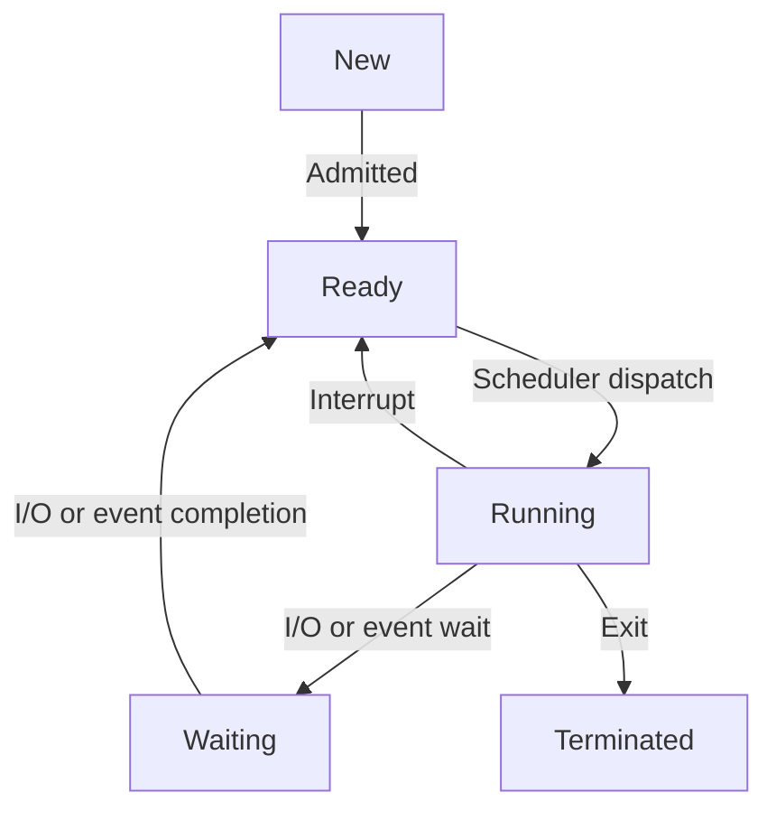

# sys2复习笔记总览

## 1. 操作系统导论

### 什么是操作系统？

-   位于应用程序与硬件之间的软件层。
-   管理硬件资源，为应用程序提供服务。
-   **核心目标**：用户便利性、系统高效性。

### 计算机系统四大组件

1.  **硬件**：CPU、内存、I/O设备。
2.  **操作系统**：控制和协调硬件。
3.  **应用程序**：定义如何使用系统资源解决用户问题（编译器、浏览器、游戏等）。
4.  **用户**：人、机器或其他计算机。

### 操作系统操作模式

-   **多道程序设计 (Multiprogramming)**：
    -   内存中同时保存多个作业。
    -   CPU执行一个作业；若当前作业等待（如I/O），则切换到另一作业。
    -   提高CPU利用率。
-   **分时系统 (Timesharing / Multitasking)**：
    -   多道程序设计的逻辑扩展。
    -   CPU频繁切换作业，允许用户与每个运行中的作业交互。
    -   **进程 (Process)**：执行中的程序。
    -   若多个作业就绪，需进行 **CPU调度**。

### 双模式操作

- **用户模式 (User Mode)**：运行应用程序，对硬件/指令的访问受限。

- **内核模式 (Kernel Mode / Privileged Mode / Supervisor Mode)**：运行操作系统，拥有完全访问权限。

- **模式位 (Mode Bit)**：硬件标志，指示当前CPU运行模式。

- **模式转换**：

  ```mermaid
  graph TD
      A[用户模式] -->|系统调用/中断/异常| B(内核模式);
      B -->|从系统调用/中断返回| A;
  ```

- **特权指令**：只能在内核模式下执行（如I/O控制、定时器管理、中断管理）。

### 资源管理

-   **进程管理**：
    -   **进程**：执行中的程序（活动实体）。程序是静态、被动的。
    -   活动：创建、终止、挂起、恢复、同步、通信、死锁处理。
-   **从进程到线程**：
    -   单线程进程：1个程序计数器 (PC)。
    -   多线程进程：每个线程有1个PC。
    -   **进程**是资源分配和保护的单位。**线程**是执行的单位。
-   **内存管理**：
    -   管理主存 (RAM)。
    -   活动：跟踪使用情况、决定何时移入/移出、分配/回收空间。
    -   目标：优化CPU利用率和响应时间，提供虚拟内存。
-   **文件系统管理**：
    -   数据的逻辑视图。
    -   **文件**：逻辑存储单元。
    -   **目录**：组织文件。
    -   活动：创建/删除文件/目录、映射到二级存储、备份。
    -   **`/proc` 文件系统**：提供进程和系统信息的特殊文件系统。

## 2. 操作系统服务与结构

### 操作系统服务

-   **用户/程序员可见服务**：
    -   **用户界面 (UI)**：命令行 (CLI)、图形用户界面 (GUI)、批处理。
    -   **程序执行**：加载程序到内存、运行、处理终止。
    -   **I/O操作**：管理对I/O设备和文件的访问。
    -   **文件系统操作**：创建、删除、读写、列出文件/目录，权限管理。
    -   **通信**：进程间通信 (IPC)，通过共享内存或消息传递。
    -   **错误检测**：检测并响应硬件、操作系统或用户程序的错误。
-   **系统视图服务 (为效率和保护)**：
    -   **资源分配**：向用户/作业分配CPU、内存、I/O。
    -   **记账/日志**：跟踪资源使用情况。
    -   **保护与安全**：
        -   **保护**：控制对资源的访问（内部）。
        -   **安全**：防御系统免受内外部攻击，用户认证。

### 系统调用

- 访问操作系统服务的编程接口。

- 通常用C/C++编写，部分使用汇编。

- **应用程序编程接口 (API)**：更高级别的接口（如Win32, POSIX, Java API），常封装系统调用，提供可移植性。

- **处理流程**：

  ```mermaid
  graph TD
      App[用户应用程序] -->|1. 设置参数, 执行trap指令| CPU_KernelMode[CPU切换到内核模式]
      CPU_KernelMode -->|2. 保存用户上下文 PC,寄存器等到内核栈| Kernel_Entry[内核入口点]
      Kernel_Entry -->|3. 获取系统调用号| Syscall_Dispatcher[系统调用分派器]
      Syscall_Dispatcher -->|4. 查表, 执行对应内核函数| Kernel_Handler[内核处理函数]
      Kernel_Handler -->|5. 准备返回值, 恢复用户上下文| CPU_UserMode[CPU切换回用户模式]
      CPU_UserMode --> App_Resume[应用程序恢复执行]
  ```

- **参数传递**：

  1.  通过寄存器（快速，数量有限）。
  2.  通过内存块（块地址在寄存器中）。
  3.  通过栈（应用程序压栈，操作系统弹栈）。

### 运行二进制程序 (ELF)

- **内存布局**：栈（向下增长）、堆（向上增长）、BSS段（未初始化数据）、数据段（已初始化数据）、代码段（Text）。

- **设置过程**：

  -   **ELF文件映射 (代码, 数据, BSS)**：内核（通过`exec`系统调用）。
  -   **栈和堆**：内核（通过`exec`系统调用）。
  -   **库 (动态链接)**：加载器（如Linux上的`ld.so`）在用户空间完成，由内核调用。

- **静态链接ELF加载流程**：

  ```mermaid
  graph LR
      subgraph 用户态
          A[$./binary] --> B(fork)
          B --> C(execve)
      end
      C --> D{内核态}
      subgraph 内核态
          D --> E(sys_execve)
          E --> F(do_execve)
          F --> G(load_elf_binary)
      end
      G --> H{用户态}
      subgraph 用户态
          H --> I(_start)
          I --> J(main)
      end
  ```

- **动态链接ELF加载流程**：

  ```mermaid
  graph LR
      subgraph 用户态
          A[$./binary] --> B(fork)
          B --> C(execve)
      end
      C --> D{内核态}
      subgraph 内核态
          D --> E(sys_execve)
          E --> F(do_execve)
          F --> G(search_binary_handler)
          G --> H(load_elf_binary 识别解释器如 ld.so)
      end
      H --> I{用户态: ld.so}
      subgraph 用户态: ld.so
          I --> J(加载依赖库)
          J --> K(_start)
          K --> L(main)
      end
  ```

### 操作系统设计与实现

-   语言：早期汇编，后C/C++，现常混合使用（底层用汇编/C，上层脚本）。
-   权衡：高级语言易移植、开发快，但可能稍慢。

### 操作系统结构

-   **简单结构 (如 MS-DOS)**：结构有限，单体。
-   **宏内核/单体内核 (Monolithic, 如传统UNIX, Linux)**：大型内核，多数功能在同一地址空间运行。内核内通信快。
-   **分层结构**：OS划分为多层，每层构建于低层之上。模块化，但可能有效率开销。
-   **微内核 (Microkernel, 如 Mach, L4)**：将多数OS服务（文件系统、设备驱动）从内核移至用户空间服务器。
    -   内核仅处理核心功能（IPC、基本调度、内存管理）。
    -   通过消息传递通信。
    -   **优点**：易扩展、可靠性高（内核代码少）、安全性。
    -   **缺点**：用户态-内核态IPC性能开销。
-   **混合内核 (Hybrid, 如 macOS, Windows)**：结合宏内核和微内核特点。
-   **外核 (Exokernel)**：极简内核，直接向应用程序安全地导出硬件资源，允许应用自定义OS抽象。

## 3. 进程管理

### 进程概念

-   执行中的程序；活动实体。
-   **程序**：静态、被动的代码和数据。
-   一个程序可对应多个进程。
-   **资源分配和保护的基本单位**。
-   **组成部分**：
    -   **代码段 (Text Section)**：程序指令。
    -   **CPU状态**：程序计数器 (PC)、寄存器。
    -   **栈 (Stack)**：临时数据（函数参数、局部变量、返回地址）。
    -   **数据段 (Data Section)**：全局变量。
    -   **堆 (Heap)**：动态分配的内存。

### 进程控制块 (PCB)

-   内核为每个进程维护的数据结构，Linux中为`task_struct`。
-   包含：
    -   进程ID (PID)
    -   进程状态
    -   程序计数器 (PC)
    -   CPU寄存器
    -   CPU调度信息（优先级、队列指针）
    -   内存管理信息（页表、段表）
    -   记账信息
    -   I/O状态信息
-   **内核栈**：每个进程拥有一个内核栈，在进程处于内核模式时使用。`thread_info`结构常位于内核栈底，指向`task_struct`。

### 进程状态



-   **新建 (New)**：正在创建。
-   **运行 (Running)**：指令正在执行。
-   **等待 (Waiting)**：等待某事件发生（如I/O完成、信号）。
-   **就绪 (Ready)**：等待分配处理器。
-   **终止 (Terminated)**：已完成执行。

### 进程创建

-   父进程创建子进程，形成进程树。
-   **资源共享**：所有资源、部分资源、无资源。
-   **地址空间**：
    -   子进程复制父进程地址空间（如Linux `fork()`，常采用写时复制）。
    -   子进程加载新程序（如`exec()`之后）。
-   **执行**：
    -   父子进程并发执行。
    -   父进程等待子进程终止（如`wait()`）。
-   **UNIX/Linux系统调用**：
    -   `fork()`：创建新进程（子进程），复制调用进程（父进程）。
        -   向父进程返回子进程PID，向子进程返回0。
    -   `exec()`：用新程序替换当前进程的地址空间。
    -   `wait()`：父进程等待子进程终止。

### 进程调度基础

-   目标：最大化CPU使用，快速切换进程。
-   **进程调度器**：从就绪队列中选择下一个要执行的进程。
-   **调度队列**：
    -   **就绪队列 (Ready Queue)**：在主存中，准备好运行的进程。
    -   **等待队列 (Wait Queues)**：等待某事件的进程（如I/O设备队列）。
-   进程在各队列间迁移。

### 上下文切换

- 内核将CPU从一个进程切换到另一个进程。

  ```mermaid
  graph TD
      P0_Running[进程 P0 运行中] -->|中断/系统调用| Save_P0_Context[保存 P0 上下文到 PCB0]
      Save_P0_Context --> Scheduler_Selects_P1[调度器选择 P1]
      Scheduler_Selects_P1 --> Load_P1_Context[从 PCB1 加载 P1 上下文]
      Load_P1_Context --> P1_Running[进程 P1 运行中]
      P1_Running --> |...切换回P0或其它...| Other
  ```

- 步骤：

  1.  保存当前进程状态（到其PCB）。
  2.  加载新进程的已保存状态（从其PCB）。

- **开销**：切换期间CPU不做有效工作。

- 时间取决于硬件支持（如多组寄存器）。

- 关键步骤：栈切换（用户栈指针和内核栈指针）。

### 进程间通信 (IPC)

-   进程通信和同步的机制。
-   **独立进程**：不受其他进程影响。
-   **协作进程**：相互影响。原因：信息共享、加速、模块化。
-   **模型**：
    1.  **共享内存 (Shared Memory)**：
        -   协作进程共享一块内存区域。
        -   进程直接读写此区域。
        -   速度快，但同步由用户负责。
        -   内核建立共享区后不参与。
        -   POSIX: `shm_open()`, `ftruncate()`, `mmap()`。
    2.  **消息传递 (Message Passing)**：
        -   进程通过交换消息通信。
        -   内核管理消息队列。
        -   较慢（涉及内核），但同步较易。

## 4. 线程管理

### 线程动机与定义

-   **动机**：
    -   应用内多任务（如UI更新、数据获取、拼写检查）。
    -   响应性：一个线程阻塞，其他线程仍可运行。
    -   资源共享：线程共享进程的代码、数据、文件。
    -   经济性：创建和切换成本低于进程。
    -   可伸缩性：可在多核系统上并行运行。
    -   内核常为多线程。
-   **定义**：
    -   进程内CPU利用的基本单位。
    -   **每个线程独有**：线程ID、程序计数器(PC)、寄存器组、栈。
    -   **同进程内线程共享**：代码段、数据段、堆、打开的文件和信号。

### 线程的优缺点

-   **优点**：响应性、资源共享、经济性、可伸缩性。
-   **缺点**：
    -   **弱隔离**：一线程崩溃常导致整个进程失败。
    -   **复杂性**：并发编程难（同步）。
    -   （历史）内存约束：OS对地址空间限制（64位系统缓解）。
    -   同进程线程间无固有内存保护。

### 线程实现

-   **用户线程**：
    -   由用户级库管理，内核无感知（如POSIX Pthreads, Win32线程, Java线程）。
    -   创建和管理快速。
    -   若一用户线程阻塞于系统调用，整个进程可能阻塞（除非非阻塞I/O或特殊内核支持）。
-   **内核线程**：
    -   OS直接支持和管理。
    -   创建和管理较慢。
    -   一内核线程阻塞不一定阻塞同进程其他线程。
    -   所有现代OS均支持。

### 多线程模型

(用户线程与内核线程的映射关系)

- **多对一 (Many-to-One)**：

  ```mermaid
  graph TD
      subgraph 用户空间
          U1[用户线程1]
          U2[用户线程2]
          U3[...]
      end
      subgraph 内核空间
          K[内核线程]
      end
      U1 --> K
      U2 --> K
      U3 --> K
  ```

  -   多个用户线程映射到单个内核线程。高效的用户态管理。一用户线程阻塞则所有阻塞。无多核并行。

- **一对一 (One-to-One)**：

  ```mermaid
  graph TD
      subgraph 用户空间
          U1[用户线程1]
          U2[用户线程2]
      end
      subgraph 内核空间
          K1[内核线程1]
          K2[内核线程2]
      end
      U1 --> K1
      U2 --> K2
  ```

  -   每个用户线程映射到一个内核线程。真多核并行。一线程阻塞不影响其他。创建开销大。

- **多对多 (Many-to-Many)**：

  ```mermaid
  graph TD
      subgraph 用户空间
          U1[用户线程1]
          U2[用户线程2]
          U3[用户线程3]
          U4[用户线程4]
      end
      subgraph 内核空间
          K1[内核线程A]
          K2[内核线程B]
      end
      U1 --> K1
      U2 --> K2
      U3 --> K1
      U4 --> K2
  ```

  -   多个用户线程复用到少数或等量内核线程。兼具并行性和高效用户管理。实现复杂。

- **两级模型 (Two-level Model)**：类似多对多，但允许用户线程绑定到特定内核线程。

### `fork()` 和 `exec()` 的语义

-   `fork()`：
    -   复制进程。
    -   对多线程进程：仅复制调用线程还是所有线程？
        -   部分UNIX系统提供两种版本。
        -   若`fork()`后立即调用`exec()`，仅复制调用线程更高效。
-   `exec()`：
    -   用新程序替换整个进程（所有线程、内存空间）。

### Linux线程

-   Linux将线程视为“轻量级进程”(LWP)。
-   无独立PCB/TCB；进程和线程均用`task_struct`。
-   `clone()`系统调用：创建线程（和进程），精细控制共享资源（如`CLONE_VM`, `CLONE_FILES`, `CLONE_SIGHAND`）。
    -   Pthreads库使用`clone()`。
-   **`task_struct`中共享与非共享**：
    -   **共享**：`mm_struct`（内存管理信息，如页表、代码段、数据段、堆）。
    -   **非共享 (每线程)**：PID (或TGID为线程组ID, TID为线程ID)、栈、寄存器、`comm` (命令名)。

## 5. CPU调度

### CPU调度基本概念

-   进程执行：CPU突发和I/O突发周期。
-   目标：通过多道程序/分时最大化CPU利用率。
-   I/O密集型作业原理：需要CPU时快速获得，以保证响应性。

### CPU调度器

-   从**就绪队列**中选择一个进程分配CPU。
-   **调度决策发生时机**：
    1.  运行 -> 等待（如I/O请求）。
    2.  运行 -> 就绪（如中断、时间片用完）。
    3.  等待 -> 就绪（如I/O完成）。
    4.  终止。
-   **非抢占式 (Cooperative)**：仅在1和4时调度。进程持有CPU直至释放。
-   **抢占式 (Preemptive)**：也在2和3时调度。OS可强制进程放弃CPU。需硬件定时器。

### 调度准则

-   **CPU利用率**：CPU繁忙时间百分比。（最大化）
-   **吞吐量**：单位时间完成进程数。（最大化）
-   **周转时间**：从提交到完成时间。（最小化）
-   **等待时间**：在就绪队列中等待时间。（最小化）
-   **响应时间**：从提交到产生首次响应时间（交互系统）。（最小化）

### 调度算法

-   **先来先服务 (FCFS / First-Come, First-Served)**：
    -   最简单。先请求CPU的进程先获得。
    -   非抢占式。
    -   可能导致**护航效应**（短进程等待长进程）。
-   **最短作业优先 (SJF / Shortest-Job-First)**：
    -   将CPU分配给下一个CPU突发最小的进程。
    -   平均等待时间最优。
    -   难点：预测下一CPU突发长度（可基于历史）。
    -   可为：
        -   **非抢占式SJF**。
        -   **抢占式SJF (最短剩余时间优先 - SRTF)**：若新到进程的突发比当前进程剩余时间短，则抢占。
-   **优先级调度 (Priority Scheduling)**：
    -   每个进程有优先级。CPU分配给最高优先级进程。
    -   可抢占或非抢占。
    -   SJF是特例（优先级=1/预测CPU突发）。
    -   问题：**饥饿**（低优先级进程可能永不运行）。
    -   解决：**老化**（逐渐提高等待进程的优先级）。
-   **轮转调度 (RR / Round Robin)**：
    -   为分时系统设计。抢占式。
    -   每个进程获得小CPU时间单位（**时间量/时间片**，通常10-100ms）。
    -   时间片后，进程被抢占并移至就绪队列尾部。
    -   性能：
        -   大时间片 -> 趋向FCFS。
        -   小时间片 -> 上下文切换开销大，但看起来快。
-   **多级队列调度 (Multilevel Queue Scheduling)**：
    -   就绪队列划分为多个独立队列（如前台/交互式，后台/批处理）。
    -   每队列有自己的调度算法。
    -   队列间调度（如固定优先级、时间片）。
-   **多级反馈队列调度 (Multilevel Feedback Queue Scheduling)**：
    -   允许进程在队列间移动。
    -   可实现老化。
    -   最复杂，也最通用。

## 6. 同步

### 同步背景

-   并发访问共享数据可能导致**数据不一致**。
-   需要有序执行以维护数据一致性。

### 竞争条件 (Race Condition)

-   执行结果取决于多个进程/线程访问和操作共享数据的特定顺序。
-   示例：`counter++`（读、增、写）可能被交错执行。
-   内核示例：`next_available_pid` 分配。

### 临界区问题 (Critical Section Problem)

- 进程/线程访问共享资源的代码段。

- **通用结构**：

  ```
  do {
      entry_section  // 请求进入许可
      critical_section // 访问共享数据
      exit_section   // 释放许可
      remainder_section
  } while (true);
  ```

- **解决方案需满足**：

  1.  **互斥 (Mutual Exclusion)**：任一时刻最多一个进程在其临界区。
  2.  **前进 (Progress)**：若无进程在CS中且有进程想进入，则选择下一个进入的进程不能无限推迟。
  3.  **有界等待 (Bounded Waiting)**：一进程请求进入后，其他进程进入其CS的次数有上限。防止饥饿。

### 操作系统中的临界区处理

-   **单核**：禁用中断（防止抢占）。对多核不可行/不可伸缩。
-   **抢占式内核**：允许内核模式下的进程被抢占。易发生竞争条件。
-   **非抢占式内核**：运行直至退出内核模式、阻塞或主动让出。较简单，内核竞争条件较少。

### Peterson算法 (软件方案, 仅2进程)

-   假定LOAD和STORE原子性。
-   共享变量：`int turn; boolean flag[2];`
    -   `flag[i] = true` 表示P_i准备就绪。
    -   `turn = j` 表示若两者都就绪，P_j优先。
-   满足全部3个要求。对多于2个进程复杂。

### 同步的硬件支持

-   原子指令（不可中断）：
    -   **测试并置位 (Test-and-Set)**：原子地测试内存字并置位。
    -   **比较并交换 (Compare-and-Swap / CAS)**：原子地比较内存位置内容与一值；若相同，则修改内容为新值。

### 互斥锁 (Mutex Locks)

- 保护临界区的软件工具。

- CS前`acquire()`锁，CS后`release()`锁。

- `acquire()`伪代码:

  ```c
  while (!available) ; // 忙等待
  available = false;
  ```

- `release()`伪代码:

  ```c
  available = true;
  ```

- 调用必须原子（常通过CAS等硬件支持实现）。

- **自旋锁 (Spinlock)**：使用忙等待的互斥锁。若CS长，则浪费CPU。

### 信号量 (Semaphore)

- 整数变量`S`，仅通过原子`wait()`和`signal()`操作访问。

- `wait(S)` (P操作) 伪代码:

  ```c
  while (S <= 0) ; // 忙等待或阻塞
  S--;
  ```

- `signal(S)` (V操作) 伪代码:

  ```c
  S++;
  ```

- **类型**：

  -   **计数信号量 (Counting Semaphore)**：整数值无限制。用于资源计数。
  -   **二进制信号量 (Binary Semaphore / Mutex)**：值为0或1。用于互斥。

- **无忙等待实现**：

  -   每个信号量关联一个等待队列。
  -   `wait(S)`：若`S <= 0`，则`S--`，进程加入队列，阻塞。否则`S--`。
  -   `signal(S)`：`S++`。若`S <= 0`（表示有进程在等待），则从队列移除一个，唤醒。
  -   负`S`值可表示等待进程数。
  -   `wait`/`signal`原子性仍关键（如用自旋锁短时保护）。

### 经典同步问题

#### 有界缓冲区问题 (生产者-消费者)

- `n`个缓冲区。生产者创建物品，消费者消费物品。

- **需同步**：

  -   生产者在缓冲区满时等待。
  -   消费者在缓冲区空时等待。
  -   缓冲区访问互斥。

- **信号量解决方案**：

  -   `mutex`: 二进制信号量，用于CS访问 (初值为1)。
  -   `empty`: 计数信号量，表示空槽位数 (初值为`n`)。
  -   `full`: 计数信号量，表示满槽位数 (初值为0)。

- **生产者流程**：

  ```mermaid
  graph TD
      StartP[开始] --> P1[wait-empty]
      P1 --> P2[wait-mutex]
      P2 --> P3[添加物品到缓冲区]
      P3 --> P4[signal-mutex]
      P4 --> P5[signal-full]
      P5 --> LoopP{继续?}
      LoopP --是--> StartP
      LoopP --否--> EndP[结束]
  ```

- **消费者流程**：

  ```mermaid
  graph TD
      StartC[开始] --> C1[wait-full]
      C1 --> C2[wait-mutex]
      C2 --> C3[从缓冲区移除物品]
      C3 --> C4[signal-mutex]
      C4 --> C5[signal-empty]
      C5 --> LoopC{继续?}
      LoopC --是--> StartC
      LoopC --否--> EndC[结束]
  ```

## 7. 死锁

### 死锁问题 (Deadlock)

- 一组阻塞的进程，每个进程持有某种资源，并等待获取该集合中其他进程持有的资源。

- 示例：

  - 系统有2个磁盘驱动器。P1持有D1，等待D2。P2持有D2，等待D1。

  - 信号量A, B (初值为1)：

    ```
    P0          P1
    wait(A);    wait(B);
    wait(B);    wait(A);
    ```

  - 死锁资源分配图示例:

    ```mermaid
    graph TD
        P1["进程P1"] -->|请求 R2| R2["资源R2"]
        R2 -->|被 P2 持有| P2["进程P2"]
        P2 -->|请求 R1| R1["资源R1"]
        R1 -->|被 P1 持有| P1
    ```

### 死锁的四个必要条件

1.  **互斥 (Mutual Exclusion)**：至少一个资源是非共享的。
2.  **占有并等待 (Hold and Wait)**：进程至少持有一个资源，并等待其他进程持有的额外资源。
3.  **非抢占 (No Preemption)**：资源不能被强制剥夺；只能由持有进程在完成任务后自愿释放。
4.  **循环等待 (Circular Wait)**：存在等待进程集合{P0, P1, ..., Pn}，使得P0等待P1的资源，P1等待P2的，...，Pn等待P0的。

### 死锁处理方法

1.  **死锁预防 (Prevention)**：
    -   确保四个必要条件中至少一个不成立。
    -   如：预先请求所有资源（破坏占有并等待），资源排序（破坏循环等待）。
2.  **死锁避免 (Avoidance)**：
    -   利用资源需求的先验信息。
    -   检查系统状态（当前分配、未来请求）以确保不发生死锁。
    -   银行家算法。
3.  **死锁检测与恢复 (Detection and Recovery)**：
    -   允许系统进入死锁状态，检测到后再恢复。
    -   检测：资源分配图、等待图。
    -   恢复：进程终止、资源抢占。
4.  **忽略问题 (Ostrich Algorithm / 鸵鸟算法)**：
    -   假装死锁永不发生。
    -   通用操作系统（Windows, Linux）常用，因预防/避免代价高，且死锁相对罕见。依赖用户/程序员避免或解决。