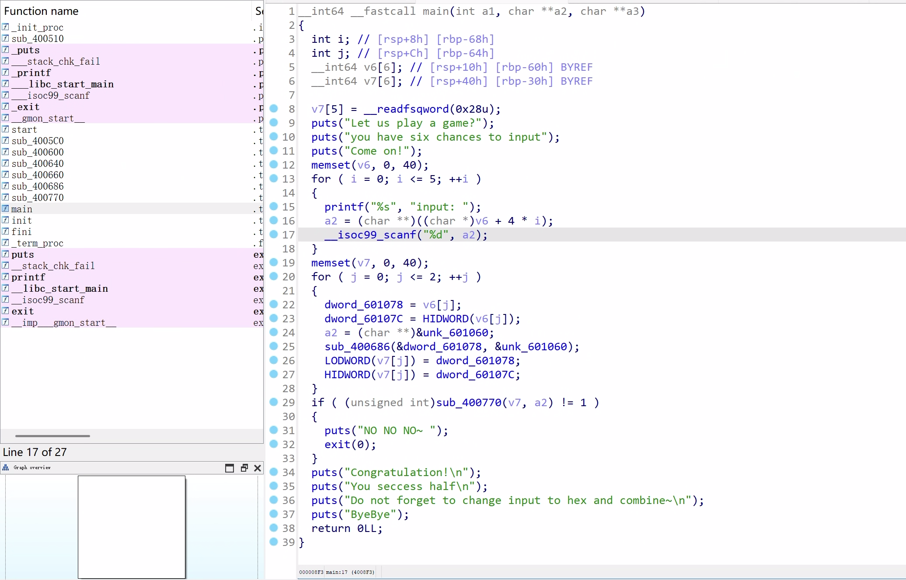
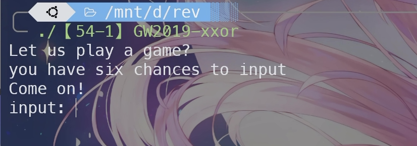
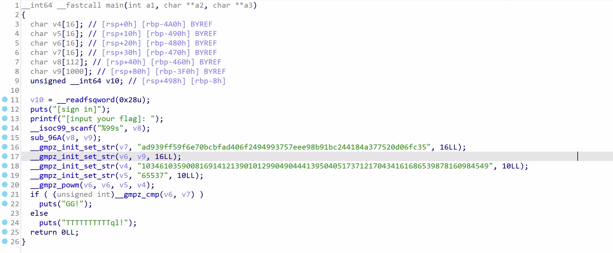
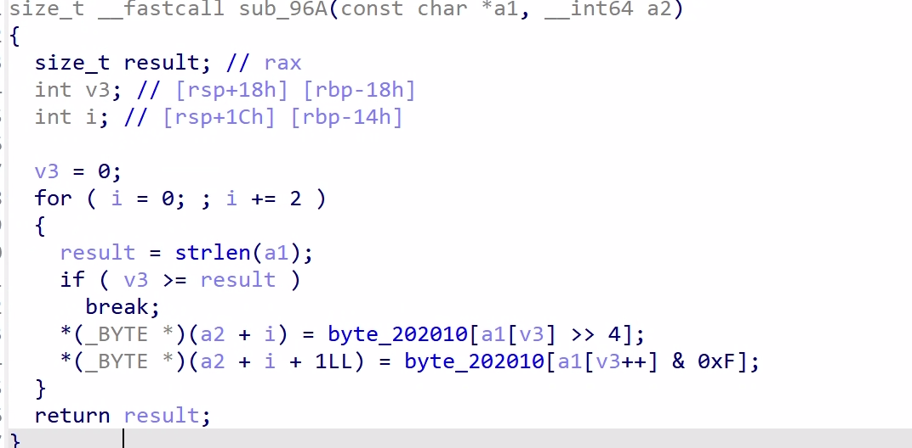

# CTF逆向工程实战 - 工具与ARM-macOS逆向分析

!!! info "课程信息"
    - **主题**: 逆向工程工具与技术
    - **日期**: 2025年5月
    - **难度**: 中级
    - **先修要求**: 基本的汇编语言知识，计算机体系结构基础

## 一、逆向工程概述

### 1.1 什么是逆向工程

逆向工程是指在缺乏源代码或详细文档的情况下，通过分析已完成的系统或产品，推导出其设计原理、工作方式、功能特性等信息的过程。在软件领域，逆向工程主要包括：

- **静态分析**：不执行程序，通过反汇编和代码检查来理解程序功能
- **动态分析**：在受控环境下运行程序，通过调试和监控来观察程序行为

### 1.2 逆向工程在CTF中的应用

在CTF（Capture The Flag）竞赛中，逆向工程用于：

- 分析未知的二进制文件以找出隐藏的flag
- 理解程序逻辑以绕过验证或保护机制
- 提取被加密或混淆的敏感信息

### 1.3 逆向工程的合法应用

除CTF外，逆向工程在信息安全领域的合法应用包括：

- **恶意软件分析**：理解恶意程序的工作原理和威胁特征
- **漏洞研究**：发现软件中的安全漏洞
- **兼容性研究**：确保不同系统之间的兼容性和互操作性
- **软件维护**：理解和维护缺乏文档的历史代码

## 二、逆向工程师的武器库：常用工具介绍

### 2.1 工具分类概述

逆向工程需要多种专门工具，主要包括：

1. **反汇编器**：将机器码翻译成人类可读的汇编语言
2. **调试器**：在程序运行时检查和控制其执行状态
3. **反编译器**：尝试将低级代码还原为高级语言代码
4. **十六进制编辑器**：直接查看和修改二进制数据
5. **专用分析工具**：如网络分析器、内存编辑器等

### 2.2 核心工具详解

#### 反汇编器与反编译器

- **IDA Pro**

  - 行业标准的专业反汇编工具
  - 支持大量处理器架构和文件格式
  - 提供强大的图形界面和分析功能
  - 支持脚本扩展（IDAPython）和插件开发
  - 提供Hex-Rays反编译器（付费插件）
  - 价格昂贵，但功能最为全面
- **Ghidra**

  - 由美国NSA开发并开源的逆向工程套件
  - 完全免费，跨平台
  - 内置反编译器功能
  - 支持多用户协作分析
  - 提供Java和Python脚本接口
  - 适合学术研究和开源项目
- **Hopper Disassembler**

  - 商业反汇编器，价格适中
  - 针对macOS和iOS平台优化
  - 提供伪代码生成功能
  - 支持Python脚本扩展

#### 调试器

- **LLDB**

  - macOS和iOS环境的默认调试器
  - 集成在Xcode开发环境中
  - 现代化架构设计
  - 提供Python API接口
  - ARM-macOS逆向分析的首选工具
- **GDB (GNU Debugger)**

  - Linux/Unix系统的经典调试器
  - 命令行界面，支持多种增强前端
  - 功能强大且灵活
  - 支持远程调试功能
- **x64dbg**

  - Windows平台开源调试器
  - 用户友好的界面
  - 丰富的插件生态系统
  - 专为Windows PE文件分析设计

#### 十六进制编辑器

- **HxD (Windows)** / **Hex Fiend (macOS)**
  - 查看和编辑文件的原始二进制数据
  - 对比文件差异
  - 搜索特定字节模式

### 2.3 工具选择建议（侧重x86/ARM与macOS）

- **初学者**：

  - 静态分析：Ghidra（免费、功能强大）
  - 动态分析：LLDB（macOS/iOS）或GDB（Linux）
  - 辅助工具：Hex Fiend（macOS）
- **进阶用户**：

  - 根据具体需求选择专业工具
  - 考虑学习商业工具如IDA Pro
  - 熟悉特定平台的特殊工具（如macOS的otool、class-dump）
- **macOS特定工具**：

  - `otool`：查看Mach-O文件信息
  - `nm`：列出符号表
  - `class-dump`：提取Objective-C类信息
  - `codesign`：处理代码签名

### 2.4 核心逆向工程工具对比

| 工具名称 | 类别              | 关键特性                   | 平台支持      | 成本        | 主要应用场景     |
| -------- | ----------------- | -------------------------- | ------------- | ----------- | ---------------- |
| IDA Pro  | 反汇编器/反编译器 | 图形视图, FLIRT, IDAPython | Win/Mac/Linux | 商业 (昂贵) | 通用RE, 行业标准 |
| Ghidra   | 反汇编器/反编译器 | 内置反编译器, 协作功能     | Win/Mac/Linux | 免费        | 通用RE, 学术研究 |
| Hopper   | 反汇编器/反编译器 | macOS/iOS优化              | Mac/Linux     | 商业 (中等) | macOS/iOS RE     |
| LLDB     | 调试器            | macOS/iOS默认              | Mac/Linux/Win | 免费        | macOS/iOS调试    |
| GDB      | 调试器            | 成熟稳定                   | Linux/Mac/Win | 免费        | Linux程序调试    |
| x64dbg   | 调试器            | 友好界面                   | Windows       | 免费        | Windows调试      |

### 2.5 IDA pro

### 2.6 Hopper

### 2.7 Ghidra

### 2.9 杂项

#### 2.9.1 z3

Z3是微软开发的SMT（Satisfiability Modulo Theory）求解器，可以用来解决逻辑约束问题，在CTF中特别有用。

**基本概念**:

- SMT问题是判定一阶逻辑公式是否可满足的问题
- 在逆向中，通常用于求解程序中的条件约束

**在CTF中的应用**:

```python
import z3

# 创建整型符号变量
x = z3.Int('x')
y = z3.Int('y')

# 创建求解器
solver = z3.Solver()

# 添加约束条件
solver.add(x * 5 == 20)
solver.add(y == x + 10)
solver.add(y < 20)

# 检查是否有解
if solver.check() == z3.sat:
    model = solver.model()
    print(f"x = {model[x]}, y = {model[y]}")
else:
    print("无解")
```

#### 2.9.2 Unicorn Engine

Unicorn是基于QEMU的轻量级多平台、多架构CPU模拟器框架，允许在任何平台上模拟代码执行。

**主要特点**:

- 支持多种架构：ARM、ARM64、X86等
- 允许精确控制执行：单指令步进、寄存器访问
- 可以脱离目标环境执行代码片段

**基本使用示例**:

```python
from unicorn import *
from unicorn.x86_const import *

# 要模拟的代码 - 简单的X86指令(INC ecx; DEC edx)
X86_CODE32 = b"\x41\x4a"

# 设置起始地址
ADDRESS = 0x1000000

# 初始化模拟器
mu = Uc(UC_ARCH_X86, UC_MODE_32)

# 映射内存
mu.mem_map(ADDRESS, 2 * 1024 * 1024)

# 写入代码
mu.mem_write(ADDRESS, X86_CODE32)

# 设置初始寄存器值
mu.reg_write(UC_X86_REG_ECX, 0x1234)
mu.reg_write(UC_X86_REG_EDX, 0x7890)

# 模拟执行
mu.emu_start(ADDRESS, ADDRESS + len(X86_CODE32))

# 获取结果
r_ecx = mu.reg_read(UC_X86_REG_ECX)
r_edx = mu.reg_read(UC_X86_REG_EDX)
print(f"执行后: ECX = 0x{r_ecx:x}, EDX = 0x{r_ecx:x}")
```

在CTF中，Unicorn Engine特别适用于：

- 分析恶意代码中的混淆或加密函数
- 模拟执行特定代码片段而不运行整个程序
- 在缺少目标平台环境的情况下执行代码

#### 2.9.3 Angr

Angr是一个功能强大的二进制分析框架，它结合了符号执行、程序分析和约束求解技术。

**主要功能**:

- 静态分析：提取程序控制流图、反汇编等
- 动态符号执行：探索程序可能的执行路径
- 约束求解：自动寻找满足特定条件的输入

**基本使用示例**:

```python
import angr
import claripy

# 加载二进制文件
proj = angr.Project('./target_binary')

# 创建符号输入
flag_chars = [claripy.BVS(f'flag_{i}', 8) for i in range(20)]
flag = claripy.Concat(*flag_chars)

# 创建初始状态
state = proj.factory.entry_state(stdin=flag)

# 创建模拟管理器
simgr = proj.factory.simulation_manager(state)

# 寻找打印"正确"的路径
simgr.explore(find=lambda s: b"Correct!" in s.posix.dumps(1))

# 如果找到解
if simgr.found:
    solution = simgr.found[0].solver.eval(flag, cast_to=bytes)
    print(f"找到flag: {solution}")
else:
    print("未找到路径")
```

在CTF中，Angr特别适合自动化解决下列类型的问题：

- 寻找通过验证逻辑的输入
- 自动绕过简单的保护机制
- 探索程序中隐藏的执行路径

## 三、软件防御技术：程序保护机制详解

### 3.1 概述：攻防对抗

软件保护与逆向分析形成了持续的技术对抗，类似于"军备竞赛"：

- 软件开发者实施保护来防止未授权分析
- 逆向工程师寻找方法绕过这些保护
- 这推动了双方技术的持续进步

### 3.2 常见保护技术

#### 代码混淆 (Code Obfuscation)

**目标**：使代码逻辑难以理解，同时保持功能不变

**常见技术**：

- **指令替换**：用功能相同但更复杂的指令序列替代简单指令
- **无效代码插入**：添加不影响程序功能的"垃圾"代码
- **控制流平坦化**：将结构化代码转换为复杂的控制流结构（如大型switch-case）
- **字符串加密**：对程序中的字符串进行加密，运行时解密

**效果**：使静态分析极为困难，反编译结果难以理解

#### 反调试 (Anti-Debugging)

**目标**：检测并阻止程序被调试

**常见技术**：

- **API检测**：如Windows的 `IsDebuggerPresent()`函数
- **时间检测**：测量特定操作的执行时间（调试时通常变慢）
- **软件断点检测**：检查代码是否被修改（如INT3指令）
- **硬件断点检测**：检查调试寄存器状态
- **反调试陷阱**：如在macOS上使用 `ptrace`系统调用的 `PT_DENY_ATTACH`选项

**效果**：程序检测到调试器时会改变行为、退出或崩溃

#### 加壳/加密 (Packing/Encryption)

**目标**：隐藏程序的真实代码和数据，防止静态分析

**常见技术**：

- **压缩壳**：如UPX，压缩原始代码，运行时解压
- **加密壳**：加密原始代码，运行时解密
- **多层壳**：嵌套多层保护，逐层解开

**特点**：

- 原始入口点(OEP)被隐藏
- 静态分析只能看到壳代码，不是原始程序

#### 代码签名与完整性校验

**目标**：确保程序代码未被修改

**常见技术**：

- **数字签名**：如macOS的代码签名机制
- **校验和检查**：运行时计算代码的哈希值或校验和，与预存值比较
- **自修改代码**：程序可以验证自身的关键部分是否被修改

### 3.3 绕过保护的基本策略

#### 对抗混淆

-**动态分析优先**：观察实际执行流程，而非分析混淆后的静态代码
- **反混淆工具**：使用专门的脚本或插件还原混淆代码
- **模式识别**：识别常见的混淆模式，有针对性地分析

#### 对抗反调试

-**代码补丁**：定位并修改反调试检测代码
- **环境伪装**：修改调试器行为以避免被检测
- **API钩子**：拦截反调试API调用并返回欺骗性结果
- **调试器插件**：使用专门规避反调试检测的调试器扩展

#### 对抗加壳

- **脱壳工具**：对于常见壳（如UPX）使用专门的脱壳工具
- **动态脱壳**：等待程序完成解压/解密，在内存中提取原始代码
- **OEP定位**：找到原始入口点，从那里开始分析
- **内存转储**：从运行中的进程导出解密后的代码段

#### 对抗完整性校验

- **定位校验代码**：找到执行完整性检查的代码段
- **修改验证逻辑**：改变比较结果的处理方式
- **重新计算校验值**：修改程序后，更新存储的校验值
- **内存修改**：在内存中而非磁盘上修改程序，绕过签名检查

### 3.4 综合分析策略

现实中的保护通常是多重技术的组合，需要逐层分析：

1. **初步静态分析**：评估保护类型和复杂度
2. **去除外层保护**：如脱壳、绕过基本反调试
3. **动静结合**：静态分析关键代码，动态跟踪程序执行
4. **自动化辅助**：使用脚本自动化分析重复或复杂的结构
5. **迭代深入**：不断反馈和调整分析策略

## 四、ARM-macOS逆向特点

### 4.1 ARM与x86汇编关键差异

- **架构类型**：
        - ARM是RISC（精简指令集计算机）架构
        - x86是CISC（复杂指令集计算机）架构
        - ARM指令通常更规整，长度固定（ARM64为4字节）
- **寄存器系统**：
    - ARM64有31个通用寄存器（x0-x30）
    - 特殊寄存器：PC（程序计数器）、SP（栈指针）、ZR（零寄存器）
    - 函数调用时，前8个参数通过寄存器x0-x7传递
- **常见指令**：
    - `LDR/STR`：加载/存储（类似x86的MOV）
    - `B/BL`：跳转/带链接的跳转（类似JMP/CALL）
    - `ADD/SUB`：加法/减法操作
    - 条件执行：使用条件后缀（如 `B.EQ`等于时跳转）

### 4.2 Mach-O文件格式

Mach-O是macOS和iOS使用的主要可执行文件格式，理解其结构对逆向分析至关重要：

- **基本结构**：
    - `Header`：包含文件类型、目标架构等基本信息
    - `Load Commands`：描述如何加载文件到内存
    - `Segments/Sections`：包含代码和数据
    - `Signature`：代码签名信息
- **主要段（Segment）**：
    - `__TEXT`：包含代码（`__text`节）、常量等只读内容
    - `__DATA`：包含可写数据，如全局变量
    - `__LINKEDIT`：包含链接器使用的数据
- **常用分析命令**：
    - `otool -l`：查看加载命令
    - `otool -tv`：查看反汇编代码
    - `nm`：列出符号
    - `strings`：提取字符串

​**T (Text)​**: 代码段中的全局函数（如 _main 是程序入口）。
​**t (Local Text)​**: 文件内部的私有函数（如 _$s6taylor4mainyyF 是 Swift 的 main 函数）。
​**U (Undefined)​**: 未在本文件定义的符号（通常是动态链接库中的函数，如 _$sSSN 是 Swift 标准库的字符串类型）。
​**d/s (Data/Static)​**: 全局或静态数据（如 _$sSays5UInt8VGMD 是 Swift 数组的元数据）。

### 4.3 Objective-C与Swift逆向分析

#### Objective-C特性

- **动态性**：

  - 使用消息传递机制，通过 `objc_msgSend`函数族实现
  - 方法调用形式：`[object method:param]` → `objc_msgSend(object, @selector(method:), param)`
- **运行时元数据**：

  - 二进制文件中保留了丰富的类型信息
  - 包括类名、方法名（选择器）、属性名等
  - 这些元数据对逆向工程师非常有价值
- **分析工具**：

  - `class-dump`：提取Objective-C类信息
  - `otool -ov`：查看Objective-C部分
  - IDA/Ghidra通常能自动识别Objective-C结构

#### Swift特性

- **名称修饰（Name Mangling）**：

  - Swift使用复杂的名称修饰机制编码类型信息
  - 修饰后的函数名很长且难以理解
- **静态特性**：

  - 相比Objective-C更静态，编译时决定更多行为
  - 保留的运行时信息较少
- **分析工具**：

  - `swift-demangle`：解析Swift修饰名称
  - 专用IDA/Ghidra插件以支持Swift分析

### 4.4 macOS特有的安全机制

- **系统完整性保护（SIP）**：

  - 保护系统文件和进程免受修改
  - 可能限制某些逆向操作
- **代码签名**：

  - 验证应用完整性和来源
  - 修改已签名的应用会使签名失效
- **沙盒机制**：

  - 限制应用访问资源的权限
  - 影响动态分析过程

### 4.5 ARM-macOS调试技巧

- **LLDB基础命令**：

  - `b` / `breakpoint set`：设置断点
  - `reg read`：查看寄存器
  - `mem read`：查看内存
  - `po`：打印对象（特别有用于OC对象）
- **调试权限问题**：

  - 可能需要禁用SIP或调整安全设置
  - 可能需要对目标应用重签名
- **ARM64特定调试**：

  - 注意ARM特有的调用约定
  - 使用ARM特有的寄存器名称
  - 可能需要通过Rosetta处理x86/ARM兼容性问题

## 五、IDA Pro与自动化脚本

### 5.1 自动化分析的必要性

随着软件复杂性的增加，纯手动逆向变得越来越困难：

- **大型程序**：现代软件规模庞大，手动分析效率低下
- **重复性任务**：许多分析工作是高度重复的
- **复杂算法**：某些保护或算法需要自动化工具辅助分析
- **批量处理**：需要处理大量相似的样本

自动化脚本可以显著提高逆向效率，减少人为错误。

### 5.2 IDAPython简介

IDAPython是IDA Pro提供的Python脚本接口，允许：

- **访问IDA数据库**：读取和修改函数、指令、注释等信息
- **扩展UI功能**：创建新的视图、菜单、快捷键等
- **自动化分析**：批量处理、模式识别、特征提取等

**常见IDAPython应用**：

- 自动识别和重命名函数
- 批量添加注释
- 提取和分析特定代码模式
- 辅助反混淆和解密

### 5.3 IDA-MCP项目介绍

在无法直接使用IDA Pro的环境中，可以尝试替代方案或结合AI辅助的解决方案：

**MCP (Model Context Protocol) 概念**：

- MCP是一种连接开发工具和AI模型的协议
- 允许AI模型直接理解和操作代码上下文

**ida-pro-mcp项目**：

- 基于MCP的IDA Pro插件
- 连接IDA与大语言模型(LLM)，如Claude
- 可以发送IDA分析上下文给AI模型，并接收AI的分析结果

1、下载安装ida-pro-mcp
pip install --upgrade git+https://github.com/mrexodia/ida-pro-mcp
ida-pro-mcp --install

2、vs code 市场安装 cline 后点击 cline 图标然后点击小齿轮选deepseek并填写 api key
https://marketplace.visualstudio ... udrizwan.claude-dev
https://code.visualstudio.com/docs/?dv=win64user

3、点小书架，再点 installed，里面应该有 github.com/mrexodia/ida-pro-mcp 这个 mcp server
     IDA里点 Edit ---> Plugins ---> MCP，此时在 output 窗口提示 [MCP] Server started at http://localhost:13337

4、勾选 Auto-approve 左边方框，再点后面大于号，勾选 use mcp servers

5、然后输入提示词
        你的任务是使用 IDA Pro 分析一个文件。你可以使用 MCP 工具来检索信息。一般来说，使用以下策略：
        检查反编译并添加注释以说明您的发现
        将变量重命名为更合理的名称
        如有必要，更改变量和参数类型（尤其是指针和数组类型）
        更改函数名称，使其更具描述性
        如果需要更多详细信息，请拆解该函数并添加注释和您的发现
        切勿自行转换进制。如有需要，请使用 convert_number MCP 工具！
        不要尝试暴力破解，任何解决方案都只能通过反汇编和简单的 Python 脚本来获得。
        创建一份 report.md，其中包含你的发现和最后采取的步骤
        当你找到解决方案时，提示用户使用你找到的密码进行反馈

**主要功能**：
    - 自动添加代码注释
    - 智能识别算法和功能
    - 辅助重命名变量和函数
    - 提供代码理解和分析建议

### 5.4 其他自动化工具对比

**Ghidra脚本**：
    - 使用Java或Python（通过Jython）
    - 免费且功能强大
    - 提供与IDAPython类似的功能

**Binary Ninja API**：
    - 现代化的Python API
    - 设计清晰，易于使用
    - 强调自动化和扩展性

**调试器自动化**：
    - LLDB和GDB都支持Python脚本
    - 可以自动化断点设置、数据收集等
    - 适合动态分析自动化

### 5.5 自动化脚本实例

当不能使用IDA Pro时，可以使用Ghidra脚本来实现类似功能。以下是一个简单的Ghidra Python脚本示例，用于自动查找并标记可疑的字符串比较函数：

```python
# Ghidra脚本示例 - 标记字符串比较
# @category: CTF
from ghidra.program.model.symbol import SourceType

def find_string_comparisons():
    # 获取字符串比较函数引用
    funcs = ["strcmp", "strncmp", "memcmp"]
  
    for func_name in funcs:
        symbol = getSymbol(func_name, None)
        if symbol is None:
            print(f"未找到函数: {func_name}")
            continue
          
        refs = getReferencesTo(symbol.getAddress())
        print(f"发现 {len(refs)} 处对 {func_name} 的调用")
      
        # 为每个调用添加注释
        for ref in refs:
            call_addr = ref.getFromAddress()
            createBookmark(call_addr, "CTF", "可能的验证点")
            setPreComment(call_addr, "// 重要: 字符串比较点，可能是验证逻辑")
            print(f"已标记地址: {call_addr}")

# 主函数
find_string_comparisons()
print("分析完成，请查看已添加的书签")
```

## 六、CTF逆向实战案例

### 大乱炖


https://buuoj.cn/challenges#[GWCTF%202019]xxor





整体上就是，输入6个数，然后每次取4个字节的低位和高位的各16位作为两个数进行变种Tea加密，最后进行验证

那么分成两步即可

[SUCTF2019]SignIn 



- gmpz_init_set_str(buffer, str, radix) ：将进制为 radix 的 str 表示的数存到 buffer 中去
- gmpz_powm(x, y, z)：return x**y % z

所以本质上是

$v6 \to v6^v5\mod v4 \equiv Enc(v7)$

要求这个 $v7=Dec(Enc(v7))$

也就是一个经典的离散对数问题

把 mod 分解成 p 和 q，用 gmpy2 库解得明文 output即可



### mac-rev 案例一：Taylor's First Swift (macOS ARM)

https://drive.google.com/file/d/1I3e-4szmDZpMbUp62RSOQ2tfSC5gJIx5/view?usp=sharing

**题目描述**：一个用Swift编写的macOS二进制程序，需要输入正确密码获取flag。

**分析步骤**：

1. 初步检查：确认文件类型和架构

   ```bash
   file TaylorsFirstSwift  # 确认为macOS ARM64可执行文件
   ```
2. 静态分析：

   - 使用Hopper或Ghidra加载程序
   - 定位主函数和关键验证逻辑
   - 发现函数 `flagcheck`包含关键代码
3. 核心发现：

   - 程序先对内置字符串执行Base64解码
   - 然后用关键字"swifties!"进行XOR解密
   - 解密结果即为flag
4. 解决方法：

   ```python
   import base64

   # 从程序中提取的Base64字符串
   encoded = "FgwcARcRHAcABBwcAAADEQMEBRsFAx4="
   # 解码
   decoded = base64.b64decode(encoded)

   # XOR解密
   key = b"swifties!"
   flag = ""
   for i in range(len(decoded)):
       flag += chr(decoded[i] ^ key[i % len(key)])

   print("Flag:", flag)
   ```

### mac-rev 案例二：IPromise (macOS ARM)

**题目描述**：macOS ARM程序，声称会执行AES解密但实际未调用解密函数。

**分析步骤**：

1. 运行程序：

   ```bash
   ./IPromise  # 显示"I promise to decrypt something"但无flag
   ```
2. 静态分析：

   - 使用Ghidra分析程序结构
   - 发现一个未被调用的函数 `decryptIPromise`
   - 该函数包含AES解密逻辑和密钥
3. 调试解决：

   - 使用LLDB附加到程序
   - 在主函数设置断点
   - 手动修改程序计数器跳转到解密函数

   ```bash
   lldb ./IPromise
   (lldb) breakpoint set --name main
   (lldb) run
   # 程序在main处停止
   (lldb) reg write pc 函数地址  # 将PC寄存器指向decryptIPromise函数
   (lldb) continue
   # 程序执行解密函数，打印flag
   ```

### 案例三：PicoCTF 2024 "Packer"

**题目描述**：一个被UPX打包的Linux二进制文件，需要提取flag。

**分析步骤**：

1. 初步检查：

   ```bash
   file out  # 查看文件类型
   strings out | tail  # 查看字符串，发现"packed with UPX"提示
   ```
2. 脱壳处理：

   ```bash
   upx -d out -o original  # 使用UPX工具解包
   ```
3. 静态分析：

   - 对解包后的文件进行分析
   - 使用strings或反编译器查找flag相关字符串

   ```bash
   strings original | grep -i flag
   ```
4. 提取flag：

   - 从反汇编代码或字符串中直接提取flag
   - 或运行解包后的程序获取flag

## 七、总结与进阶学习路径

### 7.1 核心要点回顾

- **逆向工程基础**：静态分析和动态分析相结合
- **工具选择**：根据平台和目标选择合适的工具
- **程序保护**：了解常见保护机制及其对抗方法
- **ARM-macOS特点**：适应不同架构和操作系统的逆向方法
- **自动化技术**：利用脚本提高逆向效率

### 7.2 学习资源推荐

#### 书籍

- **《Practical Reverse Engineering》** - Bruce Dang等
- **《Reversing: Secrets of Reverse Engineering》** - Eldad Eilam
- **《The Art of Mac Malware》** - Patrick Wardle (macOS特定)

#### 在线资源

- **CTF练习平台**：

  - [PicoCTF](https://picoctf.org/)
  - [CTFtime](https://ctftime.org/)
  - [crackmes.one](https://crackmes.one/)
- **技术博客**：

  - [Objective-See](https://objective-see.org/) (macOS安全)
  - [0xRick&#39;s Blog](https://0xrick.github.io/) (CTF Write-ups)
- **工具文档**：

  - [Ghidra文档](https://ghidra-sre.org/)
  - [LLDB教程](https://lldb.llvm.org/use/tutorial.html)

### 7.4 伦理与法律

逆向工程是一把双刃剑，请记住：

- 仅在合法授权的范围内进行逆向分析
- 尊重知识产权和许可协议
- 负责任地披露发现的安全漏洞
- 将技能用于防御和教育目的

---

## 参考文献

1. Bruce Dang, Alexandre Gazet, Elias Bachaalany. *Practical Reverse Engineering*. Wiley, 2014.
2. Dennis Yurichev. *Reverse Engineering for Beginners*. [https://beginners.re/](https://beginners.re/)
3. Patrick Wardle. *The Art of Mac Malware*. No Starch Press, 2022.
4. NSA. *Ghidra Software Reverse Engineering Framework*. [https://ghidra-sre.org/](https://ghidra-sre.org/)
5. Apple Inc. *LLDB Debugging Guide*. [https://lldb.llvm.org/](https://lldb.llvm.org/)
